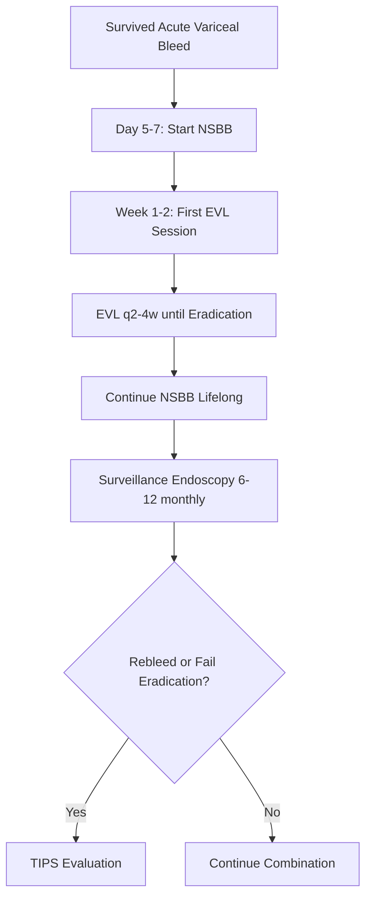
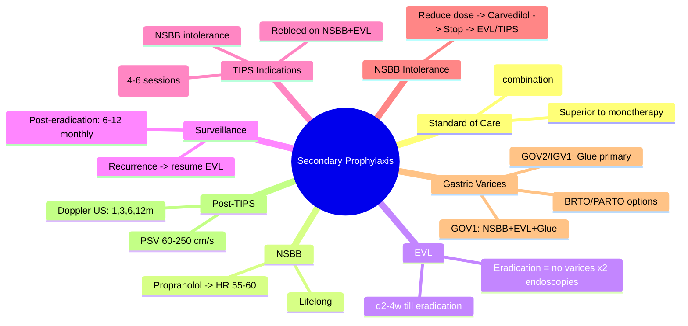

## 1. Learning Objectives
- [ ] Apply combination therapy (NSBB + EVL) as standard of care
- [ ] Know surveillance endoscopy intervals
- [ ] Identify indications for TIPS in secondary prophylaxis
- [ ] Manage NSBB intolerance/failure
- [ ] Recognize FCPS/MRCP high-yield management steps

---

## 2. Standard of Care: Combination Therapy

> **NSBB + EVL is superior to either alone for secondary prophylaxis**

| Trial | Finding |
|-------|---------|
| **Meta-analyses** | NSBB + EVL: **Rebleeding ~10-15%** vs EVL alone ~25% vs NSBB alone ~30% |
| **Mortality** | Combination reduces mortality vs monotherapy |

### Regimen
| Component | Details |
|-----------|---------|
| **NSBB** | Propranolol 20mg BD → titrate to **HR 55-60** (or max tolerated) |
| **EVL** | Banding sessions **every 2-4 weeks** until **complete eradication** |
| **Duration** | **Lifelong** (unless liver transplant) |

---

## 3. Algorithm: Post-Acute Bleed Secondary Prophylaxis

### Timeline
| Timepoint | Action |
|-----------|--------|
| **Days 1-5** | Acute bleed management (vasoactives, antibiotics, endoscopy) |
| **Day 5-7** | Start NSBB (propranolol) once stable |
| **Week 1-2** | First EVL session |
| **Weeks 2-8** | EVL sessions q2-4w until eradication |
| **Post-eradication** | Surveillance endoscopy 6-12 monthly |
| **Lifelong** | Continue NSBB + surveillance |

---

## 4. EVL Eradication Protocol

| Session | Timing | Goal |
|---------|--------|------|
| 1 | Week 1-2 post-bleed | Band all visible varices |
| 2 | Week 3-4 | Band residual/recurrent |
| 3 | Week 5-6 | Band residual/recurrent |
| 4+ | As needed | Until **no varices visible** |

**Eradication** = No varices seen on 2 consecutive endoscopies

---

## 5. Surveillance After Eradication

| Scenario | Interval |
|----------|----------|
| **Post-eradication** | **6-12 monthly** |
| **If varices recur** | Resume EVL q2-4w until re-eradication |
| **If on NSBB only** | 1-2 yearly |

---

## 6. TIPS for Secondary Prophylaxis (Rescue/Early)

### Indications for TIPS
| Indication | Criteria |
|------------|----------|
| **Failed combination therapy** | **Rebleeding despite NSBB + EVL** (2+ episodes) |
| **Failed EVL eradication** | Unable to eradicate after 4-6 sessions |
| **NSBB intolerance** | Cannot tolerate NSBB + EVL failed |
| **Child-Pugh B/C** | High rebleeding risk, transplant candidate |
| **Early TIPS (in acute bleed)** | Already covered in acute bleed — these patients already have TIPS |

### TIPS vs Continued Endoscopic Therapy
| Factor | TIPS | Continued EVL + NSBB |
|--------|------|---------------------|
| **Rebleeding** | **<10%** | 15-25% |
| **HE** | **20-30% new/worsening** | Low |
| **Survival** | Similar (or better in Child B) | Standard |
| **Cost/Resources** | High (IR suite) | Endoscopy unit |

---

## 7. NSBB Intolerance / Failure

### Intolerance (Side Effects)
| Side Effect | Management |
|-------------|------------|
| **Fatigue / Exercise intolerance** | Reduce dose; switch to carvedilol |
| **Hypotension / Dizziness** | Reduce dose; ensure euvolemia |
| **Erectile dysfunction** | Counsel; consider switch |
| **Bronchospasm** | **Stop NSBB** → EVL alone or TIPS |
| **Bradycardia (HR<50)** | Reduce dose; stop if persistent |

### Failure (Rebleed on NSBB + EVL)
- **Definition**: Bleed despite adequate NSBB dose (HR 55-60) + completed EVL eradication
- **Action**: **TIPS** (if candidate) OR **Liver Transplant evaluation**

---

## 8. Gastric Varices Secondary Prophylaxis

| Variceal Type | Secondary Prophylaxis |
|---------------|----------------------|
| **GOV1** (Oesophageal extension) | NSBB + EVL (oesophageal) ± Glue for gastric component |
| **GOV2** (Fundal + oesophageal) | **Glue injection** primary; NSBB adjunct |
| **IGV1** (Isolated fundal) | **Glue injection** primary; consider BRTO/PARTO |
| **IGV2** (Ectopic) | Glue, BRTO, PARTO, TIPS |

---

## 9. Post-TIPS Surveillance

| Test | Interval |
|------|----------|
| **Doppler US** | 1 month, 3 months, 6 months, then 6-12 monthly |
| **PSV in stent** | **60-250 cm/s** (stenosis if <60 or >250) |
| **Liver function** | 3-monthly |
| **HE assessment** | Each visit |
| **Endoscopy** | Not routine post-TIPS (varices decompress) |

---

## 10. FCPS/MRCP High-Yield Summary

| Concept | Key Points |
|---------|------------|
| **Standard of care** | **NSBB + EVL combination** (not monotherapy) |
| **NSBB dose** | Propranolol → HR 55-60 |
| **EVL schedule** | q2-4 weeks until eradication |
| **Surveillance** | 6-12 monthly after eradication |
| **TIPS indication** | Rebleed on combo therapy / Failed eradication / NSBB intolerance |
| **TIPS vs EVL** | TIPS: lower rebleed, higher HE |
| **NSBB intolerance** | Reduce dose → switch to carvedilol → stop → EVL alone/TIPS |
| **Gastric varices** | Glue primary for GOV2/IGV1 |

---

## 11. Viva Questions

1. **What is the standard of care for secondary prophylaxis after variceal bleed?**
2. **What is the EVL schedule until eradication?**
3. **When do you consider TIPS for secondary prophylaxis?**
4. **What is the rebleeding rate on NSBB+EVL vs monotherapy?**
5. **How do you manage NSBB intolerance?**
6. **What is the surveillance interval after variceal eradication?**
7. **Difference between GOV1 and GOV2 management?**
8. **Post-TIPS surveillance: what, when?**
9. **What is BRTO/PARTO? When used?**
10. **NSBB + EVL vs EVL alone: mortality benefit?**

---

## 12. Confusions & Mnemonics

| Confusion | Clarification |
|-----------|---------------|
| Primary vs Secondary prophylaxis | Primary = prevent 1st bleed; Secondary = prevent rebleed (after bleed) |
| Eradication definition | **No varices on 2 consecutive endoscopies** |
| NSBB dose for secondary | Same as primary: **HR 55-60** |
| TIPS for secondary prophylaxis | **Failed combination therapy** (rebleed on NSBB+EVL) |
| Gastric varices classification | GOV1 = oesophageal extension; GOV2 = fundal + oesophageal; IGV1 = isolated fundal |
| BRTO vs PARTO | BRTO = Balloon-occluded Retrograde Transvenous Obliteration; PARTO = Plug-Assisted (no balloon) |

---

## 13. Mind Map

---

## 14. One-Page Revision Card

| **Secondary Prophylaxis** | **Details** |
|---------------------------|-------------|
| **Standard** | NSBB + EVL combination |
| **NSBB** | Propranolol → HR 55-60 (lifelong) |
| **EVL** | q2-4w until eradication (no varices x2) |
| **Surveillance** | 6-12 monthly post-eradication |

| **TIPS Indication** | **Details** |
|---------------------|-------------|
| Rebleed on combo therapy | Primary indication |
| Failed eradication (4-6 sessions) | Consider TIPS |
| NSBB intolerance + EVL failed | TIPS |

| **NSBB Intolerance** | **Action** |
|----------------------|------------|
| Fatigue, hypotension | Reduce dose |
| Bronchospasm, bradycardia | Stop → EVL/TIPS |
| Switch option | Carvedilol |

| **Gastric Varices** | **Prophylaxis** |
|---------------------|-----------------|
| GOV1 | NSBB + EVL (oesophageal) ± Glue |
| GOV2 / IGV1 | **Glue primary** |
| BRTO/PARTO | Alternative to glue |

---

## 15. Spaced Repetition Tracker

| Day | 1 | 3 | 7 | 15 | 30 |
|-----|---|---|---|---|----|
| NSBB + EVL combo | ☐ | ☐ | ☐ | ☐ | ☐ |
| EVL eradication schedule | ☐ | ☐ | ☐ | ☐ | ☐ |
| TIPS indications | ☐ | ☐ | ☐ | ☐ | ☐ |
| NSBB intolerance management | ☐ | ☐ | ☐ | ☐ | ☐ |
| Gastric varices classification | ☐ | ☐ | ☐ | ☐ | ☐ |

---

## 16. Self-Test Scorecard

| Question | My Answer | Correct? |
|----------|-----------|----------|
| Standard of care |  |  |
| EVL eradication definition |  |  |
| TIPS indication secondary prophylaxis |  |  |
| GOV2 vs IGV1 |  |  |
| Post-TIPS Doppler schedule |  |  |

---

## 17. Local Navigation

- [[Portal Hypertension and Complications/Primary prophylaxis (NSBB vs EVL)|Primary Prophylaxis]]
- [[Portal Hypertension and Complications/Acute variceal bleeding management|Acute Bleed]]
- [[Portal Hypertension and Complications/Gastric varices (glue injection)|Gastric Varices]]
- [[Portal Hypertension and Complications/Varices|Varices Overview]]
- [[Portal Hypertension and Complications/Screening endoscopy|Screening Endoscopy]]
---

> Auto-generated study sections for "Portal Hypertension and Complications" — Ch 23: Hepatology.

## Flashcards (27 generated)

- Q: What is the definition of Portal Hypertension and Complications?
  A: A[Survived Acute Variceal Bleed] --> B[Day 5-7: Start NSBB]
- Q: How is Portal Hypertension and Complications managed?
  A: Rebleeding despite NSBB + EVL (2+ episodes)
- Q: What is Failed EVL eradication of Portal Hypertension and Complications?
  A: Unable to eradicate after 4-6 sessions
- Q: What is NSBB intolerance of Portal Hypertension and Complications?
  A: Cannot tolerate NSBB + EVL failed
- Q: What is Child-Pugh B/C of Portal Hypertension and Complications?
  A: High rebleeding risk, transplant candidate
- Q: What is Early TIPS (in acute bleed) of Portal Hypertension and Complications?
  A: Already covered in acute bleed — these patients already have TIPS
- Q: What is Fatigue / Exercise intolerance of Portal Hypertension and Complications?
  A: Reduce dose; switch to carvedilol
- Q: What is Hypotension / Dizziness of Portal Hypertension and Complications?
  A: Reduce dose; ensure euvolemia
- Q: What is Erectile dysfunction of Portal Hypertension and Complications?
  A: Counsel; consider switch
- Q: What is Bronchospasm of Portal Hypertension and Complications?
  A: Stop NSBB → EVL alone or TIPS
- Q: What is Bradycardia (HR<50) of Portal Hypertension and Complications?
  A: Reduce dose; stop if persistent
- Q: How is Portal Hypertension and Complications managed?
  A: Rebleeding despite NSBB + EVL (2+ episodes)
- Q: What is Failed EVL eradication of Portal Hypertension and Complications?
  A: Unable to eradicate after 4-6 sessions
- Q: What is NSBB intolerance of Portal Hypertension and Complications?
  A: Cannot tolerate NSBB + EVL failed
- Q: What is Child-Pugh B/C of Portal Hypertension and Complications?
  A: High rebleeding risk, transplant candidate
- Q: What is Fatigue / Exercise intolerance of Portal Hypertension and Complications?
  A: Reduce dose; switch to carvedilol
- Q: What is Hypotension / Dizziness of Portal Hypertension and Complications?
  A: Reduce dose; ensure euvolemia
- Q: What is Erectile dysfunction of Portal Hypertension and Complications?
  A: Counsel; consider switch
- Q: What is Bronchospasm of Portal Hypertension and Complications?
  A: Stop NSBB → EVL alone or TIPS
- Q: What is Standard of care of Portal Hypertension and Complications?
  A: NSBB + EVL combination (not monotherapy)
- Q: What is the dose of Portal Hypertension and Complications?
  A: Propranolol → HR 55-60
- Q: What is EVL schedule of Portal Hypertension and Complications?
  A: q2-4 weeks until eradication
- Q: What is Surveillance of Portal Hypertension and Complications?
  A: 6-12 monthly after eradication
- Q: What is Portal Hypertension and Complications indicated for?
  A: Rebleed on combo therapy / Failed eradication / NSBB intolerance
- Q: What is TIPS vs EVL of Portal Hypertension and Complications?
  A: TIPS: lower rebleed, higher HE
- Q: What is NSBB intolerance of Portal Hypertension and Complications?
  A: Reduce dose → switch to carvedilol → stop → EVL alone/TIPS
- Q: What is Gastric varices of Portal Hypertension and Complications?
  A: Glue primary for GOV2/IGV1

## MCQs (1 generated)

1. **Which of the following best describes Portal Hypertension and Complications?**
   A. **A[Survived Acute Variceal Bleed] --> B[Day 5-7: Start NSBB]**
   B. An unrelated condition not matching the clinical picture of Portal Hypertension and Complications
   C. A complication seen late in the disease course of Portal Hypertension and Complications
   D. A condition that mimics Portal Hypertension and Complications but has a different underlying cause

## PasTest Scenario SBAs (Clinical Vignettes)

> **Auto-generated PasTest/Mediscope-style scenario SBAs** grounded in the authored source. Each scenario tests a real clinical fact (triad, specific sign, contraindication, trial, first-line Rx) extracted from the topic. *Source: Ch 23: Hepatology — Secondary prophylaxis*

**Q1.** What is the most appropriate first-line therapy for Secondary prophylaxis?

  - **A.** > NSBB + EVL is superior to either alone for secondary prophylaxis
  - **B.** An advanced/surgical therapy reserved for refractory disease
  - **C.** Symptomatic treatment only, no disease-modifying therapy
  - **D.** Empiric broad-spectrum therapy without specific indication

  > **Answer: A** — > NSBB + EVL is superior to either alone for secondary prophylaxis
  >
  > *Source:* > **NSBB + EVL is superior to either alone for secondary prophylaxis**

