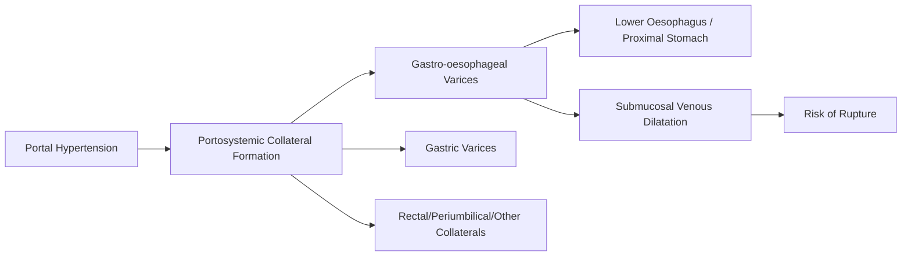
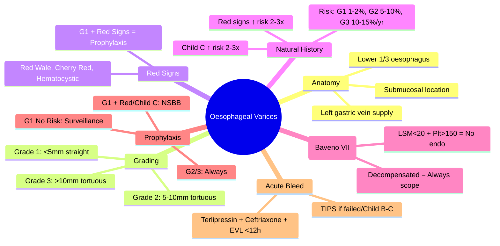

## 1. Learning Objectives
- [ ] Understand the anatomy and pathophysiology of portal hypertensive varices
- [ ] Apply variceal grading systems (Grade 1/2/3)
- [ ] Know natural history and bleeding risk
- [ ] Identify high-risk features for bleeding
- [ ] Identify FCPS/MRCP high-yield variceal concepts

---

## 2. Anatomy & Pathophysiology

| Feature | Oesophageal Varices | Gastric Varices |
|---------|---------------------|-----------------|
| **Location** | Lower 1/3 oesophagus, proximal stomach | Fundus, body, antrum |
| **Supply** | Left gastric vein → Oesophageal branches | Short gastric, posterior gastric veins |
| **Bleeding Risk** | **Higher** (thin wall, superficial) | Lower per varix, but more severe |
| **Classification** | Grade 1/2/3 | Sarin (GOV1/2, IGV1/2) |

> **FCPS/MRCP**: **Oesophageal varices bleed more frequently**; Gastric varices bleed more severely

---

## 3. Oesophageal Variceal Grading (Endoscopic)

| Grade | Description | Size | Bleeding Risk (per year) |
|-------|-------------|------|--------------------------|
| **Grade 1 (Small)** | Straight, <5mm, flatten on insufflation | <5mm | 1-2% |
| **Grade 2 (Medium)** | Tortuous, 5-10mm, <1/3 lumen | 5-10mm | 5-10% |
| **Grade 3 (Large)** | Tortuous, >10mm, >1/3 lumen | >10mm | 10-15% |

### Red Wale Signs (High-Risk Stigmata)

| Sign | Description | Significance |
|------|-------------|--------------|
| **Red Wale Marks** | Longitudinal red streaks | ↑↑ Bleeding risk |
| **Cherry Red Spots** | Small red spots | ↑ Bleeding risk |
| **Hematocystic Spots** | Blue-red dilated venules | ↑ Bleeding risk |
| **White Nipples** | Fibrin deposits | Variable |

> **Any Red Sign on Grade 1** = Indication for primary prophylaxis

---

## 4. Natural History & Bleeding Risk

| Factor | Effect on Bleeding Risk |
|--------|------------------------|
| **Grade 3 vs Grade 1** | 10-15x higher |
| **Red wale signs** | 2-3x increase |
| **Child-Pugh C vs A** | 2-3x increase |
| **HVPG ≥12 mmHg** | Threshold for variceal formation |
| **HVPG ≥16 mmHg** | High bleeding risk |
| **HVPG ≥20 mmHg** | Predicts failure to control bleeding |

### Cumulative Bleeding Probability
| Time | Grade 1 (No Red) | Grade 1 (Red) | Grade 2-3 |
|------|------------------|---------------|-----------|
| **1 year** | 5% | 15% | 25% |
| **2 years** | 10% | 30% | 40% |
| **5 years** | 20% | 50% | 60% |

> **Key**: **Most bleeds occur within first 2 years** after detection

---

## 5. Predictors of First Bleed

| Predictor | Strength |
|-----------|----------|
| **Variceal size (Grade 2/3)** | Strongest |
| **Red wale signs** | Strong |
| **Child-Pugh C** | Moderate |
| **HVPG ≥12 mmHg** | Moderate |
| **Platelet count <90k** | Moderate (surrogate) |

---

## 6. Screening & Surveillance

### Baveno VII Non-Invasive Rule-Out
| Criteria | Action |
|----------|--------|
| **LSM <20 kPa + Platelets >150** | **No endoscopy needed** (Compensated only) |
| **Otherwise** | Screening endoscopy indicated |

### Surveillance Intervals
| Finding | Compensated | Decompensated |
|---------|-------------|---------------|
| **No varices** | 2-3 years | 1-2 years |
| **Grade 1, No red signs** | 2-3 years | 1-2 years |
| **Grade 1, Red signs / Child C** | 1-2 years (after prophylaxis) | 1-2 years |
| **Post-EVL eradication** | 6-12 months | 6-12 months |
| **On NSBB** | 1-2 years | 1-2 years |

---

## 7. Prophylaxis Indications

| Finding | Prophylaxis |
|---------|-------------|
| **Grade 2/3** | **Always** (NSBB or EVL) |
| **Grade 1 + Red signs** | **Yes** (NSBB preferred) |
| **Grade 1 + Child C** | **Yes** |
| **Grade 1, No red signs, Child A/B** | **No** (Surveillance) |

---

## 8. Acute Variceal Bleeding: Key Points

| Step | Action | Timing |
|------|--------|--------|
| **1. Resuscitation** | IV access, bloods, Hb 7-8 | **Immediate** |
| **2. Vasoactives** | Terlipressin 2mg IV q4-6h | **Immediately** |
| **3. Antibiotics** | Ceftriaxone 1g IV daily | **Immediately** |
| **4. Endoscopy** | EVL (<12h) | **<12 hours** |
| **5. Post-bleed** | NSBB + EVL (Day 5-7) | Lifelong |

---

## 9. Rescue TIPS Indications
- **Failed endoscopic control**
- **Early rebleeding** (<5 days)
- **Child-Pugh B/C with active bleed** → Early TIPS within 72h
- **HVPG ≥20 mmHg** at presentation

---

## 10. FCPS/MRCP High-Yield Summary

| Concept | Key Points |
|---------|------------|
| **Grading** | G1: <5mm straight; G2: 5-10mm tortuous; G3: >10mm tortuous |
| **Red signs** | Red wale, cherry red, hematocystic → Prophylaxis even if G1 |
| **Bleeding risk/yr** | G1: 1-2%, G2: 5-10%, G3: 10-15% |
| **Screening** | Baveno VII: LSM<20 + Plt>150 = No scope |
| **Prophylaxis** | G2/3 always; G1 + red signs/Child C |
| **Acute bleed** | Terlipressin + Ceftriaxone + EVL <12h |
| **Rescue TIPS** | Failed endoscopy, Early rebleed, Child B/C with bleed |
| **Secondary prophylaxis** | NSBB + EVL lifelong |

---

## 11. Viva Questions

1. **What are the endoscopic grades of oesophageal varices?**
2. **What are red wale signs? Do they change management?**
3. **What is the annual bleeding risk for each grade?**
4. **What are Baveno VII criteria to avoid endoscopy?**
5. **When is primary prophylaxis indicated for Grade 1 varices?**
5. **What is the management of acute variceal bleeding?**
6. **What is the role of HVPG in variceal management?**
6. **When do you consider TIPS for variceal bleeding?**
7. **What is the secondary prophylaxis after variceal bleed?**
7. **How do gastric varices differ from oesophageal varices?**
8. **What is the natural history of varices?**

---

## 12. Confusions & Mnemonics

| Confusion | Clarification |
|-----------|---------------|
| Grade 1 vs 2 vs 3 | Size: <5mm, 5-10mm, >10mm; Tortuosity: Straight → Tortuous |
| Red signs on Grade 1 | **Prophylaxis indicated** (NSBB preferred) even though bleeding risk low |
| Surveillance intervals | **No varices: Comp 2-3y, Decomp 1-2y**; **Grade 1 no prophylaxis: Same** |
| Post-EVL vs On NSBB | Post-EVL = 6-12m; On NSBB = 1-2y |
| Baveno VII in NASH | **Less validated** — lower threshold for endoscopy |
| HVPG thresholds | ≥10 CSPH, ≥12 Varices, ≥16 Bleeding, ≥20 Mortality |
| Early TIPS | Child B/C, active bleed → <72h |

---

## 13. Mind Map

---

## 14. One-Page Revision Card

| **Variceal Grade** | **Size** | **Bleeding Risk/yr** | **Prophylaxis** |
|--------------------|----------|---------------------|-----------------|
| **Grade 1 (Small)** | <5mm, straight | 1-2% | If Red Signs/Child C |
| **Grade 2 (Medium)** | 5-10mm, tortuous | 5-10% | **Always** |
| **Grade 3 (Large)** | >10mm, >1/3 lumen | 10-15% | **Always** |

| **Red Signs** | **Action** |
|---------------|------------|
| Red Wale Marks | Prophylaxis if G1 |
| Cherry Red Spots | Prophylaxis if G1 |
| Hematocystic Spots | Prophylaxis if G1 |

| **Baveno VII** | **LSM <20 kPa + Platelets >150** = No Endoscopy (Compensated) |

| **Acute Bleed** | **Management** |
|-----------------|----------------|
| Resuscitation | Hb 7-8, Terlipressin 2mg q4-6h, Ceftriaxone |
| Endoscopy | <12h, EVL primary |
| Post-bleed | NSBB + EVL (Day 5-7) |
| TIPS | Failed endoscopy, Rebleed, Child B/C |

---

## 15. Spaced Repetition Tracker

| Day | 1 | 3 | 7 | 15 | 30 |
|-----|---|---|---|----|----|
| Variceal Grades | ☐ | ☐ | ☐ | ☐ | ☐ |
| Red Signs | ☐ | ☐ | ☐ | ☐ | ☐ |
| Bleeding Risks | ☐ | ☐ | ☐ | ☐ | ☐ |
| Baveno VII Rule | ☐ | ☐ | ☐ | ☐ | ☐ |
| Acute Bleed Management | ☐ | ☐ | ☐ | ☐ | ☐ |

---

## 16. Self-Test Scorecard

| Question | My Answer | Correct? |
|----------|-----------|----------|
| Variceal Grades |  |  |
| Red Signs Types |  |  |
| Bleeding Risk by Grade |  |  |
| Baveno VII Criteria |  |  |
| Acute Bleed Management |  |  |

---

## 17. Local Navigation

- [[Portal Hypertension and Complications/Primary prophylaxis (NSBB vs EVL)|Primary Prophylaxis]]
- [[Portal Hypertension and Complications/Secondary prophylaxis|Secondary Prophylaxis]]
- [[Portal Hypertension and Complications/Acute variceal bleeding management|Acute Bleed]]
- [[Portal Hypertension and Complications/Screening endoscopy|Screening Endoscopy]]
- [[Portal Hypertension and Complications/Gastric varices (glue injection)|Gastric Varices]]