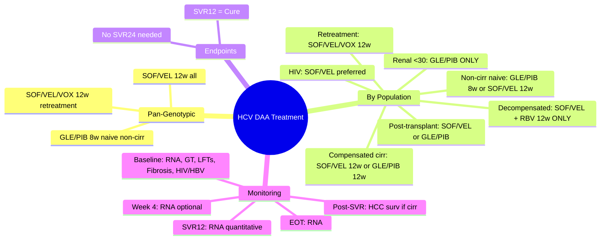

## 1. Learning Objectives
- [ ] Select DAA regimen by genotype (1-6), cirrhosis status, treatment history
- [ ] Adjust for renal impairment (eGFR <30, dialysis)
- [ ] Manage decompensated cirrhosis (Child-Pugh B/C)
- [ ] Define SVR12 and manage treatment failure
- [ ] Apply FCPS/MRCP high-yield prescribing knowledge

---

## 2. Pan-Genotypic Regimens (Preferred for All Genotypes 1-6)

| Regimen | Standard Duration | Cirrhosis Adjustment | Key Features |
|---------|-------------------|---------------------|--------------|
| **Sofosbuvir/Velpatasvir (SOF/VEL)** Epclusa® | 12 weeks | **Compensated: 12w; Decompensated: 12w + RBV** | Preferred pan-genotypic; **Avoid with amiodarone** (bradycardia) |
| **Glecaprevir/Pibrentasvir (GLE/PIB)** Maviret® | **8 weeks** (naive, non-cirrhotic) | **Compensated: 8-12w; Decompensated: CONTRAINDICATED** | Shortest duration; PI-based (drug interactions); **Not in decompensated** |
| **Sofosbuvir/Velpatasvir/Voxilaprevir (SOF/VEL/VOX)** Vosevi® | 12 weeks | **Compensated: 12w; Decompensated: CONTRAINDICATED** | **Retreatment** for DAA failures; PI-based |
| **Sofosbuvir + Daclatasvir (SOF/DAC)** | 12 weeks | 12 weeks (all) | Alternative if pan-genotypic unavailable |
| **Sofosbuvir + Simeprevir (SOF/SIM)** | 12 weeks | 12 weeks | Historical; PI-based |

---

## 3. Treatment Algorithm by Patient Profile

```mermaid
flowchart TD
    A[HCV RNA Positive] --> B{Genotype Known?}
    B -->|Yes| C[Pan-genotypic preferred]
    B -->|No| D[Use pan-genotypic]
    C --> E{Cirrhosis?}
    D --> E
    E -->|No (Non-cirrhotic)| F[Treatment Naive?]
    E -->|Yes (Compensated)| G[Treatment Naive?]
    E -->|Decompensated (Child B/C)| H[SOF/VEL + RBV x 12w]
    F -->|Yes| I[GLE/PIB x 8w OR SOF/VEL x 12w]
    F -->|No| J[Prior DAA failure?]
    G -->|Yes| K[GLE/PIB x 12w OR SOF/VEL x 12w]
    G -->|No| L[Prior DAA failure?]
    J -->|No| M[Same as naive or extend 16-24w]
    J -->|Yes| N[SOF/VEL/VOX x 12w]
    L -->|No| M
    L -->|Yes| N
    H --> O[Monitor for decompensation]
    I --> P[SVR12]
    K --> P
    M --> P
    N --> P
```

---

## 4. Special Populations

### 1. Decompensated Cirrhosis (Child-Pugh B/C)
| Regimen | Duration | Notes |
|---------|----------|-------|
| **SOF/VEL + Ribavirin** | 12 weeks | **ONLY recommended regimen**; GLE/PIB & SOF/VEL/VOX **CONTRAINDICATED** (PI metabolism) |
| **Ribavirin dose** | 600-1000 mg/day (weight-based), adjust for Hb <10 g/dL | Monitor Hb weekly ×4, then 2-weekly |

### 2. Renal Impairment
| Regimen | eGFR | Notes |
|---------|------|-------|
| **GLE/PIB** | **All stages** including dialysis | **Preferred**; no dose adjustment |
| **SOF/VEL** | eGFR ≥30 | **Avoid if <30** (sofosbuvir accumulation) |
| **OBV/PTV/r + DSV** | All stages (with caution) | Alternative if GLE/PIB not available |
| **DAC/ASV** | All stages | Historical regimen |

### 3. HIV Coinfection
- **Same regimens, same durations** as mono-infection
- **Drug interactions**: GLE/PIB with boosted PIs (avoid); SOF/VEL with some ARVs (check)
- **Preferred**: SOF/VEL (fewest interactions)

### 4. Post-Liver Transplant
- **SOF/VEL** 12 weeks (compensated)
- **GLE/PIB** 12 weeks (compensated, no interacting immunosuppressants)
- **Avoid PIs** with calcineurin inhibitors unless expert management

### 5. Prior DAA Failure (Retreatment)
| Prior Failure | Retreatment Regimen | Duration |
|---------------|---------------------|----------|
| **SOF/VEL** failure | **SOF/VEL/VOX** | 12 weeks |
| **GLE/PIB** failure | **SOF/VEL/VOX** | 12 weeks |
| **SOF/VEL/VOX** failure | **SOF/VEL + RBV** 24w OR **GLE/PIB + RBV** 16-24w | Specialist referral |
| **PR + SOF** failure | Pan-genotypic per above | Per above |

---

## 5. Genotype-Specific Considerations (If Non-Pan-Genotypic Used)

| Genotype | Alternative Regimens | Notes |
|----------|---------------------|-------|
| **GT 1a** | SOF/VEL, GLE/PIB, SOF/DAC, ELB/GZR (12-16w) | ELB/GZR: add RBV if baseline NS5A RAS |
| **GT 1b** | SOF/VEL, GLE/PIB, SOF/DAC, ELB/GZR (12w) | ELB/GZR: no RAS testing needed |
| **GT 2** | SOF/VEL (12w), SOF + RBV (12w) | SOF/VEL preferred |
| **GT 3** | SOF/VEL (12w), GLE/PIB (8w naive non-cirr), SOF + DAC (12w) | **GT3 historically difficult** — now same with pan-genotypic |
| **GT 4** | SOF/VEL, GLE/PIB, SOF/DAC, OBV/PTV/r+DSV+RBV | |
| **GT 5/6** | SOF/VEL (12w), GLE/PIB (8-12w) | Limited data; pan-genotypic preferred |

---

## 6. Treatment Endpoints & Definitions

| Endpoint | Definition | Clinical Significance |
|----------|------------|----------------------|
| **SVR12** | HCV RNA undetectable **12 weeks post-treatment** | **Cure** (>99% durability) |
| **SVR24** | HCV RNA undetectable **24 weeks post-treatment** | Historical standard; now SVR12 sufficient |
| **RV (Relapse)** | HCV RNA detectable after EOT but before SVR12 | Retreatment needed |
| **Breakthrough** | HCV RNA detectable on-treatment after suppression | Resistance; switch regimen |
| **Non-response** | HCV RNA never undetectable on-treatment | Rare with modern DAAs; resistance |

> **FCPS/MRCP**: **SVR12 = Cure**. No need for SVR24.

---

## 7. On-Treatment Monitoring

| Timepoint | Monitoring |
|-----------|------------|
| **Baseline** | HCV RNA (quantitative), Genotype (if not pan-genotypic), LFTs, CBC, Renal, HIV/HBV coinfection, Fibrosis stage (TE/APRI/FIB-4), Drug interactions |
| **Week 4** | HCV RNA (optional — rapid virologic response), LFTs, CBC, Adherence, Side effects |
| **End of Treatment (EOT)** | HCV RNA (qualitative), LFTs, CBC |
| **SVR12 (Post-treatment Week 12)** | **HCV RNA (quantitative)** — PRIMARY ENDPOINT |
| **Post-SVR** | LFTs 6-monthly; HCC surveillance if cirrhosis (6-monthly US ± AFP); Reinfection risk reduction |

---

## 8. Common Adverse Effects

| Regimen | Common AEs | Serious/Notable |
|---------|------------|-----------------|
| **SOF/VEL** | Fatigue, headache, nausea | Bradycardia with amiodarone |
| **GLE/PIB** | Fatigue, headache, nausea, pruritus | **Contraindicated in decompensated cirrhosis**; ALT elevation (PI) |
| **SOF/VEL/VOX** | Fatigue, headache, nausea | Contraindicated in decompensated; drug interactions (voxilaprevir) |
| **Ribavirin** | Haemolytic anaemia, rash, cough, teratogenic | Contraindicated in pregnancy; dose-adjust for Hb |

---

## 9. FCPS/MRCP High-Yield Prescribing Summary

| Patient | Preferred Regimen | Duration | Key Caveat |
|---------|-------------------|----------|------------|
| **Naive, non-cirrhotic, any GT** | **GLE/PIB 8w** OR **SOF/VEL 12w** | 8w (GLE/PIB) / 12w (SOF/VEL) | GLE/PIB shortest |
| **Naive, compensated cirrhosis, any GT** | **SOF/VEL 12w** OR **GLE/PIB 12w** | 12 weeks | GLE/PIB OK if compensated |
| **Decompensated cirrhosis (Child B/C)** | **SOF/VEL + RBV 12w** | 12 weeks | **Only option**; monitor Hb |
| **Renal impairment (eGFR <30/dialysis)** | **GLE/PIB 8-12w** | 8-12 weeks | **Preferred**; no SOF |
| **DAA failure (any regimen)** | **SOF/VEL/VOX 12w** | 12 weeks | For NS5A/NS5B failures |
| **HIV coinfection** | **SOF/VEL 12w** (preferred) | 12 weeks | Check ARV interactions |

---

## 10. Viva Questions

1. **What are the pan-genotypic DAA regimens? Durations?**
2. **Which regimen for decompensated cirrhosis? Why not GLE/PIB?**
3. **What regimen for CKD Stage 5/dialysis?**
4. **Define SVR12. Why is SVR24 no longer needed?**
5. **Retreatment after SOF/VEL failure?**
6. **Drug interactions: SOF/VEL + amiodarone? GLE/PIB + boosted PI?**
7. **Duration for GT3 treatment-naive non-cirrhotic?**
8. **Monitoring at SVR12? Post-SVR HCC surveillance?**
9. **Ribavirin dose adjustment in decompensated cirrhosis?**
10. **Can you use SOF/VEL in eGFR <30?**

---

## 11. Confusions & Mnemonics

| Confusion | Clarification |
|-----------|---------------|
| SOF/VEL vs GLE/PIB duration | GLE/PIB: 8w (naive, non-cirr); SOF/VEL: 12w (all) |
| Decompensated cirrhosis | **Only SOF/VEL + RBV** — GLE/PIB & VOX contain PIs (hepatic metabolism) |
| Renal impairment | **GLE/PIB safe in all eGFR**; SOF/VEL avoid <30 |
| SOF/VEL/VOX indication | **Retreatment only** — not first-line |
| SVR12 vs SVR24 | **SVR12 = Cure**; SVR24 historical |
| GT3 difficulty | Historical (IFN era); **Modern DAAs: GT3 = same as others** |

---

## 12. Mind Map



---

## 13. One-Page Revision Card

| **Patient** | **Regimen** | **Duration** | **Key Caveat** |
|-------------|-------------|--------------|----------------|
| Naive, non-cirrhotic | GLE/PIB or SOF/VEL | 8w / 12w | GLE/PIB shortest |
| Naive, compensated cirrhosis | GLE/PIB or SOF/VEL | 12w | Either OK |
| Decompensated (Child B/C) | **SOF/VEL + RBV** | 12w | **Only option** |
| eGFR <30 / Dialysis | **GLE/PIB** | 8-12w | **Only option** |
| DAA failure | **SOF/VEL/VOX** | 12w | Retreatment |
| HIV coinfected | SOF/VEL preferred | 12w | Check interactions |

---

## 14. Spaced Repetition Tracker

| Day | 1 | 3 | 7 | 15 | 30 |
|-----|---|---|---|----|----|
| Pan-genotypic regimens | ☐ | ☐ | ☐ | ☐ | ☐ |
| Decompensated regimen | ☐ | ☐ | ☐ | ☐ | ☐ |
| Renal impairment regimen | ☐ | ☐ | ☐ | ☐ | ☐ |
| Retreatment algorithm | ☐ | ☐ | ☐ | ☐ | ☐ |
| SVR12 definition | ☐ | ☐ | ☐ | ☐ | ☐ |

---

## 15. Self-Test Scorecard

| Question | My Answer | Correct? |
|----------|-----------|----------|
| 3 pan-genotypic regimens |  |  |
| Decompensated cirrhosis regimen |  |  |
| CKD Stage 5 regimen |  |  |
| SVR12 vs SVR24 |  |  |
| DAA failure retreatment |  |  |

---

## 16. Local Navigation

- [[Viral Hepatitis/Hepatitis C|Hepatitis C Overview]]
- [[Viral Hepatitis/Hepatitis C genotype-based treatment|HCV Genotype-Based Treatment]]
- [[Viral Hepatitis/Hepatitis C treatment endpoints|SVR12/Endpoints]]
- [[Viral Hepatitis/Hepatitis C decompensated cirrhosis management|HCV Decompensated]]
- [[Viral Hepatitis/Hepatitis C renal impairment|HCV Renal]]
- [[Viral Hepatitis/Hepatitis C post-SVR follow-up|Post-SVR]]