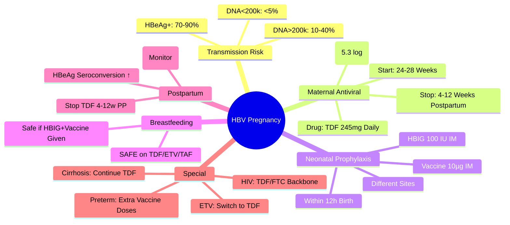

## 1. Learning Objectives
- [ ] Assess vertical transmission risk based on maternal HBV DNA level
- [ ] Apply criteria for maternal antiviral therapy during pregnancy
- [ ] Implement immunoprophylaxis for newborn (HBIG + Vaccine)
- [ ] Know breastfeeding safety on antivirals
- [ ] Identify FCPS/MRCP high-yield thresholds and timelines

---

## 2. Vertical Transmission Risk

| Maternal Factor | Transmission Risk Without Intervention |
|-----------------|----------------------------------------|
| **HBeAg+** | 70-90% |
| **HBeAg-, High HBV DNA (>200,000 IU/mL)** | 10-40% |
| **HBeAg-, Low HBV DNA (<200,000 IU/mL)** | <5% (rare) |
| **HBsAg+ only (No HBeAg, Low DNA)** | 5-10% |

> **FCPS/MRCP**: **HBV DNA >200,000 IU/mL = High Risk → Maternal Antiviral Indicated**

---

## 3. Maternal Antiviral Therapy

### Indication
| Maternal HBV DNA | Gestation Start | Recommendation |
|------------------|----------------|----------------|
| **>200,000 IU/mL** (or **>5.3 log10 IU/mL**) | **24-28 weeks** | **TENOFOVIR DISOPROXIL FUMARATE (TDF) 245mg daily** |
| **<200,000 IU/mL** | — | **No Antiviral Needed** (Immunoprophylaxis Alone Sufficient) |

> **Threshold**: **200,000 IU/mL (5.3 log10)** — Evidence-based from multiple RCTs

### Drug of Choice: TDF (Tenofovir DF)
| Aspect | Detail |
|-------|--------|
| **Drug** | **Tenofovir DF (TDF) 245mg daily** |
| **Start** | **24-28 weeks Gestation** |
| **Stop** | **4-12 weeks Postpartum** (After HBIG/Vaccine to Baby) |
| **Safety** | **Category B** — No Teratogenicity; Safe in Pregnancy |
| **Monitoring** | Renal Function, LFTs, HBV DNA q4-6 weeks |

> **TDF Preferred Over ETV/TAF** — Most Pregnancy Safety Data; TAF Emerging but Less Data

### Discontinuation
- **Stop at 4-12 weeks postpartum**
- **Continue if**: High Baseline HBV DNA, Cirrhosis, Treatment Indication Persists
- **Flare Risk**: Postpartum ALT Flare Common — Monitor LFTs Monthly ×3 Months

---

## 4. Neonatal Immunoprophylaxis (Within 12 Hours)

| Intervention | Dose | Timing |
|--------------|------|--------|
| **Hepatitis B Immunoglobulin (HBIG)** | **100 IU (0.5 mL) IM** | **Within 12 Hours** of Birth (Ideally <24h) |
| **Hepatitis B Vaccine (Engerix-B/HBvaxPRO)** | **10 µg (0.5 mL) IM** | **Within 24 Hours** of Birth (Different Site from HBIG) |

### Vaccination Schedule (Standard)
| Dose | Timing |
|------|--------|
| **1st** | Birth (with HBIG) |
| **2nd** | 1 Month |
| **3rd** | 6 Months |
| **Booster (if Anti-HBs <10)** | 6-12 Months |

> **Preterm <2kg**: HBIG + Vaccine at Birth → 3 Additional Doses (1, 2, 6, 12 Months)

---

## 5. Breastfeeding

| Situation | Recommendation |
|-----------|----------------|
| **Mother on TDF/ETV/TAF** | **Safe to Breastfeed** — Minimal Drug Excretion in Milk |
| **Mother HBsAg+ Not on Treatment** | **Safe to Breastfeed** — No Additional Transmission Risk if Baby Received HBIG + Vaccine |
| **Mother HIV+** | **Avoid Breastfeeding** (If Safe Alternative Exists) |

> **FCPS/MRCP**: **Breastfeeding Safe** with Immunoprophylaxis — **No Contraindication**

---

## 6. Postpartum Management

| Aspect | Management |
|--------|------------|
| **Maternal ALT Flare** | Common 4-12w Postpartum — Monitor LFTs Monthly ×3mo; Usually Self-Limited |
| **Antiviral Continuation** | Stop at 4-12w Postpartum (unless Cirrhosis/Indication Persists) |
| **HBeAg Seroconversion** | More Common Postpartum — Monitor HBV DNA, HBeAg |
| **Contraception** | Discuss Postpartum — TDF/ETV/TAF Safe with All Methods |

---

## 7. High-Risk Scenarios

| Scenario | Management |
|---------|------------|
| **Acute HBV in Pregnancy** | Supportive; TDF if ALF Risk; HBIG + Vaccine to Baby |
| **HBV Reactivation Postpartum** | Common 4-12w — Monitor LFTs Monthly ×3mo |
| **Mother HIV Coinfected** | TDF/FTC Backbone — Treat Both; Avoid Breastfeeding |
| **Mother on ETV** | **Switch to TDF** (ETV Pregnancy Data Limited) |
| **Mother with Cirrhosis** | Continue TDF Throughout Pregnancy + Postpartum |
| **Emergency Delivery <24w** | HBIG + Vaccine Still Indicated; Antiviral if High Risk |

---

## 8. FCPS/MRCP High-Yield Summary

| Concept | Key Points |
|---------|------------|
| **Transmission Threshold** | **HBV DNA >200,000 IU/mL (5.3 log) = High Risk** |
| **Antiviral Indication** | **TDF 245mg from 24-28 weeks** if HBV DNA >200,000 |
| **Neonatal Prophylaxis** | **HBIG 100 IU + HB Vaccine 10µg within 12h** of birth |
| **Breastfeeding** | **Safe** (with HBIG+Vaccine); No Contraindication |
| **Postpartum Flare** | Common 4-12w — Monitor LFTs Monthly ×3mo |
| **TDF Safety** | **Category B** — Preferred; Stop 4-12w Postpartum |
| **HBIG + Vaccine** | **Different Sites**; HBIG 100 IU, Vaccine 10µg |
| **Preterm <2kg** | HBIG + Vaccine ×4 Doses (Birth, 1, 2, 6, 12mo) |

---

## 9. Viva Questions

1. **What is the HBV DNA threshold for maternal antiviral therapy in pregnancy?**
2. **What is the antiviral of choice? Dose? When to start/stop?**
3. **What is the neonatal immunoprophylaxis protocol?**
4. **Is breastfeeding safe in HBsAg+ mother?**
4. **What is the postpartum flare? When does it occur?**
5. **What if mother has HBV DNA <200,000?**
6. **What is the vaccination schedule for infant?**
7. **What if mother on Entecavir?**
8. **What if mother HIV coinfected?**
9. **What is the HBIG dose and timing?**
10. **What if emergency delivery at 24 weeks?**

---

## 10. Confusions & Mnemonics

| Confusion | Clarification |
|-----------|---------------|
| TDF vs ETV in Pregnancy | **TDF Preferred** — Most Safety Data; ETV Data Limited; TAF Emerging |
| DNA Threshold | **200,000 IU/mL (5.3 log)** — NOT 20,000 or 2,000 |
| HBIG Timing | **Within 12 Hours** (Ideally) — Different Site from Vaccine |
| Breastfeeding | **Safe** — No Additional Risk with Immunoprophylaxis |
| Postpartum Flare | **ALT Rise 4-12w** — Immune Reconstitution; Monitor Don't Treat Unless Severe |
| TDF Stop | **4-12 Week Postpartum** — Unless Cirrhosis/Ongoing Indication |
| Preterm <2kg | **Extra Vaccine Doses** (Birth, 1, 2, 6, 12mo) |
| ETV in Pregnancy | **Switch to TDF** — Less Pregnancy Data |

---

## 11. Mind Map

---

## 12. One-Page Revision Card

| **Threshold** | **Action** |
|---------------|------------|
| **HBV DNA >200,000 IU/mL** | **TDF 245mg from 24-28w** |
| **HBV DNA <200,000 IU/mL** | **No Antiviral** (Immunoprophylaxis only) |

| **Neonatal Prophylaxis** | |
|--------------------------|--|
| **HBIG** | 100 IU IM (within 12h) |
| **Hep B Vaccine** | 10µg IM (within 24h, different site) |
| **Schedule** | Birth, 1mo, 6mo |

| **Maternal TDF** | |
|------------------|--|
| Dose | 245mg Daily |
| Start | 24-28 Weeks |
| Stop | 4-12 Weeks Postpartum |
| Safety | Category B (Preferred) |

| **Postpartum** | |
|----------------|--|
| ALT Flare | 4-12 Weeks (Monitor Monthly) |
| Breastfeeding | **Safe** |
| Contraception | Discuss (TDF Compatible) |

---

## 13. Spaced Repetition Tracker

| Day | 1 | 3 | 7 | 15 | 30 |
|-----|---|---|---|----|----|
| DNA Threshold 200k | ☐ | ☐ | ☐ | ☐ | ☐ |
| TDF Start/Stop | ☐ | ☐ | ☐ | ☐ | ☐ |
| HBIG+Vaccine Protocol | ☐ | ☐ | ☐ | ☐ | ☐ |
| Breastfeeding Safety | ☐ | ☐ | ☐ | ☐ | ☐ |
| Postpartum Flare | ☐ | ☐ | ☐ | ☐ | ☐ |

---

## 14. Self-Test Scorecard

| Question | My Answer | Correct? |
|----------|-----------|----------|
| DNA Threshold for TDF |  |  |
| HBIG + Vaccine Timing |  |  |
| Breastfeeding Safe? |  |  |
| TDF Stop Timing |  |  |
| Postpartum Flare |  |  |

---

## 15. Local Navigation

- [[Viral Hepatitis/Hepatitis B|HBV Overview]]
- [[Viral Hepatitis/Hepatitis B phases of chronic infection|HBV Phases]]
- [[Viral Hepatitis/Hepatitis B treatment indications|HBV Treatment]]
- [[Viral Hepatitis/Hepatitis B reactivation|HBV Reactivation]]
- [[Viral Hepatitis/Hepatitis B serology interpretation|HBV Serology]]
---

> Auto-generated study sections for "Viral Hepatitis" — Ch 23: Hepatology.

## Flashcards (27 generated)

- Q: What is the definition of Viral Hepatitis?
  A: | Maternal HBV DNA | Gestation Start | Recommendation |
- Q: What is Drug of Viral Hepatitis?
  A: Tenofovir DF (TDF) 245mg daily
- Q: What is Start of Viral Hepatitis?
  A: 24-28 weeks Gestation
- Q: What is Stop of Viral Hepatitis?
  A: 4-12 weeks Postpartum (After HBIG/Vaccine to Baby)
- Q: What is Safety of Viral Hepatitis?
  A: Category B — No Teratogenicity; Safe in Pregnancy
- Q: How is Viral Hepatitis monitored?
  A: Renal Function, LFTs, HBV DNA q4-6 weeks
- Q: What is Maternal ALT Flare of Viral Hepatitis?
  A: Common 4-12w Postpartum — Monitor LFTs Monthly ×3mo; Usually Self-Limited
- Q: What is Antiviral Continuation of Viral Hepatitis?
  A: Stop at 4-12w Postpartum (unless Cirrhosis/Indication Persists)
- Q: What is HBeAg Seroconversion of Viral Hepatitis?
  A: More Common Postpartum — Monitor HBV DNA, HBeAg
- Q: What is Contraception of Viral Hepatitis?
  A: Discuss Postpartum — TDF/ETV/TAF Safe with All Methods
- Q: What is Drug of Viral Hepatitis?
  A: Tenofovir DF (TDF) 245mg daily
- Q: What is Start of Viral Hepatitis?
  A: 24-28 weeks Gestation
- Q: What is Stop of Viral Hepatitis?
  A: 4-12 weeks Postpartum (After HBIG/Vaccine to Baby)
- Q: What is Safety of Viral Hepatitis?
  A: Category B — No Teratogenicity; Safe in Pregnancy
- Q: How is Viral Hepatitis monitored?
  A: Renal Function, LFTs, HBV DNA q4-6 weeks
- Q: What is Maternal ALT Flare of Viral Hepatitis?
  A: Common 4-12w Postpartum — Monitor LFTs Monthly ×3mo; Usually Self-Limited
- Q: What is Antiviral Continuation of Viral Hepatitis?
  A: Stop at 4-12w Postpartum (unless Cirrhosis/Indication Persists)
- Q: What is HBeAg Seroconversion of Viral Hepatitis?
  A: More Common Postpartum — Monitor HBV DNA, HBeAg
- Q: What is Contraception of Viral Hepatitis?
  A: Discuss Postpartum — TDF/ETV/TAF Safe with All Methods
- Q: What is Transmission Threshold of Viral Hepatitis?
  A: HBV DNA >200,000 IU/mL (5.3 log) = High Risk
- Q: What is Viral Hepatitis indicated for?
  A: TDF 245mg from 24-28 weeks if HBV DNA >200,000
- Q: What is Neonatal Prophylaxis of Viral Hepatitis?
  A: HBIG 100 IU + HB Vaccine 10µg within 12h of birth
- Q: What is Breastfeeding of Viral Hepatitis?
  A: Safe (with HBIG+Vaccine); No Contraindication
- Q: What is Postpartum Flare of Viral Hepatitis?
  A: Common 4-12w — Monitor LFTs Monthly ×3mo
- Q: What is TDF Safety of Viral Hepatitis?
  A: Category B — Preferred; Stop 4-12w Postpartum
- Q: What is HBIG + Vaccine of Viral Hepatitis?
  A: Different Sites; HBIG 100 IU, Vaccine 10µg
- Q: What is Preterm <2kg of Viral Hepatitis?
  A: HBIG + Vaccine ×4 Doses (Birth, 1, 2, 6, 12mo)

## MCQs (1 generated)

1. **Which of the following best describes Viral Hepatitis?**
   A. **| Maternal HBV DNA | Gestation Start | Recommendation |**
   B. An unrelated condition not matching the clinical picture of Viral Hepatitis
   C. A complication seen late in the disease course of Viral Hepatitis
   D. A condition that mimics Viral Hepatitis but has a different underlying cause

