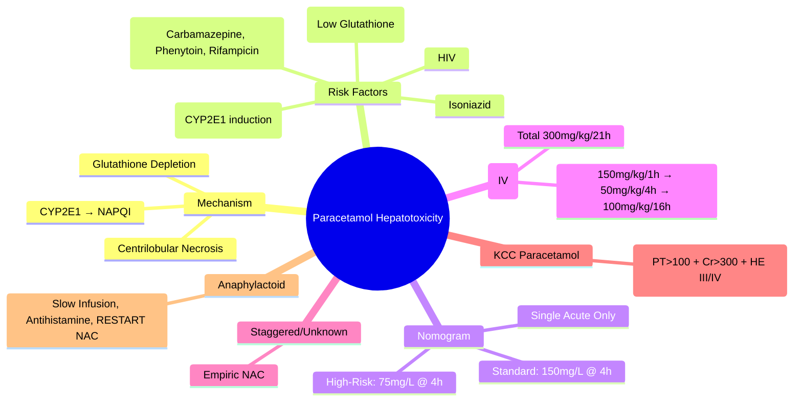

## 1. Learning Objectives
- [ ] Understand mechanism of paracetamol toxicity (NAPQI, glutathione depletion)
- [ ] Apply risk nomogram (Rumack-Matthew) for treatment decisions
- [ ] Prescribe NAC regimen (IV/oral) correctly
- [ ] Apply King's College Criteria for transplant referral
- [ ] Identify FCPS/MRCP high-yield features (staggered overdose, risk factors)

---

## 2. Mechanism of Toxicity

```mermaid
flowchart LR
    A[Paracetamol Overdose] --> B[Normal Metabolism: Glucuronidation + Sulphation]
    B --> C[Saturation → Cytochrome P450 (CYP2E1, CYP1A2, CYP3A4)]
    C --> D[NAPQI Formation (Toxic Metabolite)]
    D --> E{Glutathione Available?}
    E -->|Yes (Therapeutic Dose)| F[NAPQI Conjugated → Excreted]
    E -->|No (Overdose)| G[Glutathione Depleted]
    G --> H[NAPQI Binds Hepatocyte Proteins]
    H --> I[Oxidative Stress, Mitochondrial Dysfunction]
    I --> J[Centrilobular Necrosis]
```

---

## 3. Risk Factors for Toxicity

| Risk Factor | Mechanism |
|-------------|-----------|
| **Fasting/Malnutrition** | ↓ Glutathione stores |
| **Chronic Alcohol Use** | CYP2E1 induction → ↑ NAPQI; ↓ Glutathione |
| **Enzyme Inducers** | Carbamazepine, Phenytoin, Rifampicin, St John's Wort → ↑ CYP2E1 |
| **Isoniazid** | ↑ CYP2E1 |
| **HIV/AIDS** | ↓ Glutathione synthesis |
| **Pregnancy** | ↑ Volume of distribution, altered metabolism |

---

## 4. Rumack-Matthew Nomogram (Single Acute Overdose)

> ** ONLY for single acute ingestion with known time**

```mermaid
flowchart TD
    A[Single Acute Paracetamol Overdose] --> B[Time Since Ingestion Known?]
    B -->|Yes| C[Plot Paracetamol Level on Nomogram]
    C --> D{Above Treatment Line?}
    D -->|Yes (≥150 mg/L at 4h)| E[Give NAC]
    D -->|No| F[No NAC Needed]
    B -->|No (Staggered/Unknown Time)| G[Give NAC Empirically]
    C --> H[Also Treat if: ALT↑, INR↑, Acidosis, Uncertain Time]
```

### Nomogram Treatment Line
- **Standard Line**: 150 mg/L (200 μmol/L) at 4 hours
- **High-Risk Line** (alcohol, enzyme inducers, fasting, HIV): **75 mg/L (100 μmol/L) at 4 hours**

> **FCPS/MRCP**: **Nomogram only for single acute overdose with known time** — otherwise treat empirically

---

## 5. NAC (N-Acetylcysteine) Regimens

### IV Regimen (Preferred — UK/International)

| Phase | Dose | Duration | Volume |
|-------|------|----------|--------|
| **Loading** | **150 mg/kg** | **1 hour** | 200 mL 5% Dextrose |
| **Maintenance 1** | **50 mg/kg** | **4 hours** | 500 mL 5% Dextrose |
| **Maintenance 2** | **100 mg/kg** | **16 hours** | 1000 mL 5% Dextrose |
| **Total** | **300 mg/kg** | **21 hours** | |

> **Weight-based**: Use actual body weight (cap at 110 kg for loading dose)

### Oral Regimen (US Alternative — 72 hours)

| Dose | Frequency | Duration |
|------|-----------|----------|
| **140 mg/kg loading** | Once | — |
| **70 mg/kg** | Every 4 hours | **17 doses (72 hours total)** |

### Anaphylactoid Reactions to IV NAC
- **Incidence**: 10-20% (usually during loading dose)
- **Features**: Flushing, rash, bronchospasm, hypotension
- **Management**: Stop infusion → Antihistamine ± Bronchodilator → **Restart at slower rate** (not discontinue)

---

## 6. NAC in Special Situations

| Situation | NAC Indication |
|-----------|----------------|
| **Single Acute OD** | Nomogram above line |
| **Staggered OD** | **Always give NAC** (nomogram invalid) |
| **Unknown Time** | **Always give NAC** |
| **Presentation >24h** | **Give NAC** (benefit up to 48h, possibly longer) |
| **Already Fulfilled KCC** | **Continue NAC** (improves transplant-free survival) |
| **Pregnancy** | **IV NAC preferred** (crosses placenta, protects fetus) |
| **Children** | Same weight-based dosing |
| **Non-Paracetamol ALF** | **Consider NAC** (ALFSG trial: benefit in early HE Grade 1-2) |

---

## 7. Paracetamol ALF: King's College Criteria Refresher

| Criterion | Threshold |
|-----------|-----------|
| **Arterial pH** | **<7.30** (after resuscitation) |
| **OR** PT >100s + Cr >300 μmol/L + HE Grade III/IV | **All 3 Required** |

> **Action if Met**: Urgent Transplant Referral + Continue NAC

---

## 8. Staggered Overdose vs Therapeutic Excess

| Type | Definition | Risk | Management |
|------|------------|------|------------|
| **Staggered Overdose** | Multiple doses over >1 hour | **High** (delayed presentation, nomogram invalid) | **Empiric NAC** |
| **Therapeutic Excess** | >4g/day for several days (often with risk factors) | Variable | **NAC if ALT↑ or INR↑ or Risk Factors** |
| **Suicidal Acute** | Single large dose | Nomogram applicable | Nomogram-guided |

---

## 9. Monitoring During NAC

| Parameter | Frequency |
|-----------|-----------|
| **ALT/AST** | 12-24 hourly until peaking then daily |
| **INR** | 12-24 hourly |
| **Creatinine** | 24 hourly |
| **Venous Blood Gas (pH, Lactate)** | 6-12 hourly if abnormal |
| **Paracetamol Level** | At presentation (if <4h, repeat at 4h for nomogram) |

---

## 10. FCPS/MRCP High-Yield Summary

| Concept | Key Points |
|---------|------------|
| **Mechanism** | CYP2E1 → NAPQI → Glutathione depletion → Centrilobular necrosis |
| **Risk Factors** | Alcohol, Fasting, Enzyme Inducers (Carbamazepine, Phenytoin, Rifampicin), Isoniazid, HIV |
| **Nomogram** | **Single acute OD only**; 150 mg/L at 4h (standard); 75 mg/L (high-risk) |
| **IV NAC** | 150mg/kg/1h → 50mg/kg/4h → 100mg/kg/16h = 300mg/kg/21h |
| **Staggered/Unknown Time** | **Empiric NAC** (nomogram invalid) |
| **KCC Paracetamol** | pH<7.30 OR (PT>100s + Cr>300 + HE III/IV) |
| **Anaphylactoid Reaction** | Slow infusion, antihistamine, **don't stop NAC** |
| **Presentation >24h** | Still give NAC (benefit up to 48h+) |

---

## 11. Viva Questions

1. **What is the mechanism of paracetamol hepatotoxicity?**
2. **How does the Rumack-Matthew nomogram work? When is it applicable?**
3. **What is the IV NAC regimen (doses and timings)?**
4. **What is the treatment line on the nomogram? High-risk line?**
4. **How do you manage staggered paracetamol overdose?**
5. **What are the King's College Criteria for paracetamol ALF?**
6. **What are the risk factors for paracetamol toxicity?**
7. **How do you manage anaphylactoid reaction to IV NAC?**
8. **Is NAC beneficial in non-paracetamol ALF?**
9. **What is therapeutic excess? How managed?**
10. **When do you give NAC in pregnancy?**

---

## 12. Confusions & Mnemonics

| Confusion | Clarification |
|-----------|---------------|
| Nomogram applicability | **Only single acute overdose with known time** — never for staggered or unknown time |
| High-risk nomogram line | **75 mg/L at 4h** (alcohol, enzyme inducers, fasting, HIV) — half the standard |
| NAC regimen total dose | **300 mg/kg over 21 hours** (not 20h) |
| Staggered vs Therapeutic Excess | Staggered = multiple doses >1h apart; Therapeutic = >4g/day several days |
| NAC in non-PCM ALF | **Benefit in early HE (Grade 1-2)** transplant-free survival (ALFSG trial) |
| KCC pH timing | **After fluid resuscitation** — not on initial gas |
| Anaphylactoid reaction | **Don't stop NAC** — slow rate, give antihistamine, restart |

---

## 13. Mind Map



---

## 14. One-Page Revision Card

| **Paracetamol Toxicity** | **Details** |
|--------------------------|-------------|
| **Mechanism** | CYP2E1 → NAPQI → Glutathione Depletion |
| **Risk Factors** | Alcohol, Fasting, Enzyme Inducers, HIV |
| **Nomogram** | Single Acute Only; 150mg/L @ 4h |
| **High-Risk Line** | 75mg/L @ 4h (Alcohol, Inducers, Fasting, HIV) |
| **IV NAC** | 150mg/kg/1h → 50mg/kg/4h → 100mg/kg/16h (300mg/kg/21h) |
| **Staggered/Unknown** | Empiric NAC |
| **KCC PCM** | pH<7.30 OR (PT>100 + Cr>300 + HE III/IV) |
| **Anaphylactoid** | Slow Infusion, Antihistamine, Don't Stop NAC |

---

## 15. Spaced Repetition Tracker

| Day | 1 | 3 | 7 | 15 | 30 |
|-----|---|---|---|----|----|
| Mechanism NAPQI | ☐ | ☐ | ☐ | ☐ | ☐ |
| Nomogram lines | ☐ | ☐ | ☐ | ☐ | ☐ |
| IV NAC regimen | ☐ | ☐ | ☐ | ☐ | ☐ |
| Staggered management | ☐ | ☐ | ☐ | ☐ | ☐ |
| KCC Paracetamol | ☐ | ☐ | ☐ | ☐ | ☐ |

---

## 16. Self-Test Scorecard

| Question | My Answer | Correct? |
|----------|-----------|----------|
| Mechanism |  |  |
| Nomogram applicability |  |  |
| IV NAC doses |  |  |
| Staggered management |  |  |
| KCC PCM criteria |  |  |

---

## 17. Local Navigation

- [[Acute Liver Failure/Definition and Aetiology|ALF Definition]]
- [[Acute Liver Failure/King's College Criteria|King's College Criteria]]
- [[Acute Liver Failure/N-acetylcysteine therapy|NAC Therapy]]
- [[Acute Liver Failure/Clinical assessment and prognosis|ALF Assessment]]
- [[Drug-Induced Liver Injury/Paracetamol|DILI Paracetamol]]