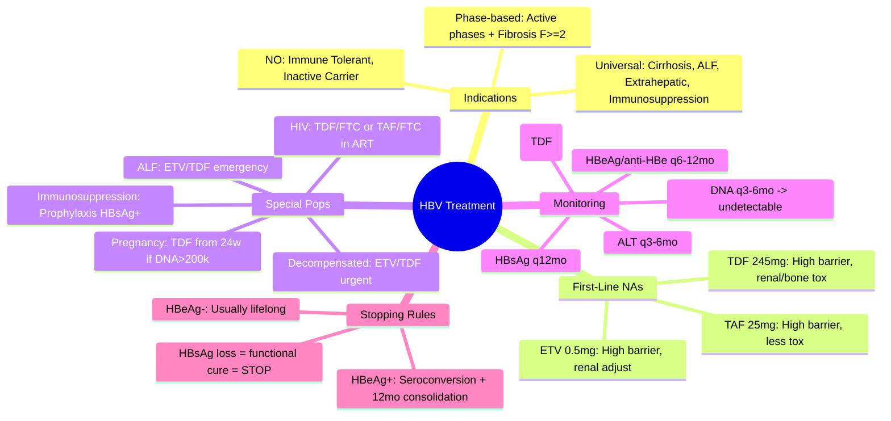

## 1. Learning Objectives
- [ ] Apply EASL/AASLD/WHO treatment criteria for chronic HBV
- [ ] Select first-line nucleos(t)ide analogues (NAs)
- [ ] Know monitoring on treatment and stopping rules
- [ ] Manage special populations: cirrhosis, decompensation, pregnancy, HIV coinfection
- [ ] Identify FCPS/MRCP high-yield treatment scenarios

---

## 2. Treatment Indications: Who to Treat?

### Universal Indications (Treat Regardless of ALT/DNA)

| Indication | Rationale |
|------------|-----------|
| **Cirrhosis (compensated or decompensated)** | Any detectable HBV DNA |
| **Acute Liver Failure (HBV-related)** | Urgent NA therapy |
| **Extrahepatic manifestations** | Vasculitis, glomerulonephritis, polyarteritis nodosa |
| **Immunosuppression planned/ongoing** | Prophylaxis against reactivation |

### Phase-Based Indications (Non-Cirrhotic)

| Guideline | Immune Active (HBeAg+) | HBeAg-Neg Reactivation | Inactive Carrier | Immune Tolerant |
|-----------|------------------------|------------------------|------------------|-----------------|
| **EASL 2017** | DNA >2,000 + ALT >ULN + **F≥2 or Age>30** | DNA >2,000 + ALT >ULN + **F≥2** | **NO** | **NO** |
| **AASLD 2018** | DNA >20,000 + ALT >2×ULN (+ biopsy/F≥2) | DNA >2,000 + ALT >ULN (+ biopsy/F≥2) | **NO** | **NO** |
| **WHO 2024** | **Simplified**: DNA >20,000 + ALT >ULN | DNA >20,000 + ALT >ULN | **NO** | **NO** |
| **APASL 2015** | DNA >2,000 + ALT >2×ULN + histology | DNA >2,000 + ALT >2×ULN + histology | **NO** | **NO** |

> **FCPS/MRCP Practical Approach**: **Treat if Cirrhosis OR (DNA >2,000 + ALT >ULN + Fibrosis F≥2) OR Age>30 with active disease**

---

## 3. First-Line Nucleos(t)ide Analogues (NAs)

| Drug | Dose | Resistance Barrier | Renal Adjustment | Key Advantages |
|------|------|-------------------|------------------|----------------|
| **Entecavir (ETV)** | 0.5 mg daily | **High** | eGFR <50: 0.25mg; <15/dialysis: 0.15mg | Potent, high barrier, minimal side effects |
| **Tenofovir DF (TDF)** | 245 mg daily | **High** | eGFR <50: adjust interval; avoid <15 | Potent, high barrier, cheap (generic) |
| **Tenofovir AF (TAF)** | 25 mg daily | **High** | eGFR <15: avoid; <30: 25mg q48h | Less renal/bone toxicity; less drug interactions |

### NOT Recommended First-Line
| Drug | Reason |
|------|--------|
| **Lamivudine (LAM)** | Low barrier (70% resistance at 5y) |
| **Adefovir (ADV)** | Low potency, nephrotoxicity |
| **Telbivudine (LdT)** | Low barrier, myopathy/neuropathy |
| **Clevudine** | Withdrawn (myopathy) |

---

## 4. Special Populations

### 1. Decompensated Cirrhosis (Child-Pugh B/C)
- **Treat IMMEDIATELY** with ETV or TDF/TAF
- **DO NOT USE PEG-IFN** (contraindicated)
- **Target**: Rapid viral suppression → improve liver function
- **Monitor**: Renal function closely (TDF); LFTs, INR, bilirubin

### 2. HBV-Related Acute Liver Failure
- **Emergency NA therapy**: ETV 0.5mg or TDF 245mg daily
- **Start BEFORE transplant listing** — can reverse ALF
- **Duration**: Lifelong if transplant not done

### 3. Pregnancy
| Scenario | Management |
|----------|------------|
| **Already on NA** | **Continue** (ETV/TDF/TAF safe in pregnancy) |
| **New diagnosis, HBV DNA >200,000** | **TDF 245mg from 24-28 weeks** → stop 4-12w postpartum |
| **HBV DNA <200,000** | Monitor; no NA needed |
| **Breastfeeding** | Safe on all NAs |

> **Vertical Transmission Prevention**: HBIG + HBV vaccine at birth + maternal NA if DNA >200,000

### 4. HIV Coinfection
- **Treat HBV regardless of phase** (all HIV+ need ART)
- **Prefer TDF/TAF + FTC/3TC** as part of ART backbone (covers both HIV & HBV)
- **Avoid ETV monotherapy** (HIV resistance risk)
- **If ART change needed**: Maintain dual HBV-active drugs

### 5. Immunosuppression (Reactivation Prophylaxis)
| Risk Group | HBV DNA | Prophylaxis |
|------------|---------|-------------|
| **HBsAg+, Anti-HBc+ (resolved)** | N/A | **Monitor ALT q1-3mo** (pre-emptive); or **prophylactic NA** if high-risk (rituximab, stem cell transplant) |
| **HBsAg+ (Chronic)** | Any | **Prophylactic NA** (ETV/TDF) **start before/with immunosuppression**; continue ≥12mo after stopping |
| **HBsAg-, Anti-HBc+ (occult)** | Detectable | Consider prophylaxis if high-risk |

---

## 5. Monitoring on Treatment

| Parameter | Frequency | Target/Action |
|-----------|-----------|---------------|
| **HBV DNA** | q3-6mo until undetectable, then q6-12mo | **Undetectable (<10-20 IU/mL)** by 6-12mo |
| **ALT** | q3-6mo | Normalization |
| **HBeAg/anti-HBe** | q6-12mo (HBeAg+) | Seroconversion |
| **HBsAg** | q12mo | Quantitative HBsAg (predicts HBsAg loss) |
| **Renal (Cr, eGFR, phosphate)** | q6mo (TDF); annually (ETV/TAF) | Adjust dose if eGFR decline |
| **Bone DEXA** | Baseline + q2-3y (TDF) | If high fracture risk |
| **Fibrosis (TE/APRI/FIB-4)** | q1-2y | Regression expected |

---

## 6. Treatment Endpoints & Stopping Rules

### HBeAg-Positive Patients
| Endpoint | Criteria |
|----------|----------|
| **HBeAg Seroconversion** | HBeAg loss + anti-HBe detection |
| **Consolidation** | **Continue 12 months AFTER seroconversion** |
| **Stopping** | After consolidation + HBsAg loss ideal; if HBsAg+, discuss risks |

### HBeAg-Negative Patients
| Endpoint | Criteria |
|----------|----------|
| **Viral Suppression** | HBV DNA undetectable |
| **Duration** | **Usually LONG-TERM / INDEFINITE** (low HBsAg loss rate) |
| **Stopping** | Only if **HBsAg loss** (functional cure) |

### Functional Cure = HBsAg Loss
- **Rate**: 1-3%/year on NA; higher with PEG-IFN
- **Significance**: Can stop treatment; continued surveillance for HCC

---

## 7. Drug Resistance

| Drug | Resistance Rate (5y) | Key Mutations |
|------|---------------------|---------------|
| **ETV** | <1.2% (NA naive); 50%+ if LAM-resistant | rtM204V/I + rtI169/T184/S202/G250 |
| **TDF/TAF** | **0%** (clinical) | None clinically significant |
| **LAM** | 15-20%/yr (70% at 5y) | rtM204V/I |
| **ADV** | 3%/yr (29% at 5y) | rtN236T, rtA181V/T |

> **If resistance**: Switch to high-barrier agent (TDF/TAF preferred); add (not switch) if on LAM

---

## 8. FCPS/MRCP High-Yield Summary

| Scenario | Treatment | Duration |
|----------|-----------|----------|
| **Cirrhosis (any DNA)** | ETV/TDF/TAF | Lifelong |
| **Decompensated cirrhosis** | ETV/TDF/TAF | Lifelong |
| **Immune Active (DNA>2k, ALT>ULN, F≥2)** | ETV/TDF/TAF | Until HBeAg seroconversion + 12mo |
| **HBeAg-Neg Reactivation (DNA>2k, ALT>ULN, F≥2)** | ETV/TDF/TAF | Usually lifelong |
| **Inactive Carrier** | **NO** | Monitor |
| **Immune Tolerant** | **NO** | Monitor |
| **Pregnancy (DNA>200k)** | TDF from 24-28w | Stop 4-12w postpartum |
| **Immunosuppression (HBsAg+)** | ETV/TDF prophylaxis | ≥12mo after immunosuppression |
| **HIV coinfection** | TDF/FTC or TAF/FTC in ART | Lifelong with ART |

---

## 9. Viva Questions

1. **What are the indications for HBV treatment per EASL?**
2. **Why don't we treat Immune Tolerant phase?**
3. **What are the 3 first-line NAs? Resistance barriers?**
4. **How do you adjust ETV/TDF for renal impairment?**
5. **What is consolidation therapy after HBeAg seroconversion?**
6. **When can you stop treatment in HBeAg-negative patients?**
7. **HBV management in pregnancy: when to treat mother?**
8. **HBV reactivation prophylaxis: who needs it?**
9. **What is functional cure in HBV?**
10. **Difference between TDF and TAF?**

---

## 10. Confusions & Mnemonics

| Confusion | Clarification |
|-----------|---------------|
| ETV vs TDF vs TAF | All high barrier; TDF: renal/bone toxicity; TAF: less toxicity, less drug interactions; ETV: minimal side effects, needs renal adjustment |
| Consolidation vs maintenance | Consolidation = 12mo AFTER HBeAg seroconversion (HBeAg+); Maintenance = ongoing if HBeAg- |
| HBsAg loss vs HBeAg seroconversion | HBeAg seroconversion = treatment endpoint for HBeAg+; HBsAg loss = functional cure (stop all) |
| Prophylaxis vs pre-emptive | Prophylaxis = start NA WITH immunosuppression; Pre-emptive = monitor ALT, start if flare (for resolved HBV) |
| PEG-IFN in cirrhosis | **CONTRAINDICATED** in decompensated; avoid in compensated (flare risk) |

---

## 11. Mind Map

---

## 12. One-Page Revision Card

| **Scenario** | **Treat?** | **Agent** | **Duration** |
|--------------|------------|-----------|--------------|
| Cirrhosis | YES | ETV/TDF/TAF | Lifelong |
| Decompensated | YES | ETV/TDF/TAF | Lifelong |
| Immune Active + F≥2 | YES | ETV/TDF/TAF | HBeAg seroconv + 12mo |
| HBeAg-Neg React + F≥2 | YES | ETV/TDF/TAF | Lifelong |
| Inactive Carrier | NO | Monitor | - |
| Immune Tolerant | NO | Monitor | - |
| Pregnancy DNA>200k | YES (TDF) | TDF 245mg | 24w → 12w post |
| HBsAg+ Immunosuppression | YES | ETV/TDF | ≥12mo after |
| HIV coinfection | YES | TDF/FTC or TAF/FTC | With ART |

---

## 13. Spaced Repetition Tracker

| Day | 1 | 3 | 7 | 15 | 30 |
|-----|---|---|---|----|----|
| Treatment indications table | ☐ | ☐ | ☐ | ☐ | ☐ |
| First-line NAs + adjustments | ☐ | ☐ | ☐ | ☐ | ☐ |
| Stopping rules HBeAg+ vs - | ☐ | ☐ | ☐ | ☐ | ☐ |
| Pregnancy/Immunosuppression/HIV | ☐ | ☐ | ☐ | ☐ | ☐ |

---

## 14. Self-Test Scorecard

| Question | My Answer | Correct? |
|----------|-----------|----------|
| EASL treatment criteria |  |  |
| ETV/TDF/TAF renal dosing |  |  |
| Consolidation definition |  |  |
| Functional cure |  |  |
| Pregnancy TDF timing |  |  |

---

## 15. Local Navigation

- [[Viral Hepatitis/Hepatitis B|HBV Overview]]
- [[Viral Hepatitis/Hepatitis B phases of chronic infection|HBV Phases]]
- [[Viral Hepatitis/Hepatitis B serology interpretation|HBV Serology]]
- [[Viral Hepatitis/Hepatitis B HCC surveillance|HCC Surveillance]]
- [[Viral Hepatitis/Hepatitis B reactivation|Reactivation]]
- [[Viral Hepatitis/Hepatitis B pregnancy and vertical transmission|Pregnancy]]
---

> Auto-generated study sections for "Viral Hepatitis" — Ch 23: Hepatology.

## Flashcards (8 generated)

- Q: What is the definition of Viral Hepatitis?
  A: | Drug | Dose | Resistance Barrier | Renal Adjustment | Key Advantages |
- Q: What is Cirrhosis (compensated or decompensated) of Viral Hepatitis?
  A: Any detectable HBV DNA
- Q: What is Acute Liver Failure (HBV-related) of Viral Hepatitis?
  A: Urgent NA therapy
- Q: What is Extrahepatic manifestations of Viral Hepatitis?
  A: Vasculitis, glomerulonephritis, polyarteritis nodosa
- Q: What is Immunosuppression planned/ongoing of Viral Hepatitis?
  A: Prophylaxis against reactivation
- Q: What is Cirrhosis (compensated or decompensated) of Viral Hepatitis?
  A: Any detectable HBV DNA
- Q: What is Acute Liver Failure (HBV-related) of Viral Hepatitis?
  A: Urgent NA therapy
- Q: What is Extrahepatic manifestations of Viral Hepatitis?
  A: Vasculitis, glomerulonephritis, polyarteritis nodosa

## MCQs (1 generated)

1. **Which of the following best describes Viral Hepatitis?**
   A. **| Drug | Dose | Resistance Barrier | Renal Adjustment | Key Advantages |**
   B. An unrelated condition not matching the clinical picture of Viral Hepatitis
   C. A complication seen late in the disease course of Viral Hepatitis
   D. A condition that mimics Viral Hepatitis but has a different underlying cause

