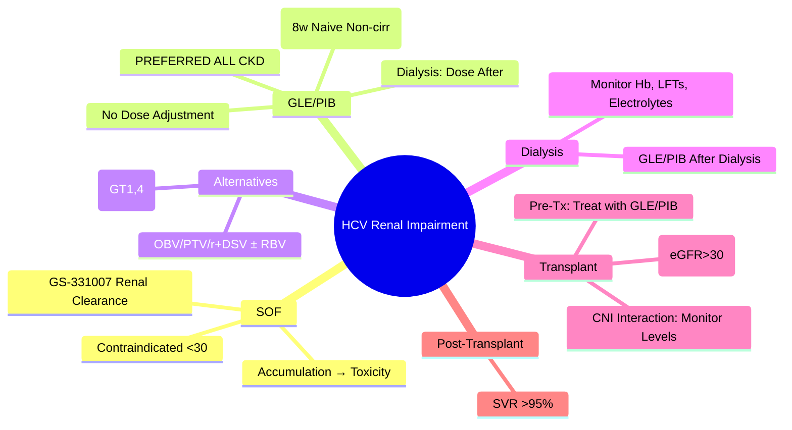

## 1. Learning Objectives
- [ ] Select appropriate DAA regimen based on eGFR stage
- [ ] Understand why SOF-based regimens are avoided in severe renal impairment
- [ ] Apply GLE/PIB as preferred regimen for CKD Stage 4-5 and Dialysis
- [ ] Monitor renal function and adjust doses during treatment
- [ ] Identify FCPS/MRCP high-yield prescribing rules

---

## 2. Why Renal Function Matters for DAAs

| Drug | Renal Clearance | eGFR Threshold | Accumulation Risk |
|------|-----------------|----------------|-------------------|
| **Sofosbuvir (SOF)** | **~80% Renal** (as GS-331007 metabolite) | **Avoid if eGFR <30** | **Yes** — ↑ GS-331007 → Potential Toxicity |
| **Velpatasvir (VEL)** | <1% Renal | No Adjustment | No |
| **Glecaprevir (GLE)** | <1% Renal | **No Adjustment (All Stages)** | No |
| **Pibrentasvir (PIB)** | <1% Renal | **No Adjustment (All Stages)** | No |
| **Voxilaprevir (VOX)** | <1% Renal | No Adjustment | No |

> **FCPS/MRCP**: **SOF Contraindicated/Avoid in eGFR <30** — **GLE/PIB is Preferred** for CKD 4-5 & Dialysis

---

## 3. Regimen Selection by eGFR

| eGFR Category | Preferred Regimen | Alternative | Notes |
|---------------|-------------------|-------------|-------|
| **≥30 mL/min** | Any Pan-Genotypic (SOF/VEL, GLE/PIB, SOF/VEL/VOX) | — | Standard Dosing |
| **15-29 mL/min (CKD 4)** | **GLE/PIB** (12 weeks) | — | **Preferred**; SOF/VEL Avoid |
| **<15 mL/min / Dialysis (CKD 5)** | **GLE/PIB** (12 weeks) | — | **Preferred**; SOF/VEL Contraindicated |

> **GLE/PIB = Only Pan-Genotypic Regimen Safe in All CKD Stages Including Dialysis**

---

## 4. GLE/PIB in Renal Impairment

| Parameter | Detail |
|-----------|--------|
| **Regimen** | **Glecaprevir/Pibrentasvir 300/120mg daily (3 tablets)** |
| **Duration** | **12 weeks** (Treatment-naive & Non-cirrhotic: 8 weeks possible; Cirrhotic/Experienced: 12 weeks) |
| **Dose Adjustment** | **None Required** (Any eGFR, Including Dialysis) |
| **Dialysis Timing** | Can Dose **After Dialysis** (Avoid Dose Removal) — Or Any Time |
| **Monitoring** | LFTs, CBC, Renal Function (Pre/Post Dialysis), Hb |

---

## 5. Why Avoid Sofosbuvir in eGFR <30?

```mermaid
flowchart LR
    A[Sofosbuvir (SOF)] --> B[Hydrolysis → GS-331007 (Metabolite)]
    B --> C[Renal Excretion ~80%]
    C --> D[eGFR <30: ↓ Clearance]
    D --> E[↑ GS-331007 AUC (3-5x)]
    E --> F[Potential Toxicity: Fatigue, Headache, GI, Rare Lactic Acidosis]
    F --> G[Avoid / Use with Extreme Caution + Monitoring]
```

> **Clinical Data**: SOF/VEL in eGFR 15-29 showed ↑ Adverse Events; **No Data in <15/Dialysis**

---

## 6. Alternative Regimens for CKD (If GLE/PIB Unavailable)

| Regimen | eGFR Range | Notes |
|---------|------------|-------|
| **OBV/PTV/r + DSV + RBV** (Viekira Pak) | All Stages | Complex Dosing; Multiple Pills; Drug Interactions |
| **OBV/PTV/r + DSV** (No RBV) | All Stages | GT1b Only |
| **SOF + DAC** (If SOF Absolutely Required) | eGFR 15-29 (Caution) | Monitor GS-331007; Not Recommended <15 |
| **ELB/GZR (Zepatier)** | All Stages | GT1,4 Only; Add RBV for GT1a |

> **GLE/PIB Remains First Choice** — Simplest, Pan-Genotypic, No Dose Adjustment

---

## 7. Monitoring in Renal Impairment

| Parameter | Frequency | Action Threshold |
|-----------|-----------|------------------|
| **LFTs (ALT, AST, Bilirubin)** | Baseline, Week 4, EOT, SVR12 | Rising → Assess DILI |
| **CBC (Hb, Platelets)** | Baseline, Week 4, EOT | Hb Drop → Assess (RBV if Used) |
| **Renal Function (eGFR, Cr, K, Phos)** | Baseline, Weekly ×4, Then 2-Weekly | eGFR Decline >30% → Review |
| **Dialysis Parameters** | Each Session | URR, Kt/V, Electrolytes |
| **HbA1c (If Diabetic)** | Baseline, EOT | Glucose Control |

---

## 8. HCV in Kidney Transplant Recipients

| Scenario | Management |
|----------|------------|
| **Pre-Transplant (Waitlisted)** | **Treat HCV Before Transplant** if Time Allows (GLE/PIB 12w) |
| **Post-Transplant (Stable, >3mo)** | **GLE/PIB 12w** OR **SOF/VEL 12w** (If eGFR >30) |
| **Early Post-Transplant (<3mo)** | Defer Until Stable; Monitor Drug Interactions (CNI, mTOR) |
| **CNI Interaction** | GLE/PIB ↔ Tacrolimus/Cyclosporine → **Monitor Levels** (PI ↑ CNI Levels) |
| **mTOR Inhibitors** | Sirolimus/Everolimus + GLE/PIB → ↑ Both Levels; **Monitor Closely** |

> **Post-Transplant SVR**: >95% with Modern DAAs

---

## 9. FCPS/MRCP High-Yield Summary

| Concept | Key Points |
|---------|------------|
| **SOF Avoidance** | **SOF Contraindicated/Avoid in eGFR <30** (Renal clearance of GS-331007) |
| **GLE/PIB** | **Preferred for CKD 4-5 & Dialysis** — No Dose Adjustment Needed |
| **GLE/PIB Duration** | **12 weeks** (8w if Naive + Non-cirrhotic) |
| **Dialysis Timing** | Dose After Dialysis (Or Any Time — Minimal Removal) |
| **Alternative** | OBV/PTV/r + DSV ± RBV (Complex, GT1/4 Only) |
| **Post-Transplant** | GLE/PIB or SOF/VEL (If eGFR>30); Monitor CNI Levels |
| **Monitoring** | LFTs, CBC, Renal Function (Pre/Post Dialysis) |

---

## 10. Viva Questions

1. **Why is Sofosbuvir avoided in eGFR <30?**
2. **What is the preferred DAA regimen for CKD Stage 5/Dialysis?**
3. **Does GLE/PIB require dose adjustment in renal impairment?**
4. **When should GLE/PIB be dosed relative to dialysis?**
5. **What are alternative regimens if GLE/PIB unavailable?**
5. **How do you manage HCV in a Kidney Transplant Recipient?**
6. **What are the drug interactions between GLE/PIB and Tacrolimus?**
7. **Can you use SOF/VEL in eGFR 15-29?**
7. **What is the duration of GLE/PIB in Dialysis?**
8. **Why is GS-331007 accumulation a concern?**

---

## 11. Confusions & Mnemonics

| Confusion | Clarification |
|-----------|---------------|
| SOF vs GLE/PIB in CKD | **SOF = Avoid <30**; **GLE/PIB = Safe All Stages** |
| GLE/PIB Dose Adjustment | **None** — Safe in CKD 4, 5, Dialysis |
| Dialysis Timing | **After Dialysis Preferred** (Avoid Dose Removal) — But Not Mandatory |
| SOF in eGFR 15-29 | **Not Recommended** — ↑ GS-331007 AUC; Avoid If Possible |
| GLE/PIB + Tacrolimus | PI ↑ Tacrolimus Levels → **Monitor Tac Levels Closely** |
| CKD Duration | **12 Weeks** (8w Only if Naive + Non-cirrhotic) |
| RBV in CKD | **Avoid** (Renal Clearance → Severe Haemolytic Anaemia) |
| Post-Tx | GLE/PIB or SOF/VEL (If eGFR>30); Monitor CNI/mTOR Levels |

---

## 12. Mind Map



---

## 13. One-Page Revision Card

| **eGFR** | **Regimen** | **Notes** |
|----------|-------------|-----------|
| **≥30** | Any Pan-Genotypic | Standard Dosing |
| **15-29 (CKD 4)** | **GLE/PIB 12w** | **Preferred**; SOF Avoid |
| **<15 / Dialysis (CKD 5)** | **GLE/PIB 12w** | **Preferred**; SOF Contraindicated |

| **GLE/PIB in Dialysis** | |
|-------------------------|--|
| Dose | 300/120mg Daily (3 Tabs) |
| Duration | 12 Weeks |
| Timing | After Dialysis Preferred |
| Adjustment | **None** |

| **Why Avoid SOF <30** | |
|-----------------------|--|
| GS-331007 | 80% Renal Clearance |
| eGFR <30 | ↑ AUC 3-5x |
| Risk | Toxicity (Fatigue, GI, Lactic Acidosis) |

| **Post-Transplant** | |
|---------------------|--|
| Pre-Tx | Treat with GLE/PIB |
| Post-Tx | GLE/PIB or SOF/VEL (eGFR>30) |
| CNI Interaction | Monitor Tac/Siro Levels |

---

## 14. Spaced Repetition Tracker

| Day | 1 | 3 | 7 | 15 | 30 |
|-----|---|---|---|----|----|
| SOF Avoidance <30 | ☐ | ☐ | ☐ | ☐ | ☐ |
| GLE/PIB Preferred CKD | ☐ | ☐ | ☐ | ☐ | ☐ |
| GLE/PIB No Dose Adjust | ☐ | ☐ | ☐ | ☐ | ☐ |
| Dialysis Timing | ☐ | ☐ | ☐ | ☐ | ☐ |
| Transplant Management | ☐ | ☐ | ☐ | ☐ | ☐ |

---

## 15. Self-Test Scorecard

| Question | My Answer | Correct? |
|----------|-----------|----------|
| SOF Avoidance eGFR |  |  |
| GLE/PIB in Dialysis |  |  |
| Dialysis Dosing Timing |  |  |
| SOF Mechanism Renal |  |  |
| Transplant CNI Interaction |  |  |

---

## 16. Local Navigation

- [[Viral Hepatitis/Hepatitis C|HCV Overview]]
- [[Viral Hepatitis/HCV DAA Regimens by Genotype & Cirrhosis|HCV DAA Regimens]]
- [[Viral Hepatitis/Hepatitis C treatment endpoints|SVR12]]
- [[Viral Hepatitis/Hepatitis C decompensated cirrhosis management|HCV Decompensated]]
- [[Viral Hepatitis/Hepatitis C post-SVR follow-up|Post-SVR]]