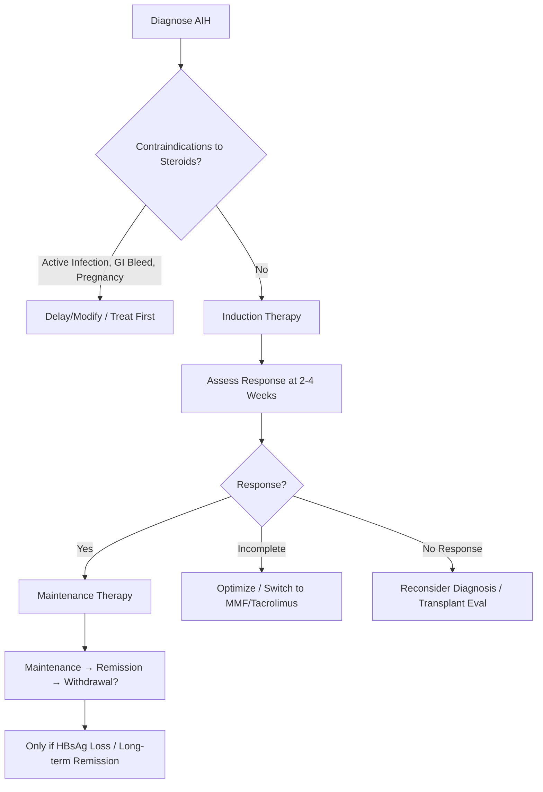
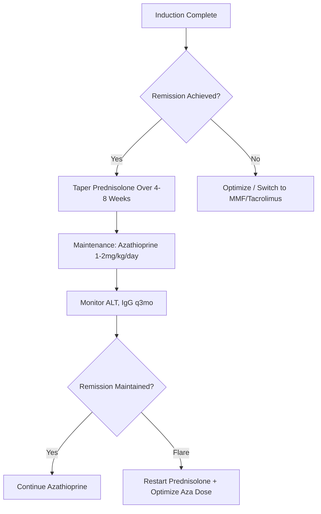
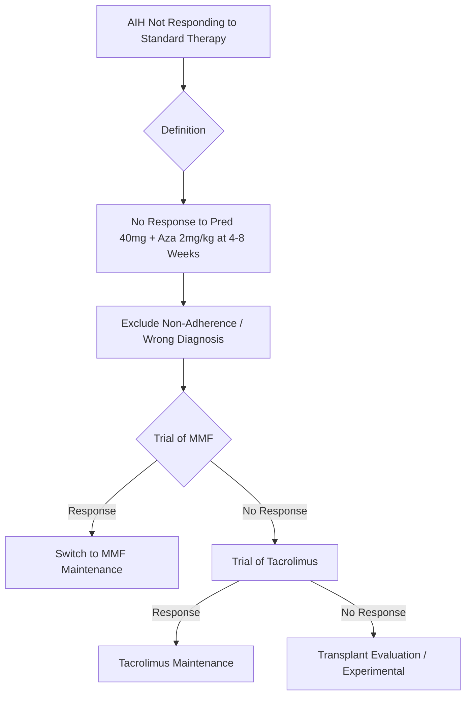
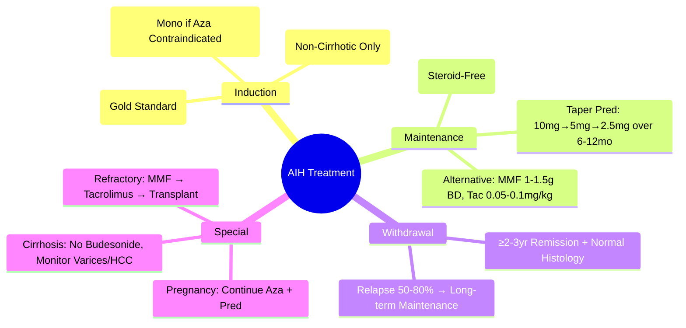

# AIH Treatment: Induction, Maintenance & Withdrawal

## Learning Objectives
- [ ] Apply induction therapy algorithms (monotherapy vs combination)
- [ ] Manage maintenance therapy and steroid tapering
- [ ] Apply steroid-sparing strategies (azathioprine, MMF, tacrolimus)
- [ ] Determine criteria for treatment withdrawal
- [ ] Identify FCPS/MRCP high-yield management decisions

---

## Treatment Principles

---

## Induction Therapy

### Standard Regimens

| Regimen | Dose | Indication | Duration |
|---------|------|------------|----------|
| **Prednisolone + Azathioprine** | **Pred 30-40mg/day + Aza 1-2mg/kg/day** | **First-Line (Preferred)** | 2-4 Weeks → Taper |
| **Prednisolone Monotherapy** | **40-60mg/day** | Azathioprine Contraindicated/Intolerant | 2-4 Weeks → Taper |
| **Budesonide** | **9mg/day (3mg TDS)** | **Non-Cirrhotic, Mild-Moderate** | 8 Weeks → Taper |

> **FCPS/MRCP**: **Prednisolone 30-40mg + Azathioprine 1-2mg/kg = Gold Standard Induction**

### Budesonide: Niche Indication

| Feature | Detail |
|--------|--------|
| **Dose** | 9mg/day (3mg TDS) |
| **Mechanism** | **High First-Pass Metabolism** (~90%) → Low Systemic Exposure |
| **Indication** | **Non-Cirrhotic AIH**, Mild-Moderate Disease |
| **Contraindications** | **Cirrhosis** (Impaired First-Pass → Systemic Effects), **Porto-Systemic Shunt**, **Severe Disease** |
| **Efficacy** | Similar to Prednisolone in Mild Disease, Fewer SE |

> **FCPS/MRCP**: **Budesonide ONLY for Non-Cirrhotic AIH** — Avoid in Cirrhosis/PHT

---

## Maintenance Therapy

### Standard Approach

### Standard Maintenance Regimen

| Drug | Dose | Target | Monitoring |
|------|------|--------|------------|
| **Azathioprine** | **1-2 mg/kg/day** | Maintain Remission, Allow Steroid Withdrawal | ALT, IgG, FBC, LFTs q3mo; TPMT Pre-Tx |
| **MMF** | 1-1.5g BD | Azathioprine Intolerance/Failure | FBC, LFTs, Renal q3mo |
| **Tacrolimus** | 0.05-0.1 mg/kg/day (Trough 5-10 ng/mL) | Refractory AIH | Trough Levels, Renal, BP, Glucose |

### Azathioprine: Key Details

| Aspect | Detail |
|--------|--------|
| **Dose** | **1-2 mg/kg/day** (Start 50mg, Titrate) |
| **TPMT Testing** | **Before Start** (TPMT Deficient = ↑ Myelosuppression Risk) |
| **Side Effects** | Myelosuppression, Hepatotoxicity, Pancreatitis, Nausea |
| **Drug Interactions** | Allopurinol (↑ 6-MP Toxicity → Reduce Aza Dose to 25%) |
| **In Pregnancy** | **Safe** (Category D but Data Supports Use) |

---

## Steroid Tapering Algorithm

### Standard Taper (After Remission)

| Phase | Prednisolone Dose | Duration |
|-------|-------------------|----------|
| **Induction** | 30-40mg/day | 2-4 Weeks |
| **Taper 1** | Reduce by 10mg every 2 weeks until 20mg | 4-6 Weeks |
| **Taper 2** | Reduce by 5mg every 2 weeks until 10mg | 4-6 Weeks |
| **Taper 3** | Reduce by 2.5mg every 2 weeks until 5mg | 4-6 Weeks |
| **Taper 4** | Reduce by 2.5mg every 2-4 weeks until 0 | 2-3 Months |
| **Total** | **Stop by 6-12 Months** | |

> **Key**: **Taper by 5-10mg decrements**; **Slower if Flare Risk High**

---

## Treatment of Flare / Relapse

| Scenario | Management |
|----------|------------|
| **Minor Flare** (ALT 2-5×ULN) | ↑ Prednisolone to Previous Effective Dose |
| **Major Flare** (ALT >5×ULN, Jaundice) | Restart Induction Dose (Pred 30-40mg + Aza) |
| **Steroid-Dependent** (Flare on Taper) | Optimise Azathioprine + Slow Taper; Consider MMF/Tacrolimus |

---

## Treatment Withdrawal Criteria

| Criteria | Requirement |
|----------|-------------|
| **Clinical Remission** | ≥2-3 Years (Some Guidelines 3-5 Years) |
| **Biochemical Remission** | Normal ALT, IgG, Autoantibodies |
| **Histological Remission** | **Normal/Inactive on Biopsy** (Ideal) |

### Relapse Risk After Withdrawal

| Time Post-Withdrawal | Relapse Rate |
|----------------------|--------------|
| **1 Year** | 30-40% |
| **3 Years** | **50-80%** |
| **5 Years** | >80% |

> **Most Relapse** → **Long-term Low-Dose Maintenance Often Preferred**

---

## Special Situations

### AIH in Pregnancy

| Aspect | Management |
|--------|------------|
| **Active AIH** | **Continuation of Aza + Pred** (Safe) |
| **Remission** | **Continue Maintenance** (Stop Steroids if Possible) |
| **New Diagnosis** | **Pred 30-40mg + Aza 1-2mg/kg** (Safe) |
| **Postpartum Flare Risk** | ↑↑ (Immune Reconstitution) → Close Monitoring |

### AIH with Cirrhosis

| Consideration | Management |
|---------------|------------|
| **Budesonide** | **Contraindicated** (Impaired First-Pass) |
| **Azathioprine** | Safe (If TPMT Normal) |
| **Variceal Screening** | Required |
| **HCC Surveillance** | 6-Monthly US ± AFP |

---

## Refractory AIH

---

## FCPS/MRCP High-Yield Summary

| Concept | Key Points |
|---------|------------|
| **First-Line Induction** | **Pred 30-40mg + Aza 1-2mg/kg** |
| **Budesonide** | **Non-Cirrhotic Only** (9mg/day) |
| **Maintenance** | **Aza 1-2mg/kg** (Steroid-Free) |
| **TPMT Test** | **Before Aza** (TPMT Deficient = Severe Myelosuppression) |
| **Taper** | **Over 6-12 Months** (By 10mg→5mg→2.5mg) |
| **Flare** | Restart Induction Dose |
| **Withdrawal** | ≥2-3 Years Remission + Normal Histology; **Relapse 50-80%** |
| **Pregnancy** | Continue Aza + Pred (Safe) |
| **Refractory** | MMF → Tacrolimus → Transplant Eval |

---

## Viva Questions

1. **What is the first-line induction regimen for AIH?**
2. **When do you use budesonide instead of prednisolone?**
2. **What is the azathioprine maintenance dose?**
3. **How do you treat steroid-refractory AIH?**
3. **What are the criteria for treatment withdrawal?**
4. **What is the relapse rate after withdrawal?**
4. **How do you manage AIH in pregnancy?**
5. **When is budesonide contraindicated?**
5. **What is the TPMT test and why is it needed?**
6. **What is the management of refractory AIH?**

---

## Confusions & Mnemonics

| Confusion | Clarification |
|-----------|---------------|
| Budesonide vs Prednisolone | **Budesonide: Non-Cirrhotic Only**; Prednisolone = Universal |
| Azathioprine Dose | **1-2 mg/kg/day** (Start 50mg, Titrate) |
| TPMT | **Pre-Tx Testing** — Deficient = Severe Myelosuppression |
| Aza + Allopurinol | **Reduce Aza to 25% Dose** (↑ 6-MP Toxicity) |
| Withdrawal Timing | **≥2-3 Years Remission** + Normal Histology |
| Relapse Rate | **50-80%** — Don't Rush Withdrawal |
| MMF vs Tacrolimus | MMF First Alternative; Tacrolimus for Refractory |

---

## Mind Map

---

## One-Page Revision Card

| **Induction** | **Details** |
|---------------|-------------|
| **Gold Standard** | **Pred 30-40mg + Aza 1-2mg/kg** |
| **Monotherapy** | Pred 40-60mg (If Aza Contraindicated) |
| **Budesonide** | 9mg/day (Non-Cirrhotic Only) |

| **Maintenance** | **Details** |
|-----------------|-------------|
| **First-Line** | **Aza 1-2mg/kg** (Steroid-Free) |
| **TPMT** | Test Before Aza |
| **Alternative** | MMF 1-1.5g BD / Tac 0.05-0.1mg/kg |

| **Taper** | **Timeline** |
|-----------|--------------|
| 30-40mg → 20mg | 4-8 Weeks |
| 20mg → 10mg | 4-6 Weeks |
| 10mg → 5mg | 4-6 Weeks |
| 5mg → 0 | 2-3 Months |

| **Withdrawal** | **Criteria** |
|----------------|--------------|
| Remission | ≥2-3 Years |
| Biochemical | Normal ALT, IgG, AutoAbs |
| Histological | Normal Biopsy (Ideal) |
| Relapse Risk | 50-80% at 3 Years |

| **Special** | **Management** |
|------------|----------------|
| Pregnancy | Continue Aza + Pred |
| Cirrhosis | No Budesonide, Monitor Varices/HCC |
| Refractory | MMF → Tacrolimus → Transplant |

---

## Spaced Repetition Tracker

| Day | 1 | 3 | 7 | 15 | 30 |
|-----|---|---|---|----|----|
| Induction Regimen | ☐ | ☐ | ☐ | ☐ | ☐ |
| Budesonide Indication | ☐ | ☐ | ☐ | ☐ | ☐ |
| Taper Schedule | ☐ | ☐ | ☐ | ☐ | ☐ |
| Withdrawal Criteria | ☐ | ☐ | ☐ | ☐ | ☐ |
| Pregnancy Management | ☐ | ☐ | ☐ | ☐ | ☐ |

---

## Self-Test Scorecard

| Question | My Answer | Correct? |
|----------|-----------|----------|
| Induction Regimen |  |  |
| Budesonide Indication |  |  |
| Taper Schedule |  |  |
| Withdrawal Criteria |  |  |
| Aza + Allopurinol |  |  |

---

## Local Navigation

- [[Autoimmune Liver Disease/Autoimmune hepatitis (AIH)|AIH Overview]]
- [[Autoimmune Liver Disease/AIH diagnostic criteria (IAIHG simplified)|AIH Criteria]]
- [[Autoimmune Liver Disease/AIH in pregnancy|AIH Pregnancy]]
- [[Autoimmune Liver Disease/Overlap syndromes|Overlap Syndromes]]
- [[Acute Liver Failure/Autoimmune hepatitis presenting as ALF|AIH ALF]]