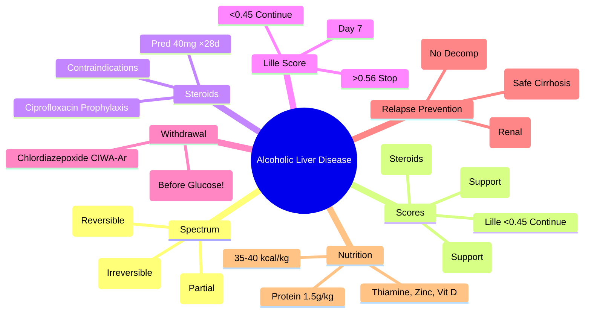

> [!tip] **FCPS/MRCP Priority: HIGH**
> **ALD Spectrum = Steatosis → Alcoholic Hepatitis → Cirrhosis** — **Abstinence is cornerstone**; **AST:ALT >2:1** characteristic; **Maddrey DF ≥32 = Severe AH → Corticosteroids**; **Lille score Day 7** guides steroid continuation; **Abstinence + Nutrition (Thiamine, Zinc) + Relapse prevention (Acamprosate/Baclofen)**.

---

## 1. Learning Objectives
By the end of this note you should be able to:
- [ ] Describe the **spectrum of ALD**: Steatosis → Alcoholic Hepatitis → Cirrhosis
- [ ] Recognise **clinical features** and **AST:ALT ratio >2:1**
- [ ] Apply **scoring systems**: Maddrey DF, GAHS, ABIC, Lille
- [ ] Prescribe **corticosteroid therapy** for severe AH (Prednisolone 40mg/day ×28d)
- [ ] Manage **alcohol withdrawal** and **relapse prevention** (Acamprosate, Baclofen, Naltrexone)

---

## 1. Definition & Spectrum

| Stage | Histology | Clinical | Reversibility |
|-------|-----------|----------|---------------|
| **Steatosis (Fatty Liver)** | Macrovesicular fat >5% hepatocytes | Often asymptomatic, hepatomegaly | **Fully reversible** with abstinence (2-4 weeks) |
| **Alcoholic Hepatitis (AH)** | Ballooning, Mallory bodies, neutrophilic infiltrate, cholestasis | Jaundice, fever, hepatomegaly, ascites, encephalopathy | **Partially reversible** with abstinence + treatment |
| **Alcoholic Cirrhosis** | Bridging fibrosis, regenerative nodules | Decompensation (ascites, varices, HE) | **Irreversible** (abstinence improves survival) |

### AST:ALT Ratio
| Ratio | Interpretation |
|-------|----------------|
| **>2:1** | **Classic for ALD** (mitochondrial AST release + pyridoxine deficiency) |
| **1:1 to 2:1** | Consistent with ALD |
| **<1:1** | Suggests viral, autoimmune, NAFLD |

---

## 2. Clinical Features & Diagnosis

| Feature | Alcoholic Hepatitis | Alcoholic Cirrhosis |
|---------|----------------------|----------------------|
| **Presentation** | Jaundice, fever, hepatomegaly, ascites, encephalopathy | Decompensation (ascites, varices, HE) |
| **Labs** | ALT/AST ↑↑ (AST>ALT), Bilirubin ↑↑, INR ↑, WBC ↑ | Synthetic failure (INR↑, Alb↓), thrombocytopenia |
| **Maddrey DF** | **≥32 = Severe** | Not typically used |
| **Imaging** | Hepatomegaly, fatty infiltration | Nodular liver, splenomegaly, portal HTN signs |

---

## 3. Scoring Systems for Alcoholic Hepatitis

### Maddrey Discriminant Function (DF)
**DF = 4.6 × (PT - control PT in seconds) + Bilirubin (mg/dL)**

| DF Score | Severity | 30-Day Mortality | Treatment |
|----------|----------|------------------|-----------|
| **<32** | Mild/Moderate | <10% | Supportive only |
| **≥32** | **Severe** | 30-50% | **Consider corticosteroids** |

### Glasgow Alcoholic Hepatitis Score (GAHS)
| Parameter | Score |
|-----------|-------|
| Age >50 | 1 |
| WBC >15 ×10⁹/L | 1 |
| Urea >5 mmol/L | 1 |
| PT ratio >1.5 | 1 |
| Bilirubin >125 µmol/L | 1 |

| GAHS | 28-Day Mortality | Steroid Indication |
|------|------------------|-------------------|
| **≥9** | ~45% | **Consider steroids** |

### ABIC Score
**ABIC = Age×0.0039 + Bilirubin(mg/dL)×0.031 + INR×0.58 + Creatinine(mg/dL)×0.47**

| ABIC | 90-Day Mortality | Steroid Indication |
|------|------------------|-------------------|
| **<6.71** | Low (<10%) | Supportive |
| **6.71-8.99** | Intermediate (30%) | Consider steroids |
| **≥9.0** | High (>50%) | Strongly consider steroids |

---

## 4. Corticosteroid Therapy

| Drug | Dose | Duration | Indication |
|------|------|----------|------------|
| **Prednisolone** | **40 mg/day** | **28 days** | **Maddrey DF ≥32** (or GAHS ≥9) + no contraindications |

| Contraindication | Action |
|------------------|--------|
| Active infection (SBP, pneumonia) | Contraindicated |
| Active GI bleed | Contraindicated |
| Renal failure (Cr >200) | Contraindicated |
| Pancreatitis | Contraindicated |
| Uncontrolled DM | Contraindicated |

### Infection Prophylaxis on Steroids
| Drug | Dose |
|------|------|
| **Ciprofloxacin** | **500mg OD** (SBP prophylaxis) |

### Lille Score (Day 7)
| Lille Score | Response | Action |
|-------------|----------|--------|
| **<0.45** | Complete/Partial responder | **Continue steroids** ×28 days |
| **0.45-0.56** | Partial responder | Individualise |
| **>0.56** | Null responder | **Stop steroids** |

---

## 5. Management Principles

| Aspect | Recommendation |
|--------|----------------|
| **Abstinence** | **Cornerstone** — complete cessation |
| **Nutrition** | 35-40 kcal/kg/day, Protein 1.5g/kg/day, **Thiamine 100mg IV TDS**, Zinc 220mg BD |
| **Withdrawal** | **Thiamine 100mg IV TDS ×3-5d (BEFORE glucose)**, Chlordiazepoxide CIWA-Ar |
| **Relapse Prevention** | **Acamprosate 666mg TDS** (renal adjust), **Baclofen 10mg TDS** (safe in cirrhosis), **Naltrexone 50mg OD** (avoid decompensated) |

---

## 5. FCPS/MRCP High-Yield Summary

| Topic | Key Points |
|-------|------------|
| **ALD Spectrum** | Steatosis (Rev) → AH (Partial) → Cirrhosis (Irrev) |
| **AST:ALT** | **>2:1** = ALD |
| **Maddrey DF** | **≥32 = Severe** → Steroids (DF = 4.6×(PT-ctrl) + Bil mg/dL) |
| **GAHS** | **≥9** Supports Steroids |
| **ABIC** | **≥6.71** Supports, **≥9** High Mortality |
| **Steroids** | **Pred 40mg ×28d** if DF≥32; **Ciprofloxacin 500mg** prophylaxis |
| **Lille Day 7** | **<0.45 Continue, >0.56 Stop** |
| **Contraindications** | Infection, Bleed, Renal, Pancreatitis, DM |
| **Withdrawal** | **Thiamine IV before Glucose**; Chlordiazepoxide CIWA-Ar |
| **Relapse Prevention** | Acamprosate (Renal), Naltrexone (No Decomp), Baclofen (Safe) |

---

## 6. Viva Questions (MRCP PACES / FCPS)

| Question | Expected Answer |
|----------|-----------------|
| **Maddrey DF — Formula, cut-off, action?** | **4.6×(PT-ctrl) + Bil (mg/dL)**; **≥32 = Severe** → consider steroids if no contraindications. |
| **GAHS — Components, steroid cut-off?** | **Age>50, WBC>15, Urea>5, PT>1.5, Bil>125**; **≥9** supports steroids. |
| **ABIC Score — Formula, cut-offs?** | **Age×0.0039 + Bil×0.031 + INR×0.58 + Cr×0.47**; **≥6.71** supports steroids, **≥9.0** high mortality. |
| **Steroid Indication — Maddrey ≥32 + no contraindications?** | **Prednisolone 40mg/day ×28 days**; taper 2 weeks; **Ciprofloxacin 500mg OD prophylaxis**. |
| **Lille Score — Day 7, interpretation?** | **<0.45 = Continue steroids**; **0.45-0.56 = Individualise**; **>0.56 = Stop** (null responder). |
| **Steroid Contraindications?** | Active infection (SBP, pneumonia), GI bleed, renal failure (Cr>200), pancreatitis, uncontrolled DM. |
| **Alcohol Withdrawal — Thiamine, CIWA-Ar, Drug?** | **Thiamine 100mg IV TDS ×3-5d (before glucose)**; **Chlordiazepoxide** symptom-triggered per CIWA-Ar. |
| **Relapse Prevention — Acamprosate vs Naltrexone vs Baclofen?** | **Acamprosate 666mg TDS** (renal adjust); **Naltrexone 50mg OD** (avoid decompensated); **Baclofen 10mg TDS** (safe in cirrhosis). |

---

## 7. Confusions & Mnemonics

| Confusion | Clarification |
|-----------|---------------|
| **Maddrey vs GAHS vs ABIC** | **Maddrey** = primary trigger (DF≥32); **GAHS/ABIC** = supportive; ABIC adds age/creatinine for 90-day mortality |
| **Lille Score — When to calculate?** | **Day 7** of steroid therapy; **<0.45 = Continue**, **>0.56 = Stop** |
| **Steroids in ALD vs Autoimmune Hepatitis** | **ALD**: Short course (28d), Maddrey ≥32; **AIH**: Prolonged (months-years), IAIHG criteria |
| **Thiamine Before Glucose** | **MANDATORY** — Glucose metabolism consumes thiamine → precipitates Wernicke's |
| **Baclofen vs Naltrexone in Cirrhosis** | **Baclofen safe** (renal adjust); **Naltrexone hepatotoxic** — avoid decompensated |
| **Disulfiram in Cirrhosis** | **Avoid** (hepatotoxicity risk); use acamprosate/baclofen instead |

**Mnemonic: ALD-SCORE**
- **A**ST:ALT **>2:1** = ALD
- **L**ille Day 7: **<0.45 Continue, >0.56 Stop**
- **D**F Maddrey: **≥32 = Steroids**
- **S**teroid: **Pred 40mg ×28d + Ciprofloxacin**
- **C**orticosteroid Contraindications: **Infection, Bleed, Renal, Pancreatitis, DM**
- **O**rgan Failure: **Lille >0.56 = Stop Steroids**
- **R**elapse Prevention: **Acamprosate (renal), Naltrexone (avoid decomp), Baclofen (safe cirrhosis)**
- **E**nable Thiamine: **100mg IV TDS before glucose**
- **M**addrey DF: **4.6×(PT-ctrl) + Bil mg/dL ≥32 = Steroids**
- **G**AHS ≥9: Supports steroids
- **A**BIC ≥6.71: Supports steroids

---

## 9. Mind Map

---

## 10. One-Page Revision Card

| Domain | Key Points |
|--------|------------|
| **Spectrum** | Steatosis (Rev) → AH (Partial) → Cirrhosis (Irrev) |
| **AST:ALT** | **>2:1** = ALD |
| **Maddrey DF** | **4.6×(PT-ctrl)+Bil ≥32 → Steroids** |
| **GAHS** | **≥9 Supports Steroids** |
| **ABIC** | **≥6.71 Supports, ≥9 High Mortality** |
| **Steroids** | **Pred 40mg ×28d** if DF≥32; **Ciprofloxacin 500mg** prophylaxis |
| **Lille Day 7** | **<0.45 Continue, >0.56 Stop** |
| **Contraindications** | Infection, Bleed, Renal, Pancreatitis, DM |
| **Withdrawal** | **Thiamine IV before Glucose**; Chlordiazepoxide CIWA-Ar |
| **Relapse** | Acamprosate (Renal), Naltrexone (No Decomp), Baclofen (Safe) |
| **Nutrition** | 35-40 kcal/kg, Protein 1.5g/kg, Thiamine, Zinc |

---

## 9. Spaced Repetition Trackers

| Review Interval | Date Completed | Confidence (1-5) | Notes |
|-----------------|----------------|------------------|-------|
| 24 hours | | | |
| 7 days | | | |
| 15 days | | | |
| 30 days | | | |
| 90 days | | | |

---

## 10. Self-Test Scorecard

| Section | Score /5 | Last Attempt |
|---------|----------|--------------|
| ALD Spectrum & AST:ALT | | |
| Maddrey DF / GAHS / ABIC | | |
| Steroid Indications & Contraindications | | |
| Lille Score Interpretation | | |
| Prednisolone Regimen | | |
| Withdrawal / Thiamine | | |
| Relapse Prevention Drugs | | |
| Viva Questions | | |

---

## 2. Local Navigation
- **Parent Heading**: [[../Hepatology|Hepatology]]
- **Chapter Map": [[../Davidson Chapter 24 - Hepatology Hierarchy|Hepatology Hierarchy]]
- **Chapter MOC": [[../Hepatology MOC|Hepatology MOC]]
- **Drug Reference": [[../../Clinical Therapeutics and Good Prescribing|Drugs]]
- **Related": [[Cirrhosis and Portal Hypertension]], [[Acute Liver Failure]], [[NAFLD]], [[Hepatology in Special Situations]]
---

> Auto-generated study sections for "Alcoholic Liver Disease" — Ch 23: Hepatology.

## Flashcards (19 generated)

- Q: What is the definition of Alcoholic Liver Disease?
  A: ALD Spectrum = Steatosis → Alcoholic Hepatitis → Cirrhosis — Abstinence is cornerstone; AST:ALT >2:1 characteristic; Maddrey DF ≥32 = Severe AH → Corticosteroids; Lille score Day 7 guides steroid continuation; Abstinence + Nutrition (Thiamine, Zinc) + Relapse prevention (Acamprosate/Baclofen).
- Q: What is Abstinence of Alcoholic Liver Disease?
  A: Cornerstone — complete cessation
- Q: What is Nutrition of Alcoholic Liver Disease?
  A: 35-40 kcal/kg/day, Protein 1.5g/kg/day, Thiamine 100mg IV TDS, Zinc 220mg BD
- Q: What is Withdrawal of Alcoholic Liver Disease?
  A: Thiamine 100mg IV TDS ×3-5d (BEFORE glucose), Chlordiazepoxide CIWA-Ar
- Q: What is Relapse Prevention of Alcoholic Liver Disease?
  A: Acamprosate 666mg TDS (renal adjust), Baclofen 10mg TDS (safe in cirrhosis), Naltrexone 50mg OD (avoid decompensated)
- Q: What is Abstinence of Alcoholic Liver Disease?
  A: Cornerstone — complete cessation
- Q: What is Nutrition of Alcoholic Liver Disease?
  A: 35-40 kcal/kg/day, Protein 1.5g/kg/day, Thiamine 100mg IV TDS, Zinc 220mg BD
- Q: What is Withdrawal of Alcoholic Liver Disease?
  A: Thiamine 100mg IV TDS ×3-5d (BEFORE glucose), Chlordiazepoxide CIWA-Ar
- Q: What is Relapse Prevention of Alcoholic Liver Disease?
  A: Acamprosate 666mg TDS (renal adjust), Baclofen 10mg TDS (safe in cirrhosis), Naltrexone 50mg OD (avoid decompensated)
- Q: What is ALD Spectrum of Alcoholic Liver Disease?
  A: Steatosis (Rev) → AH (Partial) → Cirrhosis (Irrev)
- Q: What is AST:ALT of Alcoholic Liver Disease?
  A: >2:1 = ALD
- Q: What is Maddrey DF of Alcoholic Liver Disease?
  A: ≥32 = Severe → Steroids (DF = 4.6×(PT-ctrl) + Bil mg/dL)
- Q: What is GAHS of Alcoholic Liver Disease?
  A: ≥9 Supports Steroids
- Q: What is ABIC of Alcoholic Liver Disease?
  A: ≥6.71 Supports, ≥9 High Mortality
- Q: What is Steroids of Alcoholic Liver Disease?
  A: Pred 40mg ×28d if DF≥32; Ciprofloxacin 500mg prophylaxis
- Q: What is Lille Day 7 of Alcoholic Liver Disease?
  A: <0.45 Continue, >0.56 Stop
- Q: What is Alcoholic Liver Disease indicated for?
  A: Infection, Bleed, Renal, Pancreatitis, DM
- Q: What is Withdrawal of Alcoholic Liver Disease?
  A: Thiamine IV before Glucose; Chlordiazepoxide CIWA-Ar
- Q: What is Relapse Prevention of Alcoholic Liver Disease?
  A: Acamprosate (Renal), Naltrexone (No Decomp), Baclofen (Safe)

## MCQs (1 generated)

1. **Which of the following best describes Alcoholic Liver Disease?**
   A. **ALD Spectrum = Steatosis → Alcoholic Hepatitis → Cirrhosis — Abstinence is cornerstone; AST:ALT >2:1 characteristic; Maddrey DF ≥32 = Severe AH → Corticosteroids; Lille score Day 7 guides steroid cont**
   B. An unrelated condition not matching the clinical picture of Alcoholic Liver Disease
   C. A complication seen late in the disease course of Alcoholic Liver Disease
   D. A condition that mimics Alcoholic Liver Disease but has a different underlying cause

## SBA Questions (1 generated)

1. A patient with suspected Alcoholic Liver Disease presents with: Steatosis (Fatty Liver) — Macrovesicular fat >5% hepatocytes; Alcoholic Hepatitis (AH) — Ballooning, Mallory bodies, neutrophilic infiltrate, cholestasis; Alcoholic Cirrhosis — Bridging fibrosis, regenerative nodules. What is the most likely diagnosis?
   A. **Alcoholic Liver Disease**
   B. A condition that mimics Alcoholic Liver Disease but is not the same entity
   C. A complication of Alcoholic Liver Disease rather than the primary diagnosis
   D. An unrelated condition in the same clinical category as Alcoholic Liver Disease

