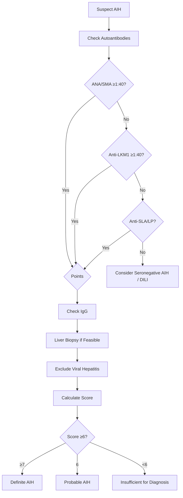
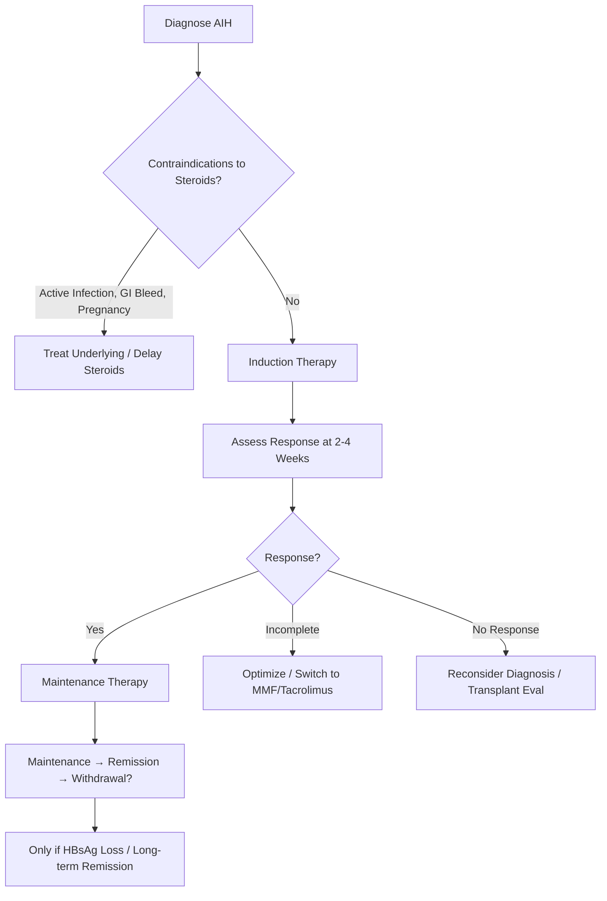

# Autoimmune Hepatitis (AIH)

## Learning Objectives
- [ ] Define AIH and classify Types 1, 2, 3
- [ ] Apply IAIHG simplified diagnostic criteria
- [ ] Differentiate AIH from viral hepatitis, DILI, Wilson disease
- [ ] Apply treatment algorithms (induction, maintenance, withdrawal)
- [ ] Identify FCPS/MRCP high-yield features

---

## Definition & Epidemiology

| Feature | AIH |
|---------|-----|
| **Definition** | Chronic inflammatory liver disease with autoimmune pathogenesis |
| **Demographics** | **Women 70-80%**, Age 10-50 (bimodal: young & perimenopausal) |
| **Prevalence** | 10-20/100,000 |
| **Associated Conditions** | Thyroiditis, Coeliac, RA, Sjögren's, Type 1 DM, Ulcerative Colitis |

---

## Classification: Types 1, 2, 3

```mermaid
flowchart TD
    A[AIH] --> B{Type}
    B -->|Type 1 (Classic)| C[ANA ≥1:40 AND/OR SMA ≥1:40]
    B -->|Type 2| D[Anti-LKM1 ≥1:40]
    B -->|Type 3| E[Anti-SLA/LP ≥1:40]
    C --> F[80% of AIH in Europe/NA]
    D --> G[Children/Young Adults; More Severe]
    E --> H[Highly Specific (95%); Often with Type 1]
```

| Type | Autoantibodies | Age | Severity | Steroid Response |
|------|----------------|-----|----------|------------------|
| **Type 1** | **ANA ± SMA** | Any (peak 20-40) | Variable | Good |
| **Type 2** | **Anti-LKM1** | Children/Young Adults | **More Severe** | Less Favourable |
| **Type 3** | **Anti-SLA/LP** | Adults | Severe | Good |

---

## Clinical Presentation

| Feature | Frequency |
|---------|-----------|
| Fatigue | 85% |
| Jaundice | 40-60% |
| Pruritus | 15% |
| Arthralgia | 20% |
| Amenorrhoea | 20% (Women) |
| Acute Liver Failure | 5-10% (Present as ALF) |
| Asymptomatic (Incidental) | 15-20% |

---

## Diagnostic Criteria: IAIHG Simplified (2008)



### Simplified Scoring

| Parameter | Cut-off | Points |
|-----------|---------|--------|
| **ANA or SMA** | ≥1:40 | **1** |
| | ≥1:80 | **2** |
| **Anti-LKM1** | ≥1:40 | **2** |
| **IgG** | >ULN | **1** |
| | >1.1×ULN | **2** |
| **Histology** | Compatible | **1** |
| | Typical | **2** |
| **Exclusion of Viral Hepatitis** | Yes | **2** |

| Total Score | Interpretation |
|-------------|----------------|
| **≥7** | **Definite AIH** |
| **6** | **Probable AIH** |
| **<6** | Insufficient |

> **In ALF/Acute Setting**: Biopsy often unavailable → Rely on Serology + IgG + Exclusion

---

## AIH in Acute Liver Failure (AIH-ALF)

| Feature | AIH-ALF |
|---------|---------|
| **% of Non-PCM ALF** | 5-10% |
| **Demographics** | Women 70%, Age 15-50 |
| **IgG** | **↑↑** (Often >2×ULN) |
| **Autoantibodies** | ANA/SMA ≥1:80, LKM1 ≥1:40 |
| **Ceruloplasmin** | Normal/↑ |
| **Haemolysis** | Absent |
| **Steroid Trial** | **Prednisolone 60mg → Day 7 Lille Assessment** |
| **Response Rate** | 60-80% if Early |
| **Transplant if** | No Response Day 7 / King's College / MELD >25 |

> **AIH-ALF = ONLY Steroid-Responsive ALF** — Early Recognition = Life-Saving

---

## Treatment Algorithm



---

## Treatment

### Induction Therapy

| Regimen | Dose | Indication | Duration |
|---------|------|------------|----------|
| **Prednisolone + Azathioprine** | **Pred 30-40mg/day + Aza 1-2mg/kg/day** | **First-Line (Preferred)** | 2-4 Weeks → Taper |
| **Prednisolone Monotherapy** | **40-60mg/day** | Azathioprine Contraindicated/Intolerant | 2-4 Weeks → Taper |
| **Budesonide** | **9mg/day (3mg TDS)** | **Non-Cirrhotic, Mild-Moderate** | 8 Weeks → Taper |

> **FCPS/MRCP**: **Prednisolone 30-40mg + Azathioprine 1-2mg/kg = Gold Standard Induction**

### Maintenance Therapy

| Drug | Dose | Target | Monitoring |
|------|------|--------|------------|
| **Azathioprine** | **1-2 mg/kg/day** | Maintain Remission, Allow Steroid Withdrawal | ALT, IgG, FBC, LFTs q3mo; TPMT Pre-Tx |
| **MMF** | 1-1.5g BD | Azathioprine Intolerance/Failure | FBC, LFTs, Renal q3mo |
| **Tacrolimus** | 0.05-0.1 mg/kg/day | Refractory Cases | Trough Levels, Renal, BP, Glucose |

### Steroid Tapering

| Phase | Prednisolone Dose | Duration |
|-------|-------------------|----------|
| Induction | 30-40mg/day | 2-4 Weeks |
| Taper 1 | Reduce by 10mg every 2 weeks until 20mg | 4-6 Weeks |
| Taper 2 | Reduce by 5mg every 2 weeks until 10mg | 4-6 Weeks |
| Taper 3 | Reduce by 2.5mg every 2 weeks until 5mg | 4-6 Weeks |
| Taper 4 | Reduce by 2.5mg every 2-4 weeks until 0 | 2-3 Months |
| **Total** | **Stop by 6-12 Months** | |

### Remission Criteria

| Parameter | Target |
|-----------|--------|
| **ALT/AST** | Normal |
| **IgG** | Normal |
| **Autoantibodies** | Negative/Declining |
| **Histology** | No Interface Hepatitis |

---

## FCPS/MRCP High-Yield Summary

| Concept | Key Points |
|---------|------------|
| **Demographics** | Women 70-80%, Age 10-50 |
| **Types** | Type 1: ANA/SMA (80%); Type 2: LKM1 (Kids); Type 3: SLA/LP |
| **Diagnosis** | IAIHG Simplified ≥6 (Probable), ≥7 (Definite) |
| **Key Labs** | IgG ↑↑, ANA/SMA/LKM+, Exclude Viral |
| **First-Line** | **Prednisolone 30-40mg + Azathioprine 1-2mg/kg** |
| **Remission** | Normal ALT, IgG, Autoantibodies |
| **Maintenance** | Azathioprine 1-2mg/kg (Steroid-Free) |
| **Relapse** | 50-80% if Withdrawn |
| **AIH-ALF** | **Pred 60mg → Day 7 Lille; Only Steroid-Responsive ALF** |

---

## Viva Questions

1. **What are the IAIHG simplified criteria for AIH?**
2. **Differentiate Type 1, 2, 3 AIH by autoantibodies.**
3. **What is the treatment regimen for AIH?**
3. **What is the role of azathioprine?**
4. **How do you manage AIH in pregnancy?**
4. **What are the remission criteria?**
5. **How does AIH differ from DILI and Wilson disease?**
5. **What is the role of budesonide?**
6. **When can you withdraw immunosuppression?**
7. **What is the relapse rate after withdrawal?**
8. **What is the management of AIH-ALF?**

---

## Confusions & Mnemonics

| Confusion | Clarification |
|-----------|---------------|
| Type 1 vs 2 vs 3 | Type 1: ANA/SMA; Type 2: LKM1; Type 3: SLA/LP (Specific 95%) |
| Azathioprine vs MMF | Aza = First-line steroid-sparing; MMF = Alternative if Aza Intolerant |
| AIH vs DILI | AIH: IgG↑, AutoAbs+, Steroid Responsive; DILI: Drug Temporal Relation |
| AIH vs Wilson | Wilson: Low Ceruloplasmin, Coombs-Neg Haemolysis, Low ALP:Bil Ratio |
| AIH-ALF Steroid Trial | **Pred 60mg → Day 7 Lille >0.45 = Stop** |
| Seronegative AIH | No AutoAbs but Meets Other Criteria (10-15%) |
| Budesonide | **Non-Cirrhotic Only** (First-Pass Effect) — Avoid if Cirrhosis/PHT |
| Relapse | **50-80%** — Don't Rush Withdrawal |

---

## Mind Map

```mermaid
mindmap
  root((Autoimmune Hepatitis))
    Types
      Type 1: ANA/SMA (80%)
      Type 2: LKM1 (Children, Severe)
      Type 3: SLA/LP (95% Specific)
    Diagnosis
      IAIHG Simplified
      ANA/SMA ≥1:40 (1pt), ≥1:80 (2pt)
      LKM1 ≥1:40 (2pt)
      IgG >ULN (1pt), >1.1xULN (2pt)
      Histology: Compatible (1), Typical (2)
      Exclude Viral (2pt)
      ≥7 Definite, 6 Probable
    Treatment
      Induction: Pred 30-40mg + Aza 1-2mg/kg
      Maintenance: Aza 1-2mg/kg (Steroid-Free)
      AIH-ALF: Pred 60mg → Day 7 Lille >0.45 Stop
    Remission
      Normal ALT, IgG, AutoAbs, Histology
      Maintenance: Aza 1-2mg/kg
      Withdrawal: 2-3yr Remission → 50-80% Relapse
```

---

## One-Page Revision Card

| **AIH** | **Details** |
|---------|-------------|
| **Demographics** | Women 70-80%, Age 10-50 |
| **Types** | Type 1: ANA/SMA; Type 2: LKM1; Type 3: SLA/LP |
| **IgG** | ↑↑ (>2×ULN common) |
| **AutoAbs** | ANA/SMA ≥1:80, LKM1 ≥1:40, SLA/LP |
| **IAIHG Simplified** | ≥7 Definite, 6 Probable |

| **Treatment** | **Regimen** |
|---------------|-------------|
| **Induction** | **Pred 30-40mg + Aza 1-2mg/kg** |
| **Maintenance** | Aza 1-2mg/kg (Steroid-Free) |
| **AIH-ALF** | **Pred 60mg → Day 7 Lille** |
| **Relapse** | 50-80% if Withdrawn |

| **Key Differentiators** | |
|-------------------------|--|
| vs DILI | IgG↑, AutoAbs+, Steroid Responsive |
| vs Wilson | Ceruloplasmin Normal, No Haemolysis |
| vs Viral | IgG↑, AutoAbs+, No Viral Serology |
| vs PBC | ALT>ALP, AMA-, No Bile Duct Damage |

---

## Spaced Repetition Tracker

| Day | 1 | 3 | 7 | 15 | 30 |
|-----|---|---|---|----|----|
| IAIHG Simplified Criteria | ☐ | ☐ | ☐ | ☐ | ☐ |
| Type 1/2/3 Autoantibodies | ☐ | ☐ | ☐ | ☐ | ☐ |
| Induction Regimen | ☐ | ☐ | ☐ | ☐ | ☐ |
| AIH-ALF Steroid Trial | ☐ | ☐ | ☐ | ☐ | ☐ |
| Relapse Rate | ☐ | ☐ | ☐ | ☐ | ☐ |

---

## Self-Test Scorecard

| Question | My Answer | Correct? |
|----------|-----------|----------|
| IAIHG Simplified Criteria |  |  |
| Type 1 vs 2 vs 3 |  |  |
| Induction Regimen |  |  |
| AIH-ALF Steroid Trial |  |  |
| Relapse Rate |  |  |

---

## Local Navigation

- [[Autoimmune Liver Disease/AIH treatment|AIH Treatment]]
- [[Autoimmune Liver Disease/AIH diagnostic criteria (IAIHG simplified)|AIH Criteria]]
- [[Autoimmune Liver Disease/AIH in pregnancy|AIH Pregnancy]]
- [[Autoimmune Liver Disease/Overlap syndromes|Overlap Syndromes]]
- [[Acute Liver Failure/Autoimmune hepatitis presenting as ALF|AIH ALF]]