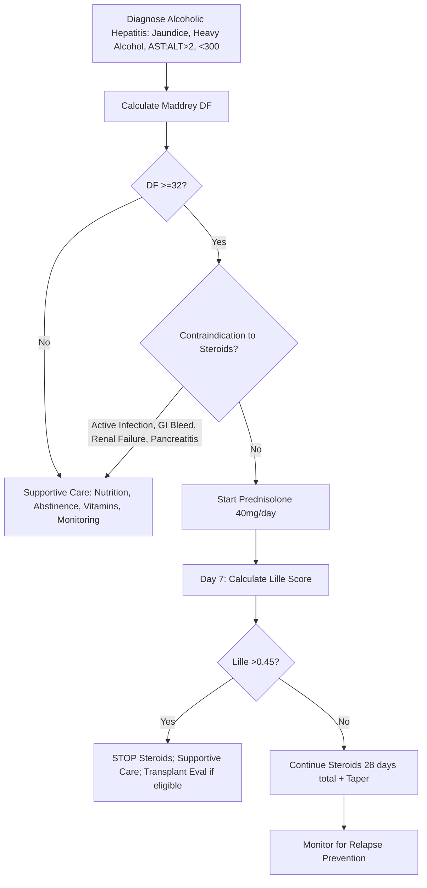

## 1. Learning Objectives
- [ ] Calculate Maddrey Discriminant Function (DF)
- [ ] Calculate Glasgow Alcoholic Hepatitis Score (GAHS)
- [ ] Calculate ABIC Score
- [ ] Apply Lille Score for steroid response at Day 7
- [ ] Know FCPS/MRCP high-yield cut-offs and clinical decisions

---

## 2. Overview: Why Score Alcoholic Hepatitis?

| Score | Purpose | Key Use |
|-------|---------|---------|
| **Maddrey DF** | **Severity** (original) | **>32 = Severe → Consider steroids** |
| **Glasgow (GAHS)** | **Prognosis** (simpler) | **≥9 = Poor prognosis (28-day mortality >50%)** |
| **ABIC** | **Prognosis** (age, bilirubin, INR, creatinine) | **>9 = 90-day mortality >50%** |
| **Lille** | **Steroid response** at Day 7 | **>0.45 = Non-response → Stop steroids** |

---

## 1. Maddrey Discriminant Function (DF)

### Formula
```
Maddrey DF = 4.6 × (PT_patient - PT_control) + Bilirubin (mg/dL)
```
- **PT in seconds** (patient - control)
- **Bilirubin in mg/dL** (not μmol/L)

### Risk Stratification

| DF Score | Severity | 30-Day Mortality | Action |
|----------|----------|------------------|--------|
| **<32** | Mild/Moderate | <20% | **No steroids** (supportive care) |
| **≥32** | **Severe** | >35% | **Consider steroids** (if no contraindication) |
| **>54** | Very Severe | >50% | Steroids + ICU; consider transplant eval |

> **FCPS/MRCP**: **DF >32 = Severe alcoholic hepatitis = Steroid candidate**

---

## 2. Glasgow Alcoholic Hepatitis Score (GAHS)

### Parameters (5 Variables)
| Variable | Points |
|----------|--------|
| **Age ≥50** | 1 |
| **WBC ≥15 ×10⁹/L** | 1 |
| **Urea ≥5 mmol/L** (or BUN ≥14 mg/dL) | 1 |
| **Bilirubin ≥12.5 mg/dL** (214 μmol/L) | 1 |
| **PT ratio ≥1.5** (or INR ≥1.5) | 1 |

### Scoring

| GAHS Score | Risk | 28-Day Mortality | 84-Day Mortality |
|------------|------|------------------|------------------|
| **≤8** | Low | <15% | <25% |
| **≥9** | **High** | **>50%** | **>60%** |

> **GAHS ≥9 = Poor prognosis** — similar to Maddrey >32 but easier to calculate

---

## 3. ABIC Score (Age, Bilirubin, INR, Creatinine)

### Formula
```
ABIC = Age × 0.01 + logₑ(Bilirubin μmol/L) × 0.58 + INR × 0.89 + logₑ(Creatinine μmol/L) × 0.69
```
- **Bilirubin in μmol/L**
- **Creatinine in μmol/L**

### Risk Stratification

| ABIC Score | Risk | 90-Day Mortality |
|------------|------|------------------|
| **<5.58** | Low | <10% |
| **5.58-9.0** | Intermediate | 10-40% |
| **>9.0** | **High** | **>50%** |

> **ABIC >9 = 90-day mortality >50%** — most accurate for intermediate-term prognosis

---

## 4. Lille Score (Steroid Response at Day 7)

### Formula (Simplified)
```
Lille = 3.19 - 0.101 × Age + 0.147 × Renal_Insufficiency + 0.0165 × Baseline_Bilirubin - 0.206 × Day7_Bilirubin - 1.99 × Prothrombin_Time_Ratio_Day7
```
- **Renal_Insufficiency**: 1 if Cr >133 μmol/L (1.5 mg/dL) at baseline, else 0
- **Bilirubin in μmol/L**
- **PT Ratio**: Patient PT / Control PT

### Interpretation

| Lille Score | Response | Action |
|-------------|----------|--------|
| **<0.16** | **Complete responder** | Continue steroids 28 days total |
| **0.16-0.45** | **Partial responder** | Continue steroids 28 days total |
| **>0.45** | **Non-responder** | **STOP steroids** (futility; increased infection risk) |
| **>0.56** | **Null responder** | **STOP steroids**; worse prognosis |

> **FCPS/MRCP**: **Lille >0.45 at Day 7 = Stop steroids** — high-yield exam fact

### Practical Lille Calculation (Bedside Approximation)
- **Complete response**: Bilirubin **decreasing** at Day 7
- **Non-response**: Bilirubin **not decreasing** at Day 7
- **Key**: Day 7 bilirubin vs baseline trajectory

---

## 3. Comparison Table

| Score | Variables | Primary Use | Key Cut-off | Mortality Prediction |
|-------|-----------|-------------|-------------|---------------------|
| **Maddrey DF** | PT, Bilirubin | **Severity → Steroid decision** | **>32 = Severe** | 30-day |
| **GAHS** | Age, WBC, Urea, Bilirubin, PT | Prognosis | **≥9 = High risk** | 28/84-day |
| **ABIC** | Age, Bilirubin, INR, Creatinine | Prognosis | **>9 = High risk** | 90-day |
| **Lille** | Age, Renal, Baseline Bil, Day 7 Bil, Day 7 PT | **Steroid response at Day 7** | **>0.45 = Stop steroids** | 6-month |

---

## 4. Clinical Algorithm



---

## 5. Steroid Contraindications (Absolute)
- **Active infection** (SBP, pneumonia, sepsis)
- **Gastrointestinal bleeding** (active)
- **Acute pancreatitis**
- **Renal failure** (Cr >250 μmol/L or on RRT) — relative in some guidelines
- **Uncontrolled diabetes**

---

## 6. FCPS/MRCP High-Yield Summary

| Score | Formula Components | Key Cut-off | Clinical Decision |
|-------|-------------------|-------------|-------------------|
| **Maddrey DF** | 4.6×(PTpt-PTc) + Bil (mg/dL) | **>32 = Severe** | **Start steroids if no contraindication** |
| **GAHS** | Age≥50, WBC≥15, Urea≥5, Bil≥12.5, PT≥1.5 | **≥9 = High risk** | Poor prognosis; consider transplant eval |
| **ABIC** | Age, log(Bil), INR, log(Cr) | **>9 = High risk** | 90-day mortality >50% |
| **Lille** | Age, Renal, Bas Bil, Day7 Bil, Day7 PT | **>0.45 = Non-responder** | **STOP steroids at Day 7** |

---

## 7. Viva Questions

1. **Calculate Maddrey DF: PT 25s (control 12s), Bilirubin 15 mg/dL.**
2. **What is the Maddrey DF cut-off for steroid consideration?**
3. **List the 5 components of GAHS.**
4. **What does GAHS ≥9 indicate?**
5. **How does ABIC differ from GAHS?**
6. **What is the Lille score used for?**
7. **What Lille score means stop steroids?**
8. **Day 7 bilirubin not falling — what is Lille likely?**
9. **Contraindications to steroids in alcoholic hepatitis?**
10. **Why is ABIC more accurate for 90-day mortality?**

---

## 8. Confusions & Mnemonics

| Confusion | Clarification |
|-----------|---------------|
| Maddrey DF vs GAHS | Maddrey = severity → steroid decision; GAHS = prognosis (mortality) |
| GAHS vs ABIC | Both prognosis; ABIC more accurate for 90-day; GAHS simpler (integer scoring) |
| Lille >0.45 | **STOP STEROIDS** — non-response; continuing increases infection without benefit |
| PT in Maddrey | **Seconds** (patient - control), NOT INR |
| Bilirubin in Maddrey | **mg/dL** (not μmol/L) |
| ABIC units | Bilirubin and Creatinine in **μmol/L** |
| Steroid duration | **28 days total** if Lille ≤0.45; taper over 2-4 weeks after |

---

## 9. Mind Map

```mermaid
mindmap
  root((Alcoholic Hepatitis Scoring))
    Maddrey DF
      4.6 x (PT_pt - PT_control) + Bilirubin (mg/dL)
      >32 = Severe -> Steroids
      <32 = Mild -> Supportive
    GAHS (5 variables, max 5)
      Age >=50
      WBC >=15
      Urea >=5
      Bilirubin >=12.5
      PT >=1.5
      >=9 = High mortality
    ABIC
      Age x0.01 + ln(Bil) x0.58 + INR x0.89 + ln(Cr) x0.69
      >9 = 90-day mortality >50%
    Lille (Day 7)
      Age, Renal insuff, Baseline Bil, Day7 Bil, Day7 PT
      >0.45 = STOP STEROIDS
      <0.16 = Complete responder
    Clinical Flow
      Diagnose -> Maddrey -> >32 -> No CI -> Steroids -> Day7 Lille -> >0.45 Stop
```

---

## 10. One-Page Revision Card

| **Score** | **Key Cut-off** | **Action** |
|-----------|-----------------|------------|
| **Maddrey DF** | **>32** | **Start Prednisolone 40mg if no CI** |
| **GAHS** | **≥9** | High mortality; transplant eval |
| **ABIC** | **>9** | 90-day mortality >50% |
| **Lille (Day 7)** | **>0.45** | **STOP STEROIDS** |

| **Steroid Contraindications** | |
|-------------------------------|--|
| Active infection | |
| GI bleeding | |
| Pancreatitis | |
| Renal failure (relative) | |

| **Steroid Regimen** | |
|---------------------|--|
| Prednisolone 40mg/day × 28 days | Taper last 2-4 weeks |
| Assess Day 7 with Lille | |

---

## 11. Spaced Repetition Tracker

| Day | 1 | 3 | 7 | 15 | 30 |
|-----|---|---|---|----|----|
| Maddrey DF formula | ☐ | ☐ | ☐ | ☐ | ☐ |
| Maddrey >32 = steroids | ☐ | ☐ | ☐ | ☐ | ☐ |
| GAHS 5 variables | ☐ | ☐ | ☐ | ☐ | ☐ |
| Lille >0.45 = stop | ☐ | ☐ | ☐ | ☐ | ☐ |
| ABIC >9 = 90d mort >50% | ☐ | ☐ | ☐ | ☐ | ☐ |

---

## 12. Self-Test Scorecard

| Question | My Answer | Correct? |
|----------|-----------|----------|
| Maddrey DF formula |  |  |
| DF >32 meaning |  |  |
| GAHS components |  |  |
| Lille >0.45 action |  |  |
| ABIC vs GAHS |  |  |

---

## 13. Local Navigation

- [[Alcoholic Liver Disease/Alcoholic Liver Disease|Alcoholic Liver Disease Overview]]
- [[Alcoholic Liver Disease/Corticosteroid therapy (prednisolone)|Corticosteroid Therapy]]
- [[Alcoholic Liver Disease/Abstinence and nutritional support|Abstinence & Nutrition]]
- [[Acute Liver Failure/Definition and Aetiology|ALF Aetiology]]
---

> Auto-generated study sections for "Alcoholic Liver Disease" — Ch 23: Hepatology.

## Flashcards (1 generated)

- Q: What is the definition of Alcoholic Liver Disease?
  A: Maddrey DF = 4.6 × (PTpatient - PTcontrol) + Bilirubin (mg/dL)

## MCQs (1 generated)

1. **Which of the following best describes Alcoholic Liver Disease?**
   A. **Maddrey DF = 4.6 × (PTpatient - PTcontrol) + Bilirubin (mg/dL)**
   B. An unrelated condition not matching the clinical picture of Alcoholic Liver Disease
   C. A complication seen late in the disease course of Alcoholic Liver Disease
   D. A condition that mimics Alcoholic Liver Disease but has a different underlying cause

## SBA Questions (1 generated)

1. A patient with suspected Alcoholic Liver Disease presents with: A[Diagnose Alcoholic Hepatitis: Jaundice, Heavy Alcohol, AST:ALT>2, <300] --> B[Calculate Maddrey DF]; B --> C{DF >=32?}; C -->|No| D[Supportive Care: Nutrition, Abstinence, Vitamins, Monitoring]. What is the most likely diagnosis?
   A. **Alcoholic Liver Disease**
   B. A condition that mimics Alcoholic Liver Disease but is not the same entity
   C. A complication of Alcoholic Liver Disease rather than the primary diagnosis
   D. An unrelated condition in the same clinical category as Alcoholic Liver Disease

