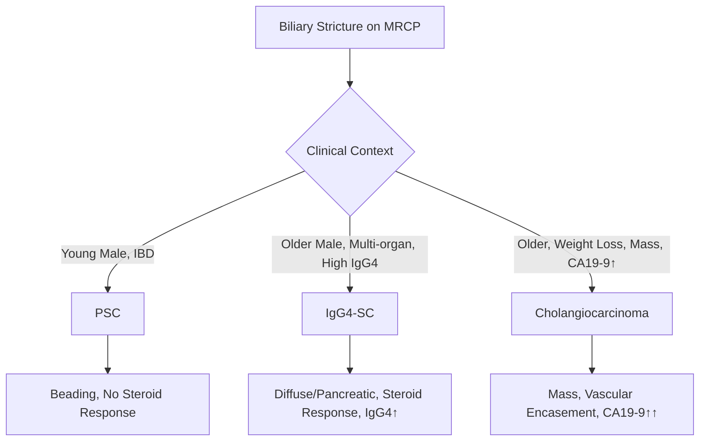
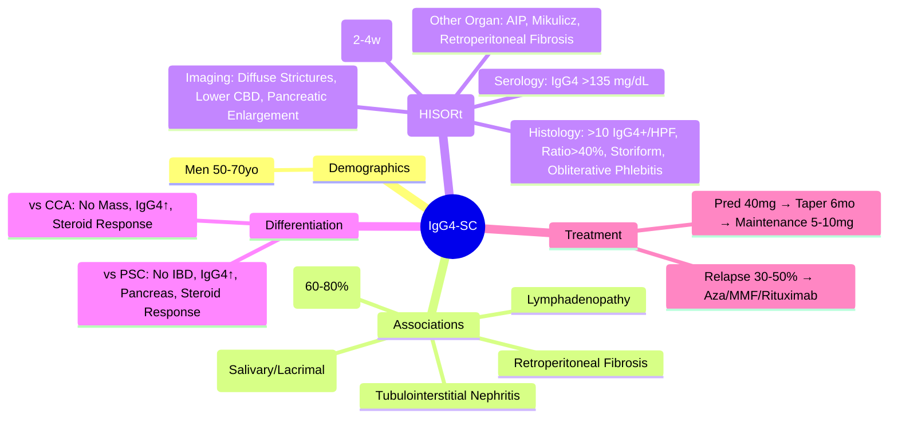

# IgG4-Related Sclerosing Cholangitis (IgG4-SC)

## Learning Objectives
- [ ] Apply diagnostic criteria (HISORt) for IgG4-SC
- [ ] Differentiate from PSC, Cholangiocarcinoma, AIH-PSC Overlap
- [ ] Initiate steroid therapy and monitor response
- [ ] Know relapse rates and maintenance therapy
- [ ] Identify FCPS/MRCP high-yield features (steroid-responsive, multi-organ involvement)

---

## Definition & Epidemiology

| Feature | IgG4-SC |
|---------|---------|
| **Definition** | **IgG4-related disease** manifesting as **sclerosing cholangitis** — part of systemic IgG4-related disease |
| **Demographics** | **Men > Women** (2:1), Age 50-70 |
| **Association** | **Multi-organ involvement**: Pancreatitis (Type 1 AIP), Sialadenitis, Retroperitoneal Fibrosis, Tubulointerstitial Nephritis |
| **Malignant Mimicry** | Mimics **Cholangiocarcinoma** and **PSC** |

---

## Diagnostic Criteria (HISORt)

> **HISORt Criteria** = Histology + Imaging + Serology + Other Organ + Response to Steroids  
> **Definite**: Histology + 1 other feature  
> **Probable**: Imaging + Serology + Other Organ  
> **Possible**: Imaging + Serology

| Criterion | Feature |
|-----------|---------|
| **H** (Histology) | **Lymphoplasmacytic infiltrate** with **>10 IgG4+ plasma cells/HPF** AND **IgG4/IgG ratio >40%** + **Storiform Fibrosis** + **Obliterative Phlebitis** |
| **I** (Imaging) | **MRCP/ERCP**: Diffuse/segmental biliary strictures (often **lower CBD**, **pancreatic**); **Pancreatic enlargement** (Type 1 AIP) |
| **S** (Serology) | **Serum IgG4 >135 mg/dL** (or >2×ULN) |
| **O** (Other Organ) | **Type 1 AIP**, Sialadenitis (Mikulicz), Retroperitoneal Fibrosis, RPN, Lymphadenopathy |
| **R** (Response) | **Rapid Clinical/Imaging Response to Steroids** (2-4 weeks) |
| **t** (Tomography) | CT/MRI: Pancreatic/biliary involvement |

---

## Clinical Presentation

| Feature | IgG4-SC |
|---------|---------|
| **Symptoms** | Jaundice, Pruritus, Weight Loss, Abdominal Pain |
| **Jaundice** | Obstructive pattern (Conjugated bilirubin ↑, ALP ↑↑) |
| **Pancreatic Involvement** | **60-80%** have Type 1 AIP (diffuse pancreatic enlargement, "Sausage pancreas") |
| **Other Organs** | Submandibular/lacrimal gland enlargement (Mikulicz), Retroperitoneal fibrosis, Lymphadenopathy |
| **Autoantibodies** | ANA+, Rheumatoid Factor+, **Anti-nuclear** (non-specific) |
| **Inflammatory Markers** | ESR/CRP ↑, **IgG ↑**, **IgG4 ↑↑** |

---

## Differentiation: IgG4-SC vs PSC vs Cholangiocarcinoma

| Feature | IgG4-SC | PSC | Cholangiocarcinoma |
|---------|---------|-----|-------------------|
| **Age/Sex** | Older Men (50-70) | Young Men (30-40) | Older (60+) |
| **IBD** | **Rare** | **70-80%** | Variable |
| **Serum IgG4** | **>135 mg/dL** (↑↑) | Normal/Mild ↑ | Normal |
| **Imaging** | **Long diffuse strictures**, Pancreatic enlargement, **Lower CBD** predominance | **Beading** (Multifocal), No pancreatic involvement | **Mass**, Vascular encasement, Asymmetric duct dilatation |
| **Histology** | **>10 IgG4+/HPF**, Storiform fibrosis, Obliterative phlebitis | **Onion-skin fibrosis**, No IgG4+ cells | **Malignancy** |
| **Steroid Response** | **Rapid (2-4 weeks)** | **None** | None |
| **CA 19-9** | Normal/Mild ↑ | Normal/Mild ↑ | **↑↑↑** |

> **FCPS/MRCP**: **High IgG4 + Pancreatic Involvement + Steroid Response = IgG4-SC**

---

## Treatment

### Induction
| Drug | Dose | Duration |
|------|------|----------|
| **Prednisolone** | **40 mg/day** (0.6 mg/kg) | **2-4 weeks** |

### Taper
| Schedule | Dose |
|----------|------|
| Weeks 1-4 | 40 mg/day |
| Weeks 5-8 | 30 mg/day |
| Weeks 9-12 | 20 mg/day |
| Weeks 13-16 | 15 mg/day |
| Weeks 17-20 | 10 mg/day |
| Weeks 21-24 | 5 mg/day |
| **Maintenance** | **5-10 mg/day** (long-term) |

> **Monitor**: Monthly LFTs, IgG4, Imaging at 3 months

### Steroid-Sparing (Relapse / Contraindications)
| Agent | Dose | Indication |
|-------|------|------------|
| **Azathioprine** | 1-2 mg/kg | First-line steroid-sparing |
| **Mycophenolate** | 1-1.5g BD | Alternative |
| **Rituximab** | 375 mg/m² weekly ×4 | Refractory / Relapse / Steroid contraindicated |

### Relapse
| Feature | Detail |
|---------|--------|
| **Rate** | **30-50%** after steroid taper |
| **Timing** | Within 1-2 years |
| **Management** | **Re-induction with Steroids** + Steroid-Sparing Agent |

---

## IgG4-SC in Acute Setting

| Scenario | Management |
|----------|------------|
| **Acute Cholangitis** | Antibiotics + **Urgent ERCP for Dominant Stricture** + **Steroids** |
| **Obstructive Jaundice** | **Steroids + ERCP if Dominant Stricture** |
| **Misdiagnosed as CCA** | **Biopsy before Surgery** if IgG4 suspected |

---

## FCPS/MRCP High-Yield Summary

| Concept | Key Points |
|---------|------------|
| **Demographics** | Older Men (50-70) |
| **Key Association** | **Type 1 AIP (Autoimmune Pancreatitis)** |
| **Serum IgG4** | **>135 mg/dL** (or >2×ULN) |
| **Imaging** | **Long diffuse strictures**, **Lower CBD**, **Pancreatic Enlargement** |
| **Histology** | **>10 IgG4+/HPF**, **IgG4/IgG >40%**, Storiform Fibrosis, Obliterative Phlebitis |
| **Other Organs** | AIP, Mikulicz (Sialadenitis/Lacrimal), Retroperitoneal Fibrosis, RPN |
| **Diagnosis** | **HISORt Criteria** (Histology, Imaging, Serology, Other Organ, Response, Tomography) |
| **Treatment** | **Steroids 40mg → Taper over 6mo → Maintenance 5-10mg** |
| **Response** | **Rapid (2-4 weeks)** — Key diagnostic feature |
| **Relapse** | **30-50%** → Steroid-sparing (Aza, MMF, Rituximab) |
| **Mimics** | PSC, Cholangiocarcinoma — **Biopsy if uncertain** |

---

## Viva Questions

1. **What is the HISORt criteria for IgG4-SC?**
2. **How do you differentiate IgG4-SC from PSC?**
3. **How do you differentiate IgG4-SC from Cholangiocarcinoma?**
4. **What is the typical imaging finding in IgG4-SC?**
5. **What is the serum IgG4 cutoff?**
6. **What is the histology of IgG4-SC?**
7. **What is the treatment and taper schedule?**
8. **What is the relapse rate? How to manage?**
9. **What other organs are involved in IgG4-related disease?**
10. **Why is it important not to misdiagnose IgG4-SC as CCA?**

---

## Confusions & Mnemonics

| Confusion | Clarification |
|-----------|---------------|
| IgG4-SC vs PSC | IgG4-SC: Older men, NO IBD, High IgG4, Pancreatic involvement, Steroid response; PSC: Young men, IBD, Beading, No steroid response |
| IgG4-SC vs CCA | IgG4-SC: Diffuse strictures, High IgG4, Steroid response; CCA: Mass, Vascular encasement, CA19-9↑↑, No steroid response |
| IgG4 Cutoff | **>135 mg/dL** (or >2×ULN) — but 5-10% false negative |
| Histology | **>10 IgG4+/HPF + IgG4/IgG >40%** + Storiform Fibrosis + Obliterative Phlebitis |
| Steroid Taper | **6 months taper** to 5-10mg maintenance — **Relapse 30-50%** if stopped |
| Rituximab Indication | Refractory, Relapse, Steroid contraindicated |
| Other Organs | **Type 1 AIP (Pancreas)**, Mikulicz (Salivary/Lacrimal), Retroperitoneal Fibrosis, RPN |

---

## Mind Map

---

## One-Page Revision Card

| **IgG4-SC** | **Key Features** |
|-------------|------------------|
| **Demographics** | Men 50-70 |
| **Association** | Type 1 AIP (60-80%) |
| **Serum IgG4** | **>135 mg/dL** |
| **Imaging** | Diffuse strictures, Lower CBD, Pancreatic enlargement |
| **Histology** | >10 IgG4+/HPF, Ratio>40%, Storiform, Obliterative Phlebitis |
| **Other Organs** | AIP, Mikulicz, Retroperitoneal Fibrosis |

| **HISORt Criteria** | |
|---------------------|--|
| H | Histology (IgG4+ cells, storiform fibrosis) |
| I | Imaging (Diffuse strictures, pancreas) |
| S | Serology (IgG4 >135) |
| O | Other Organ (AIP, Mikulicz) |
| R | Response to Steroids (Rapid) |
| t | Tomography (CT/MRI) |

| **Treatment** | |
|--------------|--|
| Induction | Prednisolone 40mg/day × 2-4w |
| Taper | 6 months to 5-10mg |
| Maintenance | 5-10mg long-term |
| Relapse | 30-50% → Aza/MMF/Rituximab |

| **Differentiation** | **IgG4-SC** | **PSC** | **CCA** |
|--------------------|-------------|---------|---------|
| Age/Sex | Older Men | Young Men | Older |
| IBD | Rare | 70-80% | Variable |
| IgG4 | ↑↑ | Normal | Normal |
| Pancreas | Enlarged | Normal | Mass |
| Steroid Response | **Rapid** | None | None |

---

## Spaced Repetition Tracker

| Day | 1 | 3 | 7 | 15 | 30 |
|-----|---|---|---|----|----|
| HISORt Criteria | ☐ | ☐ | ☐ | ☐ | ☐ |
| IgG4-SC vs PSC vs CCA | ☐ | ☐ | ☐ | ☐ | ☐ |
| Serum IgG4 cutoff | ☐ | ☐ | ☐ | ☐ | ☐ |
| Histology findings | ☐ | ☐ | ☐ | ☐ | ☐ |
| Steroid taper schedule | ☐ | ☐ | ☐ | ☐ | ☐ |

---

## Self-Test Scorecard

| Question | My Answer | Correct? |
|----------|-----------|----------|
| HISORt Criteria |  |  |
| IgG4 vs PSC vs CCA |  |  |
| IgG4 cutoff |  |  |
| Steroid induction/taper |  |  |
| Relapse rate |  |  |

---

## Local Navigation

- [[Autoimmune Liver Disease/Primary sclerosing cholangitis (PSC)|PSC]]
- [[Autoimmune Liver Disease/Overlap syndromes|Overlap Syndromes]]
- [[Autoimmune Liver Disease/Autoimmune hepatitis (AIH)|AIH]]
- [[Autoimmune Liver Disease/PBC (Primary Biliary Cholangitis)|PBC]]
- [[Biliary Tract Disease/Cholangiocarcinoma|Cholangiocarcinoma]]