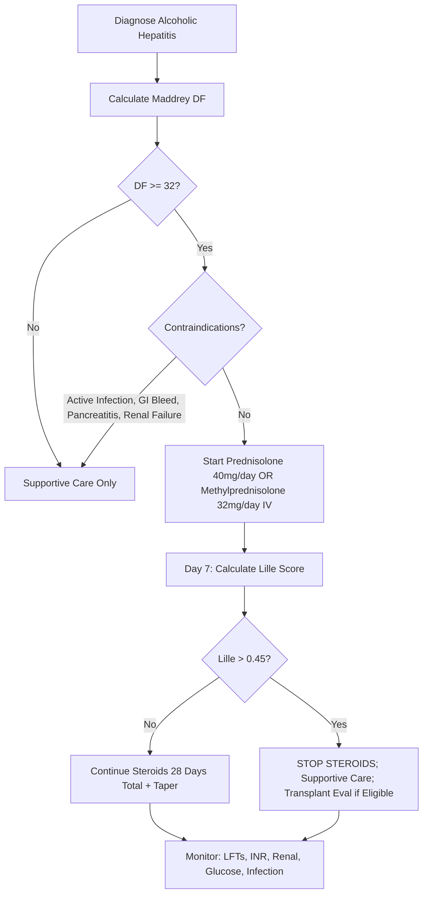

## 1. Learning Objectives
- [ ] Apply Maddrey Discriminant Function (DF) for steroid indication
- [ ] Prescribe Prednisolone 40mg/day (or Methylprednisolone 32mg/day) correctly
- [ ] Apply Lille Score at Day 7 to assess response
- [ ] Identify contraindications and manage complications
- [ ] Know FCPS/MRCP high-yield steroid protocol and numbers

---

## 2. Indication for Corticosteroids

### Maddrey Discriminant Function (DF) >32

```
Maddrey DF = 4.6 × (Patient PT - Control PT) + Total Bilirubin (mg/dL)
```

| DF Score | Severity | Steroid Indication |
|----------|----------|-------------------|
| **<32** | Mild/Moderate | **NO Steroids** — Supportive care only |
| **≥32** | **Severe** | **Consider Steroids** (if no contraindication) |
| **>54** | Very Severe | Steroids + ICU; Transplant Evaluation |

> **FCPS/MRCP**: **Maddrey DF >32 = Steroid Candidate** — Must memorise

---

## 3. Corticosteroid Regimen

### Standard Regimen (28 Days Total)

| Week | Prednisolone (PO) | Methylprednisolone (IV) |
|------|-------------------|-------------------------|
| **Week 1** | 40 mg daily | 32 mg daily |
| **Week 2** | 30 mg daily | 24 mg daily |
| **Week 3** | 20 mg daily | 16 mg daily |
| **Week 4** | 10 mg daily | 8 mg daily |
| **Total** | **28 days** | **28 days** |

> **Alternative**: **Prednisolone 40mg daily × 28 days** (no taper) — Some guidelines use flat dose

### IV vs Oral
- **IV Methylprednisolone**: If Encephalopathy Grade 3-4, Unable to swallow, Active GI Bleed (relative)
- **Oral Prednisolone**: Standard for Grade 0-2 Encephalopathy

---

## 4. Lille Score: Day 7 Response Assessment

### Formula (Simplified)
```
Lille = 3.19 - 0.101 × Age + 0.147 × Renal_Insufficiency + 0.0165 × Baseline_Bilirubin - 0.206 × Day7_Bilirubin - 1.99 × PT_Ratio_Day7
```

| Lille Score | Response Category | Action |
|-------------|-------------------|--------|
| **<0.16** | **Complete Responder** | Continue Steroids 28 Days Total |
| **0.16-0.45** | **Partial Responder** | Continue Steroids 28 Days Total |
| **>0.45** | **Non-Responder** | **STOP Steroids** (Futility; ↑ Infection Risk) |
| **>0.56** | **Null Responder** | **STOP Steroids**; Worse Prognosis |

> **FCPS/MRCP**: **Lille >0.45 at Day 7 = STOP STEROIDS** — High-yield

### Practical Lille Assessment (Bedside)
| Response | Day 7 Bilirubin Trend | Lille Likely |
|----------|----------------------|--------------|
| **Complete** | Decreasing rapidly | <0.16 |
| **Partial** | Decreasing slowly | 0.16-0.45 |
| **Non-Response** | **Not Decreasing** (Stable/Rising) | **>0.45** |

---

## 5. Algorithm for Steroid Therapy



---

## 6. Contraindications to Steroids

### Absolute
| Contraindication | Reason |
|------------------|--------|
| **Active Infection** (SBP, Pneumonia, Sepsis, UTI) | ↑ Infection Risk (Steroids impair immunity) |
| **Active GI Bleeding** | ↑ Bleeding Risk, Masking Symptoms |
| **Acute Pancreatitis** | Steroids May Worsen |
| **Renal Failure** (Cr >250 μmol/L / RRT) | Relative in some guidelines; High Infection Risk |

### Relative (Assess Risk-Benefit)
| Contraindication | Consideration |
|------------------|---------------|
| **Uncontrolled Diabetes** | Steroids ↑ Blood Glucose |
| **Active Tuberculosis** | Reactivation Risk |
| **Severe Osteoporosis** | Fracture Risk |
| **Psychiatric Illness** | Steroid Psychosis Risk |

---

## 7. Monitoring on Steroids

| Parameter | Frequency | Action |
|-----------|-----------|--------|
| **Lille Score** | **Day 7** | >0.45 → STOP |
| **LFTs (ALT, AST, Bilirubin, ALP)** | Daily ×7, then 2-3x/week | Trend Response |
| **INR** | Daily ×7, then 2-3x/week | Improvement Expected |
| **Renal Function (Cr, Urea, Na, K)** | Daily ×7, then 2-3x/week | Detect AKI/HRS |
| **Blood Glucose** | 6-hourly ×48h, then daily | Insulin Sliding Scale if >15 mmol/L |
| **Infection Screen** (WCC, CRP, Cultures) | Daily ×7, then 2-3x/week | Early Antibiotics if Suspected |
| **Weight/Oedema** | Daily | Fluid Overload |

---

## 8. Nutritional Support During Steroids

| Nutrient | Target |
|----------|--------|
| **Calories** | **35-40 kcal/kg/day** |
| **Protein** | **1.2-1.5 g/kg/day** |
| **Route** | Oral preferred; NG if intake <50%; TPN if GI failure |
| **Thiamine** | **100mg IV TDS ×3-5 days** then 100mg PO daily (Wernicke's Prevention) |
| **Folic Acid** | 5mg daily |
| **Vitamin K** | 10mg IV if INR >2 (or before procedures) |

---

## 9. FCPS/MRCP High-Yield Summary

| Concept | Key Points |
|---------|------------|
| **Maddrey DF** | **>32 = Severe** → Consider Steroids |
| **DF Formula** | 4.6 × (PT_pt - PT_ctrl) + Bilirubin (mg/dL) |
| **Regimen** | **Prednisolone 40mg/day** (or Methylprednisolone 32mg IV) × 28 days |
| **Lille Score** | **Day 7** — **>0.45 = STOP STEROIDS** |
| **Contraindications** | Active Infection, GI Bleed, Pancreatitis, Renal Failure |
| **Monitoring** | Daily LFTs/INR/Renal/Glucose; Lille Day 7 |
| **Nutrition** | 35-40 kcal/kg, 1.2-1.5g Protein/kg, Thiamine 100mg IV |
| **Taper** | 28 days total (40→30→20→10mg weekly) OR Flat 40mg ×28d |

---

## 10. Viva Questions

1. **What is the Maddrey DF formula? What score indicates steroid eligibility?**
2. **What is the steroid regimen for alcoholic hepatitis?**
3. **What is the Lille score? When is it calculated? What value means stop steroids?**
4. **What are contraindications to steroids in alcoholic hepatitis?**
5. **How do you monitor a patient on steroids for alcoholic hepatitis?**
6. **What nutritional support is required during steroid therapy?**
7. **What is the taper schedule for Prednisolone?**
8. **What is the role of Lille score in steroid non-responders?**
8. **What is the alternative to Prednisolone?**
9. **How does steroid therapy affect infection risk?**

---

## 11. Confusions & Mnemonics

| Confusion | Clarification |
|-----------|---------------|
| Maddrey DF Units | PT in **Seconds** (not INR); Bilirubin in **mg/dL** (not μmol/L) |
| Lille >0.45 | **STOP STEROIDS** — Non-response, continuing increases infection without benefit |
| Day 7 Assessment | **Day 7** is standard — Not Day 3, Not Day 10 |
| Prednisolone vs Methylprednisolone | 40mg Pred = 32mg Methylpred (0.8 conversion); Methylpred IV if oral not possible |
| Steroid Duration | **28 Days Total** (Not 14, Not 42) |
| Taper vs Flat Dose | Both acceptable; Taper (40→30→20→10) — Flat 40mg ×28d also used |
| Infection Risk | Steroids ↑ Infection (SBP, Pneumonia) — Prophylactic Antibiotics NOT Routine |
| Nutrition | **Thiamine 100mg IV** before Glucose — Prevent Wernicke's |

---

## 12. Mind Map

```mermaid
mindmap
  root((Corticosteroid in Alcoholic Hepatitis))
    Indication
      Maddrey DF > 32
      Formula: 4.6 x (PTpt-PTctrl) + Bil (mg/dL)
    Regimen
      Prednisolone 40mg/day OR
      Methylprednisolone 32mg/day IV
      28 Days Total
      Taper: 40→30→20→10 weekly
    Lille Score (Day 7)
      >0.45 = STOP STEROIDS
      <0.16 = Complete Responder
      0.16-0.45 = Partial Responder
    Contraindications
      Active Infection
      GI Bleeding
      Pancreatitis
      Renal Failure
    Monitoring
      Day 7 Lille
      Daily LFTs, INR, Renal, Glucose
      Infection Screen
    Nutrition
      35-40 kcal/kg, 1.2-1.5g Protein/kg
      Thiamine 100mg IV TDS
      Vit K if INR high
```

---

## 13. One-Page Revision Card

| **Maddrey DF** | **Action** |
|----------------|------------|
| **>32** | **Consider Prednisolone 40mg/day** |
| **<32** | Supportive Care Only |

| **Regimen** | **Details** |
|-------------|-------------|
| **Prednisolone** | 40mg/day × 28 days (Taper: 40→30→20→10 weekly) |
| **Methylprednisolone IV** | 32mg/day × 28 days |
| **Duration** | **28 Days Total** |

| **Lille Score (Day 7)** | **Action** |
|-------------------------|------------|
| **>0.45** | **STOP STEROIDS** |
| 0.16-0.45 | Continue (Partial Response) |
| <0.16 | Continue (Complete Response) |

| **Contraindications** | |
|----------------------|--|
| Active Infection | |
| GI Bleeding | |
| Pancreatitis | |
| Renal Failure | |

| **Nutrition** | **Target** |
|---------------|------------|
| Calories | 35-40 kcal/kg/day |
| Protein | 1.2-1.5 g/kg/day |
| Thiamine | 100mg IV TDS ×3-5d |
| Folic Acid | 5mg Daily |

---

## 14. Spaced Repetition Tracker

| Day | 1 | 3 | 7 | 15 | 30 |
|-----|---|---|---|----|----|
| Maddrey DF Formula | ☐ | ☐ | ☐ | ☐ | ☐ |
| DF >32 = Steroids | ☐ | ☐ | ☐ | ☐ | ☐ |
| Lille >0.45 = Stop | ☐ | ☐ | ☐ | ☐ | ☐ |
| Steroid Regimen | ☐ | ☐ | ☐ | ☐ | ☐ |
| Contraindications | ☐ | ☐ | ☐ | ☐ | ☐ |

---

## 15. Self-Test Scorecard

| Question | My Answer | Correct? |
|----------|-----------|----------|
| Maddrey DF Formula |  |  |
| DF Threshold |  |  |
| Prednisolone Regimen |  |  |
| Lille >0.45 Action |  |  |
| Contraindications |  |  |

---

## 16. Local Navigation

- [[Alcoholic Liver Disease/Alcoholic Liver Disease|Alcoholic Liver Disease]]
- [[Alcoholic Liver Disease/Alcoholic hepatitis scoring (Maddrey DF, Glasgow, ABIC, Lille)|Scoring Systems]]
- [[Alcoholic Liver Disease/Abstinence and nutritional support|Abstinence & Nutrition]]
- [[Alcoholic Liver Disease/Alcohol relapse prevention|Relapse Prevention]]
---

> Auto-generated study sections for "Alcoholic Liver Disease" — Ch 23: Hepatology.

## Flashcards (16 generated)

- Q: What is the definition of Alcoholic Liver Disease?
  A: | Week | Prednisolone (PO) | Methylprednisolone (IV) |
- Q: What is Active Infection (SBP, Pneumonia, Sepsis, UTI) of Alcoholic Liver Disease?
  A: ↑ Infection Risk (Steroids impair immunity)
- Q: What is Active GI Bleeding of Alcoholic Liver Disease?
  A: ↑ Bleeding Risk, Masking Symptoms
- Q: What is Acute Pancreatitis of Alcoholic Liver Disease?
  A: Steroids May Worsen
- Q: What is Renal Failure (Cr >250 μmol/L / RRT) of Alcoholic Liver Disease?
  A: Relative in some guidelines; High Infection Risk
- Q: What is Active Infection (SBP, Pneumonia, Sepsis, UTI) of Alcoholic Liver Disease?
  A: ↑ Infection Risk (Steroids impair immunity)
- Q: What is Active GI Bleeding of Alcoholic Liver Disease?
  A: ↑ Bleeding Risk, Masking Symptoms
- Q: What is Acute Pancreatitis of Alcoholic Liver Disease?
  A: Steroids May Worsen
- Q: What is Maddrey DF of Alcoholic Liver Disease?
  A: >32 = Severe → Consider Steroids
- Q: What is DF Formula of Alcoholic Liver Disease?
  A: 4.6 × (PTpt - PTctrl) + Bilirubin (mg/dL)
- Q: What is Regimen of Alcoholic Liver Disease?
  A: Prednisolone 40mg/day (or Methylprednisolone 32mg IV) × 28 days
- Q: What is Lille Score of Alcoholic Liver Disease?
  A: Day 7 — >0.45 = STOP STEROIDS
- Q: What is Alcoholic Liver Disease indicated for?
  A: Active Infection, GI Bleed, Pancreatitis, Renal Failure
- Q: How is Alcoholic Liver Disease monitored?
  A: Daily LFTs/INR/Renal/Glucose; Lille Day 7
- Q: What is Nutrition of Alcoholic Liver Disease?
  A: 35-40 kcal/kg, 1.2-1.5g Protein/kg, Thiamine 100mg IV
- Q: What is Taper of Alcoholic Liver Disease?
  A: 28 days total (40→30→20→10mg weekly) OR Flat 40mg ×28d

## MCQs (1 generated)

1. **Which of the following best describes Alcoholic Liver Disease?**
   A. **| Week | Prednisolone (PO) | Methylprednisolone (IV) |**
   B. An unrelated condition not matching the clinical picture of Alcoholic Liver Disease
   C. A complication seen late in the disease course of Alcoholic Liver Disease
   D. A condition that mimics Alcoholic Liver Disease but has a different underlying cause

