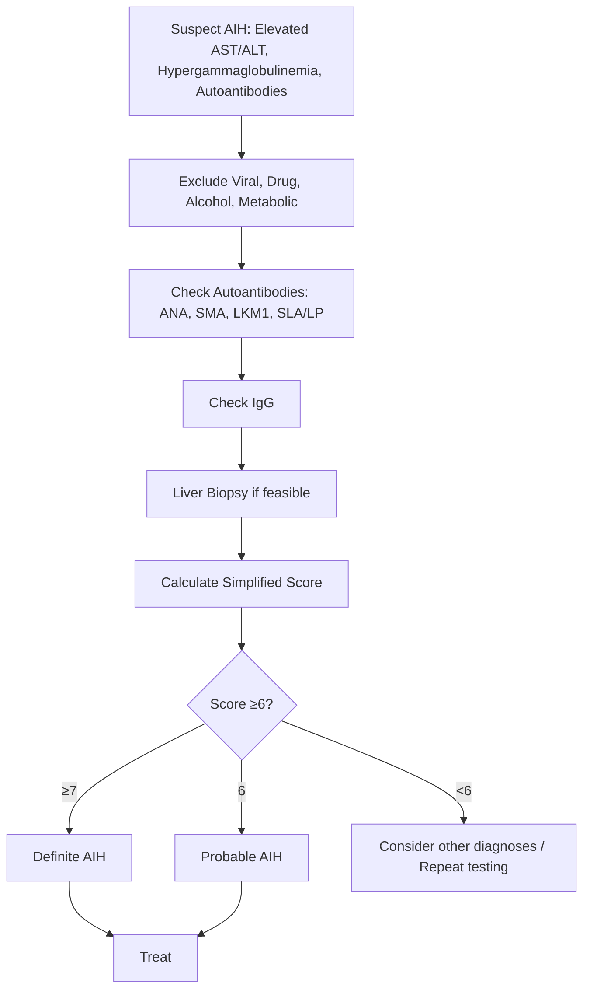

## 1. Learning Objectives
- [ ] Apply IAIHG simplified criteria for AIH diagnosis
- [ ] Differentiate Type 1 vs Type 2 AIH by autoantibodies
- [ ] Know exclusion criteria (viral, drug, alcohol, metabolic)
- [ ] Interpret scoring in clinical context
- [ ] Identify FCPS/MRCP high-yield diagnostic pitfalls

---

## 2. IAIHG Simplified Criteria (2008)

> **Score ≥6 = Probable AIH; Score ≥7 = Definite AIH**

| Parameter | Cut-off | Points |
|-----------|---------|--------|
| **ANA or SMA** | ≥1:40 | **1** |
|  | ≥1:80 | **2** |
| **Anti-LKM1** | ≥1:40 | **2** |
| **IgG** | >ULN | **1** |
|  | >1.1 × ULN | **2** |
| **Histology** | Compatible | **1** |
|  | Typical | **2** |
| **Exclusion of viral hepatitis** | Yes (A, B, C, E) | **2** |

| Total Score | Interpretation |
|-------------|----------------|
| **≥7** | **Definite AIH** |
| **6** | **Probable AIH** |
| **<6** | **Insufficient for diagnosis** |

> **FCPS/MRCP**: Simplified criteria replace original (1993) — easier to use, similar accuracy

---

## 3. Original IAIHG Criteria (1993, Revised 1999) — For Reference

| Parameter | Points (Pre-treatment) | Points (Post-treatment) |
|-----------|------------------------|------------------------|
| Gender (Female) | +2 | +2 |
| Alk Phos:AST/ALT ratio | >3: -2; 1.5-3: 0; <1.5: +2 | Same |
| Globulin / IgG | >2×ULN: +3; 1.5-2×: +2; 1-1.5×: +1; Normal: 0 | Same |
| ANA/SMA/LKM1 | >1:80: +3; 1:40: +2; 1:20: +1; Neg: 0 | Same |
| AMA | Positive: -4; Negative: 0 | Same |
| Viral markers | Positive: -3; Negative: +3 | Same |
| Drug history | Recent: -4; Past: -2; None: +1 | Same |
| Alcohol | >25g/d: -2; <25g/d: 0 | Same |
| Liver histology | Chronic hepatitis: +3; Typical AIH: +5; Biliary changes: -3; Other: -5 | Interface hepatitis: +3; Typical: +5 |
| Other autoimmune diseases | Yes: +2 | +2 |
| Response to steroids | N/A | Complete: +2; Partial: 0; None: -3 |

| Score | Pre-treatment | Post-treatment |
|-------|---------------|----------------|
| **>15** | Definite | Definite |
| **10-15** | Probable | Probable |
| **<10** | Not AIH | Not AIH |

---

## 4. Autoantibody Patterns: Type 1 vs Type 2

```mermaid
flowchart TD
    A[Autoimmune Hepatitis] --> B{Autoantibody Profile}
    B --> C[Type 1: ANA ≥1:40 AND/OR SMA ≥1:40]
    B --> D[Type 2: Anti-LKM1 ≥1:40]
    B --> E[Type 3: Anti-SLA/LP ≥1:40]
    C --> F[Most common (80% in Europe/NA)]
    D --> G[Children/Young adults; More severe]
    E --> H[Specific marker; Often co-exists with Type 1]
```

| Type | Autoantibodies | Age | Other Features |
|------|----------------|-----|----------------|
| **Type 1** | **ANA ± SMA** (LKM1 negative) | Adults (peak 20-40), F>M | Associated with other autoimmune diseases (thyroid, celiac, RA) |
| **Type 2** | **Anti-LKM1** (ANA/SMA negative) | Children/Young adults, F>M | More severe; lower spontaneous remission; associated with DRB1*03/04 |
| **Type 3** | **Anti-SLA/LP** | Adults | Highly specific (95%); often with Type 1; severe |

---

## 5. Essential Exclusions (Must Rule Out)

| Category | Specific Tests |
|----------|----------------|
| **Viral Hepatitis** | HAV IgM, HBsAg, anti-HBc, HCV Ab, HEV IgM, EBV/CMV/HSV serology |
| **Drug-Induced** | Detailed drug history; RUCAM; latency; dechallenge |
| **Alcohol** | History; GGT; AST:ALT >2; CDT; PEth |
| **Metabolic** | **Wilson**: Ceruloplasmin, urinary Cu, KF rings; **HFE**: Ferritin, TSAT, genetics; **Alpha-1 AT**: Level, phenotype |
| **PBC** | **AMA** (if positive → PBC not AIH); ALP predominant |
| **PSC** | **MRCP/ERCP** (beading); IBD association |
| **IgG4-Related** | IgG4 level; histology (storiform, obliterative phlebitis) |
| **NAFLD** | Metabolic syndrome; imaging; biopsy if needed |

---

## 6. Histopathology: Typical vs Compatible

| Feature | Typical AIH | Compatible |
|---------|-------------|------------|
| **Interface hepatitis** | Prominent | Present |
| **Plasma cell infiltration** | **Prominent** | Mild/moderate |
| **Rosette formation** | Common | Variable |
| **Emperipolesis** | Common | Variable |
| **Biliary changes** | Absent/mild | May be present |
| **Fibrosis** | Variable | Variable |
| **Exclusion** | No biliary, no granulomas, no viral inclusions | — |

> **Biopsy not mandatory if simplified criteria met** but helpful for staging and excluding mimics

---

## 7. Diagnostic Algorithm



---

## 8. AIH in Acute Liver Failure (Simplified Criteria Adaptation)

| Modification | Detail |
|--------------|--------|
| **Histology** | Often unavailable (coagulopathy) → rely on serology + IgG |
| **Score threshold** | **≥6 (probable) sufficient to start steroids** in ALF setting |
| **Key features** | Young woman, high IgG, ANA/SMA+, no viral/drug/Wilson, Coombs-neg haemolysis absent |
| **Steroid trial** | Prednisolone 60mg → assess Day 7 |

---

## 9. FCPS/MRCP High-Yield Summary

| Concept | Key Points |
|---------|------------|
| **Simplified criteria** | ANA/SMA ≥1:40 (1pt) or ≥1:80 (2pt); LKM1 ≥1:40 (2pt); IgG >ULN (1pt) or >1.1×ULN (2pt); Histology compatible (1pt) typical (2pt); Exclude viral (2pt) |
| **Cut-offs** | **≥7 = Definite; 6 = Probable** |
| **Type 1** | ANA/SMA (80%) |
| **Type 2** | Anti-LKM1 (children, severe) |
| **Type 3** | Anti-SLA/LP (specific 95%) |
| **Exclusions** | Viral, Drug, Alcohol, Wilson, PBC (AMA+), PSC, IgG4, NAFLD |
| **In ALF** | ≥6 sufficient for steroid trial |

---

## 10. Viva Questions

1. **What are the IAIHG simplified criteria for AIH?**
2. **What scores constitute definite vs probable AIH?**
3. **Differentiate Type 1, 2, and 3 AIH by autoantibodies.**
4. **What must you exclude before diagnosing AIH?**
5. **What is the role of AMA in AIH diagnosis?**
6. **What are typical histological features of AIH?**
7. **How do simplified criteria differ from original IAIHG?**
8. **AIH in ALF: what score threshold for steroid trial?**
9. **Anti-SLA/LP significance?**
10. **How to differentiate AIH from DILI?**

---

## 11. Confusions & Mnemonics

| Confusion | Clarification |
|-----------|---------------|
| Simplified vs Original | Simplified: 8 parameters, max 8 points (≥7 definite); Original: 12 parameters, complex scoring |
| ANA/SMA vs LKM1 | Type 1: ANA/SMA; Type 2: LKM1; They are mutually exclusive in classification |
| AMA in AIH | **AMA positive = PBC, NOT AIH** (exclusion criterion) |
| Anti-SLA/LP | Highly specific (95%) for AIH — not in simplified criteria but high-yield |
| IgG threshold | >ULN = 1pt; >1.1×ULN = 2pts (not 2×ULN) |
| Histology points | Compatible = 1; Typical = 2 (interface hepatitis + plasma cells) |
| ALF adaptation | No biopsy → use serology + IgG; ≥6 = start steroids |

---

## 12. Mind Map

```mermaid
mindmap
  root((AIH Diagnostic Criteria))
    IAIHG Simplified (2008)
      ANA/SMA >=1:40 (1pt), >=1:80 (2pt)
      LKM1 >=1:40 (2pt)
      IgG >ULN (1pt), >1.1xULN (2pt)
      Histology: Compatible (1), Typical (2)
      Exclude viral (2pt)
      >=7 Definite, 6 Probable
    Types
      Type 1: ANA/SMA (80%)
      Type 2: LKM1 (children, severe)
      Type 3: SLA/LP (specific 95%)
    Exclusions
      Viral A,B,C,E
      Drugs (RUCAM)
      Alcohol
      Wilson (Ceruloplasmin, Cu)
      PBC (AMA+)
      PSC (MRCP)
      IgG4 disease
      NAFLD
    Histology
      Typical: Interface hepatitis + plasma cells + rosettes = 2pt
      Compatible: Less prominent = 1pt
    ALF Adaptation
      No biopsy often
      Score >=6 = steroid trial
```

---

## 13. One-Page Revision Card

| **Simplified Criteria** | **Points** |
|-------------------------|------------|
| ANA/SMA ≥1:80 | 2 |
| ANA/SMA ≥1:40 | 1 |
| Anti-LKM1 ≥1:40 | 2 |
| IgG >1.1×ULN | 2 |
| IgG >ULN | 1 |
| Histology Typical | 2 |
| Histology Compatible | 1 |
| Viral excluded | 2 |
| **≥7 = Definite** | |
| **6 = Probable** | |

| **Type** | **Antibody** | **Age** | **Severity** |
|----------|--------------|---------|--------------|
| Type 1 | ANA ± SMA | Adults | Variable |
| Type 2 | LKM1 | Children | Severe |
| Type 3 | SLA/LP | Adults | Severe |

| **Must Exclude** | **Key Test** |
|------------------|--------------|
| Viral | HAV/HBV/HCV/HEV serology |
| Drugs | RUCAM, history |
| Wilson | Ceruloplasmin, urinary Cu |
| PBC | **AMA** |
| PSC | MRCP |
| IgG4 | Serum IgG4 |

---

## 14. Spaced Repetition Tracker

| Day | 1 | 3 | 7 | 15 | 30 |
|-----|---|---|---|----|----|
| Simplified criteria table | ☐ | ☐ | ☐ | ☐ | ☐ |
| Score cut-offs | ☐ | ☐ | ☐ | ☐ | ☐ |
| Type 1/2/3 antibodies | ☐ | ☐ | ☐ | ☐ | ☐ |
| Exclusion list | ☐ | ☐ | ☐ | ☐ | ☐ |

---

## 15. Self-Test Scorecard

| Question | My Answer | Correct? |
|----------|-----------|----------|
| Simplified criteria parameters |  |  |
| Definite vs Probable cut-offs |  |  |
| Type 1 vs 2 vs 3 |  |  |
| Anti-SLA/LP significance |  |  |
| ALF adaptation threshold |  |  |

---

## 16. Local Navigation

- [[Autoimmune Liver Disease/Autoimmune hepatitis (AIH)|AIH Overview]]
- [[Autoimmune Liver Disease/AIH treatment|AIH Treatment]]
- [[Autoimmune Liver Disease/AIH in pregnancy|AIH Pregnancy]]
- [[Autoimmune Liver Disease/Overlap syndromes|Overlap Syndromes]]
- [[Acute Liver Failure/Autoimmune hepatitis presenting as ALF|AIH ALF]]
---

> Auto-generated study sections for "Autoimmune Liver Disease" — Ch 23: Hepatology.

## Flashcards (1 generated)

- Q: What is the definition of Autoimmune Liver Disease?
  A: | Parameter | Points (Pre-treatment) | Points (Post-treatment) |

## MCQs (1 generated)

1. **Which of the following best describes Autoimmune Liver Disease?**
   A. **| Parameter | Points (Pre-treatment) | Points (Post-treatment) |**
   B. An unrelated condition not matching the clinical picture of Autoimmune Liver Disease
   C. A complication seen late in the disease course of Autoimmune Liver Disease
   D. A condition that mimics Autoimmune Liver Disease but has a different underlying cause

