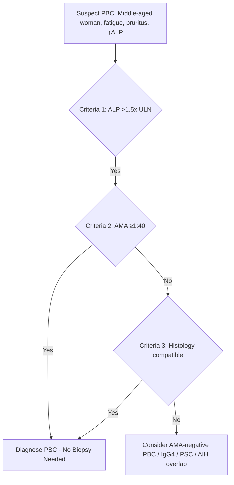
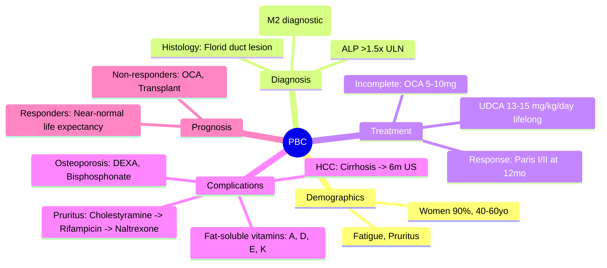

# PBC (Primary Biliary Cholangitis): Detailed

## Learning Objectives
- [ ] Apply diagnostic criteria (ALP, AMA, histology)
- [ ] Stage disease (histological and biochemical)
- [ ] Initiate UDCA and assess response (Paris, Toronto, Barcelona criteria)
- [ ] Manage incomplete responders (obeticholic acid, fibrates)
- [ ] Manage complications (pruritus, osteoporosis, fat-soluble vitamin deficiency, HCC)
- [ ] Identify FCPS/MRCP high-yield details

---

## Definition & Epidemiology

| Feature | PBC |
|-------|-----|
| **Definition** | Chronic autoimmune cholestatic liver disease targeting **small intrahepatic bile ducts** |
| **Demographics** | **Women 90%**, age 40-60 at diagnosis |
| **Autoantibody** | **AMA positive in 95%** |
| **Associated conditions** | Thyroiditis (20%), Sjögren's (30%), CREST, RA, Celiac |
| **Progression** | Variable: years to decades; without treatment → cirrhosis |

---

## Diagnostic Criteria (All 3)

| Criterion | Detail |
|---------|--------|
| **1. Biochemical** | **ALP >1.5 × ULN** (cholestatic pattern) |
| **2. Serological** | **AMA ≥1:40** (highly specific 95-98%) |
| **3. Histological** | **Florid duct lesion**: Granulomatous destruction of interlobular bile ducts |

> **AMA-negative PBC**: 5% — diagnosis requires Criteria 1 + 3 + exclusion of other causes

---

## AMA Subtypes & Significance

| Subtype | Antigen | Frequency | Significance |
|---------|---------|-----------|--------------|
| **M2** | PDC-E2 (pyruvate dehydrogenase complex) | **95% of AMA+** | **Diagnostic for PBC** |
| M4 | BCOADC-E2 | <5% | Less specific |
| M8 | Sulfite oxidase | Rare | — |
| M9 | enolase | Rare | — |

> **Only M2 is diagnostic**; others may be seen in other conditions

---

## Staging

### Histological (Ludwig/Scheuer)

| Stage | Description |
|-------|-------------|
| **1** | Florid duct lesion, portal inflammation |
| **2** | Periportal fibrosis |
| **3** | Bridging fibrosis |
| **4** | **Cirrhosis** |

### Biochemical (Global PBC Score / UK-PBC Risk Score)

| Variable | Points |
|----------|--------|
| Bilirubin | Continuous |
| ALP | Continuous |
| Albumin | Continuous |
| Platelets | Continuous |
| Age | Continuous |

**Risk calculators**: UK-PBC (transplant-free survival), GLOBE score

---

## Treatment

### 1. Ursodeoxycholic Acid (UDCA) — First-Line

| Parameter | Detail |
|---------|--------|
| **Dose** | **13-15 mg/kg/day** (typically 500-750 mg BD or TDS) |
| **Mechanism** | Hydrophilic bile acid → stabilizes hepatocyte membranes, stimulates bile flow, immunomodulation |
| **Target** | **Normalize ALP** (or <1.5×ULN), normalize bilirubin |
| **Duration** | **Lifelong** |

### 2. Response Criteria (Assess at 12 Months)

| Criteria | Definition | Transplant-Free Survival |
|----------|------------|--------------------------|
| **Paris I** | ALP ≤3×ULN + AST ≤2×ULN + **Bilirubin ≤1 mg/dL** | Excellent |
| **Paris II** (Early disease) | ALP ≤1.5×ULN + AST ≤1.5×ULN + **Bilirubin normal** | Better |
| **Toronto** | ALP ≤1.67×ULN at **2 years** | Good |
| **Barcelona** | ALP ↓40% from baseline or **ALP normal** at 1 year | Good |
| **UK-PBC / GLOBE** | Risk scores using baseline + 12mo values | Individualized |

> **FCPS/MRCP**: **Paris I/II most commonly tested** — know bilirubin ≤1 mg/dL requirement

### 3. Incomplete Responders — Second-Line

| Drug | Dose | Indication | Monitoring |
|------|------|------------|------------|
| **Obeticholic Acid (OCA)** | 5 mg daily → titrate to 10 mg | **Incomplete UDCA response** (Paris I/II fail) | **Pruritus** (common), ALP, bilirubin, lipids |
| **Fibrates (Bezafibrate)** | 400 mg daily | Incomplete response (off-label, EU approved) | Cr, CK, GI side effects |
| **Budesonide** | 3-6 mg daily | Early non-cirrhotic (caution: portal hypertension) | Cortisol, bone density |

---

## Management of Complications

| Complication | Management |
|--------------|------------|
| **Pruritus** | Cholestyramine 4g QID (1st line) → Rifampicin 150mg BD → Naltrexone 50mg → Sertraline → OCA (dose-reduce/stop) |
| **Fatigue** | Exclude anaemia, thyroid, depression; Modafinil (off-label) |
| **Osteoporosis** | **DEXA at diagnosis**; Calcium 1g + Vit D 800-1000 IU; Bisphosphonate if T-score <-2.5 or fracture |
| **Fat-soluble vitamin deficiency** | Check A, D, E, K annually; Replace if low |
| **Hyperlipidaemia** | Usually no treatment needed (high HDL); Statins safe if indicated |
| **HCC surveillance** | **Cirrhosis: 6-monthly US ± AFP**; Non-cirrhotic: consider if high risk (male, older) |

---

## Disease Progression & Prognosis

| Factor | Better Prognosis | Worse Prognosis |
|--------|------------------|-----------------|
| **UDCA Response** | Paris I/II met | Incomplete |
| **Bilirubin** | Normal | Elevated |
| **Albumin** | Normal | Low |
| **Platelets** | Normal | Low (splenomegaly) |
| **ALP** | Normalized | Persistently high |

**Median survival without treatment**: ~10-15 years
**With UDCA (responders)**: Near-normal life expectancy

---

## FCPS/MRCP High-Yield Summary

| Concept | Key Points |
|---------|------------|
| **Demographics** | Women 90%, age 40-60 |
| **Diagnosis** | ALP >1.5×ULN + AMA ≥1:40 (+/- biopsy) |
| **AMA** | M2 subtype = diagnostic |
| **1st line** | **UDCA 13-15 mg/kg/day lifelong** |
| **Response criteria** | **Paris I**: ALP ≤3×ULN, AST ≤2×ULN, Bil ≤1 mg/dL at 12mo |
| **2nd line** | **Obeticholic acid 5-10mg** if incomplete response |
| **Pruritus** | Cholestyramine → Rifampicin → Naltrexone |
| **Osteoporosis** | DEXA at diagnosis; Bisphosphonate if T<-2.5 |
| **HCC surveillance** | Cirrhosis: 6m US ± AFP |
| **Fat-soluble vitamins** | Check A, D, E, K annually |

---

## Viva Questions

1. **What are the 3 diagnostic criteria for PBC?**
2. **What AMA subtype is diagnostic?**
3. **What is the UDCA dose? Mechanism?**
4. **What are Paris I/II criteria for UDCA response?**
5. **When do you start obeticholic acid? Dose?**
6. **How do you manage pruritus in PBC? Stepwise?**
7. **Why DEXA scan at diagnosis?**
7. **What fat-soluble vitamins to monitor?**
8. **HCC surveillance in PBC?**
9. **Differentiate PBC from PSC and AIH.**
10. **What is the M2 AMA subtype?**

---

## Confusions & Mnemonics

| Confusion | Clarification |
|-----------|---------------|
| PBC vs PSC | PBC: Women, AMA+, small ducts, ALP↑; PSC: Men, IBD, MRCP beading, large+small ducts |
| PBC vs AIH | PBC: ALP predominant, AMA+; AIH: ALT predominant, ANA/SMA+, IgG↑ |
| Paris I vs II | Paris I: ALP≤3×, AST≤2×, Bil≤1 mg/dL (standard); Paris II: ALP≤1.5×, AST≤1.5×, Bil normal (early disease) |
| OCA pruritus | **Common** — manage with cholestyramine, dose-reduce, or stop |
| UDCA dose | **13-15 mg/kg/day** — not fixed mg; weight-based |
| AMA-negative PBC | 5% — needs histology + exclusion |

---

## Mind Map

---

## One-Page Revision Card

| **Diagnosis** | **Criteria** |
|---------------|--------------|
| 1. Biochemical | ALP >1.5×ULN |
| 2. Serological | **AMA ≥1:40 (M2)** |
| 3. Histological | Florid duct lesion |

| **Treatment** | **Details** |
|---------------|-------------|
| UDCA | 13-15 mg/kg/day lifelong |
| Response (Paris I) | ALP≤3×ULN, AST≤2×ULN, **Bil≤1 mg/dL** at 12mo |
| Incomplete response | **Obeticholic acid 5-10mg** |

| **Complications** | **Management** |
|-------------------|----------------|
| Pruritus | Cholestyramine → Rifampicin → Naltrexone |
| Osteoporosis | DEXA at diagnosis; Bisphosphonate if T<-2.5 |
| Vitamins | Check A, D, E, K annually |
| HCC | Cirrhosis: 6m US ± AFP |

---

## Spaced Repetition Tracker

| Day | 1 | 3 | 7 | 15 | 30 |
|-----|---|---|---|----|----|
| 3 diagnostic criteria | ☐ | ☐ | ☐ | ☐ | ☐ |
| UDCA dose | ☐ | ☐ | ☐ | ☐ | ☐ |
| Paris I criteria | ☐ | ☐ | ☐ | ☐ | ☐ |
| OCA indication/dose | ☐ | ☐ | ☐ | ☐ | ☐ |
| Pruritus ladder | ☐ | ☐ | ☐ | ☐ | ☐ |

---

## Self-Test Scorecard

| Question | My Answer | Correct? |
|----------|-----------|----------|
| PBC diagnostic triad |  |  |
| UDCA dose mechanism |  |  |
| Paris I vs II |  |  |
| Pruritus management steps |  |  |
| Fat-soluble vitamins |  |  |

---

## Local Navigation

- [[Autoimmune Liver Disease/Primary sclerosing cholangitis (PSC)|PSC]]
- [[Autoimmune Liver Disease/Autoimmune hepatitis (AIH)|AIH]]
- [[Autoimmune Liver Disease/Overlap syndromes|Overlap Syndromes]]
- [[Autoimmune Liver Disease/IgG4-related sclerosing cholangitis|IgG4-SC]]
- [[Autoimmune Liver Disease/AIH diagnostic criteria (IAIHG simplified)|AIH Criteria]]