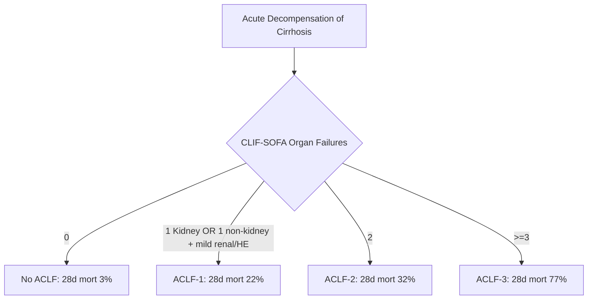
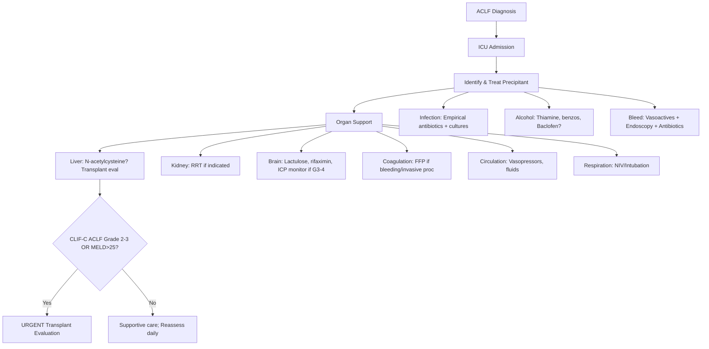
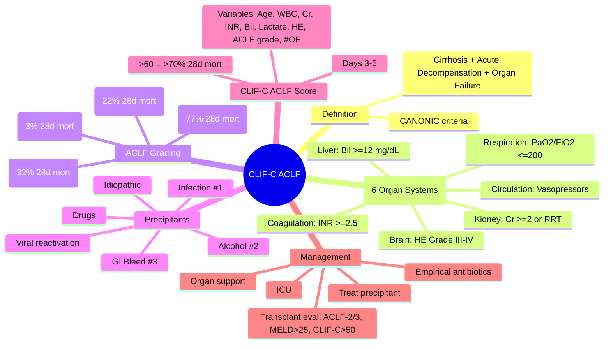

# CLIF-C ACLF Score and ACLF Grading

## Learning Objectives
- [ ] Define ACLF per EASL-CLIF (CANONIC criteria)
- [ ] Calculate CLIF-SOFA / CLIF-C ACLF score
- [ ] Grade ACLF (ACLF-1, -2, -3)
- [ ] Know 28-day and 90-day mortality by grade
- [ ] Identify precipitants and management priorities
- [ ] Apply FCPS/MRCP high-yield associations

---

## ACLF Definition (EASL-CLIF)

> **Acute decompensation of cirrhosis + organ failure(s) + high 28-day mortality**

### Diagnostic Criteria (ALL Required)
1. **Cirrhosis** (previously diagnosed or diagnosed at presentation)
2. **Acute decompensation**: Ascites, GI bleed, HE, bacterial infection
3. **Organ failure(s)** per CLIF-SOFA
4. **No chronic liver disease without cirrhosis** (chronic hepatitis ≠ ACLF)

---

## CLIF-SOFA: Organ Failure Definitions

| Organ System | Variable | Cut-off for Failure |
|--------------|----------|---------------------|
| **Liver** | Bilirubin | **≥12 mg/dL (≥204 μmol/L)** |
| **Kidney** | Creatinine | **≥2.0 mg/dL (≥177 μmol/L)** OR **RRT** |
| **Brain** | HE Grade | **Grade III-IV** |
| **Coagulation** | INR | **≥2.5** |
| **Circulation** | MAP / Vasopressors | **MAP <70 mmHg** OR **vasopressors** |
| **Respiration** | PaO₂/FiO₂ or SpO₂/FiO₂ | **PaO₂/FiO₂ ≤200** OR **SpO₂/FiO₂ ≤214** OR **mechanical ventilation** |

> **Organ Failure = 1 point each** (max 6 points)

---

## ACLF Grading

| Grade | Definition | Organ Failures | 28-Day Mortality | 90-Day Mortality |
|-------|------------|----------------|------------------|------------------|
| **ACLF-1** | Single kidney failure OR Single non-kidney failure + Cr 1.5-1.9 or HE Grade I-II | 1 (or kidney + mild other) | **22%** | **32%** |
| **ACLF-2** | Two organ failures | 2 | **32%** | **47%** |
| **ACLF-3** | Three or more organ failures | ≥3 | **77%** | **85%** |
| **No ACLF** | Acute decompensation without organ failure | 0 | **3%** | **10%** |



---

## CLIF-C ACLF Score (Prognostic, Not Diagnostic)

> **Calculated at diagnosis (Days 3-5) for prognosis**

### Variables (9 total)
| Variable | Weight |
|----------|--------|
| Age | Continuous |
| WBC count | Continuous |
| Creatinine | Continuous |
| INR | Continuous |
| Bilirubin | Continuous |
| Lactate | Continuous |
| HE grade | Ordinal |
| ACLF grade | Categorical |
| **Number of organ failures** | **Strongest predictor** |

### Formula (Simplified for Exams)
```
CLIF-C ACLF = 10 × [0.33 × logₑ(bilirubin) + 0.04 × age + 0.63 × logₑ(creatinine) 
                  + 0.58 × logₑ(WBC) + 0.46 × logₑ(INR) + 0.59 × logₑ(lactate)
                  + 0.83 × (HE grade 3-4) + 0.27 × (ACLF grade 2) + 0.76 × (ACLF grade 3)]
```

**Score Range**: 0-100 (higher = worse)

### Mortality by CLIF-C ACLF Score

| Score Range | 28-Day Mortality | 90-Day Mortality |
|-------------|------------------|------------------|
| **<40** | <10% | <20% |
| **40-50** | 20-30% | 30-40% |
| **50-60** | 40-50% | 50-60% |
| **>60** | >70% | >80% |

> **FCPS/MRCP**: Don't memorize formula — know **components**, **grading**, and **mortality by grade**

---

## Precipitants of ACLF

| Precipitant | Frequency | Mortality Impact |
|-------------|-----------|------------------|
| **Bacterial infection** | 30-40% | SBP, pneumonia, UTI, bacteremia |
| **Alcohol binge** | 20-30% | Active alcohol use in cirrhotic |
| **GI bleed** | 15-20% | Variceal/non-variceal |
| **Drug-induced** | 10-15% | NSAIDs, antibiotics, herbal |
| **Viral reactivation** | 5-10% | HBV reactivation |
| **No identifiable precipitant** | 20-30% | "Idiopathic" ACLF |

---

## ACLF vs ALF vs Acute Decompensation

| Feature | ALF | Acute Decompensation | ACLF |
|---------|-----|---------------------|------|
| **Pre-existing liver disease** | NO | YES (cirrhosis) | YES (cirrhosis) |
| **Encephalopathy** | Required | May be present | Required (Grade III-IV for OF) |
| **Coagulopathy** | INR ≥1.5 | Variable | INR ≥2.5 for OF |
| **Organ failures** | Liver only (initially) | None | **Multi-organ (CLIF-SOFA)** |
| **Clinical course** | Days-weeks | Weeks-months | Days-weeks |
| **28-day mortality** | 30-50% | 3-10% | **Grade-dependent (22-77%)** |
| **Prognostic score** | King's College | MELD, Child-Pugh | **CLIF-C ACLF** |
| **Transplant urgency** | Super-urgent | Elective/Urgent | **Urgent (ACLF-2/3)** |

---

## Management Priorities in ACLF



### Key Management Points

| Intervention | Indication |
|--------------|------------|
| **Empirical antibiotics** | All ACLF (high infection risk); Ceftriaxone 2g IV daily |
| **N-acetylcysteine** | Consider in ACLF (some evidence for transplant-free survival) |
| **Renal replacement therapy** | Cr ≥2.0 + oliguria/acidosis/fluid overload |
| **Lactulose + Rifaximin** | HE Grade II-IV |
| **Transplant evaluation** | ACLF-2/3, MELD >25, CLIF-C >50, failed organ support |

---

## FCPS/MRCP High-Yield Summary

| Concept | Key Points |
|---------|------------|
| **ACLF Definition** | Cirrhosis + acute decompensation + organ failure(s) |
| **Organ Failure (CLIF-SOFA)** | Liver: Bil ≥12; Kidney: Cr ≥2 or RRT; Brain: HE G3-4; Coag: INR ≥2.5; Circ: Vasopressors; Resp: PaO₂/FiO₂ ≤200 |
| **Grades** | ACLF-1: 1 OF (22% 28d mort); ACLF-2: 2 OF (32%); ACLF-3: ≥3 OF (77%) |
| **Precipitants** | Infection #1, Alcohol #2, Bleed #3 |
| **Prognostic Score** | CLIF-C ACLF (Days 3-5); >60 = >70% 28d mort |
| **Management** | ICU, treat precipitant, organ support, early transplant eval for Grade 2-3 |
| **Antibiotics** | Empirical ceftriaxone for ALL ACLF |

---

## Viva Questions

1. **Define ACLF per EASL-CLIF.**
2. **What are the 6 organ systems in CLIF-SOFA? Give failure cut-offs.**
3. **How is ACLF graded? What is 28-day mortality for each grade?**
4. **Differentiate ACLF from ALF and acute decompensation.**
5. **What is CLIF-C ACLF score? When is it calculated?**
5. **List top 3 precipitants of ACLF.**
6. **What is the first-line empirical antibiotic for ACLF?**
7. **When do you refer ACLF for transplant evaluation?**
8. **How does renal failure definition differ in CLIF-SOFA vs standard AKI?**
9. **What is the role of NAC in ACLF?**
10. **ACLF-1 vs no ACLF: what's the difference?**

---

## Confusions & Mnemonics

| Confusion | Clarification |
|-----------|---------------|
| ALF vs ACLF | ALF: NO prior liver disease; ACLF: cirrhosis + acute decompensation + organ failure |
| ACLF-1 vs No ACLF | ACLF-1 = 1 organ failure (or kidney + mild renal/HE); No ACLF = 0 organ failures |
| CLIF-SOFA vs SOFA | CLIF-SOFA: liver (bilirubin) replaces platelets; bilirubin ≥12 mg/dL = liver failure |
| CHOLESTATIC vs hepatic bilirubin | CLIF-SOFA uses TOTAL bilirubin ≥12 mg/dL for liver failure |
| CLIF-C ACLF vs MELD | CLIF-C ACLF: ACLF-specific, includes WBC, lactate, HE, ACLF grade; MELD: general cirrhosis prognosis |
| Kidney failure in CLIF-SOFA | Cr ≥2.0 OR RRT — lower threshold than KDIGO AKI Stage 3 (Cr ≥3× baseline or ≥4.0) |

---

## Mind Map



---

## One-Page Revision Card

| **CLIF-SOFA Organ Failure** | **Cut-off** |
|----------------------------|-------------|
| Liver | Bilirubin ≥12 mg/dL |
| Kidney | Creatinine ≥2.0 mg/dL OR RRT |
| Brain | HE Grade III-IV |
| Coagulation | INR ≥2.5 |
| Circulation | Vasopressors required |
| Respiration | PaO₂/FiO₂ ≤200 OR MV |

| **ACLF Grade** | **Organ Failures** | **28-Day Mortality** |
|----------------|-------------------|---------------------|
| No ACLF | 0 | 3% |
| ACLF-1 | 1 (or kidney + mild other) | 22% |
| ACLF-2 | 2 | 32% |
| ACLF-3 | ≥3 | 77% |

---

## Spaced Repetition Tracker

| Day | 1 | 3 | 7 | 15 | 30 |
|-----|---|---|---|----|----|
| CLIF-SOFA 6 organ cut-offs | ☐ | ☐ | ☐ | ☐ | ☐ |
| ACLF grades + mortality | ☐ | ☐ | ☐ | ☐ | ☐ |
| ACLF vs ALF vs decompensation | ☐ | ☐ | ☐ | ☐ | ☐ |
| Precipitants | ☐ | ☐ | ☐ | ☐ | ☐ |
| Transplant indications | ☐ | ☐ | ☐ | ☐ | ☐ |

---

## Self-Test Scorecard

| Question | My Answer | Correct? |
|----------|-----------|----------|
| 6 CLIF-SOFA organ failures |  |  |
| ACLF-1 vs ACLF-2 vs ACLF-3 |  |  |
| CLIF-C ACLF vs MELD |  |  |
| Top 3 precipitants |  |  |
| Transplant criteria |  |  |

---

## Local Navigation

- [[Acute Liver Failure/Definition and Aetiology|ALF Definition]]
- [[Acute Liver Failure/ALF vs ACLF|ALF vs ACLF]]
- [[Portal Hypertension and Complications/Hepatorenal Syndrome|HRS]]
- [[Portal Hypertension and Complications/Hepatic Encephalopathy|HE]]
- [[Portal Hypertension and Complications/Acute variceal bleeding management|Variceal Bleed]]
- [[Acute Liver Failure/King's College Criteria|King's College Criteria]]