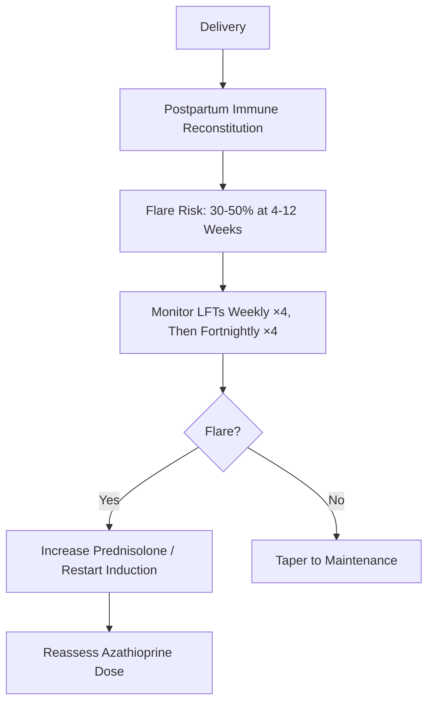

## 1. Learning Objectives
- [ ] Manage AIH during pregnancy (induction, maintenance, monitoring)
- [ ] Apply safety profiles of immunosuppressants in pregnancy
- [ ] Manage postpartum flare risk
- [ ] Plan delivery and postpartum care
- [ ] Identify FCPS/MRCP high-yield obstetric hepatology points

---

## 2. Key Principles

```mermaid
flowchart TD
    A[AIH in Pregnancy] --> B[Goal: Disease Control + Fetal Safety]
    B --> C[Continue Effective Immunosuppression]
    C --> D[Prednisolone + Azathioprine = SAFE]
    C --> E[Avoid: Mycophenolate, Methotrexate, Tacrolimus (Relative)]
    D --> F[Monitor: LFTs Monthly, Drug Levels]
    D --> G[Plan Delivery: Vaginal Preferred]
    D --> H[Postpartum: High Flare Risk (4-12 Weeks)]
```

---

## 3. Drug Safety in Pregnancy

| Drug | FDA Category | AIH Use in Pregnancy | Key Points |
|------|--------------|---------------------|------------|
| **Prednisolone** | **B (Safe)** | **First-Line** | Crosses placenta but inactivated by placental 11β-HSD2; No teratogenicity |
| **Azathioprine** | **D (Safe in Practice)** | **First-Line Steroid-Sparing** | Crosses placenta but low fetal levels; **Continue throughout pregnancy** |
| **Mycophenolate (MMF)** | **D (Contraindicated)** | **STOP Pre-Conception** | **Teratogenic** (Ear, Eye, Limb, CNS defects); **Switch 6mo Before** |
| **Methotrexate** | **X (Contraindicated)** | **STOP Pre-Conception** | **Highly Teratogenic** (Craniofacial, Limb, CNS); **Stop 3mo Before** |
| **Tacrolimus** | **C (Relative)** | **If Essential Only** | Use if MMF/Aza Fail; Monitor Levels (↑ Clearance in Pregnancy) |
| **Budesonide** | **B** | **Non-Cirrhotic Only** | High First-Pass; Safe but Avoid in Cirrhosis |
| **Ursodeoxycholic Acid** | **B** | **Safe** | Also for ICP/Cholestasis |

> **FCPS/MRCP**: **MMF & Methotrexate = ABSOLUTE Contraindications** — Stop 6mo/3mo Pre-Conception

---

## 4. Pre-Conception Counselling

| Step | Action |
|------|--------|
| **1. Review Medications** | STOP MMF (≥6mo), Methotrexate (≥3mo) Before Conception |
| **2. Optimize Regimen** | Switch to **Prednisolone + Azathioprine** |
| **3. Confirm Remission** | Normal ALT, IgG, Autoantibodies ×3-6 Months |
| **4. Folic Acid** | **5mg Daily** (Start Pre-Conception) |
| **5. Vaccinations** | Update Pre-Pregnancy (Live Vaccines Contraindicated in Pregnancy) |

---

## 5. Management During Pregnancy

### Trimester-Specific Monitoring

| Trimester | LFTs | Drug Levels | Obstetric |
|-----------|------|-------------|-----------|
| **1st** | Monthly | Azathioprine Metabolites (6-TGN/6-MMP) | Dating Scan, NIPT |
| **2nd** | Monthly | Trough Levels if on Tacrolimus | Anomaly Scan |
| **3rd** | 2-Weekly | Monitor for Flare | Growth Scans (If Indicated) |

### Drug Dosing Adjustments

| Drug | Adjustment in Pregnancy |
|------|------------------------|
| **Prednisolone** | **No Change** (Dose as per Disease Activity) |
| **Azathioprine** | **No Change** (Standard Dose 1-2mg/kg); ↑ Clearance → Check 6-TGN |
| **Tacrolimus** | **Dose ↑ 30-50%** (↑ Clearance, ↑ Vd); **Monitor Trough Levels** |
| **Budesonide** | No Change (If Indicated) |

---

## 6. Postpartum Flare



| Feature | Detail |
|---------|--------|
| **Timing** | **4-12 Weeks Postpartum** (Peak) |
| **Incidence** | **30-50%** if Remission Pre-Pregnancy |
| **Mechanism** | Immune Reconstitution (↓ Estrogen/Progesterone → ↑ Th1) |
| **Management** | ↑ Prednisolone → Taper; Optimize Azathioprine Dose |

---

## 7. Breastfeeding

| Drug | Safety | Recommendation |
|------|--------|----------------|
| **Prednisolone** | **Safe** (<1% in Milk) | **Compatible** |
| **Azathioprine** | **Safe** (Low Milk Levels) | **Compatible** |
| **Prednisolone + Azathioprine** | **Safe** | **Strongly Encourage Breastfeeding** |
| **Tacrolimus** | Low Milk Levels | **Compatible (Monitor Infant)** |
| **MMF** | **Unknown/Contraindicated** | **Avoid** |
| **Methotrexate** | **Contraindicated** | **Avoid** |

> **FCPS/MRCP**: **Breastfeeding SAFE on Pred + Aza** — Strongly Encouraged

---

## 8. Delivery Planning

| Aspect | Recommendation |
|--------|----------------|
| **Mode** | **Vaginal Delivery Preferred** (Unless Obstetric Indication) |
| **Anaesthesia** | **Epidural Safe** (No Interaction with Immunosuppression) |
| **Caesarean** | Only for Obstetric Indications |
| **Postpartum Hepatitis B** | If Mother HBsAg+ → HBIG + Vaccine to Baby |

---

## 9. AIH Presenting de Novo in Pregnancy

| Scenario | Management |
|----------|------------|
| **New AIH Diagnosis** | **Pred 30-40mg + Aza 1-2mg/kg** (Same as Non-Pregnant) |
| **Severe Disease** | **Pred 40-60mg** (May Need Higher Doses) |
| **ALF** | **Pred 60mg + Urgent Transplant Assessment** |

---

## 10. FCPS/MRCP High-Yield Summary

| Concept | Key Points |
|---------|------------|
| **Pre-Conception** | **STOP MMF (6mo), MTX (3mo)** → Switch to Pred + Aza |
| **Safe Drugs** | **Prednisolone, Azathioprine, Budesonide, UDCA** |
| **Unsafe Drugs** | **MMF (Teratogenic)**, **Methotrexate (Teratogenic)** |
| **Tacrolimus** | ↑ Dose Needed (↑ Clearance); Monitor Levels |
| **Postpartum Flare** | **30-50% at 4-12 Weeks** → Monitor LFTs Weekly ×4 |
| **Breastfeeding** | **SAFE on Pred + Aza** — Encourage |
| **Delivery** | Vaginal Preferred; Epidural Safe |
| **Postpartum** | Close LFT Monitoring ×8 Weeks |

---

## 11. Viva Questions

1. **Which immunosuppressants are contraindicated in pregnancy?**
2. **When should MMF be stopped before conception?**
3. **Is azathioprine safe in pregnancy? Dose adjustment?**
4. **What is the postpartum flare risk and timing?**
4. **Is breastfeeding safe in HBsAg+ mother?**
5. **What is the management of AIH presenting de novo in pregnancy?**
5. **What is the tacrolimus dose adjustment in pregnancy?**
6. **Is prednisolone safe in pregnancy?**
6. **What pre-conception counselling is needed for AIH?**
7. **How do you manage AIH flare in 3rd trimester?**
8. **Is vaginal delivery safe in AIH?**

---

## 12. Confusions & Mnemonics

| Confusion | Clarification |
|-----------|---------------|
| MMF in Pregnancy | **ABSOLUTE CONTRAINDICATION** — Teratogenic; Stop ≥6mo Pre-Conception |
| Azathioprine Safety | **Safe** — Crosses Placenta but Low Fetal Levels; Continue Throughout |
| Tacrolimus Dose | **Increase 30-50%** — ↑ Clearance in Pregnancy; Monitor Levels |
| Postpartum Flare | **30-50% at 4-12 Weeks** — Weekly LFTs ×4, Then Fortnightly |
| Breastfeeding on Aza | **Compatible** — Minimal Milk Transfer; Encourage |
| Methotrexate | **Category X** — Stop ≥3mo Pre-Conception |
| Budesonide in Pregnancy | Safe (Category B) but **Non-Cirrhotic Only** |
| Postpartum Monitoring | **Weekly LFTs ×4, Then Fortnightly ×4** |

---

## 13. Mind Map

```mermaid
mindmap
  root((AIH in Pregnancy))
    Pre-Conception
      STOP MMF (6mo), MTX (3mo)
      Switch to Pred + Aza
      Confirm Remission
      Folic Acid 5mg
    Safe Drugs
      Prednisolone (Cat B)
      Azathioprine (Safe)
      Budesonide (Non-Cirrhotic)
      UDCA
    Unsafe Drugs
      MMF (Cat D, Teratogenic)
      MTX (Cat X, Teratogenic)
      Tacrolimus (Cat C, ↑ Dose)
    During Pregnancy
      LFTs Monthly
      Monitor 6-TGN (Aza)
      Tacrolimus Trough
      Postpartum Flare: 30-50% at 4-12w
    Postpartum
      Weekly LFTs x4
      Fortnightly x4
      Breastfeeding: SAFE on Pred + Aza
    Delivery
      Vaginal Preferred
      Epidural Safe
      C-Section if Obstetric Indication
```

---

## 14. One-Page Revision Card

| **Pre-Conception** | **Action** |
|--------------------|------------|
| MMF | **STOP ≥6 Months** |
| Methotrexate | **STOP ≥3 Months** |
| Switch To | **Pred + Aza** |
| Folic Acid | **5mg Daily** |

| **Drug Safety** | **Category** | **Action** |
|-----------------|-------------|------------|
| Prednisolone | B | Safe, Continue |
| Azathioprine | D* | **Safe, Continue** |
| MMF | D | **STOP 6mo Pre-Conception** |
| Methotrexate | X | **STOP 3mo Pre-Conception** |
| Tacrolimus | C | Dose ↑ 30-50%, Monitor Levels |
| Budesonide | B | Non-Cirrhotic Only |

| **Postpartum** | |
|---------------|--|
| Flare Risk | 30-50% at 4-12 Weeks |
| Monitoring | Weekly LFTs ×4, Then Fortnightly ×4 |
| Breastfeeding | **SAFE** |
| Delivery | Vaginal Preferred |

| **Postpartum Flare** | **Management** |
|---------------------|----------------|
| Mild (ALT 2-5x) | ↑ Prednisolone |
| Severe (ALT >5x) | Restart Induction Dose |

---

## 15. Spaced Repetition Tracker

| Day | 1 | 3 | 7 | 15 | 30 |
|-----|---|---|---|----|----|
| MMF/MTX Stop Timing | ☐ | ☐ | ☐ | ☐ | ☐ |
| Safe vs Unsafe Drugs | ☐ | ☐ | ☐ | ☐ | ☐ |
| Azathioprine Safety | ☐ | ☐ | ☐ | ☐ | ☐ |
| Postpartum Flare Timing | ☐ | ☐ | ☐ | ☐ | ☐ |
| Breastfeeding Safety | ☐ | ☐ | ☐ | ☐ | ☐ |

---

## 16. Self-Test Scorecard

| Question | My Answer | Correct? |
|----------|-----------|----------|
| MMF Stop Timing |  |  |
| Azathioprine Category |  |  |
| Postpartum Flare Timing |  |  |
| Breastfeeding Safe? |  |  |
| Tacrolimus Dose Adjustment |  |  |

---

## 17. Local Navigation

- [[Autoimmune Liver Disease/Autoimmune hepatitis (AIH)|AIH Overview]]
- [[Autoimmune Liver Disease/AIH treatment|AIH Treatment]]
- [[Autoimmune Liver Disease/AIH diagnostic criteria (IAIHG simplified)|AIH Criteria]]
- [[Hepatology in Special Situations/Viral Hepatitis in Pregnancy|Viral Hepatitis in Pregnancy]]
- [[Hepatology in Special Situations/Hepatology in Special Situations|Special Situations Overview]]