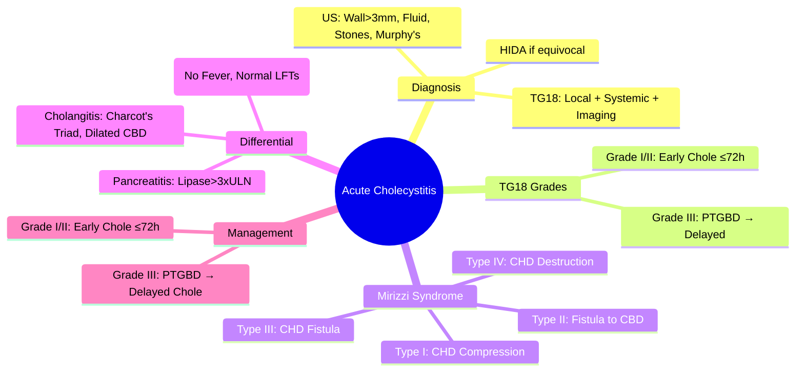

# Acute Cholecystitis

> [!tip] **FCPS/MRCP Priority: HIGH**
> **Acute Cholecystitis = Gallbladder inflammation from cystic duct obstruction** — **Tokyo Guidelines 2018 (TG18)**: Grade I/II → **early cholecystectomy ≤72h**; Grade III → **PTGBD for Grade III**; **Mirizzi syndrome** = stone in Hartmann's pouch compressing CHD.

---

## Learning Objectives
By the end of this note you should be able to:
- [ ] Apply **Tokyo Guidelines 2018 (TG18)** severity grading
- [ ] Diagnose acute cholecystitis using **clinical, laboratory, imaging criteria**
- [ ] Select **management** per TG18 grade (early cholecystectomy vs PTGBD)
- [ ] Recognise **Mirizzi syndrome** types I-IV
- [ ] Differentiate from **cholangitis**, **biliary colic**, **peptic ulcer disease**

---

## 1. Definition & Pathophysiology

| Feature | Detail |
|---------|--------|
| **Definition** | Acute inflammation of gallbladder wall, usually from **cystic duct obstruction** by gallstone |
| **Pathophysiology** | Stone impacts in cystic duct/neck → distension → ischaemia → inflammation → bacterial superinfection (E. coli, Klebsiella, Enterobacter) |
| **Risk Factors** | Female, >40, obese, multiparity, rapid weight loss, TPN, critical illness (acalculous) |

---

## 2. Diagnostic Criteria (TG18)

### A. Local Signs of Inflammation
- Murphy's sign (arrest of inspiration on RUQ palpation)
- RUQ pain, tenderness, mass
- Fever (≥38°C)

### B. Systemic Signs
- Fever (≥38°C)
- Elevated WBC (>10,000/µL), CRP

### C. Imaging Findings (US/CT)
| Modality | Findings |
|----------|----------|
| **US (First-line)** | **Wall thickening >3mm**, pericholecystic fluid, gallstones, sonographic Murphy's sign, gallbladder distension (>10cm) |
| **CT** | Wall thickening, pericholecystic fat stranding, gallbladder distension, high-attenuation bile |
| **HIDA Scan** | **Non-visualisation of GB at 60 min** (sensitivity 95%) — if US equivocal |

### Diagnostic Criteria (TG18)
| Category | Criteria |
|----------|----------|
| **Suspected** | 1 item from A + 1 from B |
| **Definite** | 1 item from A + 1 from B + 1 from C |

---

## 2. TG18 Severity Grading & Management

| Grade | Criteria | Management |
|-------|----------|------------|
| **Grade I (Mild)** | No organ dysfunction, no extensive inflammation | **Early cholecystectomy (≤72h)** |
| **Grade II (Moderate)** | **Any**: WBC >18,000, palpable GB, disease >72h, Marked local inflammation | **Early cholecystectomy (≤72h)**; consider PTGBD if high surgical risk |
| **Grade III (Severe)** | **Organ dysfunction**: CV (pressor), Neuro (GCS<14), Resp (PaO2/FiO2<300), Renal (Cr>2), Hepatic (INR>1.5), Haematological (Plt<100k) | **Urgent PTGBD/ERCP** → delayed cholecystectomy |

### Management Algorithm
```mermaid
flowchart TD
    A[Acute Cholecystitis] --> B{TG18 Grade}
    B -->|Grade I/II| C[**Early Laparoscopic Cholecystectomy ≤72h**]
    B -->|Grade III| D[**Urgent PTGBD/ERCP**]
    C --> E[If conversion needed → Open]
    D --> F[Stabilise → Delayed Cholecystectomy (6-12wks)]
```

---

## 3. Mirizzi Syndrome

| Type | Mechanism | Management |
|------|-----------|------------|
| **Type I** | Stone in Hartmann's pouch → **extrinsic compression of CHD** | **Cholecystectomy + CBD exploration** (lap/open) |
| **Type II** | **Cholecystocholedochal fistula** (erosion into CBD) | **Cholecystectomy + fistula repair + T-tube** |
| **Type III** | Fistula involving **CHD proper** | **Biliary reconstruction (hepaticojejunostomy)** |
| **Type IV** | **Complete destruction of CHD wall** | **Hepaticojejunostomy** |

---

## 4. Differential Diagnosis

| Condition | Key Distinction |
|-----------|-----------------|
| **Biliary Colic** | Intermittent pain, **no fever**, normal LFTs, no Murphy's sign |
| **Acute Cholangitis** | **Charcot's triad** (fever, jaundice, RUQ pain), **dilated CBD**, systemic sepsis |
| **Peptic Ulcer Disease** | Epigastric pain, related to meals, no Murphy's sign, normal US |
| **Acute Pancreatitis** | Epigastric pain radiating to back, **lipase >3× ULN**, normal GB on US |
| **Hepatitis** | Diffuse RUQ pain, **markedly elevated ALT/AST**, no GB wall thickening |
| **Perforated Peptic Ulcer** | Free air under diaphragm, board-like rigidity, no GB pathology |

---

## 5. FCPS/MRCP High-Yield Summary

| Topic | Key Points |
|-------|------------|
| **TG18 Diagnosis** | 1 item from A + 1 from B = suspected; + imaging (C) = definite |
| **TG18 Grades** | **Grade I/II: Early cholecystectomy ≤72h**; **Grade III: PTGBD → delayed cholecystectomy** |
| **Grade I** | No organ dysfunction, mild inflammation |
| **Grade II** | WBC>18k, palpable GB, >72h symptoms, marked inflammation |
| **Grade III** | **Organ dysfunction** (CV/Neuro/Resp/Renal/Hepatic/Haematological) |
| **Mirizzi Types** | I: CHD compression; II: Cholecystocholedochal fistula; III: CHD fistula; IV: CHD destruction |
| **Mirizzi Type I vs II** | I: Extrinsic compression; II: Fistula into CBD |
| **Differential: Cholecystitis vs Cholangitis** | Cholecystitis: GB wall thickening, Murphy's sign; Cholangitis: Fever+Jaundice+RUQ pain, dilated CBD |

---

## 5. Viva Questions (MRCP PACES / FCPS)

| Question | Expected Answer |
|----------|-----------------|
| **TG18 Grades I/II/III — Management?** | **Grade I/II: Early cholecystectomy ≤72h**; **Grade III: PTGBD → delayed cholecystectomy**. |
| **TG18 Grade II — Criteria?** | **WBC>18k**, **palpable GB**, **>72h symptoms**, **marked inflammation**. |
| **Mirizzi Syndrome — Types I-IV?** | **I**: CHD compression; **II**: Cholecystocholedochal fistula; **III**: Fistula into CHD proper; **IV**: CHD wall destruction. |
| **Acute Cholecystitis vs Cholangitis — Key Differences?** | **Cholecystitis**: GB wall thickening, Murphy's sign, no dilated CBD; **Cholangitis**: Fever+Jaundice+RUQ pain, dilated CBD, sepsis. |
| **Acute Cholecystitis — US Findings?** | **GB wall thickening >3mm**, pericholecystic fluid, gallstones, sonographic Murphy's sign, GB distension. |
| **HIDA Scan — Indication, Sensitivity?** | **US equivocal**; **Non-visualisation at 60 min = 95% sensitivity**. |
| **Mirizzi Type I vs II — Difference?** | **Type I**: Extrinsic compression of CHD by stone in Hartmann's pouch; **Type II**: Cholecystocholedochal fistula (erosion into CBD). |

---

## 6. Confusions & Mnemonics

| Confusion | Clarification |
|-----------|---------------|
| **Cholecystitis vs Cholangitis** | **Cholecystitis**: GB wall thickening, Murphy's sign, no dilated CBD; **Cholangitis**: Fever+Jaundice+RUQ pain, dilated CBD, sepsis |
| **TG18 Grade I vs II vs III** | **I**: No organ dysfunction; **II**: Local inflammation markers; **III**: Organ dysfunction (CV/Neuro/Resp/Renal/Hepatic/Haematological) |
| **Mirizzi Type I vs II** | **I**: Extrinsic compression; **II**: Fistula into CBD |
| **HIDA vs US** | **US first-line**; **HIDA if US equivocal** (95% sensitivity) |
| **TG18 Grade III Management** | **Not immediate surgery** — PTGBD/ERCP for drainage, stabilise, then delayed cholecystectomy |

**Mnemonic: CHOLECYSTITIS-TG18**
- **C**holangiitis vs **Cholecystitis**: **Charcot's Triad vs Murphy's Sign**
- **H**IDA: **US equivocal → HIDA (95% sens)**
- **O**rgan Dysfunction: **TG18 Grade III = Organ Failure → PTGBD**
- **L**ocal Signs: **Murphy's Sign, RUQ Tenderness, Mass**
- **E**arly Surgery: **Grade I/II → Cholecystectomy ≤72h**
- **C**FID: **Clinical + Lab + Imaging = Definite**
- **Y**ellow Skin: **Not typical for simple cholecystitis (suggests cholangitis)**
- **S**TG18 Grades: **I/II Early Chole, III PTGBD**
- **S**onographic Murphy's: **Positive = Highly Specific**
- **T**G18 Grade II: **WBC>18k, Palpable GB, >72h, Marked Inflammation**
- **I**nflammation Markers: **WBC, CRP, ESR**
- **T**ype I Mirizzi: **Compression; Type II: Fistula**
- **I**maging: **US First-line (Wall>3mm, Pericholecystic Fluid, Stones, Murphy's)**
- **I**CU Admission: **Grade III = ICA Organisation**
- **S**urgical Timing: **≤72h for I/II; Delayed for III**

---

## 9. Mind Map



---

## 10. One-Page Revision Card

| Domain | Key Points |
|--------|------------|
| **TG18 Diagnosis** | 1 Local (A) + 1 Systemic (B) = Suspected; + Imaging (C) = Definite |
| **US Findings** | GB wall >3mm, pericholecystic fluid, stones, Murphy's sign, distension |
| **TG18 Grades** | I: Mild; II: WBC>18k/Palpable/>72h/Marked Inflam; III: Organ Dysfunction |
| **Management** | **Grade I/II: Early Chole ≤72h**; **Grade III: PTGBD → Delayed** |
| **Mirizzi** | I: CHD Compression; II: Fistula; III: CHD Fistula; IV: CHD Destruction |
| **Differentials** | Colic (no fever); Cholangitis (Charcot's Triad + Dilated CBD); Pancreatitis (Lipase>3x) |

---

## 6. Spaced Repetition Trackers

| Review Interval | Date Completed | Confidence (1-5) | Notes |
|-----------------|----------------|------------------|-------|
| 24 hours | | | |
| 7 days | | | |
| 15 days | | | |
| 30 days | | | |
| 90 days | | | |

---

## 7. Self-Test Scorecard

| Section | Score /5 | Last Attempt |
|---------|----------|--------------|
| TG18 Diagnostic Criteria | | |
| TG18 Grading & Management | | |
| Mirizzi Syndrome Types | | |
| Differential Diagnosis | | |
| Imaging Findings | | |
| Viva Questions | | |

---

## Local Navigation
- **Parent Heading**: [[../Hepatology|Hepatology]]
- **Chapter Map": [[../Davidson Chapter 24 - Hepatology Hierarchy|Hepatology Hierarchy]]
- **Chapter MOC": [[../Hepatology MOC|Hepatology MOC]]
- **Drug Reference": [[../../Clinical Therapeutics and Good Prescribing|Drugs]]
- **Related": [[Biliary Tract Disease]], [[Choledocholithiasis]], [[Ascending Cholangitis]], [[Gallstone Pancreatitis]], [[Mirizzi Syndrome]]