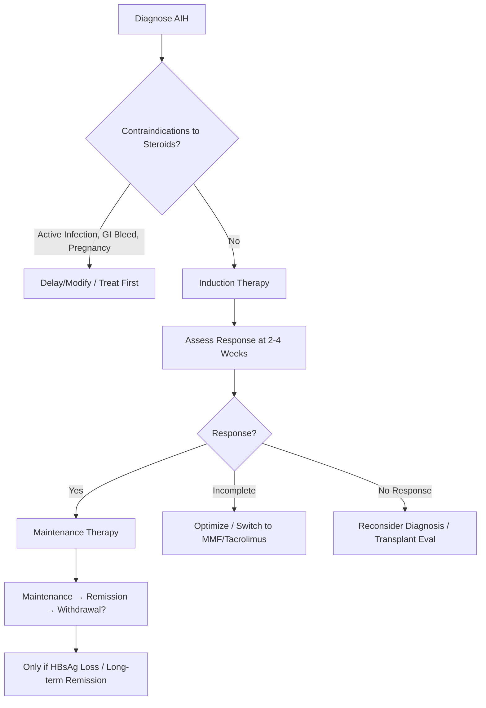
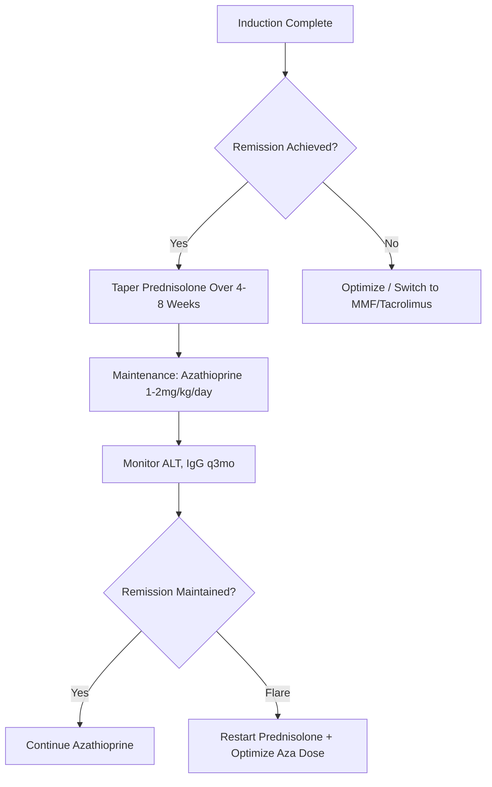

## 1. Learning Objectives
- [ ] Apply induction therapy algorithms (monotherapy vs combination)
- [ ] Manage maintenance therapy and steroid tapering
- [ ] Apply steroid-sparing strategies (azathioprine, MMF, tacrolimus)
- [ ] Determine criteria for treatment withdrawal
- [ ] Identify FCPS/MRCP high-yield management decisions

---

## 2. Treatment Principles

---

## 3. Induction Therapy

### Standard Regimens

| Regimen | Dose | Indication | Duration |
|---------|------|------------|----------|
| **Prednisolone + Azathioprine** | **Pred 30-40mg/day + Aza 1-2mg/kg/day** | **First-Line (Preferred)** | 2-4 Weeks → Taper |
| **Prednisolone Monotherapy** | **40-60mg/day** | Azathioprine Contraindicated/Intolerant | 2-4 Weeks → Taper |
| **Budesonide** | **9mg/day (3mg TDS)** | **Non-Cirrhotic, Mild-Moderate** | 8 Weeks → Taper |

> **FCPS/MRCP**: **Prednisolone 30-40mg + Azathioprine 1-2mg/kg = Gold Standard Induction**

### Budesonide: Niche Indication

| Feature | Detail |
|--------|--------|
| **Dose** | 9mg/day (3mg TDS) |
| **Mechanism** | **High First-Pass Metabolism** (~90%) → Low Systemic Exposure |
| **Indication** | **Non-Cirrhotic AIH**, Mild-Moderate Disease |
| **Contraindications** | **Cirrhosis** (Impaired First-Pass → Systemic Effects), **Porto-Systemic Shunt**, **Severe Disease** |
| **Efficacy** | Similar to Prednisolone in Mild Disease, Fewer SE |

> **FCPS/MRCP**: **Budesonide ONLY for Non-Cirrhotic AIH** — Avoid in Cirrhosis/PHT

---

## 4. Maintenance Therapy

### Standard Approach

### Standard Maintenance Regimen

| Drug | Dose | Target | Monitoring |
|------|------|--------|------------|
| **Azathioprine** | **1-2 mg/kg/day** | Maintain Remission, Allow Steroid Withdrawal | ALT, IgG, FBC, LFTs q3mo; TPMT Pre-Tx |
| **MMF** | 1-1.5g BD | Azathioprine Intolerance/Failure | FBC, LFTs, Renal q3mo |
| **Tacrolimus** | 0.05-0.1 mg/kg/day (Trough 5-10 ng/mL) | Refractory AIH | Trough Levels, Renal, BP, Glucose |

### Azathioprine: Key Details

| Aspect | Detail |
|--------|--------|
| **Dose** | **1-2 mg/kg/day** (Start 50mg, Titrate) |
| **TPMT Testing** | **Before Start** (TPMT Deficient = ↑ Myelosuppression Risk) |
| **Side Effects** | Myelosuppression, Hepatotoxicity, Pancreatitis, Nausea |
| **Drug Interactions** | Allopurinol (↑ 6-MP Toxicity → Reduce Aza Dose to 25%) |
| **In Pregnancy** | **Safe** (Category D but Data Supports Use) |

---

## 5. Steroid Tapering Algorithm

### Standard Taper (After Remission)

| Phase | Prednisolone Dose | Duration |
|-------|-------------------|----------|
| **Induction** | 30-40mg/day | 2-4 Weeks |
| **Taper 1** | Reduce by 10mg every 2 weeks until 20mg | 4-6 Weeks |
| **Taper 2** | Reduce by 5mg every 2 weeks until 10mg | 4-6 Weeks |
| **Taper 3** | Reduce by 2.5mg every 2 weeks until 5mg | 4-6 Weeks |
| **Taper 4** | Reduce by 2.5mg every 2-4 weeks until 0 | 2-3 Months |
| **Total** | **Stop by 6-12 Months** | |

> **Key**: **Taper by 5-10mg decrements**; **Slower if Flare Risk High**

---

## 6. Treatment of Flare / Relapse

| Scenario | Management |
|----------|------------|
| **Minor Flare** (ALT 2-5×ULN) | ↑ Prednisolone to Previous Effective Dose |
| **Major Flare** (ALT >5×ULN, Jaundice) | Restart Induction Dose (Pred 30-40mg + Aza) |
| **Steroid-Dependent** (Flare on Taper) | Optimise Azathioprine + Slow Taper; Consider MMF/Tacrolimus |

---

## 7. Treatment Withdrawal Criteria

| Criteria | Requirement |
|----------|-------------|
| **Clinical Remission** | ≥2-3 Years (Some Guidelines 3-5 Years) |
| **Biochemical Remission** | Normal ALT, IgG, Autoantibodies |
| **Histological Remission** | **Normal/Inactive on Biopsy** (Ideal) |

### Relapse Risk After Withdrawal

| Time Post-Withdrawal | Relapse Rate |
|----------------------|--------------|
| **1 Year** | 30-40% |
| **3 Years** | **50-80%** |
| **5 Years** | >80% |

> **Most Relapse** → **Long-term Low-Dose Maintenance Often Preferred**

---

## 8. Special Situations

### AIH in Pregnancy

| Aspect | Management |
|--------|------------|
| **Active AIH** | **Continuation of Aza + Pred** (Safe) |
| **Remission** | **Continue Maintenance** (Stop Steroids if Possible) |
| **New Diagnosis** | **Pred 30-40mg + Aza 1-2mg/kg** (Safe) |
| **Postpartum Flare Risk** | ↑↑ (Immune Reconstitution) → Close Monitoring |

### AIH with Cirrhosis

| Consideration | Management |

*...continued (truncated for renderer performance)*
---

> Auto-generated study sections for "Autoimmune Liver Disease" — Ch 23: Hepatology.

## Flashcards (26 generated)

- Q: What is the definition of Autoimmune Liver Disease?
  A: | Regimen | Dose | Indication | Duration |
- Q: What is the dose of Autoimmune Liver Disease?
  A: 9mg/day (3mg TDS)
- Q: What is the mechanism of Autoimmune Liver Disease?
  A: High First-Pass Metabolism (~90%) → Low Systemic Exposure
- Q: What is Autoimmune Liver Disease indicated for?
  A: Non-Cirrhotic AIH, Mild-Moderate Disease
- Q: What is Efficacy of Autoimmune Liver Disease?
  A: Similar to Prednisolone in Mild Disease, Fewer SE
- Q: What is the dose of Autoimmune Liver Disease?
  A: 1-2 mg/kg/day (Start 50mg, Titrate)
- Q: What is the investigation of choice for Autoimmune Liver Disease?
  A: Before Start (TPMT Deficient = ↑ Myelosuppression Risk)
- Q: What are the side effects of Autoimmune Liver Disease?
  A: Myelosuppression, Hepatotoxicity, Pancreatitis, Nausea
- Q: What is Drug Interactions of Autoimmune Liver Disease?
  A: Allopurinol (↑ 6-MP Toxicity → Reduce Aza Dose to 25%)
- Q: What is In Pregnancy of Autoimmune Liver Disease?
  A: Safe (Category D but Data Supports Use)
- Q: What is Active AIH of Autoimmune Liver Disease?
  A: Continuation of Aza + Pred (Safe)
- Q: What is Remission of Autoimmune Liver Disease?
  A: Continue Maintenance (Stop Steroids if Possible)
- Q: What is the investigation of choice for Autoimmune Liver Disease?
  A: Pred 30-40mg + Aza 1-2mg/kg (Safe)
- Q: What is Postpartum Flare Risk of Autoimmune Liver Disease?
  A: ↑↑ (Immune Reconstitution) → Close Monitoring
- Q: What is the dose of Autoimmune Liver Disease?
  A: 9mg/day (3mg TDS)
- Q: What is the mechanism of Autoimmune Liver Disease?
  A: High First-Pass Metabolism (~90%) → Low Systemic Exposure
- Q: What is Autoimmune Liver Disease indicated for?
  A: Non-Cirrhotic AIH, Mild-Moderate Disease
- Q: What is Efficacy of Autoimmune Liver Disease?
  A: Similar to Prednisolone in Mild Disease, Fewer SE
- Q: What is the dose of Autoimmune Liver Disease?
  A: 1-2 mg/kg/day (Start 50mg, Titrate)
- Q: What is the investigation of choice for Autoimmune Liver Disease?
  A: Before Start (TPMT Deficient = ↑ Myelosuppression Risk)
- Q: What are the side effects of Autoimmune Liver Disease?
  A: Myelosuppression, Hepatotoxicity, Pancreatitis, Nausea
- Q: What is Drug Interactions of Autoimmune Liver Disease?
  A: Allopurinol (↑ 6-MP Toxicity → Reduce Aza Dose to 25%)
- Q: What is In Pregnancy of Autoimmune Liver Disease?
  A: Safe (Category D but Data Supports Use)
- Q: What is Active AIH of Autoimmune Liver Disease?
  A: Continuation of Aza + Pred (Safe)
- Q: What is Remission of Autoimmune Liver Disease?
  A: Continue Maintenance (Stop Steroids if Possible)
- Q: What is the investigation of choice for Autoimmune Liver Disease?
  A: Pred 30-40mg + Aza 1-2mg/kg (Safe)

## MCQs (1 generated)

1. **Which of the following best describes Autoimmune Liver Disease?**
   A. **| Regimen | Dose | Indication | Duration |**
   B. An unrelated condition not matching the clinical picture of Autoimmune Liver Disease
   C. A complication seen late in the disease course of Autoimmune Liver Disease
   D. A condition that mimics Autoimmune Liver Disease but has a different underlying cause

## SBA Questions (1 generated)

1. A patient with suspected Autoimmune Liver Disease presents with: Dose — 1-2 mg/kg/day (Start 50mg, Titrate); TPMT Testing — Before Start (TPMT Deficient = ↑ Myelosuppression Risk); Side Effects — Myelosuppression, Hepatotoxicity, Pancreatitis, Nausea. What is the most likely diagnosis?
   A. **Autoimmune Liver Disease**
   B. A condition that mimics Autoimmune Liver Disease but is not the same entity
   C. A complication of Autoimmune Liver Disease rather than the primary diagnosis
   D. An unrelated condition in the same clinical category as Autoimmune Liver Disease

