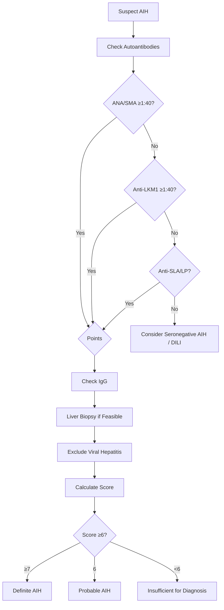
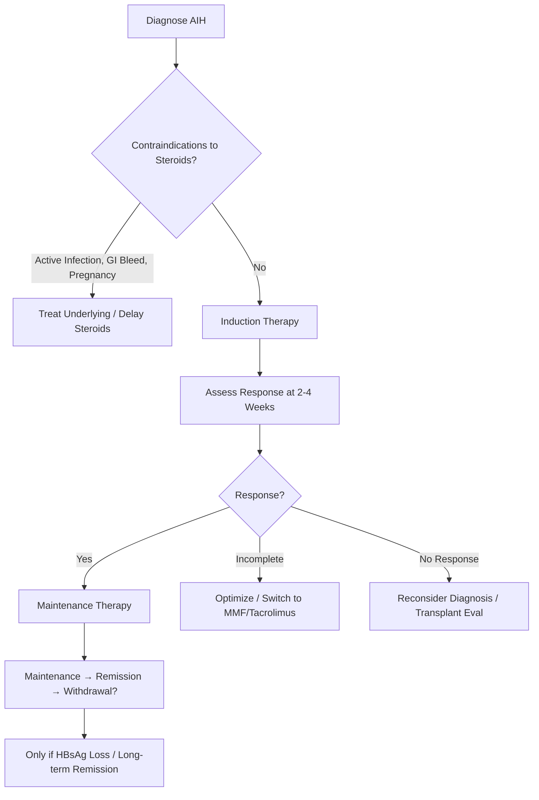

## 1. Learning Objectives
- [ ] Define AIH and classify Types 1, 2, 3
- [ ] Apply IAIHG simplified diagnostic criteria
- [ ] Differentiate AIH from viral hepatitis, DILI, Wilson disease
- [ ] Apply treatment algorithms (induction, maintenance, withdrawal)
- [ ] Identify FCPS/MRCP high-yield features

---

## 2. Definition & Epidemiology

| Feature | AIH |
|---------|-----|
| **Definition** | Chronic inflammatory liver disease with autoimmune pathogenesis |
| **Demographics** | **Women 70-80%**, Age 10-50 (bimodal: young & perimenopausal) |
| **Prevalence** | 10-20/100,000 |
| **Associated Conditions** | Thyroiditis, Coeliac, RA, Sjögren's, Type 1 DM, Ulcerative Colitis |

---

## 3. Classification: Types 1, 2, 3

```mermaid
flowchart TD
    A[AIH] --> B{Type}
    B -->|Type 1 (Classic)| C[ANA ≥1:40 AND/OR SMA ≥1:40]
    B -->|Type 2| D[Anti-LKM1 ≥1:40]
    B -->|Type 3| E[Anti-SLA/LP ≥1:40]
    C --> F[80% of AIH in Europe/NA]
    D --> G[Children/Young Adults; More Severe]
    E --> H[Highly Specific (95%); Often with Type 1]
```

| Type | Autoantibodies | Age | Severity | Steroid Response |
|------|----------------|-----|----------|------------------|
| **Type 1** | **ANA ± SMA** | Any (peak 20-40) | Variable | Good |
| **Type 2** | **Anti-LKM1** | Children/Young Adults | **More Severe** | Less Favourable |
| **Type 3** | **Anti-SLA/LP** | Adults | Severe | Good |

---

## 4. Clinical Presentation

| Feature | Frequency |
|---------|-----------|
| Fatigue | 85% |
| Jaundice | 40-60% |
| Pruritus | 15% |
| Arthralgia | 20% |
| Amenorrhoea | 20% (Women) |
| Acute Liver Failure | 5-10% (Present as ALF) |
| Asymptomatic (Incidental) | 15-20% |

---

## 5. Diagnostic Criteria: IAIHG Simplified (2008)



### Simplified Scoring

| Parameter | Cut-off | Points |
|-----------|---------|--------|
| **ANA or SMA** | ≥1:40 | **1** |
| | ≥1:80 | **2** |
| **Anti-LKM1** | ≥1:40 | **2** |
| **IgG** | >ULN | **1** |
| | >1.1×ULN | **2** |
| **Histology** | Compatible | **1** |
| | Typical | **2** |
| **Exclusion of Viral Hepatitis** | Yes | **2** |

| Total Score | Interpretation |
|-------------|----------------|
| **≥7** | **Definite AIH** |
| **6** | **Probable AIH** |
| **<6** | Insufficient |

> **In ALF/Acute Setting**: Biopsy often unavailable → Rely on Serology + IgG + Exclusion

---

## 6. AIH in Acute Liver Failure (AIH-ALF)

| Feature | AIH-ALF |
|---------|---------|
| **% of Non-PCM ALF** | 5-10% |
| **Demographics** | Women 70%, Age 15-50 |
| **IgG** | **↑↑** (Often >2×ULN) |
| **Autoantibodies** | ANA/SMA ≥1:80, LKM1 ≥1:40 |
| **Ceruloplasmin** | Normal/↑ |
| **Haemolysis** | Absent |
| **Steroid Trial** | **Prednisolone 60mg → Day 7 Lille Assessment** |
| **Response Rate** | 60-80% if Early |
| **Transplant if** | No Response Day 7 / King's College / MELD >25 |

> **AIH-ALF = ONLY Steroid-Responsive ALF** — Early Recognition = Life-Saving

---

## 7. Treatment Algorithm



---

## 8. Treatment

### Induction Therapy

| Regimen | Dose | Indication | Duration |
|---------|------|------------|----------|
| **Prednisolone + Azathioprine** | **Pred 30-40mg/day + Aza 1-2mg/kg/day** | **First-Line (Preferred)** | 2-4 Weeks → Taper |
| **Prednisolone Monotherapy** | **40-60mg/day** | Azathioprine Contraindicated/Intolerant | 2-4 Weeks → Taper |
| **Budesonide** | **9mg/day (3mg TDS)** | **Non-Cirrhotic, Mild-Moderate** | 8 Weeks → Taper |

> **FCPS/MRCP**: **Prednisolone 30-40mg + Azathioprine 1-2mg/kg = Gold Standard Induction**

### Maintenance Therapy


*...continued (truncated for renderer performance)*