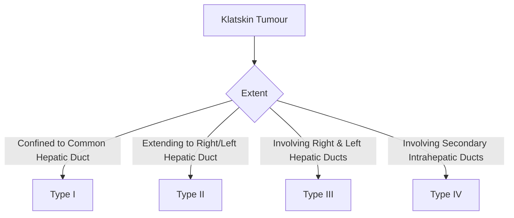

# Biliary Tract Tumours: Cholangiocarcinoma, Gallbladder Cancer, Ampullary Carcinoma

## Learning Objectives
- [ ] Diagnose and stage cholangiocarcinoma (intrahepatic, perihilar, distal)
- [ ] Diagnose and manage gallbladder cancer
- [ ] Diagnose and manage ampullary carcinoma
- [ ] Apply staging systems (Bismuth, TNM) and surgical criteria
- [ ] Identify FCPS/MRCP high-yield tumour markers and management

---

## Cholangiocarcinoma (CCA)

### Classification (Anatomical)

```mermaid
flowchart TD
    A[Cholangiocarcinoma] --> B{Location}
    B -->|Intrahepatic| C[iCCA]
    B -->|Perihilar (Klatskin)| D[pCCA]
    B -->|Distal| E[dCCA]
    C --> F[Second Most Common Primary Liver Cancer]
    D --> G[Most Common CCA (50-60%)]
    E --> H[20-30%]
```

| Type | Location | Incidence | Key Features |
|------|----------|-----------|--------------|
| **Intrahepatic (iCCA)** | Intrahepatic Bile Ducts | 10-20% | Mass-Forming, Peripheral, HCC Mimic |
| **Perihilar (pCCA/Klatskin)** | Biliary Confluence | **50-60%** | **Bismuth Type I-IV**, No GB Dilatation |
| **Distal (dCCA)** | Distal CBD | 20-30% | Similar to Pancreatic Head Cancer |

---

## Perihilar CCA (Klatskin Tumour) - Bismuth Classification



| Type | Description | Resectability |
|------|-------------|---------------|
| **Type I** | Below Confluence | **Resectable** (Hepatectomy + CBD Excision) |
| **Type II** | Reaching Confluence | **Resectable** (Hepatectomy + Reconstruction) |
| **Type IIIa/IIIb** | Right/Left Hepatic Duct Involvement | **Borderline** (Extended Hepatectomy) |
| **Type IV** | Bilateral Secondary Ducts | **Unresectable** (Palliative) |

> **Key**: **No GB Dilatation** (Obstruction Above Cystic Duct)

---

## Distal CCA vs Pancreatic Head Cancer

| Feature | Distal CCA | Pancreatic Head Adenocarcinoma |
|---------|------------|-------------------------------|
| **Location** | Distal CBD | Pancreas Head |
| **Double Duct Sign** | CBD + Pancreatic Duct Dilatation | **CBD + Pancreatic Duct Dilatation** |
| **CA19-9** | ↑ | ↑ |
| **Surgery** | Pancreaticoduodenectomy (Whipple) | Pancreaticoduodenectomy (Whipple) |
| **Prognosis** | Slightly Better | Poorer |

> **Differentiation Often Requires Surgery** — Similar Presentation, Similar Management

---

## Cholangiocarcinoma Diagnosis

### Staging (TNM 8th Edition - AJCC)

| Stage | T | N | M | Treatment |
|-------|---|---|---|-----------|
| **I** | T1 | N0 | M0 | Surgery |
| **II** | T2a/T2b | N0 | M0 | Surgery |
| **IIIA** | T3 | N0 | M0 | Surgery (Selected) |
| **IIIB** | T4 | N0 | M0 | Unresectable |
| **IIIC** | Any T | N1 | M0 | Unresectable |
| **IV** | Any T | Any N | M1 | Palliative |

> **CA19-9**: Elevated (Not Specific); **CEA**: Supportive

---

## Cholangiocarcinoma Diagnosis & Staging

```mermaid
flowchart TD
    A[Suspect CCA: Jaundice, Weight Loss, ↑ALP/CA19-9] --> B[Imaging]
    B --> C{MRCP/CT}
    C --> D{Mass/Stricture Location}
    D -->|Intrahepatic| E[Liver MRI + CA19-9]
    D -->|Perihilar| F[MRCP + CA19-9 → Bismuth Type]
    D -->|Distal| G[CT + MRCP]
    C --> H[Tissue Diagnosis?]
    H -->|Resectable| I[Surgery Without Biopsy (If High Suspicion)]
    H -->|Unresectable| J[ERCP Brushing + Biopsy / EUS-FNA]
    J --> K[FISH for Higher Sensitivity]
```

### Tumour Markers

| Marker | Sensitivity | Specificity | Use |
|--------|-------------|-------------|-----|
| **CA19-9** | 70-80% | 80-90% | Diagnosis, Monitoring, Prognosis |
| **CEA** | 40-50% | 80-90% | Adjunct |
| **CA125** | Low | Low | Adjunct |

> **CA19-9 >100 U/mL + Obstructive Jaundice = High Probability CCA**

---

## Gallbladder Cancer (GBC)

### Epidemiology & Risk Factors

| Feature | Detail |
|--------|--------|
| **Incidence** | Rare (1-2/100,000); High in Chile, Bolivia, India, Native Americans |
| **Sex** | **Women > Men** (2-3:1) |
| **Age** | **>65 Years** |
| **Risk Factors** | **Gallstones (80-90%)**, **Porcelain GB**, Chronic Typhoid Carrier, Anomalous Pancreaticobiliary Junction |

### Staging (TNM)

| Stage | T | Treatment |
|-------|---|-----------|
| **T1a** | Lamina Propria | **Cholecystectomy Alone** |
| **T1b** | Muscularis | **Extended Cholecystectomy** (Liver Bed + Nodes) |
| **T2** | Perimuscular Connective Tissue | **Radical Resection** (Liver Bed + Lymphadenectomy) |
| **T3** | Liver/Adjacent Organs | **Extended Resection** (If Resectable) |
| **T4** | Major Vessels/≥2 Organs | **Unresectable** |

### Management

| Stage | Management |
|-------|------------|
| **T1a** | **Simple Cholecystectomy** (If Incidental) |
| **T1b-T2** | **Extended Cholecystectomy** (Liver Resection + Lymphadenectomy) |
| **T3-T4** | **Neoadjuvant → Surgery** (If Resectable) / Chemo (Gemcitabine/Cisplatin) |
| **Unresectable** | **Palliative Chemo** (Gem/Cis) + Biliary Stenting (SEMS) |

---

## Ampullary Carcinoma

### Clinical Features

| Feature | Detail |
|---------|--------|
| **Presentation** | **Intermittent Jaundice** (Tumour Bleeds → Temporary Relief) |
| **Endoscopy** | **Visible Polypoid/Mass at Ampulla** |
| **Biopsy** | **Easily Accessible** (Diagnostic Yield >90%) |
| **Associated** | Familial Adenomatous Polyposis (FAP), Lynch Syndrome |

### Staging & Management

| Stage | Treatment |
|-------|-----------|
| **T1 (Mucosa/Submucosa)** | **Endoscopic Ampullectomy** (If <2cm, No Node Risk) |
| **T2-T3** | **Pancreaticoduodenectomy (Whipple)** |
| **T4/Metastatic** | **Palliative Chemo** (Gem/Cis) + Biliary Stenting |

> **Best Prognosis** Among Periampullary Cancers (5-Yr Survival 50-60% for T1-T2)

---

## Diagnostic Workup for Biliary Tumours

```mermaid
flowchart TD
    A[Suspect Biliary Tumour: Jaundice, Weight Loss, ↑CA19-9] --> B[US: Dilated Ducts, Mass]
    B --> C[CT Chest/Abdomen/Pelvis: Staging]
    C --> D{Lesion Localisation}
    D -->|Intrahepatic| E[Liver MRI + CA19-9]
    D -->|Perihilar| F[MRCP (Bismuth Type) + CA19-9]
    D -->|Distal/Ampullary| G[CT + MRCP + Endoscopy]
    C --> H{Resectable?}
    H -->|Yes| I[Surgery: Hepatectomy / Whipple / Extended Cholecystectomy]
    H -->|No| J[Palliative: SEMS Stent + Gem/Cis Chemo]
```

---

## FCPS/MRCP High-Yield Summary

| Tumour | Key Features | Diagnosis | Treatment |
|--------|--------------|-----------|-----------|
| **iCCA** | Intrahepatic Mass, HCC Mimic | MRI, CA19-9 | Hepatectomy if Resectable |
| **pCCA (Klatskin)** | Hilum, **Bismuth I-IV**, No GB Dilatation | MRCP, CA19-9 | Hepatectomy + Reconstruction (I-III) |
| **dCCA** | Distal CBD, Double Duct Sign | CT, MRCP | Whipple |
| **GBC** | GB Fossa, Porcelain GB, Women | US, CT | T1a: Chole; T1b+: Extended + Nodes |
| **Ampullary** | **Intermittent Jaundice**, Visible on Endoscopy | Endoscopy + Biopsy | T1: Endoscopic Ampullectomy; T2+: Whipple |

---

## FCPS/MRCP High-Yield Summary

| Tumour | Key Feature | Key Diagnostic | Key Surgical |
|--------|-------------|----------------|--------------|
| **iCCA** | Intrahepatic Mass | MRI + CA19-9 | Hepatectomy |
| **pCCA (Klatskin)** | **Bismuth I-IV**, No GB Dilatation | MRCP, CA19-9 | Hepatectomy + Reconstruction |
| **dCCA** | Distal CBD, Double Duct | CT, MRCP | Whipple |
| **GBC** | Porcelain GB, Women, Stones | US, CT | T1a: Chole; T1b+: Extended + Nodes |
| **Ampullary** | **Intermittent Jaundice**, Visible on Endoscopy | Endoscopic Biopsy | T1: Ampullectomy; T2+: Whipple |

---

## Viva Questions

1. **Classify cholangiocarcinoma by anatomical location.**
2. **What is the Bismuth classification for Klatskin tumours?**
3. **Differentiate distal CCA from pancreatic head cancer.**
3. **What is the management of T1a gallbladder cancer?**
4. **How does ampullary carcinoma present?**
4. **What is the double duct sign?**
5. **What is the role of CA19-9 in biliary tumours?**
5. **Differentiate iCCA from HCC.**
6. **What is the surgical management of T1b/T2 GBC?**
6. **What is the prognosis of ampullary carcinoma vs other biliary tumours?**
7. **What is the role of neoadjuvant therapy in biliary cancers?**

---

## Confusions & Mnemonics

| Confusion | Clarification |
|-----------|---------------|
| iCCA vs HCC | iCCA: Peripheral, No Cirrhosis, CA19-9↑; HCC: Cirrhosis, AFP↑, Arterial Enhancement |
| pCCA vs dCCA | pCCA: Confluence, Bismuth, No GB Dilatation; dCCA: Distal, Double Duct Sign |
| Klatskin Bismuth | I: CHD; II: Confluence; III: R/L Hepatic; IV: Secondary Ducts |
| GBC T1a vs T1b | T1a: Lamina Propria → Cholecystectomy; T1b: Muscularis → Extended + Nodes |
| Ampullary vs Distal CCA | Ampullary: **Intermittent Jaundice**, Endoscopically Visible; Distal: Constant Jaundice |
| Double Duct Sign | Dilated CBD + Dilated Pancreatic Duct = Periampullary Cancer (Pancreas/dCCA/Ampullary) |
| CCA vs HCC Markers | CCA: CA19-9↑, AFP Normal; HCC: AFP↑, CA19-9 Normal/Low |

---

## Mind Map

```mermaid
mindmap
  root((Biliary Tract Tumours))
    Cholangiocarcinoma
      iCCA: Intrahepatic Mass
      pCCA (Klatskin): Bismuth I-IV, No GB Dilatation
      dCCA: Distal CBD, Double Duct Sign
      CA19-9, CEA
      Surgery: Hepatectomy / Whipple
    Gallbladder Cancer
      Porcelain GB, Women, Stones
      T1a: Cholecystectomy
      T1b+: Extended + Nodes
      T2+: Neoadjuvant → Surgery
    Ampullary Carcinoma
      Intermittent Jaundice
      Endoscopic Visible
      Ampullectomy (T1) / Whipple (T2+)
    Diagnosis
      CA19-9, CEA
      MRCP (Bismuth)
      CT Chest/Abd/Pelvis
      EUS-FNA if Unresectable
```

---

## One-Page Revision Card

| **Tumour** | **Key Feature** | **Diagnosis** | **Surgery** |
|------------|-----------------|---------------|-------------|
| **iCCA** | Intrahepatic Mass | MRI + CA19-9 | Hepatectomy |
| **pCCA (Klatskin)** | **Bismuth I-IV**, No GB Dilatation | MRCP, CA19-9 | Hepatectomy + Reconstruction |
| **dCCA** | Distal CBD, Double Duct | CT, MRCP | Whipple |
| **GBC** | **Porcelain GB**, Women | US, CT | T1a: Chole; T1b+: Extended + Nodes |
| **Ampullary** | **Intermittent Jaundice**, Visible | Endoscopy + Biopsy | T1: Ampullectomy; T2+: Whipple |

| **Key Markers** | |
|-----------------|--|
| **CA19-9** | 70-80% Sensitivity for Biliary Tumours |
| **CEA** | Adjunct |
| **AFP** | HCC, Not CCA |

| **Bismuth Classification** | |
|---------------------------|--|
| I | Common Hepatic Duct |
| II | Confluence |
| IIIa/IIIb | Right/Left Hepatic Duct |
| IV | Secondary Intrahepatic Ducts |

---

## Spaced Repetition Tracker

| Day | 1 | 3 | 7 | 15 | 30 |
|-----|---|---|---|----|----|
| CCA Classification | ☐ | ☐ | ☐ | ☐ | ☐ |
| Bismuth Types | ☐ | ☐ | ☐ | ☐ | ☐ |
| GBC Staging | ☐ | ☐ | ☐ | ☐ | ☐ |
| Ampullary Presentation | ☐ | ☐ | ☐ | ☐ | ☐ |
| CA19-9 Utility | ☐ | ☐ | ☐ | ☐ | ☐ |

---

## Self-Test Scorecard

| Question | My Answer | Correct? |
|----------|-----------|----------|
| CCA Types |  |  |
| Bismuth Classification |  |  |
| GBC T1a vs T1b |  |  |
| Ampullary Key Feature |  |  |
| Double Duct Sign |  |  |

---

## Local Navigation

- [[Biliary Tract Disease/Biliary strictures|Biliary Strictures]]
- [[Biliary Tract Disease/Choledocholithiasis|Choledocholithiasis]]
- [[Autoimmune Liver Disease/Primary sclerosing cholangitis (PSC) Detailed|PSC]]
- [[Liver Tumours/HCC (Hepatocellular Carcinoma)|HCC]]
- [[Liver Transplantation/Liver Transplantation|Liver Transplant]]