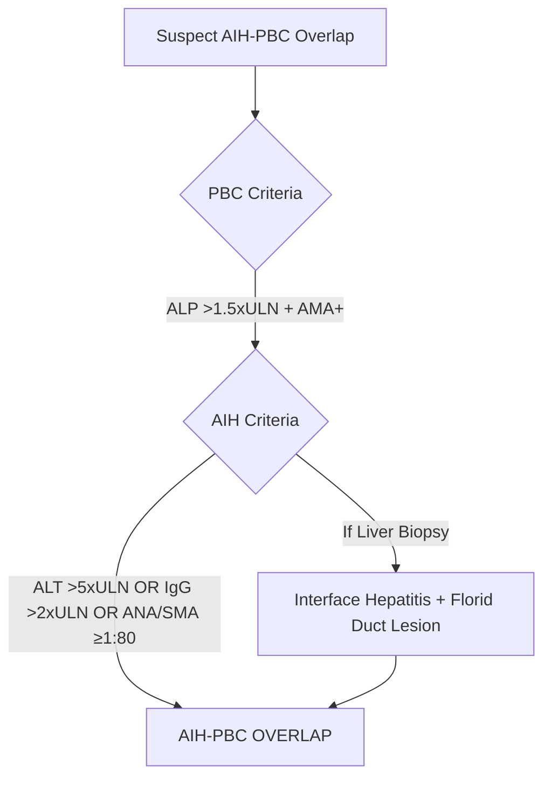
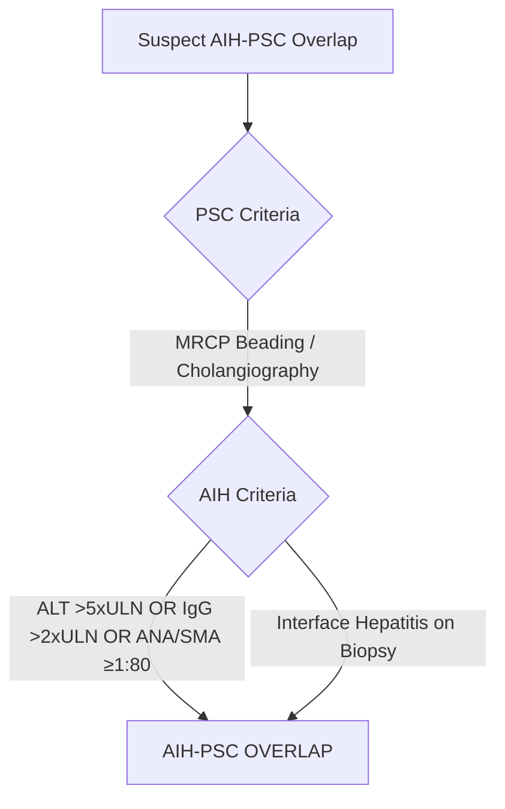
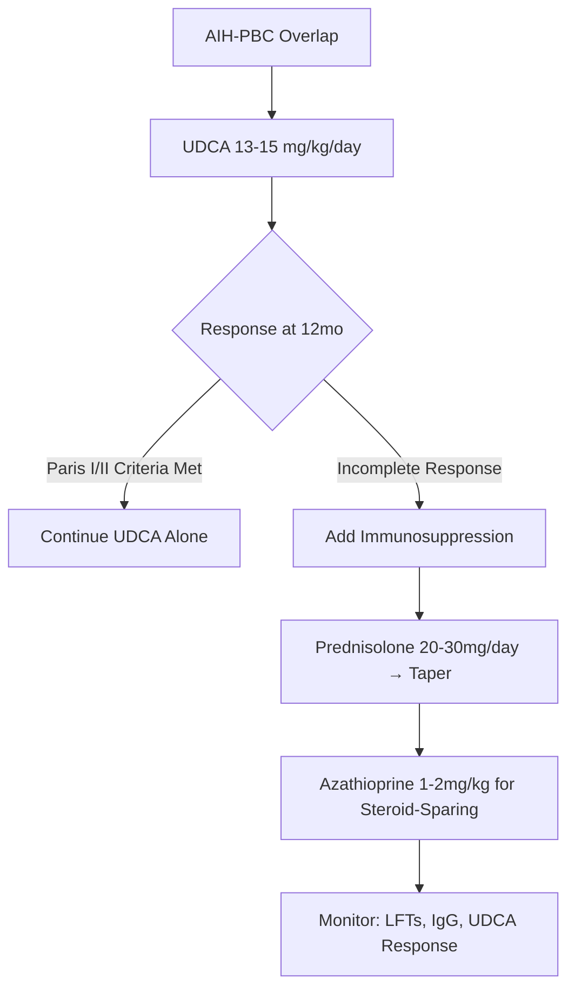
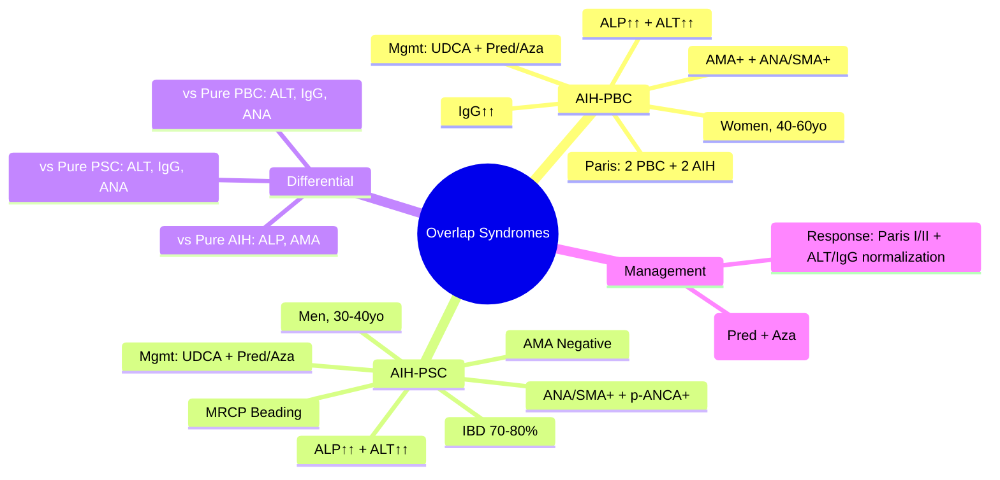

## 1. Learning Objectives
- [ ] Apply diagnostic criteria for AIH-PBC and AIH-PSC overlap
- [ ] Differentiate from pure AIH, PBC, or PSC
- [ ] Apply management algorithms (UDCA + Immunosuppression)
- [ ] Know prognosis and transplant indications
- [ ] Identify FCPS/MRCP high-yield diagnostic criteria

---

## 2. Definition

> **Overlap Syndrome** = Features of **two autoimmune liver diseases** simultaneously (usually AIH + PBC or AIH + PSC)

| Overlap | Components | Prevalence |
|---------|------------|------------|
| **AIH-PBC** | Autoimmune Hepatitis + Primary Biliary Cholangitis | 5-10% of PBC |
| **AIH-PSC** | Autoimmune Hepatitis + Primary Sclerosing Cholangitis | 5-10% of PSC |

---

## 3. AIH-PBC Overlap

### Diagnostic Criteria (Paris Criteria)



**Paris Criteria (At least 2 of each):**

| PBC Criteria (Need 2) | AIH Criteria (Need 2) |
|-----------------------|----------------------|
| ALP >1.5×ULN **OR** GGT >5×ULN | ALT >5×ULN |
| AMA **≥1:40** | IgG >2×ULN **OR** ANA/SMA ≥1:80 |
| **Florid Duct Lesion** on biopsy | **Interface Hepatitis** on biopsy |

> **FCPS/MRCP**: **Paris Criteria = 2 PBC + 2 AIH features = AIH-PBC Overlap**

### Clinical Presentation
| Feature | Typical |
|---------|---------|
| **Demographics** | Women 90%, Age 40-60 |
| **Symptoms** | Fatigue, Pruritus, Jaundice |
| **LFTs** | **Cholestatic + Hepatocellular** (ALP↑↑ + ALT↑↑) |
| **Autoantibodies** | AMA+ (95%), ANA/SMA+ (80%) |
| **IgG** | **Elevated** (>2×ULN) |

---

## 4. AIH-PSC Overlap

### Diagnostic Criteria



**Simplified Criteria:**
- **PSC Features**: Cholestatic LFTs + MRCP Beading (or ERCP) + IBD Association
- **AIH Features**: **ALT >5×ULN** or **IgG >2×ULN** or **ANA/SMA ≥1:80** (+/- Interface Hepatitis)

### Clinical Presentation
| Feature | Typical |
|---------|---------|
| **Demographics** | Men 60%, Age 30-40 (unlike pure PSC) |
| **IBD Association** | 70-80% (UC > Crohn's) |
| **LFTs** | Mixed (ALP↑↑ + ALT↑↑) |
| **Autoantibodies** | ANA/SMA+ (60-80%), p-ANCA+ (65%), **AMA Negative** |
| **IgG** | Elevated |

---

## 5. Differentiation: Pure vs Overlap

| Feature | AIH-PBC Overlap | Pure PBC | Pure AIH |
|---------|-----------------|----------|----------|
| **ALP** | ↑↑ | ↑↑ | Normal/Mild ↑ |
| **ALT** | ↑↑ | Normal/Mild ↑ | ↑↑↑ |
| **AMA** | + | + | - |
| **ANA/SMA** | + | ± | + |
| **IgG** | ↑↑ | Normal | ↑↑↑ |
| **Biopsy** | Florid Duct + Interface Hepatitis | Florid Duct Only | Interface Hepatitis Only |

| Feature | AIH-PSC Overlap | Pure PSC | Pure AIH |
|---------|-----------------|----------|----------|
| **MRCP** | Beading | Beading | Normal |
| **ALT** | ↑↑ | Normal/Mild ↑ | ↑↑↑ |
| **AMA** | - | - | - |
| **p-ANCA** | + | + | ± |
| **IBD** | 70-80% | 70-80% | Rare |
| **Biopsy** | Interface Hepatitis + Duct Changes | Onion-Skin Fibrosis | Interface Hepatitis |

---

## 6. Management

### AIH-PBC Overlap


### AIH-PSC Overlap
```mermaid
flowchart TD
    A[AIH-PSC Overlap] --> B[UDCA 13-15 mg/kg/day (Optional)]
    B --> C[Immunosuppression for AIH Component]
    C --> D[Prednisolone 30-40mg/day → Taper]
    D --> E[Azathioprine 1-2mg/kg]
    E --> F[Monitor: LFTs, IgG, MRCP for Strictures]
    F --> G[Treat Dominant Strictures: Balloon Dilatation]
```

> **Key Principle**: **Treat BOTH components** — UDCA for cholestatic + Immunosuppression for hepatocellular

---

## 7. Response Criteria (AIH-PBC)

| Criteria | Definition |
|----------|------------|
| **Paris I** | ALP ≤3×ULN + AST ≤2×ULN + Bilirubin ≤1 mg/dL at 12mo |
| **Paris II** | ALP ≤1.5×ULN + AST ≤1.5×ULN + Bilirubin Normal at 12mo |
| **Toronto** | ALP ≤1.67×ULN at 2y |
| **AIH Remission** | Normal ALT + Normal IgG + No Interface Hepatitis (if biopsy) |

---

## 8. Prognosis & Transplant

| Outcome | AIH-PBC Overlap | AIH-PSC Overlap |
|---------|-----------------|-----------------|
| **Response to UDCA+NUC** | 80-90% | 70-80% |
| **Liver Transplant** | Indicated if decompensation | Indicated if decompensation / CCA |
| **Recurrence Post-Tx** | 20-30% | 20-30% (AIH) + PSC Recurrence |
| **CCA Risk** | Low | **High** (10-20% lifetime) |

---

## 9. FCPS/MRCP High-Yield Summary

| Concept | Key Points |
|---------|------------|
| **AIH-PBC** | Women, AMA+, ALP↑↑+ALT↑↑, ANA/SMA+, IgG↑; **Paris: 2 PBC + 2 AIH** |
| **AIH-PSC** | Men, IBD, MRCP Beading, ALP↑↑+ALT↑↑, ANA/SMA+, p-ANCA+, AMA- |
| **Management** | **UDCA + Immunosuppression** (Pred + Aza) for both |
| **Response** | Paris I/II for PBC component; ALT/IgG normalization for AIH |
| **Biopsy** | Florid Duct + Interface Hepatitis (AIH-PBC); Duct + Interface (AIH-PSC) |
| **Transplant** | Decompensation / CCA (PSC) |

---

## 10. Viva Questions

1. **What are the Paris criteria for AIH-PBC overlap?**
2. **How do you differentiate AIH-PBC overlap from pure PBC and pure AIH?**
3. **What is the management of AIH-PBC overlap?**
4. **What are the diagnostic criteria for AIH-PSC overlap?**
5. **How does AIH-PSC overlap differ from pure PSC?**
5. **What is the role of UDCA in overlap syndromes?**
6. **What immunosuppression is used?**
7. **What are the response criteria for AIH-PBC overlap?**
8. **Prognosis of AIH-PSC overlap vs pure PSC?**
9. **Does AIH-PSC overlap increase CCA risk?**
10. **What is the Paris criteria for AIH-PBC?**

---

## 11. Confusions & Mnemonics

| Confusion | Clarification |
|-----------|---------------|
| AIH-PBC vs Pure PBC | Overlap: ALT↑↑, IgG↑↑, ANA/SMA+; Pure PBC: ALT normal, IgG normal |
| AIH-PSC vs Pure PSC | Overlap: ALT↑↑, IgG↑↑, ANA/SMA+; Pure PSC: ALT normal, ANA/SMA- |
| Paris Criteria | Need **2 PBC features (ALP/AMA/Biopsy) + 2 AIH features (ALT/IgG/ANA/Biopsy)** |
| UDCA in Overlap | **Always used** (for cholestatic component) + Immunosuppression (for AIH) |
| AIH-PSC and IBD | **70-80% have IBD** (like pure PSC) — doesn't distinguish |
| AMA in AIH-PSC | **Negative** (unlike AIH-PBC) |
| p-ANCA | + in both PSC and AIH-PSC (not specific) |

---

## 12. Mind Map



---

## 13. One-Page Revision Card

| **Feature** | **AIH-PBC Overlap** | **AIH-PSC Overlap** |
|-------------|---------------------|---------------------|
| **Demographics** | Women 90%, 40-60 | Men 60%, 30-40 |
| **ALP** | ↑↑ | ↑↑ |
| **ALT** | ↑↑ | ↑↑ |
| **AMA** | **+** | **-** |
| **ANA/SMA** | **+** | **+** |
| **p-ANCA** | Variable | **+** |
| **IgG** | ↑↑ | ↑↑ |
| **IBD** | Rare | 70-80% |
| **Biopsy** | Florid Duct + Interface Hepatitis | Duct Changes + Interface Hepatitis |

| **Paris Criteria (AIH-PBC)** | |
|-------------------------------|--|
| **PBC (Need 2)** | ALP>1.5xULN, AMA+, Florid Duct Lesion |
| **AIH (Need 2)** | ALT>5xULN, IgG>2xULN, ANA/SMA≥1:80, Interface Hepatitis |

| **Management** | |
|----------------|--|
| **UDCA** | 13-15 mg/kg/day (Always) |
| **Immunosuppression** | Prednisolone 20-40mg → Taper + Azathioprine 1-2mg/kg |

---

## 14. Spaced Repetition Tracker

| Day | 1 | 3 | 7 | 15 | 30 |
|-----|---|---|---|----|----|
| Paris Criteria (2+2) | ☐ | ☐ | ☐ | ☐ | ☐ |
| AIH-PBC vs Pure PBC vs Pure AIH | ☐ | ☐ | ☐ | ☐ | ☐ |
| AIH-PSC vs Pure PSC vs Pure AIH | ☐ | ☐ | ☐ | ☐ | ☐ |
| Management (UDCA + NUC) | ☐ | ☐ | ☐ | ☐ | ☐ |
| Response Criteria | ☐ | ☐ | ☐ | ☐ | ☐ |

---

## 15. Self-Test Scorecard

| Question | My Answer | Correct? |
|----------|-----------|----------|
| Paris Criteria 2+2 |  |  |
| AIH-PBC vs Pure PBC |  |  |
| AIH-PSC vs Pure PSC |  |  |
| AMA in AIH-PSC |  |  |
| Management overlap |  |  |

---

## 16. Local Navigation

- [[Autoimmune Liver Disease/Autoimmune hepatitis (AIH)|AIH]]
- [[Autoimmune Liver Disease/PBC (Primary Biliary Cholangitis)|PBC]]
- [[Autoimmune Liver Disease/Primary sclerosing cholangitis (PSC)|PSC]]
- [[Autoimmune Liver Disease/AIH diagnostic criteria (IAIHG simplified)|AIH Criteria]]
- [[Autoimmune Liver Disease/IgG4-related sclerosing cholangitis|IgG4-SC]]