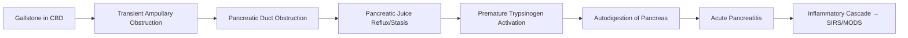

# Gallstone Pancreatitis

## Learning Objectives
- [ ] Apply Revised Atlanta Classification 2012 for severity grading
- [ ] Determine ERCP timing based on severity and cholangitis
- [ ] Apply cholecystectomy timing guidelines (Same Admission vs Interval)
- [ ] Manage complications (Necrosis, Pseudocyst, Infected Necrosis)
- [ ] Identify FCPS/MRCP high-yield management algorithms

---

## Pathophysiology



> **Mechanism**: **Transient Stone Impaction at Ampulla** → Pancreatic Duct Obstruction → Reflux/Pressure → Trypsin Activation

---

## Clinical Presentation

| Feature | Gallstone Pancreatitis |
|---------|---------------------|
| **Pain** | **Epigastric**, Radiates to **Back**, Constant, Severe |
| **Nausea/Vomiting** | **Prominent** (≥90%) |
| **Fever** | Low-Grade Initially; High Fever = Infection |
| **Jaundice** | **May Be Present** (Transient CBD Obstruction) |
| **Murphy's Sign** | Often Positive (Associated Cholecystitis) |
| **Cullen's/Grey-Turner's Sign** | Severe Necrosis (Retroperitoneal Haemorrhage) |

---

## Revised Atlanta Classification 2012 (Severity Grading)

| Severity | Criteria | Mortality |
|----------|----------|-----------|
| **Mild** | **No** Organ Failure, **No** Local Complications | <1% |
| **Moderately Severe** | **Transient** Organ Failure (<48h) **OR** Local Complications (Pseudocyst, Necrosis) | 1-5% |
| **Severe** | **Persistent** Organ Failure (>48h) (>1 System) | 15-30% |

### Organ Failure Definition (Modified Marshall Score)
| System | Variable | Failure Threshold |
|--------|----------|-------------------|
| **Respiratory** | PaO₂/FiO₂ | **<300** |
| **Cardiovascular** | Systolic BP / Vasopressors | **SBP <90** OR **Vasopressors Required** |
| **Renal** | Creatinine | **>177 μmol/L (2 mg/dL)** |

> **ACUTE PANCREATITIS DIAGNOSIS**: **2 of 3**: (1) Characteristic Pain, (2) Lipase/Amylase >3×ULN, (3) Imaging Findings

---

## Severity Assessment Tools

| Tool | Use | Cut-offs |
|------|-----|----------|
| **CT Severity Index (CTSI)** | Day 3-5 (Peak Inflammation) | **0-3 Mild, 4-6 Moderate, 7-10 Severe** |
| **BISAP Score** | Admission (0-5 Points) | **0-1 Low Risk, 2-3 Moderate, 4-5 High Risk** |
| **Ranson's Criteria** | Admission + 48h (11 Criteria) | ≥3 = Severe |
| **APACHE II** | ICU Admission | ≥8 = Severe |

### BISAP Score (0-5 Points)
| Component | Point if Present |
|-----------|------------------|
| **B**UN >25 mg/dL | 1 |
| **I**mpaired Mental Status (GCS<15) | 1 |
| **S**ystolic BP <90 mmHg | 1 |
| **A**ge >60 years | 1 |
| **P**leural Effusion (Imaging) | 1 |

| BISAP Score | Mortality Risk |
|-------------|----------------|
| 0-1 | <1% |
| 2-3 | 2-10% |
| 4-5 | 15-25% |

---

## ERCP Timing in Gallstone Pancreatitis

```mermaid
flowchart TD
    A[Gallstone Pancreatitis] --> B{Concurrent Cholangitis?}
    B -->|Yes| C[URGENT ERCP <24h (Grade II) / <12h (Grade III)]
    B -->|No| D{Severity}
    D -->|Mild| E[Conservative; No Routine ERCP]
    D -->|Moderately Severe| F[Prediction of Severe?]
    F -->|Yes (BISAP≥3, CTSI≥4, Ranson≥3)| G[EARLY ERCP <48-72h]
    F -->|No| E
    D -->|Severe| H[Resuscitate, ICU, Monitor; ERCP if Cholangitis/Sepsis]
    E --> I[Same Admission Cholecystectomy]
    G --> I
    C --> I
    I --> J[Cholecystectomy Same Admission (Preferably)]
```

### ERCP Timing Summary
| Scenario | ERCP Timing |
|----------|-------------|
| **With Cholangitis** | **Urgent <24h (Grade II) / <12h (Grade III)** |
| **Severe Predicted** (BISAP≥3, CTSI≥4, Ranson≥3) | **Early ERCP <48-72h** |
| **Mild** | **No Routine ERCP** (Conservative) |
| **Moderately Severe (No Cholangitis)** | **Early ERCP <48-72h** if Prediction of Severe |

---

## Cholecystectomy Timing

| Setting | Timing | Evidence |
|---------|--------|----------|
| **Mild Gallstone Pancreatitis** | **Same Admission** (Once Resolving) | ↓ Readmission, ↓ Recurrent Biliary Events |
| **Moderately Severe** | **Same Admission** (If Fit & Resolving) | Same as Mild |
| **Severe** | **Delayed (6-12 weeks)** | After Recovery, Nutritional Optimisation |
| **Post-Necrosectomy** | **Delayed (6-12 weeks)** | After Full Recovery |

> **Guideline Consensus**: **Same-Admission Cholecystectomy** for Mild/Moderately Severe; **Delayed** for Severe

---

## Local Complications (Imaging-Based)

| Complication | Timing | Definition (CT) | Management |
|-------------|--------|-----------------|------------|
| **Acute Peripancreatic Fluid Collection (APFC)** | <4 Weeks | Homogeneous, No Capsule | Conservative; Usually Resolves |
| **Pancreatic Pseudocyst** | >4 Weeks | Encapsulated, Fluid-Rich | **Drain if Symptomatic/Infected** (Endo/US-Guided) |
| **Acute Necrotic Collection (ANC)** | <4 Weeks | Heterogeneous, Non-Encapsulated | Conservative; Monitor for Infection |
| **Walled-Off Necrosis (WON)** | >4 Weeks | Encapsulated, Fluid + Necrotic Debris | **Drain if Infected/Symptomatic** (Endo/Percutaneous) |

---

## Infected Necrosis Management

```mermaid
flowchart TD
    A[Suspect Infected Necrosis] --> B[FNA for Culture (Optional) / Clinical Diagnosis]
    B --> C[Antibiotics: Carbapenem (Meropenem) OR Pip-Taz]
    C --> D{Clinical Deterioration?}
    D -->|Yes| E[Step-Up Approach: Endoscopic Drainage → Percutaneous → Surgical]
    D -->|No| F[Continue Antibiotics, Monitor]
    E --> G[Endoscopic Transmural Drainage (LAMS/Stent)]
    G --> H{Improvement?}
    H -->|No| I[Percutaneous Drainage / VARD / Surgery]
    H -->|Yes| J[Monitor, Remove Stents 4-6w]
```

---

## Cholecystectomy Timing

| Severity | Timing | Rationale |
|----------|--------|-----------|
| **Mild / Moderately Severe** | **Same Admission** (Once Resolving, Amylase/Lipas Normalising) | ↓ Recurrent Biliary Events (30-50% if Delayed) |
| **Severe** | **Delayed (6-12 weeks)** | After Full Recovery, Nutritional Repletion |
| **Post-Drainage (WON/Pseudocyst)** | **6-12 weeks Post-Drainage** | After Resolution |

> **Guideline**: **Same-Admission Cholecystectomy** for Mild/Moderately Severe — **NICE/ASGE/APA/ESGE**

---

## FCPS/MRCP High-Yield Summary

| Concept | Key Points |
|---------|------------|
| **Atlanta Classification** | Mild (No OF/Comp), Mod-Severe (Transient OF/Local Comp), Severe (Persistent OF>48h) |
| **BISAP Score** | BUN>25, Impaired Mental Status, SBP<90, Age>60, Pleural Effusion (0-5) |
| **CTSI** | Day 3-5; 0-3 Mild, 4-6 Mod, 7-10 Severe |
| **ERCP Timing** | Cholangitis: <24h/12h; Severe Predicted: <48-72h; Mild: No Routine ERCP |
| **Cholecystectomy** | **Same Admission** (Mild/Mod-Severe); **Delayed 6-12w** (Severe) |
| **Local Complications** | APFC (<4w, No Capsule), Pseudocyst (>4w, Capsule), ANC (<4w), WON (>4w, Capsule) |
| **Infected Necrosis** | Step-Up: Endo → Percutaneous → Surgery; Antibiotics (Carbapenem/Pip-Taz) |
| **Antibiotics** | No Prophylaxis in Mild; Carbapenem/Pip-Taz for Infected Necrosis |

---

## Viva Questions

1. **What is the Revised Atlanta Classification for acute pancreatitis severity?**
2. **What is BISAP score? Components?**
3. **When do you do ERCP in gallstone pancreatitis?**
3. **When do you do cholecystectomy for mild vs severe pancreatitis?**
4. **What is the step-up approach for infected necrosis?**
4. **Differentiate APFC, Pseudocyst, ANC, WON.**
5. **What is the role of prophylactic antibiotics in pancreatitis?**
6. **What is CTSI?**
7. **What is the difference between acute necrotic collection and walled-off necrosis?**
8. **When is ERCP indicated in gallstone pancreatitis without cholangitis?**
9. **What is the Atlanta Classification mortality by severity?**
10. **What is the step-up approach for infected necrosis?**

---

## Confusions & Mnemonics

| Confusion | Clarification |
|-----------|---------------|
| Mild vs Mod-Severe vs Severe | Mild: No OF, No Comp; Mod-Severe: Transient OF OR Local Comp; Severe: Persistent OF >48h |
| Transient vs Persistent OF | **Transient <48h** = Mod-Severe; **Persistent >48h** = Severe |
| APFC vs Pseudocyst | **APFC <4w, No Capsule**; **Pseudocyst >4w, Capsule** |
| ANC vs WON | **ANC <4w, No Capsule**; **WON >4w, Capsule** |
| ERCP in Mild Pancreatitis | **No Routine ERCP** — Conservative Management |
| Early vs Late ERCP | **Early <48-72h** for Predicted Severe; **Urgent <24h** for Cholangitis |
| Same Admission Cholecystectomy | **Mild/Moderately Severe**; **Delayed 6-12w** for Severe |
| Prophylactic Antibiotics | **Not Routine** — Only for Infected Necrosis/Cholangitis |

---

## Mind Map

```mermaid
mindmap
  root((Gallstone Pancreatitis))
    Diagnosis
      2 of 3: Pain, Lipase>3xULN, Imaging
    Atlanta Classification
      Mild: No OF, No Comp
      Mod-Severe: Transient OF (<48h) OR Local Comp
      Severe: Persistent OF (>48h)
    Scoring
      BISAP: BUN, Impaired Mental, SBP, Age, Pleural Effusion
      CTSI: Day 3-5, 0-3 Mild, 4-6 Mod, 7-10 Severe
      Ranson: Admission + 48h
    ERCP Timing
      Cholangitis: Urgent <24h
      Predicted Severe: Early <48-72h
      Mild: No ERCP
    Cholecystectomy
      Mild/Mod-Severe: Same Admission
      Severe: Delayed 6-12w
    Local Complications
      APFC <4w No Capsule
      Pseudocyst >4w Capsule
      ANC <4w No Capsule
      WON >4w Capsule
    Infected Necrosis
      Step-Up: Endo → Percutaneous → Surgery
      Abx: Carbapenem / Pip-Taz
```

---

## One-Page Revision Card

| **Atlanta Classification** | **Criteria** | **Mortality** |
|----------------------------|--------------|---------------|
| **Mild** | No Organ Failure, No Local Complications | <1% |
| **Moderately Severe** | Transient OF (<48h) OR Local Complications | 1-5% |
| **Severe** | Persistent OF (>48h) | 15-30% |

| **Severity Tool** | **Cut-offs** |
|---------------------|--------------|
| **BISAP (0-5)** | 0-1 Low, 2-3 Mod, 4-5 High |
| **CTSI (0-10)** | 0-3 Mild, 4-6 Mod, 7-10 Severe |
| **Ranson** | ≥3 = Severe |

| **ERCP Timing** | |
|------------------|--|
| Cholangitis | Urgent <24h (Grade II) / <12h (Grade III) |
| Predicted Severe | Early <48-72h |
| Mild | No Routine ERCP |

| **Cholecystectomy** | |
|---------------------|--|
| Mild / Mod-Severe | **Same Admission** |
| Severe | Delayed 6-12 Weeks |

| **Local Complications** | **Timing** | **Capsule** |
|------------------------|------------|-------------|
| APFC | <4 weeks | No |
| Pseudocyst | >4 weeks | Yes |
| ANC | <4 weeks | No |
| WON | >4 weeks | Yes |

| **Infected Necrosis** | **Step-Up Approach** |
|-----------------------|----------------------|
| 1. | Endoscopic Transmural Drainage (LAMS) |
| 2. | Percutaneous Drainage |
| 3. | Surgical (VARD/Open) |

---

## Spaced Repetition Tracker

| Day | 1 | 3 | 7 | 15 | 30 |
|-----|---|---|---|----|----|
| Atlanta Classification | ☐ | ☐ | ☐ | ☐ | ☐ |
| BISAP Components | ☐ | ☐ | ☐ | ☐ | ☐ |
| ERCP Timing Scenarios | ☐ | ☐ | ☐ | ☐ | ☐ |
| Cholecystectomy Timing | ☐ | ☐ | ☐ | ☐ | ☐ |
| APFC/Pseudocyst/ANC/WON | ☐ | ☐ | ☐ | ☐ | ☐ |

---

## Self-Test Scorecard

| Question | My Answer | Correct? |
|----------|-----------|----------|
| Atlanta Classification 3 categories |  |  |
| BISAP 5 components |  |  |
| ERCP for Cholangitis |  |  |
| Same Admission Cholecystectomy |  |  |
| APFC vs Pseudocyst |  |  |

---

## Local Navigation

- [[Biliary Tract Disease/Choledocholithiasis|Choledocholithiasis]]
- [[Biliary Tract Disease/Acute cholecystitis detailed|Acute Cholecystitis]]
- [[Biliary Tract Disease/Acute cholangitis|Acute Cholangitis]]
- [[Biliary Tract Disease/Gallstone disease|Gallstone Disease]]