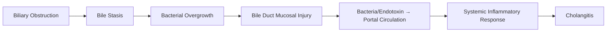
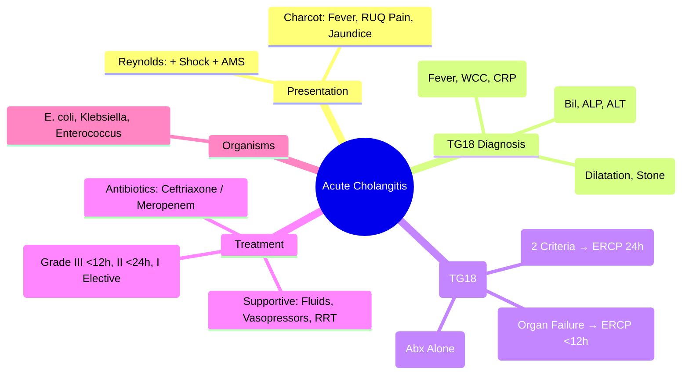

## 1. Learning Objectives
- [ ] Apply Tokyo Guidelines 2018 (TG18) for diagnosis and severity grading
- [ ] Recognize Charcot's triad and Reynolds' pentad
- [ ] Initiate appropriate antibiotics and biliary drainage (ERCP)
- [ ] Manage haemodynamic instability and organ failure
- [ ] Identify FCPS/MRCP high-yield emergency management steps

---

## 2. Definition & Pathophysiology

| Obstruction Cause | Mechanism |
|-------------------|-----------|
| **Choledocholithiasis** | Most Common (60-80%) |
| **Malignant Stricture** | Pancreatic Ca, Cholangiocarcinoma, Ampullary Ca |
| **Benign Stricture** | Post-surgical, PSC, Mirizzi |
| **Parasites** | Ascaris, Fasciola (Endemic) |

---

## 3. Clinical Presentation: Charcot's Triad & Reynolds' Pentad

| Feature | Charcot's Triad | Reynolds' Pentad |
|---------|-----------------|------------------|
| **1. Fever/Chills** | ✓ | ✓ |
| **2. RUQ Pain** | ✓ | ✓ |
| **3. Jaundice** | ✓ | ✓ |
| **4. Shock/Hypotension** | | ✓ |
| **5. AMS/Confusion** | | ✓ |

> **Sensitivity**: Charcot's Triad **50-70%**; Reynolds' Pentad **5-10%** (Severe Only)

> **FCPS/MRCP**: **Charcot's = Fever + RUQ Pain + Jaundice**; **Reynolds' = + Shock + AMS**

---

## 4. Tokyo Guidelines 2018 (TG18) Diagnostic Criteria

### A. Systemic Inflammation
| Criterion | Detail |
|-----------|--------|
| **Fever** | >38°C / <36°C |
| **WCC** | >12,000 or <4,000 / >10% Bands |
| **CRP** | >2 mg/dL |
| **Heart Rate** | >90 bpm |

### B. Cholestasis
| Criterion | Detail |
|-----------|--------|
| **ALP/GGT** | >1.5×ULN |
| **Bilirubin** | >2 mg/dL (34 μmol/L) |
| **ALT/AST** | >1.5×ULN |

### C. Imaging
| Criterion | Detail |
|-----------|--------|
| **Biliary Dilatation** | CBD >7mm (or >10mm post-cholecystectomy) |
| **Stricture/Stone/Stent** | On US/CT/MRCP/ERCP |
| **Liver Enhancement** | Arterial Phase (CT/MRI) |

### Diagnosis
| Category | Criteria |
|----------|----------|
| **Suspected** | **A + (B or C)** |
| **Definite** | **A + B + C** |

---

## 5. Severity Grading (TG18)

| Grade | Criteria | Management |
|-------|----------|------------|
| **Grade I (Mild)** | No Organ Dysfunction | **Antibiotics Alone** (May Not Need Urgent Drainage) |
| **Grade II (Moderate)** | **Any 2 of**: WBC>12k/<4k, Fever>39°C, Age>75, Bilirubin>5mg/dL, ALP>2×ULN | **Early ERCP** (Within 24h) + Antibiotics |
| **Grade III (Severe)** | **Organ Dysfunction** (Cardio, Resp, Renal, Hepatic, Haem, Neuro) | **Resuscitation + Urgent ERCP** (ASAP, <12h) + Antibiotics |

---

## 6. Antibiotic Therapy

### Empirical Regimens
| Severity | Regimen | Duration |
|----------|---------|----------|
| **Mild/Moderate** | **Ceftriaxone 2g IV daily** OR **Piperacillin-Tazobactam 4.5g IV q6h** | 4-7 Days (After Decompression) |
| **Severe / ICU** | **Meropenem 1g IV q8h** OR **Pip-Taz + Aminoglycoside** | 7-10 Days |
| **Penicillin Allergy** | **Ciprofloxacin 400mg IV q12h + Metronidazole 500mg IV q8h** | 7-10 Days |

### Common Pathogens
| Organism | Frequency |
|----------|-----------|
| **E. coli** | 30-40% |
| **Klebsiella** | 20-30% |
| **Enterococcus** | 10-20% |
| **Pseudomonas** | 5-10% (Healthcare-associated) |
| **Anaerobes** | 10-15% (Bacteroides, Clostridium) |

---

## 7. Biliary Drainage (ERCP)

| Timing | TG18 Grade | Detail |
|--------|------------|--------|
| **Emergency (<12h)** | **Grade III (Severe)** | Resuscitate → **Urgent ERCP** |
| **Urgent (24h)** | **Grade II (Moderate)** | Stabilise → **ERCP Within 24h** |
| **Elective (48-72h)** | **Grade I (Mild)** | Antibiotics First; ERCP if No Improvement |

### Drainage Options
| Method | Indication |
|--------|------------|
| **ERCP + Sphincterotomy + Stone Extraction** | **First-Line** (Choledocholithiasis) |
| **ERCP + Stent (Plastic/Metal)** | Malignant Stricture, Failed Stone Extraction |
| **PTBD** (Percutaneous) | ERCP Failed, Altered Anatomy, Proximal Obstruction |
| **EUS-BD** | ERCP Failed, Expertise Available |

---

## 8. Supportive Care

| Intervention | Indication |
|--------------|------------|
| **Fluid Resuscitation** | **Severe (Grade III)** — 30mL/kg Crystalloid Bolus |
| **Vasopressors** | **Norepinephrine** First-Line (Septic Shock) |
| **Renal Replacement** | AKI (KDIGO Criteria) |
| **Blood Products** | Coagulopathy (INR>1.5), Thrombocytopenia |
| **Source Control** | **ERCP = Definitive** — Antibiotics Alone Insufficient if Obstruction |

---

## 9. FCPS/MRCP High-Yield Summary

| Concept | Key Points |
|---------|------------|
| **Charcot's Triad** | Fever + RUQ Pain + Jaundice (~50-70%) |
| **Reynolds' Pentad** | Charcot's + Shock + AMS (~5-10%) |
| **TG18 Diagnosis** | A (Inflammation) + B (Cholestasis) + C (Imaging) |
| **Severity** | Grade I (Mild), II (Moderate), III (Severe/Organ Failure) |
| **Antibiotics** | Ceftriaxone 2g IV (First-Line); Meropenem (Severe) |
| **Drainage Timing** | **Grade III: <12h (Emergency ERCP)**; Grade II: <24h (Urgent); Grade I: Elective |
| **First-Line Drainage** | **ERCP + Sphincterotomy/Stent** |
| **Common Pathogens** | E. coli, Klebsiella, Enterococcus |

---

## 10. Viva Questions

1. **What is Charcot's triad? Reynolds' pentad?**
2. **What are Tokyo Guidelines 2018 diagnostic criteria?**
3. **How do you grade cholangitis severity?**
4. **What is the antibiotic of choice for acute cholangitis?**
5. **When do you do ERCP for Grade I, II, III cholangitis?**
6. **What is the role of PTBD vs ERCP?**
7. **What are the common organisms in cholangitis?**
8. **How do you manage septic shock from cholangitis?**
8. **What is the sensitivity of Charcot's triad?**
9. **When do you use MRCP vs ERCP in cholangitis?**

---

## 11. Confusions & Mnemonics

| Confusion | Clarification |
|-----------|---------------|
| Charcot vs Reynolds | **Charcot = Triad (Fever, Pain, Jaundice)**; **Reynolds = Pentad (+ Shock, AMS)** |
| TG18 Grade II vs III | **Grade II**: 2 of 5 criteria; **Grade III**: Organ Dysfunction |
| ERCP Timing | **Grade III: <12h (Emergency)**; **Grade II: <24h (Urgent)**; **Grade I: Elective** |
| Cholangitis vs Cholecystitis | Cholangitis: **Jaundice + Cholestasis + Obstruction**; Cholecystitis: **RUQ Pain + Fever, NO Jaundice (usually)** |
| Antibiotics Alone | **Insufficient if Obstruction Persists** — Drainage Required |
| PTBD vs ERCP | **ERCP First-Line**; PTBD = ERCP Failed/Altered Anatomy/Proximal |

---

## 12. Mind Map

---

## 13. One-Page Revision Card

| **Charcot's Triad** | **Reynolds' Pentad** |
|---------------------|----------------------|
| Fever | Fever |
| RUQ Pain | RUQ Pain |
| Jaundice | Jaundice |
| | **Shock** |
| | **AMS** |

| **TG18 Severity** | **Criteria** | **ERCP Timing** |
|-------------------|--------------|-----------------|
| Grade I (Mild) | No Organ Dysfunction | Elective |
| Grade II (Moderate) | 2 of: WBC>12k/<4k, Fever>39°C, Age>75, Bil>5mg/dL, ALP>2xULN | **<24h (Urgent)** |
| Grade III (Severe) | Organ Dysfunction | **<12h (Emergency)** |

| **Antibiotics** | **Regimen** |
|-----------------|-------------|
| First-Line | Ceftriaxone 2g IV Daily |
| Severe | Meropenem 1g IV q8h |
| Allergy | Ciprofloxacin + Metronidazole |

| **ERCP** | **Timing** |
|----------|------------|
| Grade III | <12h (Emergency) |
| Grade II | <24h (Urgent) |
| Grade I | Elective |

---

## 14. Spaced Repetition Tracker

| Day | 1 | 3 | 7 | 15 | 30 |
|-----|---|---|---|----|----|
| Charcot vs Reynolds | ☐ | ☐ | ☐ | ☐ | ☐ |
| TG18 Criteria | ☐ | ☐ | ☐ | ☐ | ☐ |
| Severity Grades | ☐ | ☐ | ☐ | ☐ | ☐ |
| ERCP Timing | ☐ | ☐ | ☐ | ☐ | ☐ |
| Antibiotic Regimens | ☐ | ☐ | ☐ | ☐ | ☐ |

---

## 15. Self-Test Scorecard

| Question | My Answer | Correct? |
|----------|-----------|----------|
| Charcot's Triad |  |  |
| Reynolds' Pentad |  |  |
| TG18 Grade III Criteria |  |  |
| ERCP Timing Grade III |  |  |
| First-Line Antibiotic |  |  |

---

## 16. Local Navigation

- [[Biliary Tract Disease/Choledocholithiasis|Choledocholithiasis]]
- [[Biliary Tract Disease/Acute Cholecystitis|Acute Cholecystitis]]
- [[Biliary Tract Disease/Gallstone disease|Gallstone Disease]]
- [[Portal Hypertension and Complications/Spontaneous bacterial peritonitis (SBP)|SBP]]
---

> Auto-generated study sections for "Biliary Tract Disease" — Ch 23: Hepatology.

## Flashcards (13 generated)

- Q: What is the definition of Biliary Tract Disease?
  A: | Feature | Charcot's Triad | Reynolds' Pentad |
- Q: What is Choledocholithiasis of Biliary Tract Disease?
  A: Most Common (60-80%)
- Q: What is Malignant Stricture of Biliary Tract Disease?
  A: Pancreatic Ca, Cholangiocarcinoma, Ampullary Ca
- Q: What is Benign Stricture of Biliary Tract Disease?
  A: Post-surgical, PSC, Mirizzi
- Q: What is Parasites of Biliary Tract Disease?
  A: Ascaris, Fasciola (Endemic)
- Q: What is Charcot's Triad of Biliary Tract Disease?
  A: Fever + RUQ Pain + Jaundice (~50-70%)
- Q: What is Reynolds' Pentad of Biliary Tract Disease?
  A: Charcot's + Shock + AMS (~5-10%)
- Q: What is the investigation of choice for Biliary Tract Disease?
  A: A (Inflammation) + B (Cholestasis) + C (Imaging)
- Q: What is Severity of Biliary Tract Disease?
  A: Grade I (Mild), II (Moderate), III (Severe/Organ Failure)
- Q: What is Antibiotics of Biliary Tract Disease?
  A: Ceftriaxone 2g IV (First-Line); Meropenem (Severe)
- Q: What is Drainage Timing of Biliary Tract Disease?
  A: Grade III: <12h (Emergency ERCP); Grade II: <24h (Urgent); Grade I: Elective
- Q: What is the first-line treatment for Biliary Tract Disease?
  A: ERCP + Sphincterotomy/Stent
- Q: What is Common Pathogens of Biliary Tract Disease?
  A: E. coli, Klebsiella, Enterococcus

## MCQs (1 generated)

1. **Which of the following best describes Biliary Tract Disease?**
   A. **| Feature | Charcot's Triad | Reynolds' Pentad |**
   B. An unrelated condition not matching the clinical picture of Biliary Tract Disease
   C. A complication seen late in the disease course of Biliary Tract Disease
   D. A condition that mimics Biliary Tract Disease but has a different underlying cause

## SBA Questions (1 generated)

1. A patient with suspected Biliary Tract Disease presents with: A[Biliary Obstruction] --> B[Bile Stasis]; B --> C[Bacterial Overgrowth]; C --> D[Bile Duct Mucosal Injury]. What is the most likely diagnosis?
   A. **Biliary Tract Disease**
   B. A condition that mimics Biliary Tract Disease but is not the same entity
   C. A complication of Biliary Tract Disease rather than the primary diagnosis
   D. An unrelated condition in the same clinical category as Biliary Tract Disease

## PasTest Scenario SBAs (Clinical Vignettes)

> **Auto-generated PasTest/Mediscope-style scenario SBAs** grounded in the authored source. Each scenario tests a real clinical fact (triad, specific sign, contraindication, trial, first-line Rx) extracted from the topic. *Source: Ch 23: Hepatology — Acute cholangitis*

**Q1.** Which of the following is characterised by the clinical triad: Fever, Pain, Jaundice?

  - **A.** Acute cholangitis
  - **B.** NAFLD
  - **C.** ALD
  - **D.** Viral hepatitis

  > **Answer: A** — Acute cholangitis
  >
  > *Source:* **When do you use MRCP vs ERCP in cholangitis?**

---
## Confusions & Mnemonics
| Confusion | Clarification |
|-----------|---------------|
| Charcot vs Reynolds | **Charcot = Triad (Fever, Pain, Jaun

