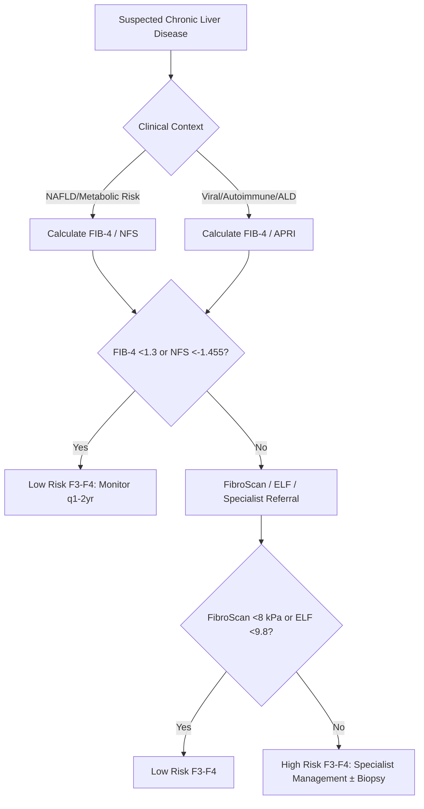
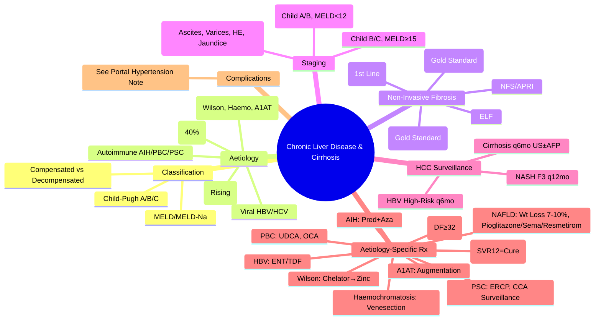

# Chronic Liver Disease and Cirrhosis

> [!tip] **FCPS/MRCP Priority: HIGH**
> **Chronic Liver Disease & Cirrhosis = Final common pathway of chronic liver injury** — Aetiology (ALD, NAFLD/NASH, Viral, Autoimmune, Inherited), **Compensated vs Decompensated** classification, **Child-Pugh/MELD scoring**, **Non-invasive fibrosis assessment** (FIB-4, NFS, APRI, ELF, FibroScan), **HCC Surveillance**, **Aetiology-specific management**.

---

## Learning Objectives
By the end of this note you should be able to:
- [ ] List **major aetiologies** of chronic liver disease and cirrhosis
- [ ] Distinguish **compensated** vs **decompensated** cirrhosis
- [ ] Apply **Child-Pugh** and **MELD/MELD-Na** scoring systems
- [ ] Apply **non-invasive fibrosis assessment** (FIB-4, NFS, APRI, ELF, FibroScan)
- [ ] Apply **HCC surveillance** criteria
- [ ] Outline **aetiology-specific management** principles

---

## 1. Definition & Classification

| Term | Definition |
|------|------------|
| **Chronic Liver Disease (CLD)** | Persistent hepatic injury/inflammation/fibrosis >6 months |
| **Cirrhosis** | **Diffuse fibrosis** with **nodular regeneration** distorting hepatic architecture |
| **Compensated Cirrhosis** | **No** history of ascites, variceal bleed, hepatic encephalopathy, jaundice |
| **Decompensated Cirrhosis** | **Current or past** ascites, variceal bleed, hepatic encephalopathy, or jaundice |

### Natural History
| Stage | Description | Progression |
|-------|-------------|-------------|
| **F0-F1** | No/minimal fibrosis | Stable, slow |
| **F2** | Significant fibrosis (periportal) | ~15%/yr to F3-F4 |
| **F3** | Advanced fibrosis (bridging) | High risk decompensation |
| **F4 (Cirrhosis)** | **Compensated** → **Decompensated** | **Decompensation rate ~5-7%/yr** |

---

## 2. Aetiology of Chronic Liver Disease

| Aetiology | Prevalence (UK) | Key Features |
|-----------|-----------------|--------------|
| **Alcoholic Liver Disease (ALD)** | ~40% cirrhosis | AST:ALT >2:1, steatosis → AH → cirrhosis |
| **NAFLD/NASH** | **Rising rapidly** (~25-30%) | Metabolic syndrome, FIB-4/FibroScan, weight loss |
| **Chronic Viral Hepatitis** (HBV, HCV) | ~15-20% | HBV: HBsAg+, DNA; HCV: RNA+, genotype |
| **Autoimmune** (AIH, PBC, PSC) | ~10% | AIH: ANA/SMA/LKM1; PBC: AMA; PSC: MRCP beading |
| **Inherited/Metabolic** | ~5% | Wilson (ceruloplasmin, Cu), Haemochromatosis (HFE, TSAT), A1AT (PiZZ) |
| **Cryptogenic** | ~10% | Exclusion diagnosis; often burnt-out NASH |

---

## 3. Non-Invasive Fibrosis Assessment

### First-Line Screening Tests

| Test | Formula | Cut-offs for Advanced Fibrosis (F3-F4) |
|------|---------|----------------------------------------|
| **FIB-4** | **Age × AST / (Platelets × √ALT)** | **<1.30** = Low risk; **>2.67** = High risk |
| **NFS (NAFLD Fibrosis Score)** | Age, BMI, IFG, AST/ALT, Platelets, Albumin | **<-1.455** Low; **>0.676** High |
| **APRI** | **AST/ULN / Platelets (10⁹/L) × 100** | **<0.5** No sig fibrosis; **>1.5** Cirrhosis |

### Second-Line / Specialist Tests

| Test | Principle | Cut-offs | Best For |
|------|-----------|----------|----------|
| **FibroScan (VCTE)** | Liver stiffness (kPa) | **<8 F0-F1, 8-9 F2, 9-12 F3, >12 F4** | **Gold standard non-invasive**; XL probe if BMI>30 |
| **ELF Test** | HA + PIIINP + TIMP-1 | Commercial algorithm | **High accuracy** for F3-F4 |
| **Liver Biopsy** | **Gold Standard** | Ishak/Metavir F0-F4 | **Gold standard**; sampling error (~15-20%) |

### Diagnostic Algorithm

---

## 3. Compensated vs Decompensated Cirrhosis

| Feature | Compensated | Decompensated |
|---------|-------------|---------------|
| **Definition** | No ascites, variceal bleed, HE, jaundice | **Any** of: ascites, variceal bleed, HE, jaundice |
| **Child-Pugh** | A (5-6) | B (7-9) or C (10-15) |
| **MELD** | <10-12 | ≥12-15 |
| **Median Survival** | >12 years | 2-5 years (B), <2 years (C) |
| **Management** | Surveillance, prophylaxis, lifestyle | Complication management, transplant referral |
| **HCC Surveillance** | 6-monthly US ± AFP | 6-monthly US ± AFP |

### Child-Pugh Score

| Parameter | 1 Point | 2 Points | 3 Points |
|-----------|---------|----------|----------|
| **Bilirubin (µmol/L)** | <34 | 34-50 | >50 |
| **Albumin (g/L)** | >35 | 28-35 | <28 |
| **INR** | <1.7 | 1.7-2.3 | >2.3 |
| **Ascites** | None | Mild/controlled | Tense/refractory |
| **Hepatic Encephalopathy** | None | Grade I-II | Grade III-IV |

| Class | Score | 1-Year Survival | 2-Year Survival |
|-------|-------|-----------------|-----------------|
| **A** | 5-6 | 100% | 85% |
| **B** | 7-9 | 80% | 60% |
| **C** | 10-15 | 45% | 35% |

### MELD / MELD-Na

**MELD = 3.78 × ln(bilirubin mg/dL) + 11.2 × ln(INR) + 9.57 × ln(creatinine mg/dL) + 6.43**

**MELD-Na = MELD + 1.32 × (137 - Na) - [0.033 × MELD × (137 - Na)]** (Na capped 125-137)

| MELD | 3-Month Mortality | Transplant Priority |
|------|-------------------|-------------------|
| <10 | <5% | Low |
| 10-19 | 6-20% | Moderate |
| 20-29 | 20-50% | High |
| 30-39 | 50-75% | Very High |
| ≥40 | >75% | Urgent |

> **Creatinine capped at 4.0 mg/dL** (dialysis = 4.0); **Na capped 125-137**

---

## 4. Aetiology-Specific Management

| Aetiology | Key Management |
|-----------|----------------|
| **ALD** | **Abstinence** (cornerstone), Nutrition (35-40 kcal/kg, 1.5g/kg protein), Thiamine, Zinc; AH → Maddrey DF ≥32 → Prednisolone 40mg ×28d |
| **NAFLD/NASH** | **Weight loss ≥7-10%**, Mediterranean/low-carb diet, Exercise 150-300min/wk; F2-F3 → Pioglitazone/Semaglutide/Resmetirom/Vit E |
| **HBV** | Entecavir/TDF/TAF if immune active/cirrhosis; HCC surveillance q6mo |
| **HCV** | **DAA (GLE/PIB, SOF/VEL)** → SVR12 = cure; Post-SVR surveillance if cirrhosis |
| **AIH** | Prednisolone 30-40mg → Azathioprine 1.5mg/kg maintenance ≥2yrs |
| **PBC** | UDCA 13-15mg/kg; OCA if inadequate response at 12mo |
| **PSC** | UDCA not proven; ERCP for dominant strictures; CCA surveillance (MRI+CA19-9) |
| **Wilson** | Chelator (Penicillamine/Trientine) → Zinc maintenance |
| **Haemochromatosis** | Venesection 500ml weekly → Ferritin <50; Maintenance q2-4mo |
| **A1AT Deficiency** | PiZZ → Augmentation (Prolastin 60mg/kg IV weekly) + Smoking cessation |

---

## 4. HCC Surveillance

| Population | Interval | Modality |
|------------|----------|----------|
| **Cirrhosis (all aetiologies)** | **6-monthly** | **US ± AFP** |
| **Chronic HBV (Asian M>40, F>50; African >20; Family history)** | **6-monthly** | US ± AFP |
| **NASH F3 Fibrosis** | **12-monthly** | US ± AFP |
| **Post-SVR HCV with cirrhosis** | **6-monthly** | US ± AFP |

> **AFP cut-off**: >20 ng/mL suspicious; >200 ng/mL + mass = HCC diagnosis (with imaging)

---

## 5. FCPS/MRCP High-Yield Summary

| Topic | Key Points |
|-------|------------|
| **Compensated vs Decompensated** | Decompensated = ascites, variceal bleed, HE, jaundice |
| **Child-Pugh** | Bilirubin, Albumin, INR, Ascites, HE → A(5-6), B(7-9), C(10-15) |
| **MELD/MELD-Na** | Transplant allocation; Creatinine cap 4.0; Na 125-137 |
| **FIB-4** | **First-line**: Age×AST/(Plt×√ALT); **<1.3 low, >2.67 high** risk F3-F4 |
| **NFS** | Age, BMI, IFG, AST/ALT, Plt, Alb; **<-1.455 low, >0.676 high** risk |
| **FibroScan** | **Gold standard non-invasive**; **<8, 8-9, 9-12, >12 kPa = F0-F1, F2, F3, F4** |
| **APRI** | **AST/ULN/Plt×100**; **<0.5 no fibrosis, >1.5 cirrhosis** |
| **HCC Surveillance** | **Cirrhosis q6mo US±AFP**; HBV high-risk groups q6mo |
| **Aetiology-Specific Rx** | ALD: Abstinence; NAFLD: Weight loss 7-10%; HBV: ENT/TDF; HCV: DAA; AIH: Pred+Aza; PBC: UDCA |

---

## 6. Viva Questions (MRCP PACES / FCPS)

| Question | Expected Answer |
|----------|-----------------|
| **Cirrhosis Definition — Compensated vs Decompensated?** | **Compensated**: No ascites, variceal bleed, HE, jaundice; **Decompensated**: Any of ascites, variceal bleed, HE, jaundice. |
| **Child-Pugh Score — Components, Classes?** | **Bilirubin, Albumin, INR, Ascites, HE** → **A(5-6), B(7-9), C(10-15)**. |
| **MELD-Na — Formula, Creatinine Cap, Use?** | **3.78×ln(bili)+11.2×ln(INR)+9.57×ln(Cr)+6.43+Na adj**; **Cr cap 4.0**; **Transplant allocation**. |
| **FIB-4 — Formula, Cut-offs?** | **Age×AST/(Plt×√ALT)**; **<1.30 Low risk F3-F4, >2.67 High risk F3-F4**. |
| **NFS — Formula, Cut-offs?** | Age, BMI, IFG, AST/ALT, Platelets, Albumin; **<-1.455 Low, >0.676 High** risk. |
| **FibroScan — Cut-offs for F0-F4?** | **<8 kPa F0-F1, 8-9 F2, 9-12 F3, >12 kPa F4** (XL probe if BMI>30). |
| **APRI — Formula, Cut-offs?** | **AST/ULN/Plt×100**; **<0.5 No significant fibrosis, >1.5 Cirrhosis**. |
| **HCC Surveillance — Who, How Often?** | **Cirrhosis q6mo US±AFP**; **HBV high-risk (Asian M>40/F>50, African>20, Family hx) q6mo**; **NASH F3 q12mo**. |
| **NAFLD Management — Weight Loss Target, Pharmacotherapy?** | **≥7-10% weight loss** (NASH resolution 90%); **Pioglitazone, Semaglutide, Resmetirom, Vit E (non-DM)** for F2-F3. |
| **ALD Management — Abstinence, AH Treatment?** | **Abstinence cornerstone**; **Maddrey DF ≥32 → Prednisolone 40mg ×28d**; Lille <0.45 continue. |

---

## 6. Confusions & Mnemonics

| Confusion | Clarification |
|-----------|---------------|
| **Compensated vs Decompensated** | **Compensated** = No clinical decompensation events; **Decompensated** = Has had ascites/variceal bleed/HE/jaundice |
| **Child-Pugh vs MELD** | **Child-Pugh**: Clinical + lab (subjective ascites/HE); **MELD**: Objective lab-based, transplant allocation |
| **FIB-4 vs NFS** | **FIB-4**: First-line, age+AST+ALT+platelets; **NFS**: Adds BMI, IFG, albumin; use both for NAFLD |
| **FibroScan vs Biopsy** | **FibroScan**: Non-invasive, operator-dependent, XL probe BMI>30; **Biopsy**: Gold standard, invasive, sampling error |
| **Compensated Cirrhosis Management** | Surveillance (HCC q6mo, varices q2-3yr), lifestyle, aetiology treatment, vaccinations |
| **Decompensated Cirrhosis Management** | Complication management (ascites, varices, HE, HRS), transplant referral (MELD≥15) |
| **FIB-4 vs NFS vs APRI** | **FIB-4**: Age, AST, ALT, Plt; **NFS**: +BMI, IFG, Alb; **APRI**: AST, Plt only |
| **FibroScan vs Biopsy** | **FibroScan**: Non-invasive, XL probe BMI>30; **Biopsy**: Gold standard, invasive, sampling error ~15-20% |

**Mnemonic: CIRRHOSIS-MANAGEMENT**
- **C**irrhosis: **Compensated (No events) vs Decompensated (Ascites/Varices/HE/Jaundice)**
- **I**ndex Scores: **Child-Pugh (Clinical+Lab), MELD-Na (Objective Lab+Na)**
- **R**isk Stratification: **FIB-4 (1st line), NFS (NAFLD), APRI (Simple), FibroScan (Gold Non-invasive)**
- **R**eserve Assessment: **ICG-R15 (<10% Normal), HVPG (≥10 CSPH, ≥12 Varices)**
- **H**CC Surveillance: **Cirrhosis q6mo US±AFP; HBV High-Risk q6mo; NASH F3 q12mo**
- **O**ther Scores: **APRI (<0.5 no fibrosis, >1.5 cirrhosis), ELF (High Accuracy)**
- **S**coring Systems: **Child A/B/C (5-6/7-9/10-15); MELD (<10 Low, 10-19 Mod, 20-29 High, ≥40 Urgent)**
- **I**ndividualised Rx: **ALD (Abstinence), NAFLD (Wt Loss 7-10%), HBV (ENT/TDF), HCV (DAA), AIH (Pred+Aza)**
- **S**pecific Aetiologies: **PBC (UDCA→OCA), PSC (ERCP dominant strictures), Wilson (Chelator→Zinc), Haemochromatosis (Venesection)**
- **M**onitoring: **q6mo US±AFP (Cirrhosis), q2-3yr Endoscopy (Varices), q6-12mo LFTs**
- **A**lcohol: **Abstinence = Cornerstone ALD; Maddrey DF≥32 → Steroids; Lille<0.45 Continue**
- **N**AFLD: **Weight Loss 7-10% = 90% NASH Resolution; Pioglitazone/Semaglutide/Resmetirom/VitE**
- **A**scites/Varices/HE/HRS: **See Portal Hypertension Complications Note**
- **G**enetics: **Wilson (ATP7B), Haemochromatosis (HFE C282Y), A1AT (PiZZ), Gilbert (UGT1A1*28)**
- **E**nd-Stage: **Transplant if MELD≥15, ALF, HCC Milan, Metabolic**

---

## 7. Mind Map

---

## 7. One-Page Revision Card

| Domain | Key Points |
|--------|------------|
| **Classification** | Compensated (No events) vs Decompensated (Ascites/Varices/HE/Jaundice) |
| **Child-Pugh** | Bil, Alb, INR, Ascites, HE → A(5-6), B(7-9), C(10-15) |
| **MELD-Na** | 3.78×ln(bili)+11.2×ln(INR)+9.57×ln(Cr)+6.43+Na adj; Cr cap 4.0 |
| **Fibrosis Non-Invasive** | FIB-4 <1.3 Low, >2.67 High; NFS <-1.455 Low, >0.676 High; FibroScan <8,8-9,9-12,>12 |
| **HCC Surveillance** | Cirrhosis q6mo US±AFP; HBV High-Risk q6mo; NASH F3 q12mo |
| **Aetiology Rx** | ALD: Abstinence; NAFLD: 7-10% Wt Loss; HBV: ENT/TDF; HCV: DAA; AIH: Pred+Aza; PBC: UDCA/OCA |
| **Decompensated Mgmt** | Ascites (SAAG≥11, SBP, LVP), Varices (EVL+NSBB), HE (Lactulose+Rifax), HRS (Terlipressin) |

---

## 8. Spaced Repetition Trackers

| Review Interval | Date Completed | Confidence (1-5) | Notes |
|-----------------|----------------|------------------|-------|
| 24 hours | | | |
| 7 days | | | |
| 15 days | | | |
| 30 days | | | |
| 90 days | | | |

---

## 9. Self-Test Scorecard

| Section | Score /5 | Last Attempt |
|---------|----------|--------------|
| Classification (Comp/Decomp) | | |
| Child-Pugh / MELD | | |
| Non-Invasive Fibrosis Tests | | |
| HCC Surveillance | | |
| Aetiology-Specific Management | | |
| Complications Overview | | |
| Viva Questions | | |

---

## Local Navigation
- **Parent Heading**: [[../Hepatology|Hepatology]]
- **Chapter Map": [[../Davidson Chapter 24 - Hepatology Hierarchy|Hepatology Hierarchy]]
- **Chapter MOC": [[../Hepatology MOC|Hepatology MOC]]
- **Drug Reference": [[../../Clinical Therapeutics and Good Prescribing|Drugs]]
- **Related": [[Portal Hypertension and Complications]], [[Alcoholic Liver Disease]], [[NAFLD]], [[Viral Hepatitis]], [[Autoimmune Liver Disease]], [[Inherited and Metabolic Liver Disease]], [[Liver Transplantation]], [[Liver Tumours]]