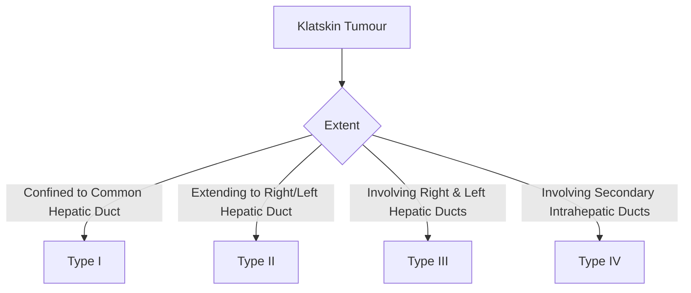

## 1. Learning Objectives
- [ ] Diagnose and stage cholangiocarcinoma (intrahepatic, perihilar, distal)
- [ ] Diagnose and manage gallbladder cancer
- [ ] Diagnose and manage ampullary carcinoma
- [ ] Apply staging systems (Bismuth, TNM) and surgical criteria
- [ ] Identify FCPS/MRCP high-yield tumour markers and management

---

## 2. Cholangiocarcinoma (CCA)

### Classification (Anatomical)

```mermaid
flowchart TD
    A[Cholangiocarcinoma] --> B{Location}
    B -->|Intrahepatic| C[iCCA]
    B -->|Perihilar (Klatskin)| D[pCCA]
    B -->|Distal| E[dCCA]
    C --> F[Second Most Common Primary Liver Cancer]
    D --> G[Most Common CCA (50-60%)]
    E --> H[20-30%]
```

| Type | Location | Incidence | Key Features |
|------|----------|-----------|--------------|
| **Intrahepatic (iCCA)** | Intrahepatic Bile Ducts | 10-20% | Mass-Forming, Peripheral, HCC Mimic |
| **Perihilar (pCCA/Klatskin)** | Biliary Confluence | **50-60%** | **Bismuth Type I-IV**, No GB Dilatation |
| **Distal (dCCA)** | Distal CBD | 20-30% | Similar to Pancreatic Head Cancer |

---

## 3. Perihilar CCA (Klatskin Tumour) - Bismuth Classification



| Type | Description | Resectability |
|------|-------------|---------------|
| **Type I** | Below Confluence | **Resectable** (Hepatectomy + CBD Excision) |
| **Type II** | Reaching Confluence | **Resectable** (Hepatectomy + Reconstruction) |
| **Type IIIa/IIIb** | Right/Left Hepatic Duct Involvement | **Borderline** (Extended Hepatectomy) |
| **Type IV** | Bilateral Secondary Ducts | **Unresectable** (Palliative) |

> **Key**: **No GB Dilatation** (Obstruction Above Cystic Duct)

---

## 4. Distal CCA vs Pancreatic Head Cancer

| Feature | Distal CCA | Pancreatic Head Adenocarcinoma |
|---------|------------|-------------------------------|
| **Location** | Distal CBD | Pancreas Head |
| **Double Duct Sign** | CBD + Pancreatic Duct Dilatation | **CBD + Pancreatic Duct Dilatation** |
| **CA19-9** | ↑ | ↑ |
| **Surgery** | Pancreaticoduodenectomy (Whipple) | Pancreaticoduodenectomy (Whipple) |
| **Prognosis** | Slightly Better | Poorer |

> **Differentiation Often Requires Surgery** — Similar Presentation, Similar Management

---

## 5. Cholangiocarcinoma Diagnosis

### Staging (TNM 8th Edition - AJCC)

| Stage | T | N | M | Treatment |
|-------|---|---|---|-----------|
| **I** | T1 | N0 | M0 | Surgery |
| **II** | T2a/T2b | N0 | M0 | Surgery |
| **IIIA** | T3 | N0 | M0 | Surgery (Selected) |
| **IIIB** | T4 | N0 | M0 | Unresectable |
| **IIIC** | Any T | N1 | M0 | Unresectable |
| **IV** | Any T | Any N | M1 | Palliative |

> **CA19-9**: Elevated (Not Specific); **CEA**: Supportive

---

## 6. Cholangiocarcinoma Diagnosis & Staging

```mermaid
flowchart TD
    A[Suspect CCA: Jaundice, Weight Loss, ↑ALP/CA19-9] --> B[Imaging]
    B --> C{MRCP/CT}
    C --> D{Mass/Stricture Location}
    D -->|Intrahepatic| E[Liver MRI + CA19-9]
    D -->|Perihilar| F[MRCP + CA19-9 → Bismuth Type]
    D -->|Distal| G[CT + MRCP]
    C --> H[Tissue Diagnosis?]
    H -->|Resectable| I[Surgery Without Biopsy (If High Suspicion)]
    H -->|Unresectable| J[ERCP Brushing + Biopsy / EUS-FNA]
    J --> K[FISH for Higher Sensitivity]
```

### Tumour Markers

| Marker | Sensitivity | Specificity | Use |
|--------|-------------|-------------|-----|
| **CA19-9** | 70-80% | 80-90% | Diagnosis, Monitoring, Prognosis |
| **CEA** | 40-50% | 80-90% | Adjunct |
| **CA125** | Low | Low | Adjunct |

> **CA19-9 >100 U/mL + Obstructive Jaundice = High Probability CCA**

---

## 7. Gallbladder Cancer (GBC)

### Epidemiology & Risk Factors

| Feature | Detail |
|--------|--------|
| **Incidence** | Rare (1-2/100,000); High in Chile, Bolivia, India, Native Americans |
| **Sex** | **Women > Men** (2-3:1) |
| **Age** | **>65 Years** |
| **Risk Factors** | **Gallstones (80-90%)**, **Porcelain GB**, Chronic Typhoid Carrier, Anomalous Pancreaticobiliary Junction |

### Staging (TNM)

| Stage | T | Treatment |
|-------|---|-----------|
| **T1a** | Lamina Propria | **Cholecystectomy Alone** |
| **T1b** | Muscularis | **Extended Cholecystectomy** (Liver Bed + Nodes) |
| **T2** | Perimuscular Connective Tissue | **Radical Resection** (Liver Bed + Lymphadenectomy) |
| **T3** | Liver/Adjacent Organs | **Extended Resection** (If Resectable) |
| **T4** | Major Vessels/≥2 Organs | **Unresectable** |

### Management

| Stage | Management |
|-------|------------|
| **T1a** | **Simple Cholecystectomy** (If Incidental) |
| **T1b-T2** | **Extended Cholecystectomy** (Liver Resection + Lymphadenectomy) |
| **T3-T4** | **Neoadjuvant → Surgery** (If Resectable) / Chemo (Gemcitabine/Cisplatin) |
| **Unresectable** | **Palliative Chemo** (Gem/Cis) + Biliary Stenting (SEMS) |

---

## 8. Ampullary Carcinoma

### Clinical Features

| Feature | Detail |

*...continued (truncated for renderer performance)*
---

> Auto-generated study sections for "Biliary Tract Disease" — Ch 23: Hepatology.

## Flashcards (1 generated)

- Q: What is the definition of Biliary Tract Disease?
  A: B -->|Confined to Common Hepatic Duct| B1[Type I]

## MCQs (1 generated)

1. **Which of the following best describes Biliary Tract Disease?**
   A. **B -->|Confined to Common Hepatic Duct| B1[Type I]**
   B. An unrelated condition not matching the clinical picture of Biliary Tract Disease
   C. A complication seen late in the disease course of Biliary Tract Disease
   D. A condition that mimics Biliary Tract Disease but has a different underlying cause

## SBA Questions (1 generated)

1. A patient with suspected Biliary Tract Disease presents with: A[Klatskin Tumour] --> B{Extent}; B -->|Confined to Common Hepatic Duct| B1[Type I]; B -->|Extending to Right/Left Hepatic Duct| B2[Type II]. What is the most likely diagnosis?
   A. **Biliary Tract Disease**
   B. A condition that mimics Biliary Tract Disease but is not the same entity
   C. A complication of Biliary Tract Disease rather than the primary diagnosis
   D. An unrelated condition in the same clinical category as Biliary Tract Disease

