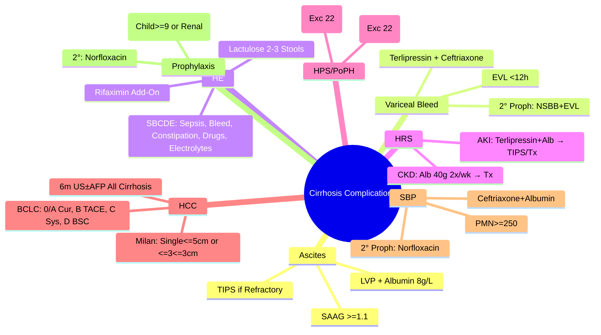

# Complications of Cirrhosis

## Learning Objectives
- [ ] Identify and manage the major complications of cirrhosis
- [ ] Apply prognostic implications of each complication
- [ ] Apply screening and surveillance strategies
- [ ] Prioritise transplant referral based on complications
- [ ] Identify FCPS/MRCP high-yield complication management

---

## Overview: Complications as Decompensation Events

```mermaid
flowchart TD
    A[Decompensated Cirrhosis] --> B[Ascites]
    A --> C[Variceal Bleed]
    A --> D[Hepatic Encephalopathy]
    A --> E[Jaundice]
    A --> F[Hepatorenal Syndrome (HRS)]
    A --> G[Hepatopulmonary Syndrome (HPS)]
    A --> H[Portopulmonary Hypertension (PoPH)]
    A --> I[HCC Development]
    A --> J[Infection (SBP, Sepsis)]
    A --> K[Malnutrition/Sarcopenia]
    A --> L[Osteoporosis]
    A --> M[Coagulopathy/Thrombocytopenia]
```

---

## 1. Ascites

| Aspect | Key Points |
|--------|------------|
| **Pathophysiology** | Portal HTN + Splanchnic Vasodilation → Effective Hypovolaemia → RAAS/SNS/ADH → Na/Water Retention |
| **Diagnosis** | **SAAG ≥1.1 g/dL** = Portal Hypertensive; **PMN ≥250** = SBP |
| **Management** | Salt 88mmol + Spiro 400 + Furo 160 → LVP + Albumin 8g/L → TIPS → Transplant |
| **Refractory** | Failed Max Diuretics + Salt Restriction OR Diuretic-Intractable |

---

## 2. Portal Hypertensive Varices & Bleeding

### Screening & Prophylaxis
| Step | Action |
|-------|--------|
| **Screening** | Endoscopy at Diagnosis (Compensated) / At Decompensation |
| **Baveno VII Rule-Out** | LSM <20 kPa + Platelets >150 = No Endoscopy Needed |
| **Primary Prophylaxis** | NSBB (Propranolol → HR 55-60) OR EVL (Grade 2/3 or G1+Red Signs) |
| **Secondary Prophylaxis** | **NSBB + EVL Combination** (Superior to Either Alone) |

### Acute Variceal Bleed
| Step | Management |
|------|------------|
| **1. Resuscitation** | IV Access, Blood Products, Target Hb 7-8 g/dL |
| **2. Vasoactives** | Terlipressin 2mg IV q4-6h (or Octreotide) |
| **3. Antibiotics** | Ceftriaxone 1g IV (7 Days) |
| **4. Endoscopy** | <12h (EVL ± Glue for Gastric) |
| **5. Post-Bleed** | NSBB + EVL (Secondary Prophylaxis), TIPS if Rebleed |

### Gastric Varices
| Type | Description | Management |
|------|-------------|------------|
| **GOV1** | Oesophageal Extension | NSBB + EVL (Oesophageal) |
| **GOV2** | Fundal + Oesophageal | **Glue Injection** Primary |
| **IGV1** | Isolated Fundal | **Glue Injection** Primary |
| **IGV2** | Ectopic | Glue / BRTO / PARTO / TIPS |

---

## 3. Hepatic Encephalopathy (HE)

| Grade | Features | Management |
|-------|----------|------------|
| **Covert (MHE/G1)** | No Asterixis, Psychometric Impairment | Lactulose if Symptomatic |
| **Overt G2** | Lethargy, Asterixis | Lactulose 15-30ml BD → 2-3 Stools/Day |
| **Overt G3** | Somnolent, Disoriented | ICU, Lactulose PR, Rifaximin |
| **Overt G4** | Coma | ICU, Intubation, Lactulose PR, Rifaximin, ICP Monitor |

| Precipitant | Frequency | Treatment |
|-------------|-----------|------------|
| **Infection (SBP #1)** | 30-50% | Ceftriaxone + Albumin |
| **GI Bleed** | 20-30% | Vasoactives + Endoscopy + Ceftriaxone |
| **Electrolytes (K↓, Na↓)** | 15-20% | Correct K, Na, Alkalosis |
| **Drugs (Benzo, Opioid, Diuretic)** | 10% | Stop Offending Agents |
| **Constipation** | 10-15% | Lactulose 15-30ml BD → 2-3 Stools/Day |

| Treatment | Dose/Target |
|-----------|-------------|
| **Lactulose** | 15-30ml BD PO/PR → **2-3 Soft Stools/Day** |
| **Rifaximin** | 550mg BD (Add-On for Recurrent) |
| **G3-4** | ICU, Intubate (GCS<8), Lactulose PR, Rifaximin, ICP Monitor |

---

## 4. Hepatorenal Syndrome (HRS)

### HRS-AKI (Former Type 1)
| Criteria (ICA 2015) | All Required |
|---------------------|--------------|
| Cirrhosis + Ascites | |
| AKI (KDIGO): Cr ↑≥0.3mg/dl/48h OR ≥1.5×Baseline | |
| No Response to Albumin 1g/kg×2d (Diuretics Stopped) | |
| No Shock | |
| No Nephrotoxins | |
| No Parenchymal Renal Disease (Proteinuria<500mg, No Haematuria, Normal US) | |

| Treatment | Protocol |
|-----------|----------|
| **Terlipressin** | 2mg IV q4-6h + Albumin 20-40g/day |
| **Alternative** | Noradrenaline (ICU), Midodrine+Octreotide |
| **Response** | Cr ↓25% at Day 3-7 → Continue 14 Days |
| **Failure** | TIPS (Child A/B) → Transplant Evaluation |

### HRS-CKD (Former Type 2)
| Feature | Management |
|---------|------------|
| Chronic Kidney Damage (eGFR<60) | Albumin 40g 2x/week (Long-term) |
| Refractory Ascites Association | TIPS (Selected Child A/B) |
| eGFR <30 for >8 Weeks | **Combined Liver-Kidney Transplant** |

---

## 5. Hepatopulmonary Syndrome (HPS) & Portopulmonary Hypertension (PoPH)

| Feature | HPS | PoPH |
|--------|-----|------|
| **Pathophysiology** | Intrapulmonary Vasodilation | Pulmonary Vascular Remodelling |
| **Diagnosis** | **PaO₂ <80 mmHg** (Room Air) + **Intrapulmonary Shunt** (Contrast Echo) | **mPAP >25 mmHg** + **PVR >240** + **PAWP ≤15** (RHC) |
| **Severity** | Mild: 60-80; Moderate: 50-60; Severe: <50 | Mild: 25-35; Moderate: 35-45; Severe: >45 |
| **Treatment** | **Liver Transplant** (Only Cure) | Vasodilators (Epoprostenol, Sildenafil, Bosentan) → Transplant if mPAP<35 |
| **Transplant MELD Exception** | **22 Points** (PaO₂ <60) | **22 Points** (If mPAP>35, PVR>240) |

---

## 6. HCC Surveillance in Cirrhosis

| Population | Surveillance |
|-----------|--------------|
| **All Cirrhosis** | **6-Monthly US ± AFP** |
| **HBV (High Risk)** | 6-Monthly US ± AFP (Even Non-Cirrhotic) |
| **Post-SVR HCV (F4)** | Continue 6-Monthly US ± AFP |
| **NAFLD Non-Cirrhotic F3** | Consider 6-Monthly US (Guideline Variation) |

### Diagnostic Workup (LI-RADS)
| Category | Finding | Action |
|----------|---------|--------|
| **LR-1** | Definitely Benign | Routine Surveillance |
| **LR-2** | Probably Benign | Routine Surveillance |
| **LR-3** | Intermediate | Short-Interval FU (3-6mo) |
| **LR-4** | Probably HCC | Treat as HCC (MDT) |
| **LR-5** | **Definitely HCC** | **Treat as HCC** (No Biopsy Needed) |
| **LR-M** | Probably Malignant (Non-HCC) | Biopsy / MDT |

### Treatment by BCLC Stage
| Stage | Tumour | Treatment |
|-------|--------|-----------|
| **0** | Single <2cm, Child A | Ablation / Resection |
| **A** | Single/≤3 ≤3cm, Child A/B | Resection / Ablation / Transplant |
| **B** | Multinodular, Child A/B | **TACE / TARE** |
| **C** | Vasc Invasion / Extrahepatic / PS 1-2 | **Systemic (Atezo-Bev 1st, Sorafenib, Lenvatinib)** |
| **D** | Child C / PS 3-4 | Best Supportive Care |

> **Milan Criteria for Transplant**: Single ≤5cm **OR** ≤3 Nodules ≤3cm, No Vascular Invasion

---

## 6. Infection Susceptibility (SBP, Sepsis)

| Aspect | Detail |
|--------|--------|
| **SBP Incidence** | 10-30% Hospitalised Cirrhotics |
| **Diagnosis** | Ascitic PMN ≥250/mm³ (Culture-Negative Still SBP) |
| **Treatment** | **Ceftriaxone 2g IV Daily** + **Albumin 1.5g/kg D1 + 1g/kg D3** |
| **Prophylaxis** | **Secondary**: Norfloxacin 400mg Daily (Post-SBP) |
| **Primary Prophylaxis** | Ascitic Protein <1.5 + (Child≥9 OR Renal Impairment) |

---

## 7. Other Complications

| Complication | Key Features | Management |
|------------|--------------|------------|
| **Malnutrition/Sarcopenia** | Low BMI, Low Muscle Mass | High Protein (1.5g/kg), Exercise, BCAA |
| **Osteoporosis** | DEXA T-score <-2.5 | Calcium/VitD, Bisphosphonate |
| **Coagulopathy** | Low Factors, Thrombocytopenia | No Routine INR Correction; FFP for Bleed/Procedure |
| **Thrombocytopenia** | Hypersplenism, Low TPO | Eltrombopag (If Procedure), Avoid Unnecessary Procedures |
| **Hyponatraemia** | Dilutional, SIADH | Fluid Restrict 1L, Vaptans (Tolvaptan), Stop Diuretics |

---

## FCPS/MRCP High-Yield Summary

| Complication | Key Management |
|--------------|----------------|
| **Ascites** | Salt 88mmol + Spiro 400 + Furo 160 → LVP+Alb → TIPS → Tx |
| **Variceal Bleed** | Terlipressin + Ceftriaxone + EVL <12h → NSBB+EVL 2° Prophylaxis |
| **HE** | SBCDE Precipitants → Lactulose 2-3 Stools → Rifaximin Add-On |
| **HRS-AKI** | Terlipressin 2mg q4-6h + Alb 20-40g/d → TIPS/Transplant if Fail |
| **HPS** | PaO₂<80 + Contrast Echo → **Tx (MELD Exception 22)** |
| **PoPH** | mPAP>25+PVR>240 → Vasodilators → Tx if mPAP<35 (Exc 22) |
| **HCC** | **6m US±AFP All Cirrhosis** → BCLC Staging → Tx if Milan |
| **SBP** | PMN≥250 → Ceftriaxone 2g + Alb 1.5g/kg D1 + 1g/kg D3 |
| **Prophylaxis** | 2°: Norfloxacin 400mg; 1°: Protein<1.5 + (Child≥9 or Renal) |

---

## Viva Questions

1. **List 5 major complications of cirrhosis.**
2. **What is the first-line treatment for acute variceal bleed?**
3. **What are the ICA criteria for HRS-AKI?**
3. **How do you diagnose HPS? What is the transplant exception?**
4. **What is the HCC surveillance protocol for cirrhosis?**
4. **What are the precipitating factors for HE (SBCDE)?**
5. **How do you manage refractory ascites?**
6. **Differentiate HPS from PoPH.**
6. **What is the Milan criteria for HCC transplant?**
7. **What is the SBP diagnostic criterion?**
7. **What is the cefotriaxone dose in variceal bleed?**
8. **What is the management of HRS-AKI?**

---

## Confusions & Mnemonics

| Confusion | Clarification |
|-----------|---------------|
| HRS-AKI vs HRS-CKD | AKI: Acute (Cr↑0.3/48h), Mortality <2wk; CKD: Chronic (eGFR<60), Months |
| HPS vs PoPH | HPS: Vasodilation (PaO₂↓), Shunt; PoPH: Vasoconstriction (mPAP↑), Remodelling |
| SBP Diagnosis | **PMN ≥250** (Not Total WCC); Culture-Negative = Still SBP |
| HRS-AKI vs ATN | HRS: UNa<10, FENa<0.1%, Benign Sediment; ATN: UNa>40, Muddy Casts |
| HE Precipitants | **SBCDE**: Sepsis, Bleed, Constipation, Drugs, Electrolytes |
| HCC Surveillance | **All Cirrhosis = 6m US±AFP** — No Exception |
| Milan Criteria | Single ≤5cm OR ≤3 Nodules ≤3cm, No Vasc Invasion |
| HPS vs PoPH Transplant | HPS: PaO₂<60 → Exc 22; PoPH: mPAP>35+PVR>240 → Exc 22 |
| SBP Prophylaxis | 1°: Protein<1.5 + (Child≥9 or Renal); 2°: Norfloxacin post-SBP |

---

## Mind Map



---

## One-Page Revision Card

| **Complication** | **Key Diagnostic** | **First-Line Treatment** | **Transplant Indication** |
|------------------|-------------------|--------------------------|---------------------------|
| **Ascites** | SAAG ≥1.1 | Salt 88mmol + Spiro 400 + Furo 160 | Refractory → TIPS → Tx |
| **Variceal Bleed** | Endoscopy | Terlipressin + Ceftriaxone + EVL | Rebleed on 2° Proph → TIPS/Tx |
| **HE** | West Haven Grade | Lactulose 15-30ml BD → 2-3 Stools | Refractory → ICU/Tx |
| **HRS-AKI** | Cr↑≥0.3/48h + No Response to Alb | Terlipressin 2mg q4-6h + Alb | Fail → TIPS → Tx |
| **HPS** | PaO₂<80 + Contrast Echo | **Tx Only** | **MELD Exception 22** |
| **PoPH** | mPAP>25 + PVR>240 | Vasodilators → Tx | **MELD Exception 22** |
| **HCC** | 6m US±AFP | BCLC Staging | **Milan: Single≤5cm or ≤3≤3cm** |
| **SBP** | PMN≥250 | Ceftriaxone 2g + Alb 1.5g/kg D1 | 2° Proph: Norfloxacin |

---

## Spaced Repetition Tracker

| Day | 1 | 3 | 7 | 15 | 30 |
|-----|---|---|---|----|----|
| 5 Major Complications | ☐ | ☐ | ☐ | ☐ | ☐ |
| HE Precipitants (SBCDE) | ☐ | ☐ | ☐ | ☐ | ☐ |
| HRS-AKI Management | ☐ | ☐ | ☐ | ☐ | ☐ |
| HPS vs PoPH | ☐ | ☐ | ☐ | ☐ | ☐ |
| HCC Surveillance | ☐ | ☐ | ☐ | ☐ | ☐ |

---

## Self-Test Scorecard

| Question | My Answer | Correct? |
|----------|-----------|----------|
| 5 Complications |  |  |
| SBCDE Mnemonic |  |  |
| HRS-AKI vs ATN |  |  |
| HPS vs PoPH |  |  |
| Milan Criteria |  |  |

---

## Local Navigation

- [[Portal Hypertension and Complications/Ascites|Ascites]]
- [[Portal Hypertension and Complications/Varices|Varices]]
- [[Portal Hypertension and Complications/Hepatic Encephalopathy|HE]]
- [[Portal Hypertension and Complications/Hepatorenal Syndrome|HRS]]
- [[Portal Hypertension and Complications/Hepatopulmonary syndrome|HPS]]
- [[Portal Hypertension and Complications/Portopulmonary hypertension|PoPH]]
- [[Liver Tumours/HCC (Hepatocellular Carcinoma)|HCC]]
- [[Portal Hypertension and Complications/Spontaneous bacterial peritonitis (SBP)|SBP]]