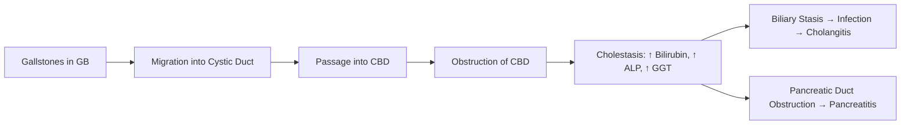
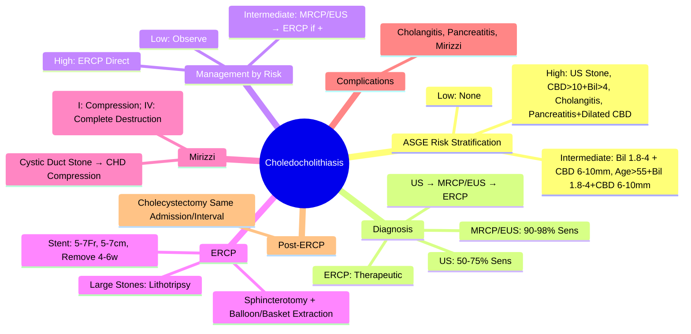

## 1. Learning Objectives
- [ ] Apply diagnostic criteria (Clinical, Biochemical, Imaging)
- [ ] Risk stratification (ASGE Criteria) for CBD stones
- [ ] Determine management: ERCP, MRCP, EUS, Laparoscopic CBD Exploration
- [ ] Manage complications (Cholangitis, Pancreatitis)
- [ ] Identify FCPS/MRCP high-yield diagnostic and management steps

---

## 2. Definition & Pathophysiology



---

## 3. Clinical Presentation

| Feature | Choledocholithiasis |
|---------|---------------------|
| **Pain** | RUQ/Epigastric, Colicky, Radiates to Back/Scapula |
| **Jaundice** | **Intermittent** (Stone Moves In/Out of Ampulla) |
| **Fever/Chills** | If **Cholangitis** Supervenes |
| **Nausea/Vomiting** | Common |
| **Pruritus** | If Prolonged Obstruction |

> **Key**: **Intermittent Jaundice** = Classic for CBD Stones vs Constant in Malignant Obstruction

---

## 4. Diagnostic Criteria & ASGE Risk Stratification

### ASGE Criteria for CBD Stone Probability

```mermaid
flowchart TD
    A[Suspect CBD Stone] --> B{High Risk Criteria}
    B -->|CBD Stone Seen on US| C[HIGH Probability]
    B -->|CBD >10mm (US/Axial) + Bilirubin>4mg/dL| C
    B -->|Cholangitis| C
    B -->|Pancreatitis + Dilated CBD| C
    B -->|None of Above| D{Intermediate Risk}
    D -->|Bilirubin 1.8-4mg/dL + CBD 6-10mm| E[INTERMEDIATE Probability]
    D -->|Age>55, Bilirubin 1.8-4, CBD 6-10mm| E
    D -->|None| F[LOW Probability]
```

| Risk Category | Criteria | CBD Stone Probability |
|---------------|----------|----------------------|
| **High** | **US: Stone in CBD** OR **CBD >10mm + Bilirubin >4mg/dL** OR **Cholangitis** OR **Pancreatitis + Dilated CBD** | **>50%** |
| **Intermediate** | **Bilirubin 1.8-4mg/dL + CBD 6-10mm** OR **Age>55 + Bilirubin 1.8-4 + CBD 6-10mm** | **10-50%** |
| **Low** | **None of Above** | **<10%** |

> **FCPS/MRCP**: **ASGE High Risk = Immediate ERCP**; **Intermediate = MRCP/EUS First**

---

## 5. Diagnostic Algorithm

```mermaid
flowchart TD
    A[Suspect CBD Stone] --> B[Transabdominal US]
    B --> C{ASGE Risk}
    C -->|High| D[ERCP (Therapeutic)]
    C -->|Intermediate| E[MRCP (Preferred) OR EUS]
    E --> F{MRCP/EUS Positive}
    F -->|Yes| D
    F -->|No| G[Observe / Repeat US]
    C -->|Low| H[Observe / Repeat US if Clinical Change]
    D --> I[ERCP: Sphincterotomy + Stone Extraction]
    I --> J[Laparoscopic Cholecystectomy (Same Admission/Interval)]
```

---

## 6. ERCP Indications & Technique

### Indications for ERCP
| Indication | Detail |
|-----------|--------|
| **Confirmed CBD Stones** (High/Intermediate Risk + Positive Imaging) | Therapeutic ERCP |
| **Cholangitis** (Any Severity) | **Urgent ERCP <24h** (Grade II) or **<12h** (Grade III) |
| **Gallstone Pancreatitis** (Severe/With Cholangitis) | **Urgent ERCP <24h** if Cholangitis; **Early ERCP <48h** if Predicted Severe |
| **Failed Conservative** | Stones Not Passing |

### ERCP Technique
| Step | Detail |
|------|--------|
| **Sphincterotomy** | Standard (EST) — **Medium/Large** for Large Stones |
| **Stone Extraction** | Balloon (8.5-12mm) OR Basket (Mechanical) |
| **Large Stones (>15mm)** | Mechanical Lithotripsy OR Laser Lithotripsy |
| **Intra-ductal Stones** | Cholangioscopy-Guided Lithotripsy |
| **Post-ERCP** | **Stent (5-7Fr, 5-7cm)** if Difficult Extraction/Edema; Remove 4-6w |

---

## 7. MRCP vs EUS vs ERCP

| Modality | Sensitivity | Specificity | Role |
|----------|-------------|-------------|------|
| **Transabdominal US** | 50-75% | 90-95% | **First-Line Screening** |
| **MRCP** | **90-95%** | **95-98%** | **Best Non-Invasive Diagnostic** |
| **EUS** | **95-98%** | **95-98%** | **If MRCP Equivocal/Unavailable** |
| **ERCP** | 95-98% (Therapeutic) | N/A | **Therapeutic Gold Standard** |

> **Choledocholithiasis**: **US → MRCP/EUS → ERCP** (Diagnostic → Therapeutic)

---

## 8. Management of Complications

### 1. Cholangitis (See Acute Cholangitis Note)
- **Antibiotics + Urgent ERCP**

### 2. Gallstone Pancreatitis
| Severity | ERCP Timing |
|----------|-------------|
| **With Cholangitis** | **<24h (Urgent)** |
| **Predicted Severe (CT Severity Index, APACHE>8)** | **<48-72h (Early ERCP)** |
| **Mild, No Cholangitis** | **Conservative**; ERCP if Fails to Improve |

### 3. Mirizzi Syndrome
| Type | Description | Management |
|------|-------------|------------|
| **Type I** | Cystic Duct Stone Compressing CHD | **Cholecystectomy + CBD Exploration/ERCP** |
| **Type II** | Cholecystocholedochal Fistula (<1/3 CBD) | **Cholecystectomy + Fistula Closure + CBD Repair** |
| **Type III** | Fistula 1/3-2/3 CBD | Complex Reconstruction |
| **Type IV** | Fistula >2/3 CBD | Hepaticojejunostomy |

---

## 9. Management of Stones During Cholecystectomy

| Approach | Indication | Detail |
|----------|------------|--------|
| **Pre-op ERCP** | **High/Intermediate Risk + Confirmed Stones** | **Standard of Care** |
| **Intra-op Cholangiogram (IOC)** | Routine (Some Surgeons) / Suspected Stones | Fluoroscopic; If Stones → IOC + CBD Exploration |
| **Laparoscopic CBD Exploration (LCBDE)** | **Confirmed Stones at IOC** | Trans-cystic OR Choledochotomy; Surgeon Expertise Required |
| **Post-op ERCP** | Missed Stones, Failed IOC/LCBDE | 6-12 Weeks Post-op |

> **Current Standard**: **Pre-op ERCP for High/Intermediate Risk** → Lap Cholecystectomy

---

## 10. FCPS/MRCP High-Yield Summary

| Concept | Key Points |
|---------|------------|
| **High Risk (ASGE)** | US Stone in CBD, CBD>10mm+Bil>4, Cholangitis, Pancreatitis+Dilated CBD |
| **Intermediate Risk** | Bil 1.8-4 + CBD 6-10mm, Age>55+Bil 1.8-4+CBD 6-10mm |
| **Low Risk** | None of Above |
| **High Risk Management** | **Direct to ERCP** |
| **Intermediate Risk** | **MRCP/EUS First** → ERCP if Positive |
| **ERCP Indications** | Confirmed Stones, Cholangitis, Gallstone Pancreatitis (Severe/With Cholangitis) |
| **Mirizzi Syndrome** | Cystic Duct Stone Compressing CHD → Jaundice |
| **Post-ERCP** | Cholecystectomy Same Admission or Interval |

---

## 11. Viva Questions

1. **What are the ASGE criteria for high-risk CBD stones?**
2. **How do you manage intermediate-risk CBD stones?**
3. **What is the ERCP indication for gallstone pancreatitis?**
4. **What is Mirizzi syndrome? Classification?**
4. **What is the sensitivity of US, MRCP, EUS for CBD stones?**
5. **When do you do pre-op ERCP vs IOC vs LCBDE?**
6. **What is the management of cholangitis from CBD stones?**
7. **What are the predictors of difficult CBD stone extraction?**
8. **What is the post-ERCP stenting protocol?**
9. **How do you manage retained stones post-cholecystectomy?**
10. **What is the role of MRCP vs EUS in intermediate-risk?**

---

## 12. Confusions & Mnemonics

| Confusion | Clarification |
|-----------|---------------|
| High vs Intermediate ASGE | **High**: Stone seen, CBD>10mm+Bil>4, Cholangitis; **Intermediate**: Bil 1.8-4 + CBD 6-10mm |
| ERCP vs MRCP | **MRCP = Diagnostic**; **ERCP = Therapeutic** (Do ERCP First if High Risk) |
| CBD Stone vs Cholangitis | **Cholangitis = Infection** (Fever, Pain, Jaundice); **CBD Stone = Obstruction** (May Cause Cholangitis) |
| Mirizzi Syndrome | **Cystic Duct Stone** Compresses CHD → Jaundice; **Not** Primary CBD Stone |
| Pre-op ERCP vs IOC | **Pre-op ERCP** for High/Intermediate Risk (Standard); **IOC** for Low Risk/Routine |
| Pre-op ERCP Timing | **Before Cholecystectomy** (Same Admission or Staged) |
| Post-ERCP Stent | **5-7Fr, 5-7cm** — Remove at 4-6w |

---

## 13. Mind Map



---

## 14. One-Page Revision Card

| **ASGE Risk** | **Criteria** | **Probability** | **Action** |
|---------------|--------------|-----------------|------------|
| **High** | US Stone, CBD>10+Bil>4, Cholangitis, Pancreatitis+Dilated CBD | >50% | **ERCP Direct** |
| **Intermediate** | Bil 1.8-4 + CBD 6-10mm, Age>55+Bil 1.8-4+CBD 6-10mm | 10-50% | **MRCP/EUS → ERCP if +** |
| **Low** | None | <10% | Observe |

| **Imaging Sensitivity** | **Role** |
|------------------------|----------|
| US (50-75%) | First-Line Screening |
| MRCP (90-95%) | Best Non-Invasive Diagnostic |
| EUS (95-98%) | If MRCP Equivocal |
| ERCP (95-98%) | **Therapeutic** |

| **ERCP Indications** | |
|----------------------|--|
| Confirmed CBD Stones | |
| Cholangitis | <24h (Grade II) / <12h (Grade III) |
| Gallstone Pancreatitis + Cholangitis | <24h |
| Predicted Severe Pancreatitis | <48-72h |

| **Mirizzi Syndrome** | |
|----------------------|--|
| Type I | Cystic Duct Stone Compressing CHD |
| Type II-IV | Fistula with CBD Involvement |

---

## 15. Spaced Repetition Tracker

| Day | 1 | 3 | 7 | 15 | 30 |
|-----|---|---|---|----|----|
| ASGE High Risk Criteria | ☐ | ☐ | ☐ | ☐ | ☐ |
| Intermediate vs High | ☐ | ☐ | ☐ | ☐ | ☐ |
| Imaging Sensitivities | ☐ | ☐ | ☐ | ☐ | ☐ |
| ERCP Indications | ☐ | ☐ | ☐ | ☐ | ☐ |
| Mirizzi Classification | ☐ | ☐ | ☐ | ☐ | ☐ |

---

## 16. Self-Test Scorecard

| Question | My Answer | Correct? |
|----------|-----------|----------|
| ASGE High Risk Criteria |  |  |
| Intermediate Risk Criteria |  |  |
| MRCP vs ERCP |  |  |
| Cholangitis ERCP Timing |  |  |
| Mirizzi Syndrome |  |  |

---

## 17. Local Navigation

- [[Biliary Tract Disease/Acute cholecystitis detailed|Acute Cholecystitis]]
- [[Biliary Tract Disease/Acute cholangitis|Acute Cholangitis]]
- [[Biliary Tract Disease/Gallstone disease|Gallstone Disease]]
- [[Biliary Tract Disease/Gallstone pancreatitis|Gallstone Pancreatitis]]