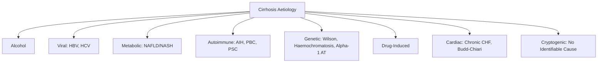
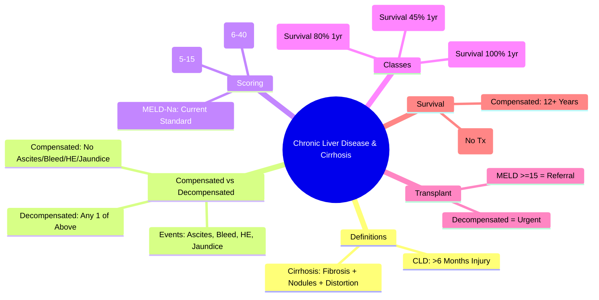

# Chronic Liver Disease and Cirrhosis: Definition & Classification

## Learning Objectives
- [ ] Define chronic liver disease and cirrhosis
- [ ] Differentiate compensated vs decompensated cirrhosis
- [ ] Apply Child-Pugh and MELD scoring systems
- [ ] Identify aetiological classification
- [ ] Identify FCPS/MRCP high-yield definitions and thresholds

---

## Definitions

### Chronic Liver Disease (CLD)
> **Histological Definition**: **Fibrosis** (any stage) with or without cirrhosis, persisting >6 months
> **Clinical Definition**: Persistent hepatic injury (biochemical, radiological, or histological) >6 months

### Cirrhosis
> **Histological Definition**: **Diffuse fibrosis** with **nodular regeneration** distorting hepatic architecture
> **Key Features**: 
> - **Bridging Fibrosis** connecting portal tracts
> - **Regenerative Nodules** (surrounded by fibrosis)
> - **Architectural Distortion** (vascular, biliary)
> - **Irreversible** (though regression possible with treatment of cause)

> **FCPS/MRCP**: **Cirrhosis = End-stage of Chronic Liver Disease** — Not all CLD progresses to cirrhosis

---

## Aetiological Classification



| Aetiology | Global Prevalence | Regional Variation |
|-----------|-------------------|--------------------|
| **Alcohol** | ~25-30% | High in Europe, West |
| **HCV** | ~20-25% | High in Egypt, Pakistan |
| **HBV** | ~15-20% | High in Asia, Africa |
| **NAFLD/NASH** | **Rapidly Rising** (15-20%) | West, Urban Asia |
| **AIH/PBC/PSC** | 5-10% | Women (AIH/PBC), Men (PSC) |
| **Genetic** | 1-5% | Wilson (Young), Haemochromatosis (Celtic) |
| **Cryptogenic** | 10-15% | Now Often Reclassified as NASH |

---

## Compensated vs Decompensated Cirrhosis

| Feature | **Compensated** | **Decompensated** |
|---------|-----------------|-------------------|
| **Ascites** | Absent | **Present** |
| **Variceal Bleed** | Never | **Occurred** |
| **Hepatic Encephalopathy** | Never | **Occurred** |
| **Jaundice** | Absent/Mild | **Present (Bilirubin >2-3 mg/dL)** |
| **Synthetic Function** | Preserved (INR Normal) | **Impaired (INR >1.5, Low Albumin)** |
| **Portal Pressure (HVPG)** | **≥10 mmHg** (CSPH) | **≥12 mmHg** (Variceal Risk) |
| **Median Survival** | **12+ Years** | **2-5 Years** (Without Transplant) |
| **Transplant Indication** | Not Urgent | **Urgent (MELD ≥15)** |

> **Key Transition**: **First Decompensation Event** (Ascites/Bleed/HE/Jaundice) = Shift to Decompensated

---

## Child-Pugh Score

| Parameter | 1 Point | 2 Points | 3 Points |
|-----------|---------|----------|----------|
| **Bilirubin (μmol/L)** | <34 | 34-50 | >50 |
| **Albumin (g/L)** | >35 | 28-35 | <28 |
| **INR** | <1.7 | 1.7-2.3 | >2.3 |
| **Ascites** | None | Mild/Controlled | Refractory |
| **Encephalopathy** | None | Grade 1-2 | Grade 3-4 |

| Class | Score | 1-Year Survival | 2-Year Survival |
|-------|-------|-----------------|-----------------|
| **A** | 5-6 | 100% | 85% |
| **B** | 7-9 | 80% | 60% |
| **C** | 10-15 | 45% | 35% |

> **FCPS/MRCP**: **Child A** = Well-Compensated; **Child B** = Moderate; **Child C** = Decompensated/High Risk

---

## MELD Score

### Original MELD
```
MELD = 3.78 × ln(Bilirubin mg/dL) + 11.2 × ln(INR) + 9.57 × ln(Creatinine mg/dL) + 6.43
```
- **Bilirubin, INR, Creatinine**: Capped at 4.0 (Min 1.0)
- **Dialysis**: Creatinine = 4.0

### MELD-Na (Current Standard)
```
MELD-Na = MELD + 1.32 × (137 - Na) - [0.033 × MELD × (137 - Na)]
```
- **Na Capped**: 125-137 mmol/L
- **Range**: 6-40 (Higher = Sicker)

| MELD Range | 3-Month Mortality | Transplant Priority |
|------------|-------------------|---------------------|
| **6-9** | <5% | Low |
| **10-19** | 5-15% | Moderate |
| **20-29** | 20-50% | High |
| **30-39** | 50-75% | Very High |
| **40** | >75% | Highest |

> **FCPS/MRCP**: **MELD ≥15** = Transplant Referral Threshold; **MELD-Na** Replaced Original MELD

---

## BCLC Staging for HCC in Cirrhosis

| Stage | Tumour | Liver Function | PS | Treatment |
|-------|--------|----------------|----|-----------|
| **0** | Single <2cm | Child A | 0 | Ablation/Resection |
| **A** | Single or ≤3 ≤3cm | Child A/B | 0 | Resection/Ablation/Transplant |
| **B** | Multinodular | Child A/B | 0 | TACE |
| **C** | Vascular Invasion/Extrahepatic | Child A/B | 1-2 | Systemic (Sorafenib/Lenvatinib/Atezo-Bev) |
| **D** | Any | **Child C** | 3-4 | Best Supportive Care |

---

## Aetiology-Specific Cirrhosis Features

| Aetiology | Typical Features |
|-----------|------------------|
| **Alcohol** | AST:ALT >2, Macrocytosis, GGT↑, Pancreatitis |
| **HCV** | Cryoglobulinaemia, Lymphoproliferative, HCC High Risk |
| **HBV** | HBeAg Status, Reactivation Risk, HCC (Even Non-Cirrhotic) |
| **NAFLD** | Metabolic Syndrome, T2DM, Obesity, HCC (Even Non-Cirrhotic) |
| **AIH** | High IgG, Autoantibodies, Steroid Responsive |
| **PBC** | AMA+, Cholestatic (ALP↑), Pruritus, Osteoporosis |
| **PSC** | IBD (UC>Crohn), MRCP Beading, CCA Risk |
| **Wilson** | Young, Neuro/Psych, Low Ceruloplasmin, KF Rings |
| **Haemochromatosis** | Ferritin↑, TSAT>45%, C282Y, Diabetes, Cardiomyopathy |

---

## FCPS/MRCP High-Yield Summary

| Concept | Key Points |
|---------|------------|
| **Cirrhosis Definition** | Diffuse Fibrosis + Nodules + Architectural Distortion |
| **Compensated vs Decompensated** | Decompensated = Ascites/Bleed/HE/Jaundice |
| **Child-Pugh** | 5 Parameters (Bil, Alb, INR, Ascites, HE); A:5-6, B:7-9, C:10-15 |
| **MELD** | Bil, INR, Cr (+ Na for MELD-Na); Range 6-40 |
| **Transplant Threshold** | MELD ≥15 (or Child B/C with Complications) |
| **1-Year Survival** | Child A: 100%, B: 80%, C: 45% |
| **Decompensation Events** | Ascites, Variceal Bleed, HE, Jaundice |
| **HCC Surveillance** | Cirrhosis: 6m US ± AFP (All Aetiologies) |

---

## Viva Questions

1. **Define cirrhosis histologically.**
2. **Differentiate compensated vs decompensated cirrhosis.**
3. **What are the components of Child-Pugh score?**
4. **What is MELD score? How is MELD-Na different?**
5. **What is the transplant referral threshold for MELD?**
5. **Differentiate Child A, B, C by survival.**
6. **What are the 4 decompensation events?**
6. **How does MELD-Na differ from original MELD?**
7. **What is the Child-Pugh score for albumin <28 g/L?**
8. **What is the MELD score if patient on dialysis?**
9. **How does decompensation affect transplant urgency?**

---

## Confusions & Mnemonics

| Confusion | Clarification |
|-----------|---------------|
| Compensated vs Decompensated | **Decompensated = Ascites/Bleed/HE/Jaundice** (Any One) |
| Child-Pugh vs MELD | Child-Pugh: Clinical, Categorical; MELD: Objective, Continuous, Allocation |
| MELD vs MELD-Na | MELD-Na Adds Sodium (Better Prognostication, Especially Low Na) |
| Child C vs Decompensated | **All Child C = Decompensated**; But **Decompensated Can Be Child B** (Early) |
| MELD in Dialysis | Creatinine Set to 4.0 (Maximum) |
| Decompensation Survival | **Median 2-5 Years** Without Transplant |
| HCC Surveillance | **ALL Cirrhosis** = 6m US ± AFP (Regardless of Aetiology) |

---

## Mind Map



---

## One-Page Revision Card

| **Cirrhosis** | **Definition** |
|---------------|----------------|
| Histological | Diffuse Fibrosis + Regenerative Nodules + Architectural Distortion |
| Clinical | End-Stage CLD with/without Decompensation |

| **Compensated** | **Decompensated** |
|-----------------|-------------------|
| No Ascites | Ascites |
| No Variceal Bleed | Variceal Bleed |
| No HE | Hepatic Encephalopathy |
| No Jaundice | Jaundice |
| Survival 12+ Years | Survival 2-5 Years (No Tx) |

| **Child-Pugh** | **1 Pt** | **2 Pts** | **3 Pts** |
|----------------|----------|-----------|-----------|
| Bilirubin | <34 | 34-50 | >50 |
| Albumin | >35 | 28-35 | <28 |
| INR | <1.7 | 1.7-2.3 | >2.3 |
| Ascites | None | Mild | Refractory |
| HE | None | G1-2 | G3-4 |

| **Class** | **Score** | **1-Yr Survival** |
|-----------|-----------|-------------------|
| A | 5-6 | 100% |
| B | 7-9 | 80% |
| C | 10-15 | 45% |

| **MELD** | **Formula** | **Range** | **Tx Threshold** |
|----------|-------------|-----------|------------------|
| Original | 3.78ln(Bil)+11.2ln(INR)+9.57ln(Cr)+6.43 | 6-40 | ≥15 |
| MELD-Na | MELD + 1.32(137-Na) - 0.033×MELD×(137-Na) | 6-40 | ≥15 |

---

## Spaced Repetition Tracker

| Day | 1 | 3 | 7 | 15 | 30 |
|-----|---|---|---|----|----|
| Cirrhosis Definition | ☐ | ☐ | ☐ | ☐ | ☐ |
| Compensated vs Decompensated | ☐ | ☐ | ☐ | ☐ | ☐ |
| Child-Pugh Components | ☐ | ☐ | ☐ | ☐ | ☐ |
| MELD Formula | ☐ | ☐ | ☐ | ☐ | ☐ |
| Tx Threshold MELD≥15 | ☐ | ☐ | ☐ | ☐ | ☐ |

---

## Self-Test Scorecard

| Question | My Answer | Correct? |
|----------|-----------|----------|
| Cirrhosis Histology |  |  |
| Compensated vs Decompensated |  |  |
| Child-Pugh 5 Components |  |  |
| MELD Formula |  |  |
| Tx Threshold |  |  |

---

## Local Navigation

- [[Chronic Liver Disease and Cirrhosis/Compensated vs decompensated cirrhosis|Compensated vs Decompensated]]
- [[Chronic Liver Disease and Cirrhosis/Child-Pugh and MELD scores|Child-Pugh & MELD]]
- [[Portal Hypertension and Complications/Ascites|Ascites]]
- [[Portal Hypertension and Complications/Varices|Varices]]
- [[Liver Transplantation/Liver Transplantation|Liver Transplant]]