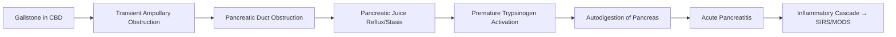

## 1. Learning Objectives
- [ ] Apply Revised Atlanta Classification 2012 for severity grading
- [ ] Determine ERCP timing based on severity and cholangitis
- [ ] Apply cholecystectomy timing guidelines (Same Admission vs Interval)
- [ ] Manage complications (Necrosis, Pseudocyst, Infected Necrosis)
- [ ] Identify FCPS/MRCP high-yield management algorithms

---

## 2. Pathophysiology



> **Mechanism**: **Transient Stone Impaction at Ampulla** → Pancreatic Duct Obstruction → Reflux/Pressure → Trypsin Activation

---

## 3. Clinical Presentation

| Feature | Gallstone Pancreatitis |
|---------|---------------------|
| **Pain** | **Epigastric**, Radiates to **Back**, Constant, Severe |
| **Nausea/Vomiting** | **Prominent** (≥90%) |
| **Fever** | Low-Grade Initially; High Fever = Infection |
| **Jaundice** | **May Be Present** (Transient CBD Obstruction) |
| **Murphy's Sign** | Often Positive (Associated Cholecystitis) |
| **Cullen's/Grey-Turner's Sign** | Severe Necrosis (Retroperitoneal Haemorrhage) |

---

## 4. Revised Atlanta Classification 2012 (Severity Grading)

| Severity | Criteria | Mortality |
|----------|----------|-----------|
| **Mild** | **No** Organ Failure, **No** Local Complications | <1% |
| **Moderately Severe** | **Transient** Organ Failure (<48h) **OR** Local Complications (Pseudocyst, Necrosis) | 1-5% |
| **Severe** | **Persistent** Organ Failure (>48h) (>1 System) | 15-30% |

### Organ Failure Definition (Modified Marshall Score)
| System | Variable | Failure Threshold |
|--------|----------|-------------------|
| **Respiratory** | PaO₂/FiO₂ | **<300** |
| **Cardiovascular** | Systolic BP / Vasopressors | **SBP <90** OR **Vasopressors Required** |
| **Renal** | Creatinine | **>177 μmol/L (2 mg/dL)** |

> **ACUTE PANCREATITIS DIAGNOSIS**: **2 of 3**: (1) Characteristic Pain, (2) Lipase/Amylase >3×ULN, (3) Imaging Findings

---

## 5. Severity Assessment Tools

| Tool | Use | Cut-offs |
|------|-----|----------|
| **CT Severity Index (CTSI)** | Day 3-5 (Peak Inflammation) | **0-3 Mild, 4-6 Moderate, 7-10 Severe** |
| **BISAP Score** | Admission (0-5 Points) | **0-1 Low Risk, 2-3 Moderate, 4-5 High Risk** |
| **Ranson's Criteria** | Admission + 48h (11 Criteria) | ≥3 = Severe |
| **APACHE II** | ICU Admission | ≥8 = Severe |

### BISAP Score (0-5 Points)
| Component | Point if Present |
|-----------|------------------|
| **B**UN >25 mg/dL | 1 |
| **I**mpaired Mental Status (GCS<15) | 1 |
| **S**ystolic BP <90 mmHg | 1 |
| **A**ge >60 years | 1 |
| **P**leural Effusion (Imaging) | 1 |

| BISAP Score | Mortality Risk |
|-------------|----------------|
| 0-1 | <1% |
| 2-3 | 2-10% |
| 4-5 | 15-25% |

---

## 6. ERCP Timing in Gallstone Pancreatitis

```mermaid
flowchart TD
    A[Gallstone Pancreatitis] --> B{Concurrent Cholangitis?}
    B -->|Yes| C[URGENT ERCP <24h (Grade II) / <12h (Grade III)]
    B -->|No| D{Severity}
    D -->|Mild| E[Conservative; No Routine ERCP]
    D -->|Moderately Severe| F[Prediction of Severe?]
    F -->|Yes (BISAP≥3, CTSI≥4, Ranson≥3)| G[EARLY ERCP <48-72h]
    F -->|No| E
    D -->|Severe| H[Resuscitate, ICU, Monitor; ERCP if Cholangitis/Sepsis]
    E --> I[Same Admission Cholecystectomy]
    G --> I
    C --> I
    I --> J[Cholecystectomy Same Admission (Preferably)]
```

### ERCP Timing Summary
| Scenario | ERCP Timing |
|----------|-------------|
| **With Cholangitis** | **Urgent <24h (Grade II) / <12h (Grade III)** |
| **Severe Predicted** (BISAP≥3, CTSI≥4, Ranson≥3) | **Early ERCP <48-72h** |
| **Mild** | **No Routine ERCP** (Conservative) |
| **Moderately Severe (No Cholangitis)** | **Early ERCP <48-72h** if Prediction of Severe |

---

## 7. Cholecystectomy Timing

| Setting | Timing | Evidence |
|---------|--------|----------|
| **Mild Gallstone Pancreatitis** | **Same Admission** (Once Resolving) | ↓ Readmission, ↓ Recurrent Biliary Events |
| **Moderately Severe** | **Same Admission** (If Fit & Resolving) | Same as Mild |
| **Severe** | **Delayed (6-12 weeks)** | After Recovery, Nutritional Optimisation |
| **Post-Necrosectomy** | **Delayed (6-12 weeks)** | After Full Recovery |

> **Guideline Consensus**: **Same-Admission Cholecystectomy** for Mild/Moderately Severe; **Delayed** for Severe

---

## 8. Local Complications (Imaging-Based)

| Complication | Timing | Definition (CT) | Management |
|-------------|--------|-----------------|------------|
| **Acute Peripancreatic Fluid Collection (APFC)** | <4 Weeks | Homogeneous, No Capsule | Conservative; Usually Resolves |
| **Pancreatic Pseudocyst** | >4 Weeks | Encapsulated, Fluid-Rich | **Drain if Symptomatic/Infected** (Endo/US-Guided) |
| **Acute Necrotic Collection (ANC)** | <4 Weeks | Heterogeneous, Non-Encapsulated | Conservative; Monitor for Infection |
| **Walled-Off Necrosis (WON)** | >4 Weeks | Encapsulated, Fluid + Necrotic Debris | **Drain if Infected/Symptomatic** (Endo/Percutaneous) |

---

## 9. Infected Necrosis Management

```mermaid
flowchart TD
    A[Suspect Infected Necrosis] --> B[FNA for Culture (Optional) / Clinical Diagnosis]
    B --> C[Antibiotics: Carbapenem (Meropenem) OR Pip-Taz]
    C --> D{Clinical Deterioration?}
    D -->|Yes| E[Step-Up Approach: Endoscopic Drainage → Percutaneous → Surgical]
    D -->|No| F[Continue Antibiotics, Monitor]
    E --> G[Endoscopic Transmural Drainage (LAMS/Stent)]
    G --> H{Improvement?}
    H -->|No| I[Percutaneous Drainage / VARD / Surgery]
    H -->|Yes| J[Monitor, Remove Stents 4-6w]
```

*...continued (truncated for renderer performance)*