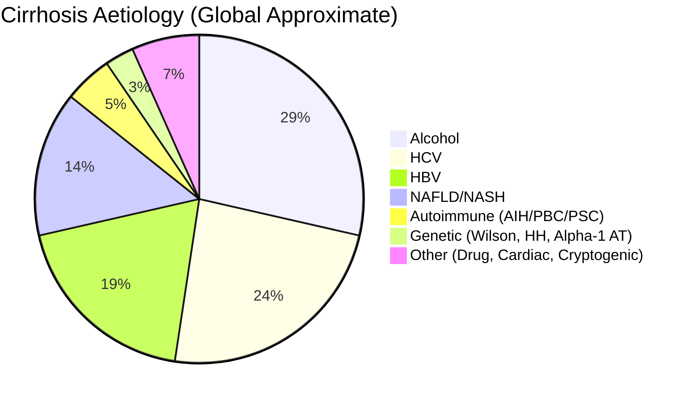
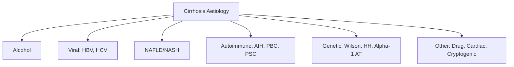

## 1. Learning Objectives
- [ ] Identify major aetiological categories of cirrhosis
- [ ] Apply clinical clues to differentiate aetiologies
- [ ] Know key diagnostic features of each aetiology
- [ ] Apply FCPS/MRCP high-yield aetiology-specific features

---

## 2. Global Aetiological Distribution



| Aetiology | Global % | Key Region/Demographic |
|-----------|----------|----------------------|
| **Alcohol** | 25-30% | Europe, USA, High-Income |
| **HCV** | 20-25% | Egypt, Pakistan, Japan, IVDU |
| **HBV** | 15-20% | Asia, Africa, Endemic Areas |
| **NAFLD/NASH** | **15-20% (Rising)** | Western, Urban Asia, Metabolic Syndrome |
| **Autoimmune (AIH/PBC/PSC)** | 5-10% | Women (AIH/PBC), Men (PSC) |
| **Genetic** | 3-5% | Wilson (Young), Haemochromatosis (Celtic/Northern European) |
| **Cryptogenic** | 5-10% | Often NASH on Re-evaluation |
| **Other** | 5% | Drug, Cardiac, Vascular, Sarcoid |

---

## 3. Major Aetiologies: Diagnostic Features



---

## 1. Alcohol-Related Cirrhosis

| Feature | Detail |
|---------|--------|
| **History** | Heavy Alcohol (>30g/day M, >20g/day F for >10y) |
| **LFTs** | **AST:ALT >2:1** (AST <300), **GGT ↑↑**, MCV ↑ |
| **Imaging** | Nodular Liver, Splenomegaly, Ascites (Late) |
| **Biopsy** | Macrovesicular Steatosis, Mallory Bodies, Perivenular Fibrosis |
| **Complications** | Pancreatitis, Cardiomyopathy, Peripheral Neuropathy |
| **Key** | **Abstinence → Re-compensation Possible** |

---

## 2. Viral Hepatitis Cirrhosis

### HCV Cirrhosis
| Feature | Detail |
|---------|--------|
| **Epidemiology** | IVDU, Blood Transfusion (Pre-1992), High in Egypt/Pakistan |
| **Progression** | 20% → Cirrhosis at 20y; **HCC Risk High** (Even Post-SVR if Cirrhosis) |
| **Extrahepatic** | Cryoglobulinaemia (MPGN, Vasculitis), Lymphoproliferative |
| **Treatment** | **DAA → SVR >95%**; Still Need HCC Surveillance if Cirrhosis |

### HBV Cirrhosis
| Feature | Detail |
|---------|--------|
| **Epidemiology** | Endemic Asia/Africa, Vertical/Horizontal Transmission |
| **Progression** | **HCC Risk Even Without Cirrhosis** (Integrated DNA) |
| **Phases** | Immune Tolerant → Immune Active → Inactive → Reactivation |
| **Treatment** | **NA (TDF/TAF/ETV)**; Suppress DNA → ↓ Cirrhosis Progression |
| **Reactivation Risk** | **Immunosuppression → Prophylactic NA** |

---

## 3. NAFLD/NASH Cirrhosis

| Feature | Detail |
|---------|--------|
| **Risk Factors** | **Obesity, T2DM, Metabolic Syndrome, Dyslipidaemia** |
| **Pathogenesis** | Insulin Resistance → Lipolysis → FFA Flux → Steatosis → NASH → Fibrosis |
| **Genetics** | **PNPLA3 I148M** (Strongest Risk Allele) |
| **HCC Risk** | **High Even in Non-Cirrhotic NASH** (Unique to NAFLD) |
| **Diagnosis** | FIB-4, NFS, ELF, FibroScan; Biopsy if Indeterminate |
| **Treatment** | **Weight Loss 7-10%** (Lifestyle); **Pioglitazone, GLP-1, Resmetirom** for F≥2 |
| **Key** | **HCC Surveillance Even if Non-Cirrhotic** (If High Risk) |

---

## 4. Autoimmune Liver Disease Cirrhosis

| Disease | Key Features | Cirrhosis Risk |
|---------|--------------|----------------|
| **AIH** | Women, High IgG, ANA/SMA/LKM+, Steroid Responsive | 20-30% if Untreated |
| **PBC** | Women 90%, AMA+, ALP↑, Pruritus, Osteoporosis | 20-30% at 10-20y |
| **PSC** | Men 60%, IBD (UC>Crohn), MRCP Beading, CCA Risk 10-20% | 30-40% at 10-15y |
| **Overlap** | AIH-PBC, AIH-PSC | Higher Progression |
| **IgG4-SC** | Steroid Responsive, Pancreatic Involvement | Variable |

---

## 5. Genetic/Metabolic Cirrhosis

| Disease | Gene | Key Features | Cirrhosis Onset |
|---------|------|--------------|-----------------|
| **Wilson** | ATP7B | Low Ceruloplasmin, KF Rings, Neuro/Psych, Coombs- Haemolysis | 2nd-4th Decade |
| **Haemochromatosis (HFE)** | HFE (C282Y) | Ferritin↑, TSAT>45%, Diabetes, Cardiomyopathy, Arthritis, Bronze Skin | 4th-6th Decade (Men) |
| **Alpha-1 AT** | SERPINA1 (PiZZ) | Neonatal Hepatitis, Panacinar Emphysema, PAS+ Globules | Childhood/Adult |
| **Alpha-1 AT (PiNull)** | SERPINA1 | Emphysema Only (No Liver Disease) | N/A |

---

## 6. Other Causes

| Cause | Key Features |
|-------|--------------|
| **Drug-Induced** | Temporal Relation, RUCAM, Isoniazid, Methotrexate, Amiodarone |
| **Cardiac** | Chronic RHF, Constrictive Pericarditis, TR → Nutmeg Liver, Ascites |
| **Vascular** | Budd-Chiari (HVOT), Portal Vein Thrombosis, SOS/VOD |
| **Sarcoidosis** | Granulomas, ACE↑, Hilar Lymphadenopathy, Hypercalcaemia |
| **Cryptogenic** | No Identifiable Cause (Now Often Reclassified as NAFLD) |

---

## 4. Aetiology-Based Cirrhosis Features Summary

| Aetiology | Key LFT Pattern | Key Diagnostic Test | Specific Complications |
|-----------|-----------------|---------------------|------------------------|
| **Alcohol** | AST:ALT >2, GGT↑↑ | History, MCV↑, GGT | Pancreatitis, Cardiomyopathy |
| **HCV** | ALT>AST, Variable | Anti-HCV, HCV RNA | Cryoglobulinaemia, HCC (Post-SVR Surveillance) |
| **HBV** | ALT>AST, Variable | HBsAg, HBV DNA, HBeAg | Reactivation, HCC (Non-Cirr) |
| **NAFLD** | ALT≈AST, Mild ↑ | FIB-4, FibroScan, PNPLA3 | **HCC (Non-Cirrhotic)**, T2DM, CVD |
| **AIH** | ALT↑↑, IgG↑, AutoAb+ | ANA/SMA/LKM+, IgG↑ | Steroid Responsive |
| **PBC** | ALP↑↑, AMA+ | AMA, ALP, Biopsy | Osteoporosis, Fat-Soluble Vit Def |
| **PSC** | ALP↑, p-ANCA+ | MRCP Beading, IBD | **CCA 10-20%**, Colon Ca |
| **Wilson** | Mixed, Low Ceruloplasmin | Ceruloplasmin, Urine Cu, KF Rings | Neuro, Haemolysis, Renal |
| **Haemochromatosis** | Mixed, Ferritin↑↑ | TSAT>45%, C282Y | DM, Cardiomyopathy, Arthritis |
| **Alpha-1 AT** | Mixed, Low A1AT | A1AT Level, PiZZ | Emphysema, Neonatal Hepatitis |

---

## 5. FCPS/MRCP High-Yield Summary

| Aetiology | Key Identifier | Key Complication |
|-----------|----------------|------------------|
| **Alcohol** | **AST:ALT >2**, GGT↑, MCV↑ | Pancreatitis, Cardiomyopathy |
| **HCV** | Anti-HCV+, RNA+ | Cryoglobulinaemia, HCC (Post-SVR Surveillance) |
| **HBV** | HBsAg+, DNA+ | Reactivation, HCC (Non-Cirr) |
| **NAFLD** | Metabolic Syndrome, FIB-4/FibroScan | **HCC (Non-Cirrhotic)** |
| **AIH** | IgG↑, ANA/SMA+ | Steroid Responsive |
| **PBC** | **AMA+**, ALP↑ | Osteoporosis, Vit Def |
| **PSC** | MRCP Beading, IBD | **CCA 10-20%**, Colon Ca |
| **Wilson** | Low Ceruloplasmin, KF Rings | Neuro, Haemolysis |
| **Haemochromatosis** | **TSAT>45%, C282Y** | DM, Cardiomyopathy, Arthritis |
| **Alpha-1 AT** | Low A1AT, PiZZ | Emphysema, PAS+ Globules |

---

## 6. Viva Questions

1. **What are the most common causes of cirrhosis globally?**
2. **How do you differentiate alcoholic from NAFLD cirrhosis?**
3. **What is the key diagnostic test for PBC? PSC? Wilson? Haemochromatosis?**
4. **Which cirrhosis aetiology has HCC risk without cirrhosis?**
4. **What is the PNPLA3 gene significance in NAFLD?**
5. **How do you differentiate AIH from DILI?**
5. **What is the Wilson disease diagnostic triad?**
6. **What is the haemochromatosis diagnostic pathway?**
6. **Which cirrhosis aetiology has highest HCC risk?**
7. **How does AIH cirrhosis differ from PBC cirrhosis?**
8. **What is the significance of PNPLA3 in NAFLD?**

---

## 7. Confusions & Mnemonics

| Confusion | Clarification |
|-----------|---------------|
| Alcohol vs NAFLD | Alcohol: AST:ALT>2, GGT↑↑, History; NAFLD: Metabolic Syndrome, ALT≈AST |
| HCV vs HBV Cirrhosis | HCV: Cryoglobulinaemia, HCC Post-SVR; HBV: Reactivation, HCC Non-Cirr |
| AIH vs PBC | AIH: ALT↑, IgG↑, ANA/SMA; PBC: ALP↑, AMA+, Pruritus |
| PSC vs PBC | PSC: Men, IBD, MRCP Beading, CCA; PBC: Women, AMA+, No IBD |
| Wilson vs Haemochromatosis | Wilson: Young, Low Ceruloplasmin, Neuro; Haemochromatosis: TSAT>45%, Ferritin↑, C282Y |
| Alpha-1 AT | PiZZ = Liver + Lung; PiNull = Lung Only |
| Cryptogenic Cirrhosis | Now Mostly NAFLD (After Exclusion) |

---

## 8. Mind Map

```mermaid
mindmap
  root((Cirrhosis Aetiology))
    Alcohol
      AST:ALT>2, GGT↑, MCV↑
      Pancreatitis, Cardiomyopathy
    Viral
      HCV: Anti-HCV+, Cryoglobulinaemia, HCC Post-SVR
      HBV: HBsAg+, Reactivation, HCC Non-Cirr
    NAFLD/NASH
      Metabolic Syndrome, PNPLA3
      HCC Non-Cirrhotic
      FIB-4, FibroScan
    Autoimmune
      AIH: IgG↑, ANA/SMA, Steroid Responsive
      PBC: AMA+, ALP↑, Osteoporosis
      PSC: MRCP Beading, IBD, CCA Risk
      Overlap: AIH-PBC, AIH-PSC
    Genetic
      Wilson: Ceruloplasmin, KF Rings, Neuro
      Haemochromatosis: TSAT>45%, C282Y, DM, CM
      Alpha-1 AT: PiZZ, Emphysema, PAS+ Globules
    Other
      Drug, Cardiac (Nutmeg Liver), Vascular, Sarcoid
      Cryptogenic → Often NAFLD
```

---

## 9. One-Page Revision Card

| **Aetiology** | **Key Test** | **Key Feature** | **Specific Complication** |
|---------------|--------------|-----------------|---------------------------|
| **Alcohol** | History, AST:ALT>2, GGT↑ | AST:ALT>2 | Pancreatitis, Cardiomyopathy |
| **HCV** | Anti-HCV, RNA | Cryoglobulinaemia | HCC Post-SVR Surveillance |
| **HBV** | HBsAg, DNA | HBeAg Phases | Reactivation, HCC Non-Cirr |
| **NAFLD** | FIB-4, FibroScan, PNPLA3 | Metabolic Syndrome | **HCC Non-Cirrhotic** |
| **AIH** | IgG↑, ANA/SMA+ | Steroid Responsive | Steroid Responsive |
| **PBC** | AMA+, ALP↑ | Pruritus, Osteoporosis | Fat-Soluble Vit Def |
| **PSC** | MRCP Beading, IBD | p-ANCA+ | **CCA 10-20%** |
| **Wilson** | Low Ceruloplasmin, KF Rings | Neuro, Haemolysis | Neuro, Renal |
| **Haemochromatosis** | TSAT>45%, C282Y | DM, CM, Bronze Skin | DM, CM, Arthritis |
| **Alpha-1 AT** | Low A1AT, PiZZ | Emphysema, Neonatal Hepatitis | PAS+ Globules |

---

## 10. Spaced Repetition Tracker

| Day | 1 | 3 | 7 | 15 | 30 |
|-----|---|---|---|----|----|
| Top 5 Aetiologies | ☐ | ☐ | ☐ | ☐ | ☐ |
| Alcohol vs NAFLD | ☐ | ☐ | ☐ | ☐ | ☐ |
| HCV vs HBV Cirrhosis | ☐ | ☐ | ☐ | ☐ | ☐ |
| Wilson vs Haemochromatosis | ☐ | ☐ | ☐ | ☐ | ☐ |
| PBC vs PSC | ☐ | ☐ | ☐ | ☐ | ☐ |

---

## 11. Self-Test Scorecard

| Question | My Answer | Correct? |
|----------|-----------|----------|
| Top 5 Aetiologies |  |  |
| Alcohol vs NAFLD |  |  |
| HCV vs HBV |  |  |
| Wilson vs Haemochromatosis |  |  |
| PBC vs PSC |  |  |

---

## 12. Local Navigation

- [[Chronic Liver Disease and Cirrhosis/Definition and classification|Definition & Classification]]
- [[Chronic Liver Disease and Cirrhosis/Compensated vs decompensated cirrhosis|Compensated vs Decompensated]]
- [[Chronic Liver Disease and Cirrhosis/Child-Pugh and MELD scores|Child-Pugh & MELD]]
- [[Alcoholic Liver Disease/Alcoholic Liver Disease|Alcoholic Liver Disease]]
- [[Viral Hepatitis/Hepatitis B|HBV]]
- [[Viral Hepatitis/Hepatitis C|HCV]]
- [[Non-Alcoholic Fatty Liver Disease/Non-Alcoholic Fatty Liver Disease|NAFLD]]
- [[Autoimmune Liver Disease/Autoimmune hepatitis (AIH)|AIH]]
- [[Inherited and Metabolic Liver Disease/Wilson Disease|Wilson Disease]]
- [[Inherited and Metabolic Liver Disease/Haemochromatosis|Haemochromatosis]]