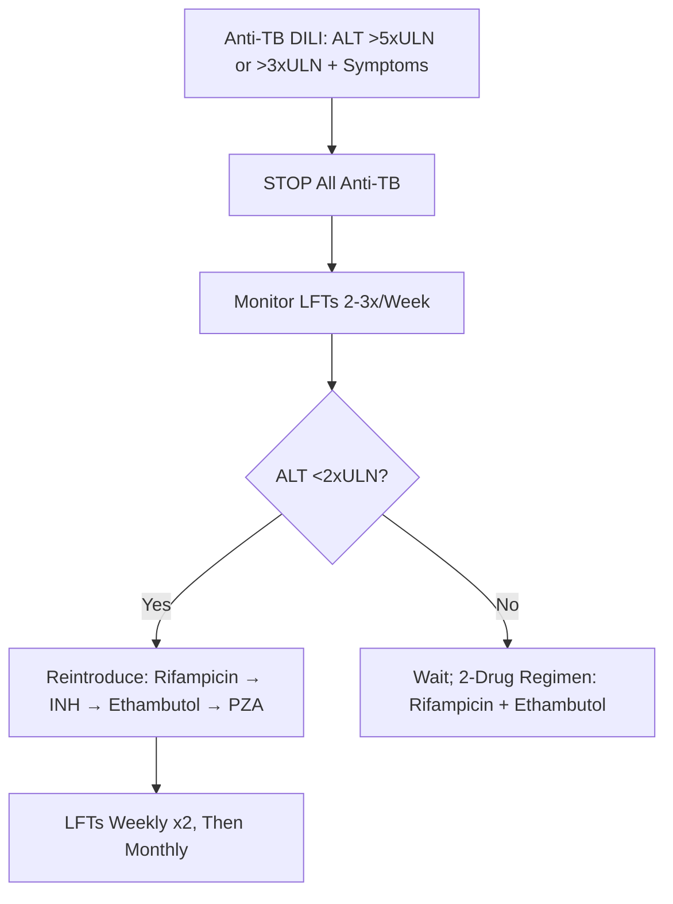
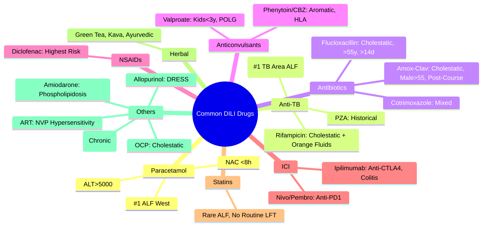

# Common Culprit Drugs in DILI

## Learning Objectives
- [ ] Identify top drugs causing DILI by pattern and frequency
- [ ] Know specific risk factors for each high-risk drug
- [ ] Apply clinical pearls for each drug class
- [ ] Identify FCPS/MRCP high-yield drug associations

---

## Top Drugs by DILI Frequency & Severity

```mermaid
flowchart TD
    A[Common Culprit Drugs] --> B[Paracetamol (ALF #1 West)]
    A --> C[Anti-TB: Isoniazid, Rifampicin]
    A --> D[Antibiotics: Amox-Clav, Flucloxacillin]
    A --> E[Anticonvulsants: Phenytoin, Valproate, Carbamazepine]
    A --> F[NSAIDs: Diclofenac]
    A --> G[Herbal/Alternative]
    A --> H[ICI: Ipilimumab, Nivolumab]
    A --> I[Statin]
    A --> J[Allopurinol]
    A --> K[Anti-retrovirals]
```

---

## 1. Paracetamol (Acetaminophen)

| Aspect | Detail |
|--------|--------|
| **Pattern** | **Hepatocellular** (Intrinsic) |
| **ALF Rank** | **#1 Cause of ALF in UK/USA** (50-70%) |
| **Mechanism** | NAPQI Accumulation → Glutathione Depletion → Centrilobular Necrosis |
| **Risk Factors** | **Fasting/Malnutrition**, Chronic Alcohol, CYP2E1 Inducers (Carbamazepine, Phenytoin, Rifampicin), HIV/AIDS |
| **ALT** | **>5000 U/L** (Often >10,000) |
| **Antidote** | **N-Acetylcysteine (NAC)** — Within 8h Optimal, Beneficial up to 24-48h |
| **Nomogram** | Rumack-Matthew (Single Acute OD Only) — Treat Line 150 mg/L at 4h |

> **FCPS/MRCP**: **Paracetamol = #1 ALF Cause (West)**; **NAC Within 8h**; **Staggered OD = Empiric NAC**

---

## 2. Anti-TB Drugs

### Isoniazid (INH)
| Aspect | Detail |
|--------|--------|
| **Pattern** | **Hepatocellular** |
| **Rank** | **#1 DILI-ALF in TB Endemic Areas** |
| **Incidence** | 5-30% Asymptomatic ALT Rise; 1-5% Symptomatic; <1% ALF |
| **Risk Factors** | **NAT2 Slow Acetylator**, Alcohol, Age >35, Malnutrition, HIV |
| **Latency** | 2-12 Weeks (Peak 4-8w) |
| **Monitoring** | LFTs Baseline, Monthly ×2, Then 3-Monthly |
| **ALT >5×ULN or >3×ULN + Symptoms** | **STOP All Anti-TB** |

### Rifampicin
| Aspect | Detail |
|--------|--------|
| **Pattern** | **Cholestatic / Mixed** |
| **Latency** | 2-8 Weeks |
| **Key Feature** | **Orange/Red Body Fluids** (Tears, Urine, Sweat) |
| **Interaction** | Potent CYP3A4 Inducer → ↓ Levels of ART, OCP, Warfarin, DOACs |
| **With INH** | Synergistic Hepatotoxicity |

### Pyrazinamide (PZA)
| Aspect | Detail |
|--------|--------|
| **Historical** | Most Hepatotoxic (High-Dose Regimens) |
| **Current** | Low-Dose (25 mg/kg) → Lower Hepatotoxicity |

### Anti-TB DILI Management Algorithm


---

## 3. Antibiotics

### Amoxicillin-Clavulanate
| Aspect | Detail |
|--------|--------|
| **Pattern** | **Cholestatic** |
| **Rank** | **Commonest Antibiotic DILI-ALF in West** |
| **Demographic** | **Male >55 Years** |
| **Latency** | **1-6 Weeks** (Can Occur **After Stopping**) |
| **Duration** | Prolonged (Months), 10% Chronicity |
| **Key** | **Male >55, Cholestatic, Can Occur Post-Course** |

### Flucloxacillin
| Aspect | Detail |
|--------|--------|
| **Pattern** | Cholestatic |
| **Risk Factors** | **>55 Years**, **Male**, **>14 Days Use** |
| **Latency** | 2-4 Weeks |
| **Key** | **>55y, Male, >14 Days Use** |

### Other Antibiotics
| Antibiotic | Pattern | Key Features |
|-----------|---------|--------------|
| **Cotrimoxazole** | Mixed | HIV Patients, Hypersensitivity (Rash, Eosinophilia) |
| **Erythromycin** | Cholestatic | Estolate Form > Base |
| **Tetracyclines** | Hepatocellular | High Dose IV → Microvesicular Steatosis |
| **Isoniazid** | Hepatocellular | NAT2 Slow Acetylators |

---

## 4. Anticonvulsants

| Drug | Pattern | Key Risk Factors |
|------|---------|------------------|
| **Phenytoin** | Hepatocellular | **Aromatic**, HLA-B*15:02 (Asian), Aromatic AA Cross-Reactivity |
| **Carbamazepine** | Hepatocellular | **Aromatic**, HLA-B*15:02, HLA-A*31:01, Cross-Reactivity with Phenytoin |
| **Valproate** | Hepatocellular | **Children <3y**, Polytherapy, **POLG Mutation (Alpers)** |
| **Lamotrigine** | Hypersensitivity/Mixed | Rash (Stevens-Johnson), Titration Reduces Risk |
| **Phenobarbital** | Hepatocellular/Enzyme Induction | Enzyme Induction (↓ Other Drug Levels) |

> **Valproate in Children**: **<3y + Polytherapy + POLG** = High Risk (Alpers Syndrome)

---

## 5. NSAIDs

| Drug | Pattern | Key Feature |
|------|---------|--------------|
| **Diclofenac** | Hepatocellular/Mixed | **Highest Risk Among NSAIDs** (Rare ALF) |
| **Ibuprofen/Naproxen** | Hepatocellular | Rare, Dose-Related |
| **Aspirin** | Hepatocellular | Reye's Syndrome (Children + Viral Illness) |
| **Celecoxib** | Hepatocellular | Lower GI Risk, Similar Hepatic Risk |

---

## 5. Herbal & Alternative Medicines

| Herb/Supplement | Pattern | Key Risk |
|----------------|---------|----------|
| **Green Tea Extract** | Hepatocellular | Catechins (EGCG), Weight Loss Supplements |
| **Kava** | Hepatocellular | Banned in Some Countries, Liver Failure Reports |
| **Herbalife** | Hepatocellular/Cholestatic | Multiple Ingredients, Case Reports |
| **Ayurvedic/TCM** | Variable | Heavy Metals (Lead, Mercury, Arsenic), Adulterants |
| **Black Cohosh** | Hepatocellular | Menopausal Symptoms, Autoimmune Features |
| **Germander (Teucrium)** | Hepatocellular | Weight Loss, Hepatotoxic Diterpenes |
| **Vitamin A** | Hepatocellular | Chronic Hypervitaminosis A (>25,000 IU/day) |
| **Niacin** | Hepatocellular | High Dose (>2g/day), Time-Release Formulations |

> **FCPS/MRCP**: **Always Ask Specifically About Herbal/OTC** — Patients Don't Volunteer

---

## 6. Immune Checkpoint Inhibitors (ICI)

| Agent | Pattern | Key Features |
|-------|---------|------------|
| **Ipilimumab (Anti-CTLA-4)** | Hepatocellular | **5-10% Incidence**, ↑ With Combo |
| **Nivolumab/Pembrolizumab (Anti-PD-1)** | Hepatocellular | 1-3% Incidence |
| **Combo (Ipi + Nivo)** | Hepatocellular | **15-30% Incidence** |
| **Onset** | 6-14 Weeks | |
| **Co-existent Colitis** | Common | **Same Pathway (CTLA-4/PD-1)** |
| **Management** | Grade 2: Hold + Pred 1mg/kg; Grade 3/4: IV Methylpred 2mg/kg + Infliximab if Steroid-Refractory | |

---

## 6. Statins

| Aspect | Detail |
|--------|--------|
| **Pattern** | Hepatocellular (Asymptomatic ALT Rise Most Common) |
| **Clinical ALF** | **Extremely Rare** (<1:1,000,000) |
| **Asymptomatic ALT Rise** | 0.5-3% (Usually <3×ULN, Self-Limited) |
| **Risk Factors** | High Dose, Drug Interactions (Fibrates, Niacin), Alcohol, Pre-existing Liver Disease |
| **Guideline** | **Do Not Routinely Monitor LFTs**; Check if Symptomatic |
| **Contraindication** | **Active Liver Disease / Unexplained Persistent ALT >3×ULN** |

---

## 7. Other Notable Drugs

| Drug | Pattern | Key Feature |
|------|---------|-------------|
| **Allopurinol** | Hypersensitivity (DRESS) | Rash, Eosinophilia, Fever, Renal Impairment |
| **Methotrexate** | Fibrosis/Cirrhosis (Chronic) | Dose-Dependent, Folic Acid Protective |
| **Amiodarone** | Steatosis/Phospholipidosis | Long-Term, High Dose, Mimic Alcohol |
| **OCP** | Cholestatic | Women, Benign, Reversible on Stopping |
| **Chlorpromazine** | Cholestatic | Fever, Eosinophilia, Rash |
| **Anti-retrovirals (ART)** | Variable | EFV (CNS), NVP (Hypersensitivity), PI (Metabolic) |
| **Ticlopidine** | Cholestatic | Rare, Withdrawn in Many Countries |

---

## FCPS/MRCP High-Yield Summary

| Drug | Pattern | Key FCPS/MRCP Pearl |
|------|---------|---------------------|
| **Paracetamol** | Hepatocellular | **#1 ALF West**, ALT>5000, NAC within 8h |
| **Isoniazid** | Hepatocellular | **#1 DILI-ALF in TB Areas**, NAT2 Slow |
| **Rifampicin** | Cholestatic/Mixed | **Orange Fluids**, Enzyme Inducer |
| **Amox-Clav** | Cholestatic | **Male >55, Post-Course Onset** |
| **Flucloxacillin** | Cholestatic | **>55y, Male, >14d Use** |
| **Phenytoin/Carbamazepine** | Hepatocellular | Aromatic, HLA Association |
| **Valproate** | Hepatocellular | **Children <3y, POLG** |
| **Diclofenac** | Hepatocellular | **Highest NSAID Risk** |
| **ICI (Ipilimumab)** | Hepatocellular | **Colitis Co-Exists**, Anti-CTLA4>PD1 |
| **Statins** | Hepatocellular | **Rare ALF**, Don't Routine Monitor LFTs |
| **Oral Contraceptive** | Cholestatic | Benign, Reversible |
| **Green Tea Extract** | Hepatocellular | Weight Loss Supplement |
| **ICI Hepatitis** | Hepatocellular | **Anti-CTLA4 > Anti-PD1**, Colitis Co-exists |

---

## Viva Questions

1. **Which drug is the commonest cause of ALF in the UK/USA?**
2. **Which anti-TB drug causes hepatocellular injury? Which causes cholestatic?**
3. **What is the demographic for amoxicillin-clavulanate DILI?**
4. **What is the demographic for flucloxacillin DILI?**
4. **What is the highest risk NSAID for hepatotoxicity?**
5. **What are the risk factors for valproate hepatotoxicity?**
5. **What is the pattern of ICI-induced hepatitis?**
6. **Which drug causes orange discolouration of body fluids?**
6. **What is the DRESS syndrome? Which drugs cause it?**
7. **Are statins a common cause of ALF?**
8. **What is the risk of valproate in children under 3?**
9. **What herbal supplements cause hepatotoxicity?**
10. **What is the interaction between rifampicin and OCP/warfarin?**

---

## Confusions & Mnemonics

| Confusion | Clarification |
|-----------|---------------|
| INH vs Rifampicin Pattern | INH = Hepatocellular; Rifampicin = Cholestatic/Mixed |
| Amox-Clav vs Flucloxacillin | Both Cholestatic; Amox-Clav: Male>55, Post-Course; Fluclox: >14d Use |
| Valproate Risk | **Children <3y + Polytherapy + POLG** = Alpers Syndrome |
| Statins & ALF | **Extremely Rare** (<1:1M) — Don't Routine Monitor LFTs |
| ICI Hepatitis | **Anti-CTLA4 (Ipilimumab) > Anti-PD1** Incidence; **Colitis Co-Exists** |
| Rifampicin Orange Fluids | **Diagnostic Clue** — Tears, Urine, Sweat |
| DRESS Syndrome | Drug Reaction with Eosinophilia and Systemic Symptoms — Allopurinol, Aromatic Anticonvulsants, Sulfonamides |
| ICI Hepatitis Management | Grade 2: Hold + Pred 1mg/kg; Grade 3/4: IV Methylpred 2mg/kg + Infliximab |

---

## Mind Map



---

## One-Page Revision Card

| **Drug** | **Pattern** | **Key FCPS/MRCP Feature** |
|--------|-------------|---------------------------|
| **Paracetamol** | Hepatocellular | **#1 ALF West**, ALT>5000, NAC <8h |
| **Isoniazid** | Hepatocellular | **#1 DILI-ALF in TB Areas**, NAT2 Slow |
| **Rifampicin** | Cholestatic/Mixed | **Orange Fluids**, Enzyme Inducer |
| **Amox-Clav** | Cholestatic | **Male>55, Post-Course** |
| **Flucloxacillin** | Cholestatic | **>55y, Male, >14d Use** |
| **Phenytoin/CBZ** | Hepatocellular | Aromatic, HLA-B*15:02 |
| **Valproate** | Hepatocellular | **Kids<3y, POLG (Alpers)** |
| **Diclofenac** | Hepatocellular | **Highest NSAID Risk** |
| **ICI (Ipi)** | Hepatocellular | **Anti-CTLA4>PD1**, Colitis Co-exists |
| **Statins** | Hepatocellular | **Rare ALF**, No Routine LFT |
| **Green Tea** | Hepatocellular | Weight Loss Supplement |
| **Rifampicin** | Cholestatic/Mixed | **Orange Fluids**, CYP3A4 Inducer |

| **Toxic Pattern** | **Key Drug** |
|-------------------|--------------|
| Hepatocellular ALF | Paracetamol, INH |
| Cholestatic | Amox-Clav, Fluclox |
| Mixed | Rifampicin, Cotrimoxazole |
| DRESS | Allopurinol, Aromatic Anticonvulsants, Sulfonamides |
| Fibrosis/Cirrhosis | Methotrexate, Amiodarone, Vitamin A |

---

## Spaced Repetition Tracker

| Day | 1 | 3 | 7 | 15 | 30 |
|-----|---|---|---|----|----|
| Paracetamol ALF Rank | ☐ | ☐ | ☐ | ☐ | ☐ |
| INH vs Rifampicin Pattern | ☐ | ☐ | ☐ | ☐ | ☐ |
| Amox-Clav vs Fluclox | ☐ | ☐ | ☐ | ☐ | ☐ |
| Valproate Kids <3y | ☐ | ☐ | ☐ | ☐ | ☐ |
| ICI Hepatitis Anti-CTLA4>PD1 | ☐ | ☐ | ☐ | ☐ | ☐ |

---

## Self-Test Scorecard

| Question | My Answer | Correct? |
|----------|-----------|----------|
| #1 ALF Cause West |  |  |
| INH vs Rifampicin |  |  |
| Amox-Clav Demographics |  |  |
| Valproate Risk Group |  |  |
| ICI Colitis Association |  |  |

---

## Local Navigation

- [[Drug-Induced Liver Injury/Classification and patterns|DILI Classification]]
- [[Drug-Induced Liver Injury/Diagnosis (RUCAM, exclusion)|DILI Diagnosis]]
- [[Acute Liver Failure/Paracetamol-induced hepatotoxicity|Paracetamol ALF]]
- [[Acute Liver Failure/Non-paracetamol drug-induced liver injury|Non-PCM DILI ALF]]
- [[Jaundice and LFT Interpretation/DILI patterns|DILI Patterns]]