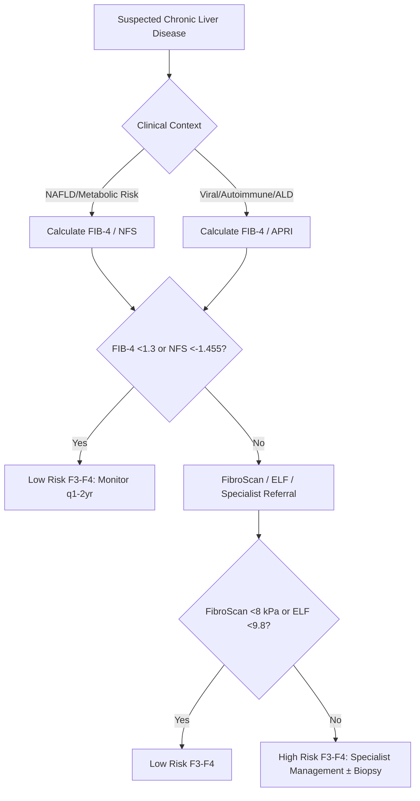

> [!tip] **FCPS/MRCP Priority: HIGH**
> **Chronic Liver Disease & Cirrhosis = Final common pathway of chronic liver injury** — Aetiology (ALD, NAFLD/NASH, Viral, Autoimmune, Inherited), **Compensated vs Decompensated** classification, **Child-Pugh/MELD scoring**, **Non-invasive fibrosis assessment** (FIB-4, NFS, APRI, ELF, FibroScan), **HCC Surveillance**, **Aetiology-specific management**.

---

## 1. Learning Objectives
By the end of this note you should be able to:
- [ ] List **major aetiologies** of chronic liver disease and cirrhosis
- [ ] Distinguish **compensated** vs **decompensated** cirrhosis
- [ ] Apply **Child-Pugh** and **MELD/MELD-Na** scoring systems
- [ ] Apply **non-invasive fibrosis assessment** (FIB-4, NFS, APRI, ELF, FibroScan)
- [ ] Apply **HCC surveillance** criteria
- [ ] Outline **aetiology-specific management** principles

---

## 1. Definition & Classification

| Term | Definition |
|------|------------|
| **Chronic Liver Disease (CLD)** | Persistent hepatic injury/inflammation/fibrosis >6 months |
| **Cirrhosis** | **Diffuse fibrosis** with **nodular regeneration** distorting hepatic architecture |
| **Compensated Cirrhosis** | **No** history of ascites, variceal bleed, hepatic encephalopathy, jaundice |
| **Decompensated Cirrhosis** | **Current or past** ascites, variceal bleed, hepatic encephalopathy, or jaundice |

### Natural History
| Stage | Description | Progression |
|-------|-------------|-------------|
| **F0-F1** | No/minimal fibrosis | Stable, slow |
| **F2** | Significant fibrosis (periportal) | ~15%/yr to F3-F4 |
| **F3** | Advanced fibrosis (bridging) | High risk decompensation |
| **F4 (Cirrhosis)** | **Compensated** → **Decompensated** | **Decompensation rate ~5-7%/yr** |

---

## 2. Aetiology of Chronic Liver Disease

| Aetiology | Prevalence (UK) | Key Features |
|-----------|-----------------|--------------|
| **Alcoholic Liver Disease (ALD)** | ~40% cirrhosis | AST:ALT >2:1, steatosis → AH → cirrhosis |
| **NAFLD/NASH** | **Rising rapidly** (~25-30%) | Metabolic syndrome, FIB-4/FibroScan, weight loss |
| **Chronic Viral Hepatitis** (HBV, HCV) | ~15-20% | HBV: HBsAg+, DNA; HCV: RNA+, genotype |
| **Autoimmune** (AIH, PBC, PSC) | ~10% | AIH: ANA/SMA/LKM1; PBC: AMA; PSC: MRCP beading |
| **Inherited/Metabolic** | ~5% | Wilson (ceruloplasmin, Cu), Haemochromatosis (HFE, TSAT), A1AT (PiZZ) |
| **Cryptogenic** | ~10% | Exclusion diagnosis; often burnt-out NASH |

---

## 3. Non-Invasive Fibrosis Assessment

### First-Line Screening Tests

| Test | Formula | Cut-offs for Advanced Fibrosis (F3-F4) |
|------|---------|----------------------------------------|
| **FIB-4** | **Age × AST / (Platelets × √ALT)** | **<1.30** = Low risk; **>2.67** = High risk |
| **NFS (NAFLD Fibrosis Score)** | Age, BMI, IFG, AST/ALT, Platelets, Albumin | **<-1.455** Low; **>0.676** High |
| **APRI** | **AST/ULN / Platelets (10⁹/L) × 100** | **<0.5** No sig fibrosis; **>1.5** Cirrhosis |

### Second-Line / Specialist Tests

| Test | Principle | Cut-offs | Best For |
|------|-----------|----------|----------|
| **FibroScan (VCTE)** | Liver stiffness (kPa) | **<8 F0-F1, 8-9 F2, 9-12 F3, >12 F4** | **Gold standard non-invasive**; XL probe if BMI>30 |
| **ELF Test** | HA + PIIINP + TIMP-1 | Commercial algorithm | **High accuracy** for F3-F4 |
| **Liver Biopsy** | **Gold Standard** | Ishak/Metavir F0-F4 | **Gold standard**; sampling error (~15-20%) |

### Diagnostic Algorithm

---

## 3. Compensated vs Decompensated Cirrhosis

| Feature | Compensated | Decompensated |
|---------|-------------|---------------|
| **Definition** | No ascites, variceal bleed, HE, jaundice | **Any** of: ascites, variceal bleed, HE, jaundice |
| **Child-Pugh** | A (5-6) | B (7-9) or C (10-15) |
| **MELD** | <10-12 | ≥12-15 |
| **Median Survival** | >12 years | 2-5 years (B), <2 years (C) |
| **Management** | Surveillance, prophylaxis, lifestyle | Complication management, transplant referral |
| **HCC Surveillance** | 6-monthly US ± AFP | 6-monthly US ± AFP |

### Child-Pugh Score

| Parameter | 1 Point | 2 Points | 3 Points |
|-----------|---------|----------|----------|
| **Bilirubin (µmol/L)** | <34 | 34-50 | >50 |
| **Albumin (g/L)** | >35 | 28-35 | <28 |
| **INR** | <1.7 | 1.7-2.3 | >2.3 |
| **Ascites** | None | Mild/controlled | Tense/refractory |
| **Hepatic Encephalopathy** | None | Grade I-II | Grade III-IV |

| Class | Score | 1-Year Survival | 2-Year Survival |
|-------|-------|-----------------|-----------------|
| **A** | 5-6 | 100% | 85% |
| **B** | 7-9 | 80% | 60% |
| **C** | 10-15 | 45% | 35% |

### MELD / MELD-Na

**MELD = 3.78 × ln(bilirubin mg/dL) + 11.2 × ln(INR) + 9.57 × ln(creatinine mg/dL) + 6.43**

**MELD-Na = MELD + 1.32 × (137 - Na) - [0.033 × MELD × (137 - Na)]** (Na capped 125-137)

| MELD | 3-Month Mortality | Transplant Priority |
|------|-------------------|-------------------|
| <10 | <5% | Low |
| 10-19 | 6-20% | Moderate |
| 20-29 | 20-50% | High |
| 30-39 | 50-75% | Very High |
| ≥40 | >75% | Urgent |

> **Creatinine capped at 4.0 mg/dL** (dialysis = 4.0); **Na capped 125-137**

---

## 4. Aetiology-Specific Management

| Aetiology | Key Management |
|-----------|----------------|
| **ALD** | **Abstinence** (cornerstone), Nutrition (35-40 kcal/kg, 1.5g/kg protein), Thiamine, Zinc; AH → Maddrey DF ≥32 → Prednisolone 40mg ×28d |
| **NAFLD/NASH** | **Weight loss ≥7-10%**, Mediterranean/low-carb diet, Exercise 150-300min/wk; F2-F3 → Pioglitazone/Semaglutide/Resmetirom/Vit E |
| **HBV** | Entecavir/TDF/TAF if immune active/cirrhosis; HCC surveillance q6mo |
| **HCV** | **DAA (GLE/PIB, SOF/VEL)** → SVR12 = cure; Post-SVR surveillance if cirrhosis |
| **AIH** | Prednisolone 30-40mg → Azathioprine 1.5mg/kg maintenance ≥2yrs |
| **PBC** | UDCA 13-15mg/kg; OCA if inadequate response at 12mo |
| **PSC** | UDCA not proven; ERCP for dominant strictures; CCA surveillance (MRI+CA19-9) |
| **Wilson** | Chelator (Penicillamine/Trientine) → Zinc maintenance |
| **Haemochromatosis** | Venesection 500ml weekly → Ferritin <50; Maintenance q2-4mo |
| **A1AT Deficiency** | PiZZ → Augmentation (Prolastin 60mg/kg IV weekly) + Smoking cessation |

---

## 4. HCC Surveillance

| Population | Interval | Modality |
|------------|----------|----------|

*...continued (truncated for renderer performance)*