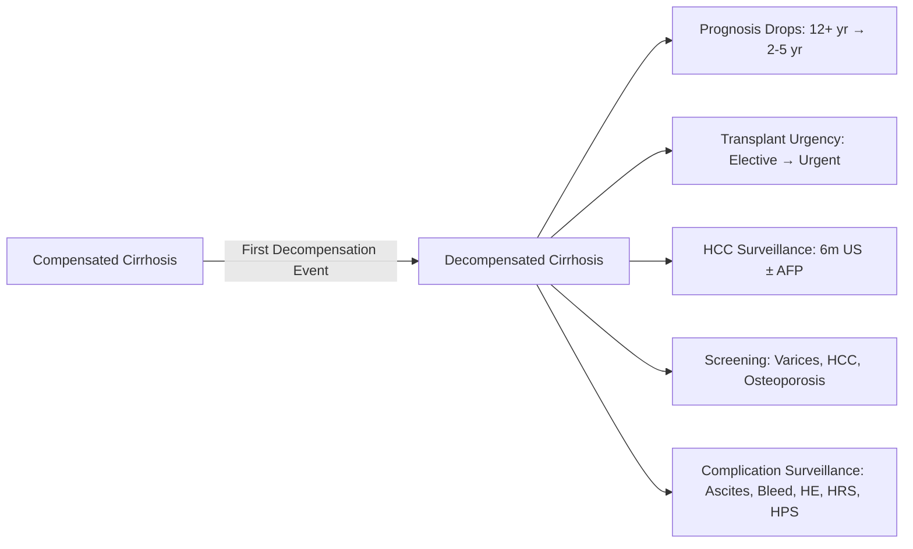
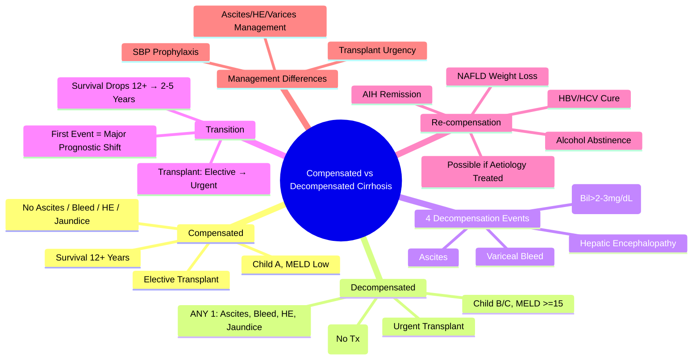

## 1. Learning Objectives
- [ ] Apply clinical criteria distinguishing compensated vs decompensated cirrhosis
- [ ] Identify the 4 decompensation events
- [ ] Understand prognostic implications and management differences
- [ ] Apply scoring systems (Child-Pugh, MELD) in both states
- [ ] Identify FCPS/MRCP high-yield transition points and management

---

## 2. Definitions

| State | Definition |
|-------|------------|
| **Compensated Cirrhosis** | Cirrhosis **without** history of: Ascites, Variceal Bleed, Hepatic Encephalopathy, or Jaundice (Bilirubin >2-3 mg/dL) |
| **Decompensated Cirrhosis** | Cirrhosis **with** current or past: **Ascites, Variceal Bleed, Hepatic Encephalopathy, or Jaundice** (Bilirubin >2-3 mg/dL) |

> **FCPS/MRCP**: **First Decompensation Event** = Transition from Compensated → Decompensated — **Major Prognostic Threshold**

---

## 3. The 4 Decompensation Events

```mermaid
flowchart TD
    A[Compensated Cirrhosis] --> B{Decompensation Event}
    B -->|Ascites| C[Decompensated]
    B -->|Variceal Bleed| C
    B -->|Hepatic Encephalopathy| C
    B -->|Jaundice (Bil >2-3 mg/dL)| C
    C --> D[Decompensated Cirrhosis]
```

| Decompensation Event | Definition | Typical Presentation |
|----------------------|------------|---------------------|
| **1. Ascites** | New-onset peritoneal fluid accumulation | Abdominal distension, shifting dullness, flank dullness |
| **2. Variceal Bleed** | Haematemesis/Malaena from portal hypertensive varices | Haematemesis, melaena, hypotension, tachycardia |
| **3. Hepatic Encephalopathy** | Neuropsychiatric dysfunction from liver failure | Asterixis, confusion, personality change, coma |
| **4. Jaundice** | Serum Bilirubin >2-3 mg/dL (>34-50 μmol/L) | Yellow sclera/skin, dark urine, pale stools |

> **FCPS/MRCP**: **Any ONE** of these = Decompensated Cirrhosis — **Prognosis Changes Dramatically**

---

## 4. Clinical Features Comparison

| Feature | Compensated Cirrhosis | Decompensated Cirrhosis |
|-------|----------------------|-------------------------|
| **Ascites** | Absent | **Present** (or h/o) |
| **Variceal Bleed** | Never | **History/Current** |
| **Hepatic Encephalopathy** | Never | **History/Current** |
| **Jaundice** | Absent (Bil <2 mg/dL) | **Present** (Bil >2-3 mg/dL) |
| **Synthetic Function** | Preserved (INR Normal, Albumin >35) | **Impaired** (INR >1.5, Albumin <35) |
| **Portal Pressure (HVPG)** | ≥10 mmHg (CSPH) | ≥12 mmHg (Variceal Risk) |
| **Platelet Count** | Often >100 | Often <100 (Hypersplenism) |
| **Median Survival** | **12+ Years** | **2-5 Years** (Without Transplant) |
| **Transplant Urgency** | Elective (MELD <15) | **Urgent** (MELD ≥15) |

---

## 5. Transition Points: The Compensated → Decompensated Shift



### Key Implications of Decompensation
| Domain | Compensated | Decompensated |
|--------|-------------|---------------|
| **Survival** | 12+ Years | 2-5 Years (No Tx) |
| **Transplant Referral** | MELD <15 (Elective) | **MELD ≥15 → Urgent** |
| **HCC Surveillance** | 6m US ± AFP | 6m US ± AFP (Same) |
| **Variceal Screening** | Endoscopy at Diagnosis | Already Done / Surveillance |
| **Ascites Management** | N/A | Diuretics, LVP, TIPS |
| **HE Prophylaxis** | Not Needed | Lactulose if Recurrent |
| **Infection Risk** | Baseline | ↑↑ (SBP, Sepsis) |

---

## 6. Aetiology of Decompensation

| Precipitant | Common Decompensation Type |
|-------------|----------------------------|
| **Infection (SBP, Pneumonia)** | Ascites, HE, AKI/HRS |
| **GI Bleed** | Hypovolaemia → HRS, Bleed → HE |
| **Alcohol Binge** | Alcoholic Hepatitis → Jaundice, Ascites, HE |
| **Drugs (NSAIDs, Sedatives)** | AKI/HRS, HE |
| **Electrolyte Imbalance** | Hyponatraemia, Hypokalaemia → HE, HRS |
| **Non-Adherence (Diuretics, Lactulose)** | Ascites Recurrence, HE Relapse |
| **TIPS Dysfunction** | Recurrent Ascites, Variceal Bleed |
| **HCC Development** | Jaundice, Ascites, Pain |

---

## 7. Scoring Systems in Both States

| Scoring System | Compensated | Decompensated |
|----------------|-------------|---------------|
| **Child-Pugh** | Usually A (5-6) | B (7-9) or C (10-15) |
| **MELD/MELD-Na** | Low (<10-12) | Often ≥15 (Transplant Threshold) |
| **HVPG** | ≥10 (CSPH) | ≥12 (Varices/Bleeding Risk) |
| **Platelet Count** | Often >100-150 | Often <100-150 |
| **Albumin** | >35 g/L | <35 g/L (Often <30) |
| **Bilirubin** | <2 mg/dL | >2-3 mg/dL |

---

## 8. Management Implications

| Aspect | Compensated | Decompensated |
|--------|-------------|---------------|
| **Transplant Referral** | MELD ≥15 / Child B/C (Elective) | **Urgent** (MELD ≥15, Complications) |
| **HCC Surveillance** | 6m US ± AFP | 6m US ± AFP (Same) |
| **Variceal Screening** | Endoscopy at Diagnosis | Endoscopy Done / Surveillance |
| **Ascites** | N/A | Diuretics → LVP → TIPS |
| **Varices** | Primary Prophylaxis (NSBB/EVL) | Secondary Prophylaxis (NSBB+EVL) |
| **HE Prophylaxis** | Not Needed | Lactulose if Recurrent |
| **SBP Prophylaxis** | Not Routine | Primary (If High Risk) / Secondary (Post-SBP) |
| **Vaccination** | Hep A/B, Pneumococcal, Flu | Hep A/B, Pneumococcal, Flu |
| **Nutrition** | Normal | High Protein (1.2-1.5 g/kg), Low Salt |

---

## 9. Re-compensation: Can Decompensated Become Compensated?

| Scenario | Possible? |
|----------|-----------|
| **Alcoholic Hepatitis Treated** | Yes — If Abstinent, May Re-compensate |
| **Viral Hepatitis Treated (HBV NUC, HCV DAA)** | Yes — SVR/Cure → Histological Regression Possible |
| **Autoimmune Hepatitis Treated** | Yes — Steroids → Remission → Re-compensation |
| **NAFLD with Weight Loss** | Yes — 10% Weight Loss → Fibrosis Regression |
| **TIPS for Refractory Ascites** | May Improve Haemodynamics but **Not True Re-compensation** |

> **True Re-compensation** = Resolution of ALL Decompensation Events + Normalisation of Synthetic Function

---

## 10. FCPS/MRCP High-Yield Summary

| Concept | Key Points |
|---------|------------|
| **Compensated** | No Ascites, Bleed, HE, Jaundice — Survival 12+ yr |
| **Decompensated** | **Any 1**: Ascites, Bleed, HE, Jaundice — Survival 2-5 yr |
| **First Decompensation** | Major Prognostic Threshold |
| **Survival Drop** | 12+ yr → 2-5 yr |
| **Transplant Urgency** | Compensated: Elective; Decompensated: Urgent (MELD≥15) |
| **4 Decompensation Events** | Ascites, Variceal Bleed, HE, Jaundice |
| **Re-compensation Possible** | If Aetiology Treated (Alcohol, Viral, AIH, NAFLD) |
| **Scoring** | Compensated: Child A/MELD Low; Decompensated: Child B/C, MELD≥15 |

---

## 11. Viva Questions

1. **Define compensated vs decompensated cirrhosis.**
2. **What are the 4 decompensation events?**
3. **How does prognosis change with decompensation?**
4. **What survival difference between compensated and decompensated?**
4. **What is the transplant urgency for each?**
5. **Can decompensated cirrhosis become compensated again?**
5. **What scoring systems distinguish the two states?**
6. **What are the management differences?**
6. **What is the most common precipitant of decompensation?**
7. **How does prognostic scoring differ between the two?**
8. **What is the key factor determining transplant urgency?**

---

## 12. Confusions & Mnemonics

| Confusion | Clarification |
|-----------|---------------|
| Decompensation Definition | **Any ONE** of 4 events = Decompensated (Not All Required) |
| Bilirubin Threshold | **>2-3 mg/dL** (34-50 μmol/L) for Jaundice Definition |
| Survival Numbers | Compensated: **12+ yrs**; Decompensated: **2-5 yrs** (No Tx) |
| MELD Threshold | **≥15** = Transplant Referral (Decompensated Usually Exceeds) |
| Child-Pugh Classes | Compensated = Usually A; Decompensated = B or C |
| Re-compensation | **Possible** if Aetiology Treated (Alcohol, HBV, HCV, AIH, NAFLD) |
| TIPS | Does NOT Re-compensate — Palliation/Bridge to Transplant |
| First Decompensation | **Major Prognostic Event** — Survival Drops Drastically |

---

## 13. Mind Map



---

## 14. One-Page Revision Card

| **State** | **Criteria** | **Survival** | **Transplant** |
|-----------|--------------|--------------|----------------|
| **Compensated** | No Ascites, Bleed, HE, Jaundice | **12+ Years** | Elective (MELD<15) |
| **Decompensated** | **ANY 1**: Ascites, Bleed, HE, Jaundice | **2-5 Years** | **Urgent (MELD≥15)** |

| **Decompensation Event** | **Key Feature** |
|--------------------------|-----------------|
| Ascites | New Fluid, Shifting Dullness |
| Variceal Bleed | Haematemesis/Malaena |
| HE | Asterixis, Confusion, Coma |
| Jaundice | Bilirubin >2-3 mg/dL |

| **Survival** | **Compensated** | **Decompensated** |
|--------------|-----------------|-------------------|
| Median (No Tx) | 12+ Years | 2-5 Years |
| 1-Year | >95% | 60-80% |

| **Scoring** | **Compensated** | **Decompensated** |
|-------------|-----------------|-------------------|
| Child-Pugh | A (5-6) | B/C (7-15) |
| MELD | <10-12 | ≥15 (Tx Threshold) |

---

## 15. Spaced Repetition Tracker

| Day | 1 | 3 | 7 | 15 | 30 |
|-----|---|---|---|----|----|
| 4 Decompensation Events | ☐ | ☐ | ☐ | ☐ | ☐ |
| Survival Difference | ☐ | ☐ | ☐ | ☐ | ☐ |
| Transplant Urgency | ☐ | ☐ | ☐ | ☐ | ☐ |
| Key Lab Differences | ☐ | ☐ | ☐ | ☐ | ☐ |

---

## 16. Self-Test Scorecard

| Question | My Answer | Correct? |
|----------|-----------|----------|
| 4 Decompensation Events |  |  |
| Survival Difference |  |  |
| Transplant Urgency |  |  |
| Definition of Decompensated |  |  |
| Precipitants of Decompensation |  |  |

---

## 17. Local Navigation

- [[Chronic Liver Disease and Cirrhosis/Definition and classification|Definition & Classification]]
- [[Chronic Liver Disease and Cirrhosis/Child-Pugh and MELD scores|Child-Pugh & MELD]]
- [[Portal Hypertension and Complications/Ascites|Ascites]]
- [[Portal Hypertension and Complications/Varices|Varices]]
- [[Portal Hypertension and Complications/Hepatic Encephalopathy|HE]]
- [[Portal Hypertension and Complications/Acute variceal bleeding management|Variceal Bleed]]
- [[Liver Transplantation/Liver Transplantation|Liver Transplant]]