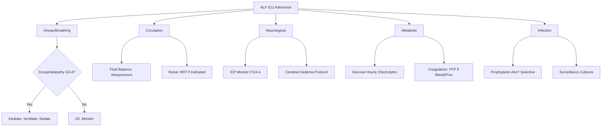
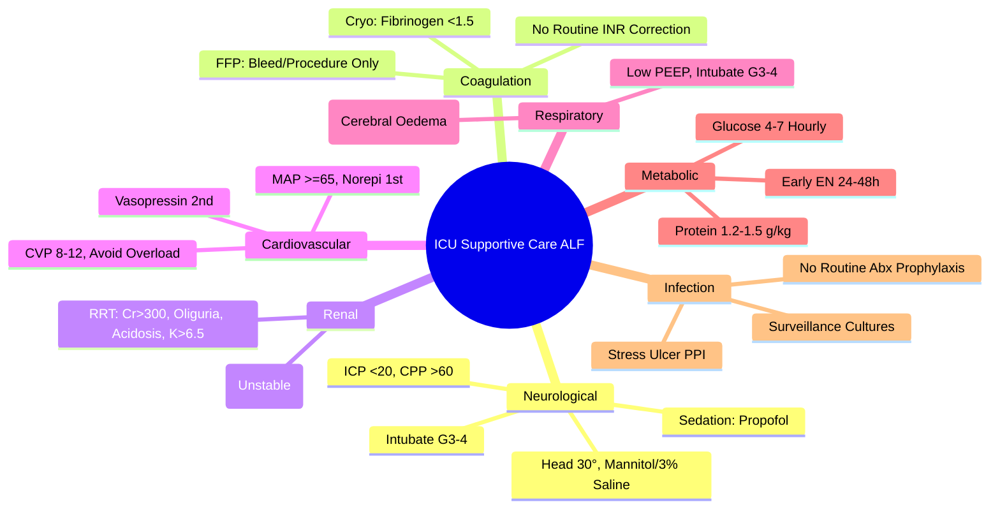

# ICU Supportive Care in Acute Liver Failure

## Learning Objectives
- [ ] Implement multi-organ support in ALF ICU
- [ ] Manage cerebral oedema and intracranial hypertension
- [ ] Prevent and treat infections
- [ ] Manage coagulopathy and bleeding
- [ ] Support renal, cardiovascular, and respiratory systems
- [ ] Identify FCPS/MRCP high-yield ICU management steps

---

## Multi-Organ Support Framework

---

## 1. Neurological Support & Cerebral Oedema

### Pathophysiology
- **Ammonia → Astrocyte Swelling** (Glutamine accumulation)
- **Inflammation → BBB Disruption** (Cytokines, ROS)
- **Cerebral Blood Flow Dysregulation** (Loss of Autoregulation)

### Monitoring
| Parameter | Method | Target |
|-----------|--------|--------|
| **Encephalopathy** | Clinical (Hourly) | Detect Progression |
| **ICP** | Intraparenchymal Bolt (G3-4) | **<20 mmHg** |
| **CPP** | MAP - ICP | **>60 mmHg** |
| **Pupils** | Hourly | Symmetry, Reactivity |
| **EEG** | Continuous (If Available) | Non-Convulsive Seizures |

### Cerebral Oedema Management Protocol

| Step | Intervention | Target |
|------|--------------|--------|
| **1. Head Position** | **Head Up 30°**, Neutral Neck | ICP ↓ |
| **2. Sedation** | **Propofol** (Short-acting, ICP ↓) or **Midazolam** | RASS -2 to -3 |
| **3. Osmotherapy** | **Mannitol 0.5-1g/kg** (Bolus) OR **3% Saline 2-5 ml/kg** | ICP <20 mmHg |
| **4. Hyperventilation** | PaCO₂ 30-35 mmHg (Short-term) | Temporary ICP ↓ |
| **5. Barbiturates** | Thiopental (Refractory) | Last Resort |
| **6. Hypothermia** | 32-34°C (Controversial) | Refractory |

### Neurological Targets
| Parameter | Target |
|-----------|--------|
| **ICP** | **<20 mmHg** |
| **CPP** | **>60 mmHg** (MAP - ICP) |
| **PaCO₂** | 30-35 mmHg (If Hyperventilating) |
| **Temperature** | **35-36°C** (Mild Hypothermia) |
| **Glucose** | **4-7 mmol/L** (Tight Control) |

---

## 2. Coagulation Management

### Monitoring
| Test | Frequency | Transfusion Threshold |
|------|-----------|----------------------|
| **PT/INR** | 4-6 Hourly | INR >2.0 + Bleeding/Procedure |
| **Fibrinogen** | 6-12 Hourly | <1.5 g/L → Cryoprecipitate |
| **Platelets** | 6-12 Hourly | <50 ×10⁹/L (Bleeding) / <20 (Spontaneous) |
| **D-dimer / FDP** | Daily | DIC Screen |

### Transfusion Protocol
| Product | Indication | Dose |
|---------|------------|------|
| **FFP** | INR >2.0 + Active Bleeding / Invasive Procedure | 15-20 ml/kg |
| **Cryoprecipitate** | Fibrinogen <1.5 g/L | 1 Unit/10 kg |
| **Platelets** | <50 ×10⁹/L (Bleeding/Procedure) / <20 ×10⁹/L (Prophylactic) | 1 Adult Dose |
| **Vitamin K** | INR Rising / Prolonged | 10 mg IV (If Deficient) |
| **rFVIIa** | **NOT Routine** (Thrombosis Risk) | Life-Threatening Bleeding Only |

> **Do NOT Correct INR Routinely** — Only for Active Bleeding or Invasive Procedures

---

## 3. Renal Support

### HRS/AKI in ALF
| Parameter | Threshold for RRT |
|-----------|-------------------|
| **Creatinine** | >300 μmol/L (or Rising Rapidly) |
| **Urine Output** | <0.5 ml/kg/h for >6h |
| **Fluid Overload** | >10% FO, Pulmonary Oedema |
| **Electrolytes** | K >6.5, pH <7.15 |
| **Urea** | >40 mmol/L |

### RRT Modalities
| Modality | Indication | Advantage |
|----------|------------|-----------|
| **CVVH / CVVHDF** | **First-Line** (Haemodynamically Unstable) | Continuous, Haemodynamic Stability |
| **IHD** | Stable, Access Available | Efficient, Shorter |
| **PEX / MARS** | Bridge to Transplant | Ammonia/Toxin Removal |

---

## 4. Cardiovascular Support

### Haemodynamic Targets
| Parameter | Target |
|-----------|--------|
| **MAP** | **≥65 mmHg** |
| **CVP** | 8-12 mmHg (Avoid Overload) |
| **Lactate** | <2 mmol/L (Trending Down) |
| **ScvO₂** | >70% |

### Vasopressors
| Drug | Dose | Indication |
|------|------|------------|
| **Norepinephrine** | 0.01-3 μg/kg/min | **First-Line** (Alpha > Beta) |
| **Vasopressin** | 0.01-0.04 U/min | **Second-Line** (Vasodilatory Shock) |
| **Dobutamine** | 2-20 μg/kg/min | Cardiac Dysfunction + Low CO |

### Fluid Management
- **Goal**: **Euvolaemia** — Avoid Overload (Worsens Cerebral Oedema, Ascites)
- **Albumin** 20-40g/day (If Hypoalbuminaemic, HRS, Large Volume Paracentesis)
- **CVP Target**: 8-12 mmHg (Avoid High CVP → Portal Hypertension, Cerebral Oedema)

---

## 5. Respiratory Support

### Ventilation Strategy
| Parameter | Target |
|-----------|--------|
| **PaO₂** | >10 kPa (80 mmHg) |
| **PaCO₂** | **30-35 mmHg** (If Cerebral Oedema) |
| **FiO₂** | Minimum to Maintain Target |
| **PEEP** | Low (5-8 cmH₂O) — Avoid High PEEP (↑ ICP) |

### Indications for Intubation
- **Encephalopathy Grade 3-4** (GCS ≤8)
- **Inability to Protect Airway**
- **Severe Hypoxaemia** (PaO₂ <8 kPa on High FiO₂)
- **Respiratory Acidosis** (pH <7.20)

---

## 6. Metabolic & Nutritional Support

### Glucose Control
- **Target**: **4-7 mmol/L** (72-126 mg/dL)
- **Insulin Infusion** (Tight Glycaemic Control)
- **Avoid Hypoglycaemia** — Hourly Glucose Monitoring

### Electrolytes
| Electrolyte | Target | Replacement |
|-------------|--------|-------------|
| **Potassium** | 4.0-4.5 mmol/L | KCl IV (Central if >40 mmol/L) |
| **Magnesium** | 0.8-1.0 mmol/L | MgSO₄ IV |
| **Phosphate** | 0.8-1.0 mmol/L | K₂HPO₄/Na₂HPO₄ IV |
| **Calcium** | Ionised 1.1-1.3 mmol/L | Ca Gluconate/Chloride IV |

### Nutrition
- **Early Enteral Nutrition** (Within 24-48h) — **Preferred**
- **Protein**: 1.2-1.5 g/kg/day (Do NOT Restrict)
- **Calories**: 25-30 kcal/kg/day
- **Route**: NG/NJ Tube (Post-Pyloric Preferred if Gastroparesis)
- **If Enteral Not Possible**: TPN (Central Line)

---

## 7. Infection Prevention & Management

### Prophylaxis
| Agent | Indication |
|-------|------------|
| **Selective Gut Decontamination** | Some Units (Controversial) |
| **IV Proton Pump Inhibitor** | Stress Ulcer Prophylaxis (All ICU) |
| **Antifungal** | High-Risk (Prolonged ICU, Broad Abx, TPN) |

### Surveillance
| Culture | Frequency |
|---------|-----------|
| **Blood** | Daily if Fever/Leukocytosis; On Admission |
| **Urine** | Daily if Catheterised |
| **Sputum/BAL** | If Intubated (q48-72h) |
| **Ascitic Fluid** | If Paracentesis Performed |
| **Line Tips** | On Removal |

### Empirical Antibiotics (If Sepsis Suspected)
| Scenario | Regimen |
|----------|---------|
| **Community-Acquired** | Ceftriaxone 2g IV + Metronidazole |
| **Healthcare-Associated** | Piperacillin-Tazobactam 4.5g q6h |
| **Fungal (Candida)** | Caspofungin / Anidulafungin |
| **MRSA** | Add Vancomycin / Linezolid |

---

## FCPS/MRCP High-Yield Summary

| System | Key Targets |
|--------|-------------|
| **Neurological** | ICP <20, CPP >60, Head 30°, Mannitol/3% Saline, Propofol |
| **Coagulation** | No Routine Correction; FFP Only for Bleed/Procedure |
| **Renal** | RRT if Cr>300, Oliguria, Acidosis, K>6.5, FO>10% |
| **Cardiovascular** | MAP ≥65, Norepinephrine 1st, CVP 8-12, Avoid Overload |
| **Respiratory** | PaCO₂ 30-35 (Cerebral Oedema), Low PEEP, Intubate G3-4 |
| **Metabolic** | Glucose 4-7 (Hourly), K 4-4.5, Mg/Phos Normal, Early EN |
| **Infection** | No Routine Abx Prophylaxis; Surveillance Cultures; Selective |

---

## Viva Questions

1. **What are the targets for ICP and CPP in ALF?**
2. **How do you manage cerebral oedema in ALF?**
2. **When do you transfuse FFP in ALF?**
3. **What is the first-line vasopressor in ALF?**
4. **What are the indications for RRT in ALF?**
5. **What is the target PaCO₂ in ALF with cerebral oedema?**
6. **Do you correct INR routinely in ALF?**
7. **What is the first-line vasopressor? Second-line?**
7. **How do you manage cerebral oedema stepwise?**
8. **What is the nutrition target in ALF?**
9. **Do you give prophylactic antibiotics in ALF ICU?**
10. **What is the target glucose range in ALF?**

---

## Confusions & Mnemonics

| Confusion | Clarification |
|-----------|---------------|
| ICP vs CPP | **CPP = MAP - ICP**; Target CPP >60, ICP <20 |
| Mannitol vs 3% Saline | Both Osmotic; Mannitol Diuretic (Monitor Volume); 3% Saline Volume-Expanding |
| INR Correction | **NOT Routine** — Only Active Bleeding/Invasive Procedure |
| FFP Dose | 15-20 ml/kg (Not 1 Unit) |
| RRT Modality | **CVVH/CVVHDF** — Haemodynamically Unstable |
| PaCO₂ in Cerebral Oedema | **30-35 mmHg** (Hyperventilation) — Short-term Only |
| Prophylactic Antibiotics | **Not Routine** — Selective Gut Decontamination Controversial |
| Nutrition Route | **Early Enteral** (24-48h) — Post-Pyloric Preferred |
| Protein in ALF | **1.2-1.5 g/kg/day** — Do NOT Restrict |

---

## Mind Map

---

## One-Page Revision Card

| **System** | **Target** | **Key Intervention** |
|------------|------------|----------------------|
| **ICP** | <20 mmHg | Head 30°, Mannitol 0.5-1g/kg, 3% Saline, Propofol |
| **CPP** | >60 mmHg | MAP >ICP+60, Vasopressors |
| **PaCO₂** | 30-35 mmHg | Hyperventilation (Short-term) |
| **Coagulation** | No Routine Fix | FFP 15-20ml/kg for Bleed/Proc |
| **Renal** | CVVH Preferred | Cr>300, Oliguria, K>6.5, pH<7.15 |
| **MAP** | ≥65 mmHg | Norepinephrine 1st Line |
| **CVP** | 8-12 mmHg | Avoid High (≥15) |
| **Glucose** | 4-7 mmol/L | Hourly, Insulin Infusion |
| **Nutrition** | Early EN (24-48h) | 1.2-1.5g Protein/kg/day |
| **Infection** | No Routine Abx | Surveillance Cultures, PPI |

| **Cerebral Oedema Stepwise** | |
|------------------------------|--|
| 1. Head 30°, Neutral Neck | |
| 2. Sedation (Propofol) | |
| 3. Mannitol 0.5-1g/kg OR 3% Saline 2-5ml/kg | |
| 4. Hyperventilation PaCO₂ 30-35 | |
| 5. Barbiturates (Refractory) | |
| 6. Hypothermia 32-34°C (Last Resort) | |

---

## Spaced Repetition Tracker

| Day | 1 | 3 | 7 | 15 | 30 |
|-----|---|---|---|----|----|
| ICP/CPP Targets | ☐ | ☐ | ☐ | ☐ | ☐ |
| Cerebral Oedema Steps | ☐ | ☐ | ☐ | ☐ | ☐ |
| Coagulation Management | ☐ | ☐ | ☐ | ☐ | ☐ |
| CVS Targets | ☐ | ☐ | ☐ | ☐ | ☐ |
| Nutrition/Metabolic | ☐ | ☐ | ☐ | ☐ | ☐ |

---

## Self-Test Scorecard

| Question | My Answer | Correct? |
|----------|-----------|----------|
| ICP/CPP Targets |  |  |
| Cerebral Oedema Mannitol Dose |  |  |
| FFP Indication in ALF |  |  |
| First-Line Vasopressor |  |  |
| RRT Modality in Unstable |  |  |

---

## Local Navigation

- [[Acute Liver Failure/Clinical assessment and prognosis|ALF Assessment]]
- [[Acute Liver Failure/King's College Criteria|King's College Criteria]]
- [[Acute Liver Failure/N-acetylcysteine therapy|NAC Therapy]]
- [[Portal Hypertension and Complications/Hepatorenal Syndrome|HRS]]
- [[Portal Hypertension and Complications/Hepatic Encephalopathy|HE]]