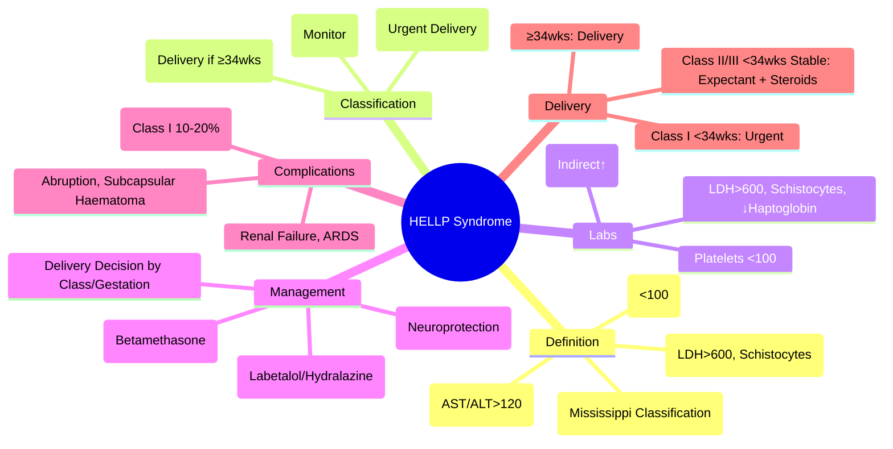

# HELLP Syndrome

> [!tip] **FCPS/MRCP Priority: HIGH**
> **HELLP = Haemolysis, Elevated Liver enzymes, Low Platelets** — **Mississippi Classification** (Class I: Plt<50; Class II: Plt 50-100; Class III: Plt 100-150); **Delivery ≥34wks or if maternal/fetal compromise**; **Differentiate from AFLP** (HELLP = Haemolysis + Elevated LFTs + Low Platelets; AFLP = Hypoglycaemia + Hyperuricaemia + Encephalopathy).

---

## Learning Objectives
By the end of this note you should be able to:
- [ ] Apply **Mississippi Classification** for HELLP severity
- [ ] Differentiate **HELLP vs AFLP vs Severe Pre-eclampsia**
- [ ] Manage **HELLP**: delivery timing, magnesium sulphate, antihypertensives, platelet transfusion
- [ ] Recognise **complications**: DIC, renal failure, placental abruption, ARDS

---

## 1. Definition & Classification

### HELLP Acronym
| Letter | Feature | Threshold |
|--------|---------|-----------|
| **H** | **Haemolysis** | LDH >600 U/L, schistocytes, ↓haptoglobin, ↑indirect bilirubin |
| **EL** | **Elevated Liver Enzymes** | **AST/ALT >120 U/L** (typically 2-10× ULN) |
| **LP** | **Low Platelets** | **<100 ×10⁹/L** |

### Mississippi Classification

| Class | Platelets | AST/ALT | LDH | Management |
|-------|-----------|---------|-----|------------|
| **Class I** | **<50 ×10⁹/L** | >120 | >600 | **Urgent delivery** (maternal/fetal compromise) |
| **Class II** | **50-100 ×10⁹/L** | >120 | >600 | **Delivery** (≥34wks or maternal/fetal compromise) |
| **Class III** | **100-150 ×10⁹/L** | >120 | >600 | **Close monitoring**; deliver if ≥34wks or deterioration |

> **Class I** = Most severe, highest maternal/fetal morbidity/mortality

---

## 2. Clinical Features

| Feature | Finding |
|---------|---------|
| **Presentation** | RUQ/epigastric pain, nausea, vomiting, malaise, headache |
| **Hypertension** | **Present in ~80%** (but not required for diagnosis) |
| **Proteinuria** | Common (but not required) |
| **Signs** | RUQ tenderness, hepatomegaly, hypertension, oedema |

### Lab Findings
| Test | HELLP Findings |
|------|----------------|
| **Platelets** | **<100 ×10⁹/L** (Class I: <50, II: 50-100, III: 100-150) |
| **AST/ALT** | **>120 U/L** (typically 2-10× ULN) |
| **LDH** | **>600 U/L** (haemolysis marker) |
| **Bilirubin** | **Indirect ↑** (haemolysis), may have direct ↑ if cholestasis |
| **Haptoglobin** | **Low** (consumed by haemolysis) |
| **Schistocytes** | **Present on blood film** |
| **PT/INR** | Normal or mildly prolonged (unless DIC) |
| **Fibrinogen** | Normal (unless DIC) |

---

## 2. Differential Diagnosis

| Condition | Key Distinction |
|---------|-----------------|
| **AFLP** | **Hypoglycaemia, Hyperuricaemia, Encephalopathy, DIC** |
| **Severe Pre-eclampsia** | **Hypertension + Proteinuria**, no haemolysis, platelets usually >150 |
| **Acute Fatty Liver of Pregnancy** | **Hypoglycaemia, Hyperuricaemia, Encephalopathy, DIC** |
| **Acute Viral Hepatitis** | Transaminases >1000, viral serology positive, no hypertension |
| **TTP/HUS** | **Microangiopathic haemolytic anaemia**, neurological symptoms, renal failure, **no hypertension** |
| **Acute Cholecystitis** | RUQ pain, fever, Murphy's sign, no hypertension, normal platelets |

---

## 3. Management

### Delivery Decision
| Gestation | Platelets / Maternal Condition | Management |
|-----------|--------------------------------|------------|
| **<34 weeks** | Class I (Plt<50) or maternal/fetal compromise | **Urgent delivery** (give steroids first if <34wks) |
| **<34 weeks** | Class II/III, stable | **Expectant management** (steroids, MgSO4, close monitoring) |
| **≥34 weeks** | Any class | **Delivery** (induction or C-section) |

### Medical Management (Pre-Delivery / Stabilisation)
| Intervention | Dose/Details |
|--------------|--------------|
| **Magnesium Sulphate** | **4g IV loading** over 20min, then **1g/h infusion** (neuroprotection, seizure prophylaxis) |
| **Antihypertensives** | **Labetalol** 20-80mg IV q10-20min (max 300mg); **Hydralazine** 5-10mg IV q20min; **Nifedipine** 10-20mg PO q20min — **Target BP <160/110** |
| **Corticosteroids** | **Betamethasone 12mg IM ×2 doses 24h apart** (if <34wks — fetal lung maturity) |
| **Platelet Transfusion** | **If <50 ×10⁹/L** and active bleeding / invasive procedure / C-section |
| **Fresh Frozen Plasma** | If **DIC** (PT>1.5×control, fibrinogen <2g/L) |
| **Blood Products** | FFP, Cryoprecipitate, Platelets as needed for coagulopathy |

### Postpartum Management
| Aspect | Duration |
|--------|----------|
| **Magnesium Sulphate** | **24 hours** post-delivery (or 24h post-last seizure) |
| **Antihypertensives** | Continue until BP controlled <140/90 postpartum |
| **Platelet Monitoring** | Daily until >150 ×10⁹/L |
| **LFTs** | Daily until improving; may worsen 24-48h post-delivery then improve |
| **Discharge Criteria** | Platelets >100, normalising LFTs, BP controlled off IV meds |

---

## 3. Complications

| Complication | Incidence | Management |
|------------|-----------|------------|
| **DIC** | ~10-20% (Class I) | **FFP, Cryoprecipitate, Platelets**; treat underlying |
| **Renal Failure** | ~5-10% | Fluids, avoid nephrotoxins, CRRT if severe |
| **Pulmonary Oedema / ARDS** | ~3-5% | Diuretics, ventilation, PEEP |
| **Placental Abruption** | ~5-10% | Emergency C-section |
| **Subcapsular Haematoma / Rupture** | Rare | Emergency laparotomy |
| **Posterior Reversible Encephalopathy (PRES)** | Rare | BP control, MgSO4, stop offending drugs |

---

## 3. FCPS/MRCP High-Yield Summary

| Topic | Key Points |
|-------|------------|
| **HELLP Definition** | **Haemolysis (LDH>600, schistocytes), Elevated LFTs (AST/ALT>120), Low Platelets (<100)** |
| **Mississippi Classification** | **Class I: Plt<50**, Class II: Plt 50-100, Class III: Plt 100-150 |
| **Key Labs** | **LDH>600, Schistocytes, ↓Haptoglobin, AST/ALT>120, Platelets<100** |
| **Delivery Timing** | **<34wks + Class I or Compromise → Urgent Delivery**; **≥34wks → Delivery**; **<34wks Class II/III Stable → Expectant + Steroids** |
| **Medical Management** | **MgSO4 4g IV + 1g/h**, **Antihypertensives (Target BP<160/110)**, **Steroids (Betamethasone 12mg×2) if <34wks** |
| **Corticosteroids** | **Betamethasone 12mg IM ×2 doses 24h apart** (if <34wks — fetal lung maturity) |
| **Platelet Transfusion** | **If <50×10⁹/L** and active bleeding / C-section / invasive procedure |
| **Complications** | **DIC (10-20% Class I), Renal Failure, ARDS, Placental Abruption, Subcapsular Haematoma, PRES** |
| **Postpartum** | **MgSO4 24h post-delivery**, BP control, platelet monitoring |

---

## 4. Viva Questions (MRCP PACES / FCPS)

| Question | Expected Answer |
|----------|-----------------|
| **HELLP — Full Form, Diagnostic Triad?** | **Haemolysis (LDH>600, schistocytes), Elevated Liver Enzymes (AST/ALT>120), Low Platelets (<100)**. |
| **Mississippi Classification — Classes?** | **Class I: Plt<50**, **Class II: 50-100**, **Class III: 100-150**; **Class I = Most severe**. |
| **HELLP vs AFLP — Key Differences?** | **HELLP**: Haemolysis (LDH>600, schistocytes), Elevated LFTs, Low Platelets; **AFLP**: Hypoglycaemia, Hyperuricaemia, Encephalopathy, DIC. |
| **HELLP vs Severe Pre-eclampsia?** | **HELLP**: Haemolysis + Low Platelets + Elevated LFTs; **Severe Pre-eclampsia**: Hypertension + Proteinuria, no haemolysis, platelets usually >150. |
| **HELLP — Delivery Timing?** | **<34wks Class I or Compromise → Urgent Delivery**; **≥34wks → Delivery**; **<34wks Class II/III Stable → Expectant + Steroids**. |
| **HELLP — MgSO4 Dose, Indication?** | **4g IV loading → 1g/h infusion** (neuroprotection, seizure prophylaxis). |
| **HELLP — Antihypertensive Target?** | **BP <160/110** (Labetalol, Hydralazine, Nifedipine). |
| **HELLP — Platelet Transfusion Threshold?** | **<50 ×10⁹/L** with active bleeding, C-section, or invasive procedure. |
| **HELLP — Corticosteroids Indication, Dose?** | **<34wks gestation**: **Betamethasone 12mg IM ×2 doses 24h apart** (fetal lung maturity). |
| **HELLP Complications — DIC, Renal Failure, ARDS?** | **DIC (10-20% Class I): FFP, Cryo, Platelets**; **Renal: Fluids, Avoid Nephrotoxins**; **ARDS: Ventilation, PEEP**. |

---

## 6. Confusions & Mnemonics

| Confusion | Clarification |
|-----------|---------------|
| **HELLP vs AFLP** | **HELLP**: Haemolysis + Elevated LFTs + Low Platelets; **AFLP**: Hypoglycaemia + Hyperuricaemia + Encephalopathy + DIC |
| **HELLP vs Severe Pre-eclampsia** | **HELLP**: Haemolysis + Low Platelets + Elevated LFTs; **Pre-eclampsia**: Hypertension + Proteinuria, platelets >150 |
| **HELLP vs TTP/HUS** | **TTP/HUS**: MAHA + Thrombocytopenia + Renal/Neurological, **No hypertension**; HELLP: Hypertension common |
| **Class I vs II vs III** | **I: Plt<50 (Urgent delivery)**; **II: 50-100 (Delivery if ≥34wks or compromise)**; **III: 100-150 (Monitor, deliver if ≥34wks)** |
| **Corticosteroids in HELLP** | **Betamethasone 12mg IM ×2 (24h apart)** — **ONLY if <34wks** for fetal lung maturity |
| **MgSO4 in HELLP** | **4g IV load + 1g/h infusion** — for **seizure prophylaxis**, not for platelet count |

**Mnemonic: HELLP-SYNDROME**
- **H**aemolysis: **LDH>600, Schistocytes, ↓Haptoglobin**
- **E**levated LFTs: **AST/ALT >120**
- **L**ow Platelets: **<100 (Class I<50, II 50-100, III 100-150)**
- **L**iver: **RUQ Pain, Hepatomegaly**
- **P**latelets: **<100 → Mississippi Class I/II/III**
- **S**evere Pre-eclampsia: **BP>160/110 + Proteinuria** (vs HELLP: Plt<100+Haemolysis)
- **Y**es to Delivery: **Class I <34wks → Urgent; ≥34wks → Always**
- **N**europrotection: **MgSO4 4g load + 1g/h**
- **D**elivery Decision: **Class I <34wks = Urgent; Class II/III <34wks = Expectant if Stable**
- **R**enal Failure: **Fluid, Avoid Nephrotoxins, CRRT**
- **O**bstetric Complications: **Abruption, Subcapsular Haematoma, PRES**
- **M**agnesium Sulphate: **4g Load + 1g/h Infusion**
- **E**clampsia: **Seizures → MgSO4, Deliver**
- **C**orticosteroids: **Betamethasone 12mg×2 (if <34wks)**
- **E**xpectant Management: **Class II/III <34wks Stable → Monitor + Steroids**

---

## 8. Mind Map

---

## 11. One-Page Revision Card

| Domain | Key Points |
|--------|------------|
| **Definition** | **Haemolysis (LDH>600), Elevated LFTs (>120), Low Platelets (<100)** |
| **Mississippi Class** | I: <50 (Urgent Delivery); II: 50-100 (Deliver if ≥34wks); III: 100-150 (Monitor) |
| **Key Labs** | LDH>600, Schistocytes, AST/ALT>120, Platelets<100 |
| **Delivery** | Class I <34wks → Urgent; ≥34wks → Deliver; Class II/III <34wks Stable → Expectant |
| **MgSO4** | 4g IV load → 1g/h infusion (Neuroprotection) |
| **Antihypertensives** | Target BP <160/110 (Labetalol, Hydralazine, Nifedipine) |
| **Steroids** | Betamethasone 12mg IM ×2 (if <34wks — fetal lung) |
| **Platelet Transfusion** | <50 + Bleeding/C-section/Invasive procedure |
| **Complications** | DIC (Class I 10-20%), Renal, ARDS, Abruption, PRES |
| **Postpartum** | MgSO4 24h, BP control, Platelet monitoring |

---

## 9. Spaced Repetition Trackers

| Review Interval | Date Completed | Confidence (1-5) | Notes |
|-----------------|----------------|------------------|-------|
| 24 hours | | | |
| 7 days | | | |
| 15 days | | | |
| 30 days | | | |
| 90 days | | | |

---

## 10. Self-Test Scorecard

| Section | Score /5 | Last Attempt |
|---------|----------|--------------|
| HELLP Definition & Triad | | |
| Mississippi Classification | | |
| HELLP vs AFLP vs Pre-eclampsia | | |
| Delivery Timing by Class | | |
| MgSO4 / BP Management | | |
| Platelet Transfusion Indications | | |
| Complications | | |
| Corticosteroid Use | | |

---

## Local Navigation
- **Parent Heading**: [[../Hepatology|Hepatology]]
- **Chapter Map": [[../Davidson Chapter 24 - Hepatology Hierarchy|Hepatology Hierarchy]]
- **Chapter MOC": [[../Hepatology MOC|Hepatology MOC]]
- **Drug Reference": [[../../Clinical Therapeutics and Good Prescribing|Drugs]]
- **Related": [[Hepatology in Special Situations]], [[AFLP]], [[ICP]], [[Pre-eclampsia]], [[Viral Hepatitis in Pregnancy]]