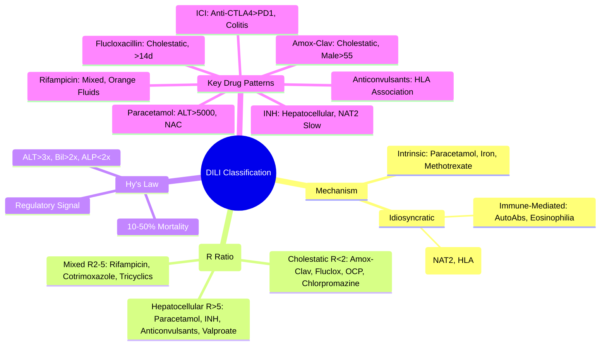

## 1. Learning Objectives
- [ ] Classify DILI as intrinsic vs idiosyncratic
- [ ] Classify by biochemical pattern (hepatocellular, cholestatic, mixed)
- [ ] Apply Hy's Law for severe DILI prediction
- [ ] Identify FCPS/MRCP high-yield classification concepts

---

## 2. DILI Classification

```mermaid
flowchart TD
    A[Drug-Induced Liver Injury (DILI)] --> B{Mechanism}
    B -->|Intrinsic| C[Predictable, Dose-Dependent]
    B -->|Idiosyncratic| D[Unpredictable, Not Dose-Dependent]
    A --> E{Biochemical Pattern}
    E --> F[Hepatocellular (R>5)]
    E --> G[Cholestatic (R<2)]
    E --> H[Mixed (R 2-5)]
    E --> I[Other: Mitochondrial, Vascular, Neoplastic]
```

---

## 1. Mechanism-Based Classification

### Intrinsic (Predictable, Dose-Dependent)
| Feature | Detail |
|--------|--------|
| **Mechanism** | Direct Toxicity / Metabolite Accumulation |
| **Dose Relationship** | **Direct** — Higher Dose = Higher Risk |
| **Latency** | Short (Hours-Days) |
| **Reproducibility** | **High** — Anyone at Sufficient Dose |
| **Incidence** | **High** — If Dose Exceeded |
| **Examples** | **Paracetamol** (NAPQI), Iron Overload, Methotrexate (High Dose), Amiodarone (Phospholipidosis) |

### Idiosyncratic (Unpredictable, Not Dose-Dependent)
| Feature | Detail |
|--------|--------|
| **Mechanism** | Immune-Mediated OR Metabolic Susceptibility |
| **Dose Relationship** | **No Clear Relationship** (Therapeutic Dose) |
| **Latency** | Variable (Days-Months) |
| **Reproducibility** | **Low** — Only Susceptible Individuals |
| **Incidence** | **Low** (1:10,000 - 1:100,000) |
| **Subtypes** | **Immune-Mediated** (Hypersensitivity, Autoantibodies) / **Metabolic** (Genetic Susceptibility) |

### Subtypes of Idiosyncratic DILI

| Subtype | Mechanism | Examples | Key Features |
|---------|-----------|----------|--------------|
| **Immune-Mediated** | Haptenisation → Immune Response | Halothane (Historical), Diclofenac, Phenytoin, Co-trimoxazole | Autoantibodies, Eosinophilia, Fever, Rash, Short Latency on Rechallenge |
| **Metabolic** | Genetic Susceptibility → Toxic Metabolite Accumulation | **Isoniazid** (NAT2 Slow Acetylators), Valproate, Diclofenac, Flucloxacillin | No Autoantibodies, Genetic Polymorphisms (NAT2, HLA, CYP) |

---

## 2. Biochemical Pattern Classification (R Ratio)

```mermaid
flowchart TD
    A[DILI] --> B{R = (ALT/ULN) / (ALP/ULN)}
    B -->|R > 5| C[Hepatocellular]
    B -->|R < 2| D[Cholestatic]
    B -->|R 2-5| E[Mixed]
```

| Pattern | R Ratio | ALT/AST | ALP | Common Drugs |
|---------|---------|---------|-----|--------------|
| **Hepatocellular** | **>5** | **↑↑↑** (10-100×ULN) | Normal/Mild ↑ | Paracetamol, Isoniazid, Anti-TB, Phenytoin, Valproate, AIH-mimics |
| **Cholestatic** | **<2** | Normal/Mild ↑ | **↑↑ (>3×ULN)** | Amox-Clav, Flucloxacillin, OCP, Chlorpromazine, Sulfonamides |
| **Mixed** | **2-5** | ↑↑ | ↑↑ | Rifampicin, Cotrimoxazole, Tricyclics, Allopurinol |

> **R Ratio Formula**: `R = (ALT / ULN_ALT) ÷ (ALP / ULN_ALP)` — **ULN-Corrected Essential**

---

## 3. Special Patterns

### Mitochondrial Toxicity
| Drug | Features |
|------|----------|
| **Valproate** | Microvesicular Steatosis, Hyperammonaemia, **Children <3y + Polytherapy** |
| **Tetracyclines** | Microvesicular Steatosis, Acute Fatty Liver (High Dose IV) |
| **NRTIs (Didanosine, Stavudine)** | Lactic Acidosis, Steatosis, Pancreatitis |
| **Linezolid** | Mitochondrial Protein Synthesis Inhibition |

### Vascular Injury
| Drug | Vascular Pattern |
|------|------------------|
| **OCP** | Hepatic Vein Thrombosis (Budd-Chiari), Sinusoidal Dilatation |
| **Anabolic Steroids** | Peliosis Hepatis, Hepatic Adenoma |
| **Pyrrolizidine Alkaloids** (Herbal) | Veno-Occlusive Disease (SOS) |

### Neoplastic
| Drug | Neoplasm |
|------|----------|
| **OCP** | **Hepatic Adenoma** (Regression on Stopping) |
| **Anabolic Steroids** | Hepatocellular Adenoma, HCC |
| **Thorotrast** (Historical) | Angiosarcoma, Cholangiocarcinoma |

---

## 4. Hy's Law (Severe DILI Risk)

### Criteria (ALL Required)
1. **Hepatocellular Injury**: ALT or AST **>3×ULN**
2. **Jaundice**: Total Bilirubin **>2×ULN**
3. **No Cholestasis**: ALP **<2×ULN** (or ALP:ALT Ratio Low)
4. **Exclusion** of Other Causes (Viral, Obstructive, Alcoholic, AIH, etc.)

### Implications
- **Mortality Risk**: **10-50%** (If Hy's Law Met)
- **Regulatory Significance**: **Signal for Drug Withdrawal** (FDA/EMA)
- **Monitoring**: Any Drug Meeting Hy's Law → **Immediate Stop + Intensive Monitoring**

> **FCPS/MRCP**: **Hy's Law = ALT>3×ULN + Bilirubin>2×ULN + ALP<2×ULN** = High Mortality Risk (10-50%)

---

## 5. Pattern-Specific Drug Associations

### Hepatocellular (R>5)
| Drug | Pattern | Key Feature |
|------|---------|-------------|
| **Paracetamol** | Hepatocellular | **ALT >5000**, NAC |
| **Isoniazid** | Hepatocellular | NAT2 Slow Acetylator, Most Common DILI-ALF in TB Areas |
| **Anti-TB (Rifampicin)** | Mixed/Cholestatic | Orange Fluids, With INH |
| **Anticonvulsants** (Phenytoin, Carbamazepine, Valproate) | Hepatocellular | Valproate: Children <3y, POLG; Phenytoin/CBZ: Aromatic, HLA |
| **NSAIDs (Diclofenac)** | Hepatocellular/Mixed | Higher Risk Than Other NSAIDs |
| **Valproate** | Hepatocellular | Children <3y, POLG (Alpers), Mitochondrial |

### Cholestatic (R<2)
| Drug | Pattern | Key Feature |
|------|---------|-------------|
| **Amoxicillin-Clavulanate** | Cholestatic | **Male >55y**, Post-Course Onset |
| **Flucloxacillin** | Cholestatic | **>55y, Male, >14 Days Use** |
| **OCP** | Cholestatic | Women, Months Latency |
| **Chlorpromazine** | Cholestatic | Fever, Eosinophilia, Rash |
| **Sulfonamides** | Cholestatic/Mixed | Hypersensitivity Features |

### Mixed (R 2-5)
| Drug | Pattern | Key Feature |
|------|---------|-------------|
| **Rifampicin** | Cholestatic/Mixed | Orange Fluids, With INH |
| **Cotrimoxazole** | Mixed | HIV Patients, Hypersensitivity |
| **Tricyclics** | Mixed | Amitriptyline, Imipramine |
| **Allopurinol** | Hypersensitivity/Mixed | **DRESS**: Rash, Eosinophilia, Fever, Renal |

---

## 6. FCPS/MRCP High-Yield Summary

| Concept | Key Points |
|---------|------------|
| **Intrinsic vs Idiosyncratic** | Intrinsic: Dose-Dependent, Predictable (Paracetamol); Idiosyncratic: Unpredictable, Genetic/Immune |
| **Idiosyncratic Subtypes** | **Immune-Mediated** (AutoAbs, Eosinophilia) vs **Metabolic** (Genetic, NAT2/HLA) |
| **R Ratio** | **Hepatocellular >5**, Cholestatic <2, Mixed 2-5 |
| **Hepatocellular Drugs** | Paracetamol, INH, Anticonvulsants, Valproate |
| **Cholestatic Drugs** | **Amox-Clav, Flucloxacillin, OCP, Chlorpromazine** |
| **Mixed Drugs** | Rifampicin, Cotrimoxazole, Tricyclics |
| **Hy's Law** | **ALT>3×ULN + Bil>2×ULN + ALP<2×ULN** = 10-50% Mortality |
| **Paracetamol** | **ALT>5000**, **NAC** Within 8h |
| **Hy's Law Implications** | **10-50% Mortality** — Regulatory Withdrawal Signal |

---

## 7. Viva Questions

1. **Differentiate intrinsic vs idiosyncratic DILI with examples.**
2. **What is the R ratio? How do you classify DILI patterns?**
3. **What is Hy's Law? What mortality risk does it predict?**
4. **List 3 drugs causing hepatocellular DILI.**
4. **List 3 drugs causing cholestatic DILI.**
5. **What is the difference between immune-mediated and metabolic idiosyncratic DILI?**
5. **Which drug causes cholestatic DILI in males >55 years?**
5. **What is the mechanism of valproate hepatotoxicity?**
6. **How does amoxicillin-clavulanate DILI present?**
7. **What is the significance of Hy's Law for drug regulation?**
8. **Differentiate rifampicin vs isoniazid DILI patterns.**

---

## 8. Confusions & Mnemonics

| Confusion | Clarification |
|-----------|---------------|
| Intrinsic vs Idiosyncratic | Intrinsic = Dose-Dependent (Paracetamol); Idiosyncratic = Unpredictable (Genetic/Immune) |
| Hepatocellular vs Cholestatic | R>5 = Hepatocellular (ALT↑↑); R<2 = Cholestatic (ALP↑↑) |
| Hy's Law | ALT>3×ULN + Bil>2×ULN + ALP<2×ULN = 10-50% Mortality |
| INH vs Rifampicin | INH = Hepatocellular; Rifampicin = Cholestatic/Mixed |
| Amox-Clav vs Flucloxacillin | Both Cholestatic; Amox-Clav: Male>55, Post-Course; Fluclox: >55, >14d Use |
| Valproate Liver Injury | Children <3y + Polytherapy + POLG Mutation = Alpers Syndrome |
| ICI Hepatitis | Anti-CTLA4 > Anti-PD1; Colitis Co-Exists |
| DILI vs AIH | AIH: IgG↑, AutoAbs+, Steroid Responsive; DILI: Drug Temporal Relation, RUCAM |

---

## 9. Mind Map



---

## 10. One-Page Revision Card

| **Classification** | **Key Feature** |
|--------------------|-----------------|
| **Intrinsic** | Dose-Dependent, Predictable (Paracetamol) |
| **Idiosyncratic** | Unpredictable, Genetic/Immune |
| **Immune-Mediated** | AutoAbs, Eosinophilia, Fever, Rash |
| **Metabolic** | Genetic Susceptibility (NAT2, HLA) |

| **R Ratio** | **Pattern** | **Key Drugs** |
|-------------|-------------|---------------|
| **>5** | Hepatocellular | Paracetamol, INH, Phenytoin, Valproate |
| **<2** | Cholestatic | Amox-Clav, Fluclox, OCP, Chlorpromazine |
| **2-5** | Mixed | Rifampicin, Cotrimoxazole, Tricyclics |

| **Hy's Law** | **Criteria** | **Mortality** |
|--------------|--------------|---------------|
| ALT >3×ULN | | |
| Bilirubin >2×ULN | **10-50%** |
| ALP <2×ULN | |

| **Key Drug Patterns** | |
|-----------------------|--|
| Paracetamol | ALT>5000, NAC |
| INH | Hepatocellular, NAT2 Slow |
| Amox-Clav | Cholestatic, Male>55, Post-Course |
| Flucloxacillin | Cholestatic, >55y, >14d |
| Rifampicin | Mixed, Orange Fluids |
| ICI | Anti-CTLA4>PD1, Colitis |

---

## 11. Spaced Repetition Tracker

| Day | 1 | 3 | 7 | 15 | 30 |
|-----|---|---|---|----|----|
| Intrinsic vs Idiosyncratic | ☐ | ☐ | ☐ | ☐ | ☐ |
| R Ratio Thresholds | ☐ | ☐ | ☐ | ☐ | ☐ |
| Hy's Law Criteria | ☐ | ☐ | ☐ | ☐ | ☐ |
| Key Drug Patterns | ☐ | ☐ | ☐ | ☐ | ☐ |
| DILI vs AIH | ☐ | ☐ | ☐ | ☐ | ☐ |

---

## 12. Self-Test Scorecard

| Question | My Answer | Correct? |
|----------|-----------|----------|
| Intrinsic vs Idiosyncratic |  |  |
| Hy's Law Criteria |  |  |
| R Ratio Thresholds |  |  |
| Amox-Clav vs Fluclox |  |  |
| Valproate Risk Factors |  |  |

---

## 13. Local Navigation

- [[Drug-Induced Liver Injury/Common culprit drugs|Common Culprit Drugs]]
- [[Drug-Induced Liver Injury/Diagnosis (RUCAM, exclusion)|Diagnosis & RUCAM]]
- [[Drug-Induced Liver Injury/Management and rechallenge|Management]]
- [[Acute Liver Failure/Paracetamol-induced hepatotoxicity|Paracetamol ALF]]
- [[Acute Liver Failure/Non-paracetamol drug-induced liver injury|Non-PCM DILI ALF]]
- [[Jaundice and LFT Interpretation/DILI patterns|DILI Patterns in Jaundice]]