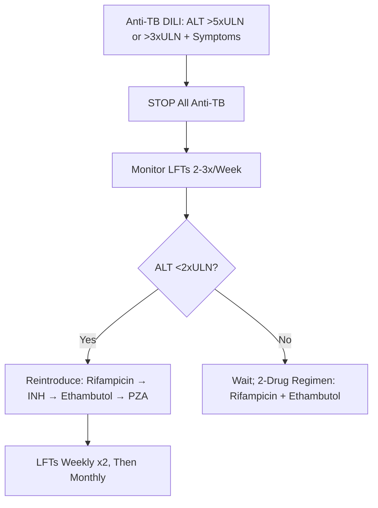

## 1. Learning Objectives
- [ ] Identify top drugs causing DILI by pattern and frequency
- [ ] Know specific risk factors for each high-risk drug
- [ ] Apply clinical pearls for each drug class
- [ ] Identify FCPS/MRCP high-yield drug associations

---

## 2. Top Drugs by DILI Frequency & Severity

```mermaid
flowchart TD
    A[Common Culprit Drugs] --> B[Paracetamol (ALF #1 West)]
    A --> C[Anti-TB: Isoniazid, Rifampicin]
    A --> D[Antibiotics: Amox-Clav, Flucloxacillin]
    A --> E[Anticonvulsants: Phenytoin, Valproate, Carbamazepine]
    A --> F[NSAIDs: Diclofenac]
    A --> G[Herbal/Alternative]
    A --> H[ICI: Ipilimumab, Nivolumab]
    A --> I[Statin]
    A --> J[Allopurinol]
    A --> K[Anti-retrovirals]
```

---

## 1. Paracetamol (Acetaminophen)

| Aspect | Detail |
|--------|--------|
| **Pattern** | **Hepatocellular** (Intrinsic) |
| **ALF Rank** | **#1 Cause of ALF in UK/USA** (50-70%) |
| **Mechanism** | NAPQI Accumulation → Glutathione Depletion → Centrilobular Necrosis |
| **Risk Factors** | **Fasting/Malnutrition**, Chronic Alcohol, CYP2E1 Inducers (Carbamazepine, Phenytoin, Rifampicin), HIV/AIDS |
| **ALT** | **>5000 U/L** (Often >10,000) |
| **Antidote** | **N-Acetylcysteine (NAC)** — Within 8h Optimal, Beneficial up to 24-48h |
| **Nomogram** | Rumack-Matthew (Single Acute OD Only) — Treat Line 150 mg/L at 4h |

> **FCPS/MRCP**: **Paracetamol = #1 ALF Cause (West)**; **NAC Within 8h**; **Staggered OD = Empiric NAC**

---

## 2. Anti-TB Drugs

### Isoniazid (INH)
| Aspect | Detail |
|--------|--------|
| **Pattern** | **Hepatocellular** |
| **Rank** | **#1 DILI-ALF in TB Endemic Areas** |
| **Incidence** | 5-30% Asymptomatic ALT Rise; 1-5% Symptomatic; <1% ALF |
| **Risk Factors** | **NAT2 Slow Acetylator**, Alcohol, Age >35, Malnutrition, HIV |
| **Latency** | 2-12 Weeks (Peak 4-8w) |
| **Monitoring** | LFTs Baseline, Monthly ×2, Then 3-Monthly |
| **ALT >5×ULN or >3×ULN + Symptoms** | **STOP All Anti-TB** |

### Rifampicin
| Aspect | Detail |
|--------|--------|
| **Pattern** | **Cholestatic / Mixed** |
| **Latency** | 2-8 Weeks |
| **Key Feature** | **Orange/Red Body Fluids** (Tears, Urine, Sweat) |
| **Interaction** | Potent CYP3A4 Inducer → ↓ Levels of ART, OCP, Warfarin, DOACs |
| **With INH** | Synergistic Hepatotoxicity |

### Pyrazinamide (PZA)
| Aspect | Detail |
|--------|--------|
| **Historical** | Most Hepatotoxic (High-Dose Regimens) |
| **Current** | Low-Dose (25 mg/kg) → Lower Hepatotoxicity |

### Anti-TB DILI Management Algorithm


---

## 3. Antibiotics

### Amoxicillin-Clavulanate
| Aspect | Detail |
|--------|--------|
| **Pattern** | **Cholestatic** |
| **Rank** | **Commonest Antibiotic DILI-ALF in West** |
| **Demographic** | **Male >55 Years** |
| **Latency** | **1-6 Weeks** (Can Occur **After Stopping**) |
| **Duration** | Prolonged (Months), 10% Chronicity |
| **Key** | **Male >55, Cholestatic, Can Occur Post-Course** |

### Flucloxacillin
| Aspect | Detail |
|--------|--------|
| **Pattern** | Cholestatic |
| **Risk Factors** | **>55 Years**, **Male**, **>14 Days Use** |
| **Latency** | 2-4 Weeks |
| **Key** | **>55y, Male, >14 Days Use** |

### Other Antibiotics
| Antibiotic | Pattern | Key Features |
|-----------|---------|--------------|
| **Cotrimoxazole** | Mixed | HIV Patients, Hypersensitivity (Rash, Eosinophilia) |
| **Erythromycin** | Cholestatic | Estolate Form > Base |
| **Tetracyclines** | Hepatocellular | High Dose IV → Microvesicular Steatosis |
| **Isoniazid** | Hepatocellular | NAT2 Slow Acetylators |

---

## 4. Anticonvulsants

| Drug | Pattern | Key Risk Factors |
|------|---------|------------------|
| **Phenytoin** | Hepatocellular | **Aromatic**, HLA-B*15:02 (Asian), Aromatic AA Cross-Reactivity |
| **Carbamazepine** | Hepatocellular | **Aromatic**, HLA-B*15:02, HLA-A*31:01, Cross-Reactivity with Phenytoin |
| **Valproate** | Hepatocellular | **Children <3y**, Polytherapy, **POLG Mutation (Alpers)** |
| **Lamotrigine** | Hypersensitivity/Mixed | Rash (Stevens-Johnson), Titration Reduces Risk |
| **Phenobarbital** | Hepatocellular/Enzyme Induction | Enzyme Induction (↓ Other Drug Levels) |

> **Valproate in Children**: **<3y + Polytherapy + POLG** = High Risk (Alpers Syndrome)

---

## 5. NSAIDs

| Drug | Pattern | Key Feature |
|------|---------|--------------|
| **Diclofenac** | Hepatocellular/Mixed | **Highest Risk Among NSAIDs** (Rare ALF) |
| **Ibuprofen/Naproxen** | Hepatocellular | Rare, Dose-Related |
| **Aspirin** | Hepatocellular | Reye's Syndrome (Children + Viral Illness) |
| **Celecoxib** | Hepatocellular | Lower GI Risk, Similar Hepatic Risk |

---

## 5. Herbal & Alternative Medicines

| Herb/Supplement | Pattern | Key Risk |
|----------------|---------|----------|
| **Green Tea Extract** | Hepatocellular | Catechins (EGCG), Weight Loss Supplements |
| **Kava** | Hepatocellular | Banned in Some Countries, Liver Failure Reports |
| **Herbalife** | Hepatocellular/Cholestatic | Multiple Ingredients, Case Reports |
| **Ayurvedic/TCM** | Variable | Heavy Metals (Lead, Mercury, Arsenic), Adulterants |
| **Black Cohosh** | Hepatocellular | Menopausal Symptoms, Autoimmune Features |
| **Germander (Teucrium)** | Hepatocellular | Weight Loss, Hepatotoxic Diterpenes |
| **Vitamin A** | Hepatocellular | Chronic Hypervitaminosis A (>25,000 IU/day) |
| **Niacin** | Hepatocellular | High Dose (>2g/day), Time-Release Formulations |

*...continued (truncated for renderer performance)*
---

> Auto-generated study sections for "Drug Induced Liver Injury" — Ch 23: Hepatology.

## Flashcards (3 generated)

- Q: What is the definition of Drug Induced Liver Injury?
  A: | ALF Rank | #1 Cause of ALF in UK/USA (50-70%) |
- Q: What is Historical of Drug Induced Liver Injury?
  A: Most Hepatotoxic (High-Dose Regimens)
- Q: What is Current of Drug Induced Liver Injury?
  A: Low-Dose (25 mg/kg) → Lower Hepatotoxicity

## MCQs (1 generated)

1. **Which of the following best describes Drug Induced Liver Injury?**
   A. **| ALF Rank | #1 Cause of ALF in UK/USA (50-70%) |**
   B. An unrelated condition not matching the clinical picture of Drug Induced Liver Injury
   C. A complication seen late in the disease course of Drug Induced Liver Injury
   D. A condition that mimics Drug Induced Liver Injury but has a different underlying cause

