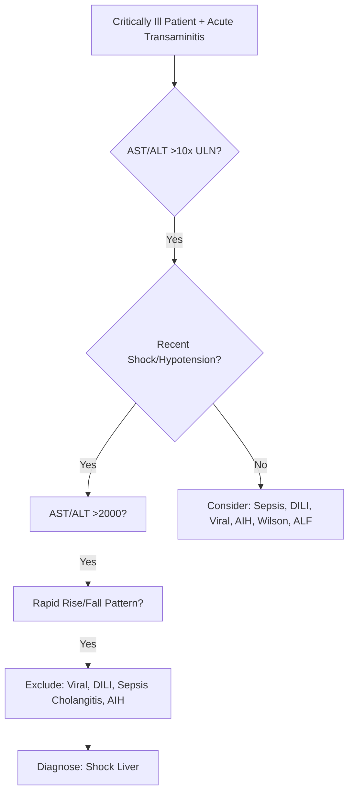
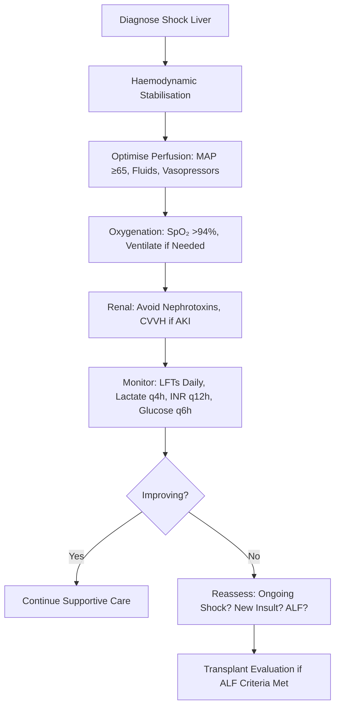

# Liver Disease in Critical Illness: Shock Liver (Ischaemic Hepatitis)

## Learning Objectives
- [ ] Diagnose shock liver (ischaemic hepatitis) in critically ill patients
- [ ] Differentiate from other causes of acute transaminitis in ICU
- [ ] Apply management principles for ischaemic hepatitis
- [ ] Understand prognosis and monitoring
- [ ] Identify FCPS/MRCP high-yield critical care hepatology points

---

## Definition & Terminology

| Term | Definition |
|------|------------|
| **Shock Liver** | **Acute hepatocellular injury** due to **hepatic hypoperfusion** (hypoxia/ischaemia) in critically ill patients |
| **Ischaemic Hepatitis** | Synonym for Shock Liver — Histological Evidence of Centrilobular Necrosis |
| **Hypoxic Hepatitis** | Same Entity — Emphasises Hypoxia as Mechanism |

> **FCPS/MRCP**: **Shock Liver = Ischaemic Hepatitis = Hypoxic Hepatitis** — Centrilobular Necrosis from Hypoperfusion

---

## Pathophysiology

```mermaid
flowchart LR
    A[Systemic Hypotension / Shock] --> B[↓ Splanchnic Blood Flow]
    B --> C[Hepatic Hypoperfusion]
    C --> D[Centrilobular Hypoxia (Zone 3 Most Vulnerable)]
    D --> E[ATP Depletion → ↓ Na/K ATPase]
    E --> F[Cellular Swelling, Calcium Influx]
    F --> G[ROS, Inflammatory Cytokines]
    G --> H[Centrilobular Necrosis]
    H --> I[↑ AST/ALT Massive (>2000)]
```

### Zone 3 (Centrilobular) Vulnerability
- **Furthest from Portal Triad** → Lowest Oxygen Tension
- **Lowest Oxygen Reserve** → First to Suffer in Hypoxia
- **CYP450 Enzymes Concentrated** → ROS Production in Hypoxia

---

## Clinical Presentation

| Feature | Shock Liver |
|-------|-------------|
| **Context** | **Shock, Sepsis, Cardiac Surgery, Major Trauma, Cardiac Arrest** |
| **Onset** | **Within 24-48 Hours** of Hypotensive Event |
| **Symptoms** | Often Asymptomatic (Sedated/Intubated); Jaundice (Late) |
| **Key Lab** | **AST/ALT >2000 U/L** (Often >5000-10,000) |
| **Pattern** | **Rapid Rise (24-48h) → Rapid Fall (3-7 Days)** |
| **AST:ALT Ratio** | Often **>1** (AST > ALT) — Mitochondrial Damage |
| **Bilirubin** | Rises Later (Peak Day 3-5) |
| **INR** | May Rise (Synthetic Dysfunction) |
| **Lactate** | **Markedly Elevated** (Marker of Hypoperfusion) |

---

## Diagnostic Criteria



### Diagnostic Criteria (Suggested)
1. **Clinical Context**: Shock/Hypotension (MAP <60 mmHg, Vasopressors, Cardiac Arrest)
2. **AST/ALT**: **>2000 U/L** (Often 5000-10,000+)
3. **Pattern**: **Rapid Rise (24-48h) → Rapid Fall (3-7 Days)**
3. **Exclusion**: Viral Hepatitis (Seronegative), DILI (No Drug), AIH (IgG-, AutoAbs-), Biliary Obstruction (US Normal)
4. **Supporting**: Lactate ↑↑, INR ↑ (Later), Bilirubin ↑ (Day 3-5)

---

## Differentials in ICU

| Condition | Pattern | Key Differentiator |
|-----------|---------|-------------------|
| **Shock Liver** | **AST/ALT >2000, Rapid Rise/Fall, Shock History** | **Temporal Link to Hypotension** |
| **Sepsis-Induced Cholestasis** | **ALP/GGT ↑↑, ALT/AST Modest** | **No Shock Hypotension Required** |
| **Drug-Induced (DILI)** | Variable | **Temporal Drug Relationship** |
| **Acute Viral Hepatitis** | ALT >1000, Serology + | **HAV/HBV/HCV/HEV Serology +** |
| **Autoimmune Hepatitis** | High IgG, AutoAbs, Steroid Responsive | **IgG↑, ANA/SMA/LKM+** |
| **Acute Biliary Obstruction** | ALP↑↑, Dilated Ducts on US | **Dilated CBD, Cholangitis** |
| **Wilson Disease** | Young, Low Ceruloplasmin, Coombs-Neg Haemolysis | Low Ceruloplasmin, KF Rings |
| **ALF** | INR ≥1.5 + Encephalopathy | **Encephalopathy Required** |

---

## Management



### Key Principles

| Principle | Action |
|----------|--------|
| **Treat the Cause** | **Restore Perfusion** (Fluids, Vasopressors, Inotropes, Blood) |
| **N-Acetylcysteine** | **Consider** — Some Evidence of Benefit (Antioxidant) |
| **Avoid Hepatotoxins** | Review All Medications (Statins, Antibiotics, Paracetamol) |
| **Supportive** | Glucose Control, Coagulopathy (Vit K/FFP if Bleed), Renal Support |
| **Nutrition** | Early EN (24-48h), Protein 1.2-1.5g/kg/day |

---

## Prognosis & Outcomes

| Parameter | Finding |
|----------|---------|
| **AST/ALT Peak** | **Day 2-3** (Often 5000-10,000+) |
| **Normalisation** | **3-7 Days** (Rapid Fall) |
| **Bilirubin Peak** | **Day 3-5** (Then Falls) |
| **INR Peak** | Day 3-5 (If Synthetic Impairment) |
| **Mortality** | **50-70%** (Driven by Underlying Shock, Not Liver Itself) |
| **Recovery** | **Complete in Survivors** (No Chronic Sequelae) |

> **Key**: **Mortality Driven by Underlying Shock** — Liver Injury Is a Marker, Not the Cause of Death

---

## Shock Liver vs Acute Liver Failure (ALF)

| Feature | Shock Liver | ALF |
|---------|-------------|-----|
| **Encephalopathy** | **Absent** (Unless Late/Severe) | **Required** |
| **INR** | Often Normal/Mild ↑ | **≥1.5 (Required)** |
| **Bilirubin** | Late Rise | Variable |
| **Primary Driver** | **Hypoperfusion** | Multiple Aetiologies |
| **Recoverability** | **Excellent if Survive** | Variable (Aetiology Dependent) |
| **Transplant Need** | Rare | **Common (Super-Urgent)** |

---

## Monitoring Protocol

| Parameter | Frequency | Target / Action |
|-----------|-----------|-----------------|
| **AST/ALT** | Daily → 12h if Rising | Trend (Peak Day 2-3, Fall by Day 5-7) |
| **Bilirubin** | Daily | Rising Expected (Peak Day 3-5) |
| **INR** | 12-Hourly | >2.0 → Vit K; >3.0 or Bleed → FFP |
| **Lactate** | 4-Hourly | **Clearance = Perfusion Restored** |
| **Glucose** | 6-Hourly | 4-7 mmol/L (Insulin if Needed) |
| **Renal** | 6-12 Hourly | RRT if AKI (KDIGO) |
| **Ammonia** | If Encephalopathy | Supportive (Lactulose/Rifaximin) |

---

## FCPS/MRCP High-Yield Summary

| Concept | Key Points |
|---------|------------|
| **Definition** | **Massive Transaminitis (AST/ALT >2000) Post-Shock** |
| **Mechanism** | **Centrilobular Necrosis** (Zone 3 Hypoxia) |
| **Key Feature** | **Rapid Rise (24-48h) → Rapid Fall (3-7 Days)** |
| **AST:ALT** | **>1** (AST > ALT) |
| **Triggers** | Shock, Cardiac Arrest, Cardiac Surgery, Severe Sepsis, Major Trauma |
| **Differential** | Sepsis Cholestasis, DILI, Viral, Biliary Obstruction |
| **Management** | **Treat Shock** (Perfusion, Norepinephrine, Fluids); Supportive |
| **NAC** | Consider (Antioxidant) — No Definitive Evidence |
| **Prognosis** | **Mortality 50-70%** (Due to Shock, Not Liver) |
| **Recovery** | **Complete in Survivors** (No Chronic Liver Disease) |

---

## Viva Questions

1. **What is the hallmark laboratory finding in shock liver?**
2. **Why is AST typically higher than ALT in shock liver?**
2. **What is the typical time course of AST/ALT in shock liver?**
3. **How do you differentiate shock liver from sepsis-induced cholestasis?**
3. **What is the mortality of shock liver? What determines it?**
4. **How do you distinguish shock liver from acute liver failure?**
4. **What is the role of N-acetylcysteine in shock liver?**
5. **What is the typical pattern of bilirubin and INR in shock liver?**
5. **What is centrilobular (zone 3) necrosis and why does it occur?**
6. **Can shock liver cause chronic liver disease?**

---

## Confusions & Mnemonics

| Confusion | Clarification |
|-----------|---------------|
| Shock Liver vs ALF | **Shock Liver: No Encephalopathy, INR Normal/Mild**; ALF: Encephalopathy Required |
| Shock Liver vs Sepsis Cholestasis | Shock Liver: **AST/ALT >2000**, Shock History; Sepsis: **ALP/GGT↑, ALT Modest** |
| AST > ALT | **Mitochondrial Damage** (AST in Mitochondria) → Zone 3 Necrosis |
| Transaminitis Duration | **Peak Day 2-3, Normalise by Day 5-7** — Very Rapid |
| Mortality | **Driven by Shock, Not Liver Injury** — Liver Is Survivor, Not Victim |
| NAC Role | **Antioxidant** — Theoretical Benefit, No RCT Proof |
| Chronic Sequelae | **None** — Complete Recovery if Survive |

---

## Mind Map

```mermaid
mindmap
  root((Shock Liver / Ischaemic Hepatitis))
    Definition
      Massive Transaminitis Post-Shock
      Centrilobular (Zone 3) Necrosis
    Mechanism
      Hypotension → ↓ Hepatic Perfusion
      Zone 3 (Centrilobular) Most Vulnerable
      ATP Depletion → Necrosis
    Labs
      AST/ALT >2000 (Often 5000-10000)
      AST > ALT (Ratio >1)
      Rapid Rise (24-48h) → Fall (3-7d)
      Bilirubin ↑ Day 3-5
      INR Mild ↑ Late
    Triggers
      Shock (Septic, Cardiogenic, Haemorrhagic)
      Cardiac Arrest / Surgery
      Major Trauma
    Differential
      Sepsis Cholestasis (ALP↑, ALT Modest)
      DILI (Drug History)
      Viral (Serology)
      ALF (Encephalopathy Required)
    Management
      Treat Shock (Fluids, Vasopressors, Inotropes)
      NAC Consider
      Supportive (Glucose, Coag, Renal, Nutrition)
      Monitor LFTs Daily, Lactate q4h
    Prognosis
      Mortality 50-70% (Due to Shock)
      Survivors: Full Recovery, No Chronic Disease
```

---

## One-Page Revision Card

| **Shock Liver** | **Details** |
|-----------------|-------------|
| **Definition** | AST/ALT >2000 Post-Shock → Centrilobular Necrosis |
| **Key Feature** | **Rapid Rise 24-48h → Fall 3-7 Days** |
| **AST:ALT Ratio** | **>1 (AST > ALT)** |
| **Triggers** | Shock, Cardiac Arrest, Cardiac Surgery, Severe Sepsis |
| **AST:ALT Peak** | Day 2-3 (Often 5000-10,000+) |

| **Differential** | **Shock Liver** | **Sepsis Cholestasis** | **ALF** |
|------------------|-----------------|------------------------|---------|
| **AST/ALT** | >2000, AST>ALT | Modest ALT, ALP↑↑ | Variable |
| **Encephalopathy** | No | No | **Yes (Required)** |
| **INR** | Mild ↑ Late | Normal | **≥1.5** |
| **History** | **Shock/Hypotension** | Sepsis | Variable |

| **Management** | |
|----------------|--|
| **Primary** | **Haemodynamic Stabilisation** (MAP ≥65, Fluids, Norepinephrine) |
| **NAC** | Consider (Theoretical Antioxidant) |
| **Supportive** | Glucose 4-7, Coagulopathy, Renal, Nutrition |
| **Avoid** | Hepatotoxins (Paracetamol, Statins, Unnecessary Abx) |

| **Outcome** | |
|-------------|--|
| **Mortality** | 50-70% (Due to Shock, Not Liver) |
| **Recovery** | Complete in Survivors (No Chronic Disease) |

---

## Spaced Repetition Tracker

| Day | 1 | 3 | 7 | 15 | 30 |
|-----|---|---|---|----|----|
| AST/ALT Peak & Pattern | ☐ | ☐ | ☐ | ☐ | ☐ |
| AST > ALT Reason | ☐ | ☐ | ☐ | ☐ | ☐ |
| Centrilobular Necrosis | ☐ | ☐ | ☐ | ☐ | ☐ |
| Shock Liver vs ALF | ☐ | ☐ | ☐ | ☐ | ☐ |
| Mortality Driver | ☐ | ☐ | ☐ | ☐ | ☐ |

---

## Self-Test Scorecard

| Question | My Answer | Correct? |
|----------|-----------|----------|
| AST/ALT Threshold |  |  |
| AST > ALT Reason |  |  |
| Time Course |  |  |
| vs Sepsis Cholestasis |  |  |
| Recovery Pattern |  |  |

---

## Local Navigation

- [[Acute Liver Failure/Definition and Aetiology|ALF Definition]]
- [[Acute Liver Failure/ICU supportive care|ICU Supportive Care]]
- [[Acute Liver Failure/CLIF-C ACLF and ACLF grades|CLIF-C ACLF]]
- [[Portal Hypertension and Complications/Hepatorenal Syndrome|HRS]]
- [[Acute Liver Failure/ICU supportive care|ICU Supportive Care]]