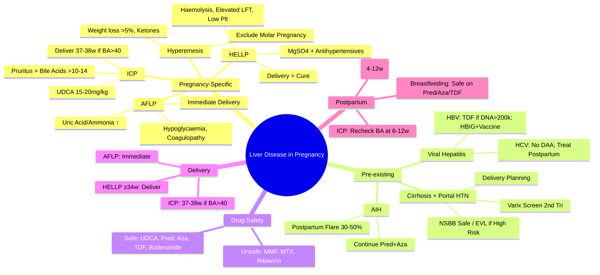

# Liver Disease in Pregnancy: General Overview

## Learning Objectives
- [ ] Understand physiological liver changes in pregnancy
- [ ] Differentiate pregnancy-specific liver diseases (ICP, AFLP, HELLP, Hyperemesis)
- [ ] Manage pre-existing chronic liver disease in pregnancy
- [ ] Plan delivery and postpartum care
- [ ] Identify FCPS/MRCP high-yield obstetric hepatology points

---

## Physiological Liver Changes in Pregnancy

| Parameter | Change | Clinical Significance |
|-----------|--------|----------------------|
| **ALP** | **↑↑ (2-4x ULN)** | Placental origin; **Not** indicative of cholestasis |
| **ALT/AST** | Normal / Slightly ↑ | Significant elevation = Pathology |
| **Bilirubin** | Normal / Slightly ↓ | Hyperbilirubinaemia = Pathology |
| **Albumin** | ↓ (Physiological dilution) | <35 g/L = Pathology |
| **Coagulation** | **Hypercoagulable** (↑ Fibrinogen, Factors) | INR usually normal; D-dimer ↑ |
| **Liver Blood Flow** | ↑ Portal flow | May affect drug clearance |

> **FCPS/MRCP**: **ALP ↑↑ in pregnancy is physiological** (placental); **ALT/AST/Bilirubin should remain normal**

---

## Pregnancy-Specific Liver Diseases

```mermaid
flowchart TD
    A[Liver Disease in Pregnancy] --> B{Pregnancy-Specific}
    B --> B1[Intrahepatic Cholestasis of Pregnancy (ICP)]
    B --> B2[HELLP Syndrome]
    B --> B3[Acute Fatty Liver of Pregnancy (AFLP)]
    B --> B4[Hyperemesis Gravidarum]
    B --> B5[Pre-eclampsia/Eclampsia]
    A --> C[Pre-existing Liver Disease]
    C --> C1[Chronic Viral Hepatitis]
    C --> C2[Autoimmune Hepatitis (AIH)]
    C --> C3[Cirrhosis / Portal Hypertension]
    C --> C4[Wilson Disease / Haemochromatosis]
    A --> D[Acute Liver Failure (ALF)]
    D --> D1[Pregnancy-Specific (AFLP, HELLP, HEV)]
    D --> D2[Non-Pregnancy Related (Drug, AIH, Wilson)]
```

---

## 1. Intrahepatic Cholestasis of Pregnancy (ICP)

### Definition & Epidemiology
| Feature | ICP |
|------|-----|
| **Definition** | **Pruritus + Elevated Bile Acids** (>10-14 μmol/L) in 2nd/3rd trimester |
| **Incidence** | 0.1-2% (High in Chile, Scandinavia, South Asia) |
| **Risk Factors** | Twin pregnancy, IVF, Family history, Previous ICP, Hepatitis C |
| **Genetics** | **ABCB4 (MDR3), ABCB11 (BSEP), ATP8B1 (FIC1)** mutations |

### Clinical Features
| Feature | Detail |
|---------|--------|
| **Pruritus** | **Hallmark**; Palms/soles, worse at night, **No Rash** |
| **Timing** | Typically **3rd Trimester** (≥28 weeks) |
| **Jaundice** | 10-20% (mild, bilirubin <5 mg/dL) |
| **LFTs** | **Bile Acids ↑↑** (>40 μmol/L diagnostic); AST/ALT ↑ (2-10x); ALP ↑ (physiological) |

### Diagnosis
| Test | Threshold |
|------|-----------|
| **Serum Bile Acids** | **>10-14 μmol/L** (Fasting) |
| **LFTs** | ALT/AST ↑ (usually <1000); Bilirubin usually normal/mild |
| **Exclusion** | Viral hepatitis, Drug-induced, Obstruction, PBC |

### Fetal Risks
| Complication | Risk |
|-------------|------|
| **Stillbirth** | **↑↑** (if BA >40 μmol/L; 37-39 weeks delivery recommended) |
| **Preterm Labour** | 30-60% |
| **Meconium Staining** | 20-30% |
| **RDS** | Increased risk |

### Management
| Aspect | Management |
|---------|------------|
| **Ursodeoxycholic Acid (UDCA)** | **15-20 mg/kg/day** (1st line); ↓ Bile acids, improves pruritus, ↓ fetal risk |
| **Cholestyramine** | 4g QID (2nd line for pruritus); Give 4h apart from UDCA |
| **Vitamin K** | 10mg IM at delivery (if prolonged PT) |
| **Antihistamines** | Sedating (chlorpheniramine) for sleep |
| **Delivery Timing** | **37-38 weeks** (if BA >40 μmol/L); **38-39 weeks** (if BA 10-40) |
| **Postpartum** | Resolves within 48h; Recheck LFTs at 6-12 weeks |

---

## 2. HELLP Syndrome

| Component | Definition |
|-----------|------------|
| **H** | **Haemolysis** (LDH >600, ↓ Hb, Schistocytes) |
| **EL** | **Elevated Liver Enzymes** (ALT/AST >2x or >70 U/L) |
| **LP** | **Low Platelets** (<100 ×10⁹/L) |

| Feature | Detail |
|---------|--------|
| **Timing** | Usually 3rd trimester; Can present postpartum (24-48h) |
| **Association** | **Pre-eclampsia** (70-80%); Can occur without hypertension |
| **Symptoms** | RUQ/epigastric pain, nausea, vomiting, headache, malaise |
| **Labs** | **LDH >600, AST/ALT >2x, Plt <100k, PT/INR ↑, Fibrinogen ↓** |

### Classification (Mississippi / Tennessee)
| Class | Platelets | AST/ALT | LDH |
|-------|-----------|---------|-----|
| **Class 1** | <50k | >140 | >600 |
| **Class 2** | 50-100k | >70 | >600 |
| **Class 3** | 100-150k | >40-70 | >600 |

### Management
| Step | Action |
|------|--------|
| **1. Delivery** | **Definitive treatment**; **≥34 weeks: Deliver**; <34 weeks: Corticosteroids + Delay if stable |
| **2. Magnesium Sulphate** | Seizure prophylaxis (if severe pre-eclampsia) |
| **3. Blood Products** | Platelets if <20k (or <50k if bleed/CS); FFP if coagulopathy |
| **4. Antihypertensives** | Labetalol, Nifedipine, Hydralazine (if BP >160/110) |
| **5. Postpartum** | Monitor 48-72h (peak labs at 48h); Platelets may transiently ↓ further |

---

## 3. Acute Fatty Liver of Pregnancy (AFLP)

### Definition & Epidemiology
| Feature | AFLP |
|--------|------|
| **Incidence** | 1:7,000-15,000 pregnancies |
| **Timing** | **3rd Trimester (30-38 weeks)**, postpartum (rare) |
| **Pathogenesis** | **Mitochondrial β-oxidation defect** (Fetal LCHAD mutation) → Maternal microvesicular steatosis |

### Clinical Presentation
| Feature | Detail |
|---------|--------|
| **Presentation** | Nausea, vomiting, anorexia (90%); RUQ pain (80%); Jaundice (70%) |
| **Encephalopathy** | 20-50% (late) |
| **Labs** | **Hypoglycaemia** (Hallmark); ↑ Uric acid; ↑ Ammonia; ↑ ALT/AST (200-1000); ↑ Bilirubin; **Leucocytosis**; Coagulopathy (INR↑) |

### Swansea Criteria (Diagnostic: ≥6/14)
| Criterion | Threshold |
|---------|-----------|
| Vomiting | Persistent |
| Abdominal Pain | Epigastric/RUQ |
| Polydipsia/Polyuria | Diabetes insipidus-like |
| Encephalopathy | Any grade |
| Bilirubin | >0.8 mg/dL (>14 μmol/L) |
| AST/ALT | >42 U/L |
| Alk Phos | >2× ULN |
| **Hypoglycaemia** | **<72 mg/dL (<4 mmol/L)** |
| Uric Acid | >5.7 mg/dL (>340 μmol/L) |
| Creatinine | >1.0 mg/dL (>90 μmol/L) |
| Ammonia | >47 μmol/L |
| Platelets | <150×10⁹/L |
| PT/INR | PT >14s or INR >1.5 |
| WBC | >11×10⁹/L |

### AFLP vs HELLP vs Viral Hepatitis

| Feature | AFLP | HELLP | Viral Hepatitis |
|---------|------|-------|-----------------|
| **Timing** | 3rd Trimester | 3rd Trimester | Any |
| **Hypoglycaemia** | **Yes (Hallmark)** | No | No |
| **Uric Acid** | **↑↑** | ↑ | Normal |
| **Ammonia** | **↑↑** | Normal | ↑ in ALF |
| **Transaminases** | Mild-mod (200-1000) | **High (>1000)** | **Very High (>1000)** |
| **Coagulopathy** | **DIC (INR↑, Fibrinogen↓)** | Mild | Severe in ALF |
| **Platelets** | Low (DIC) | **Very Low (<100k)** | Normal |
| **Leucocytosis** | **Marked** | Variable | Variable |

### Management
| Step | Action |
|------|--------|
| **1. Delivery** | **Immediate** (C-section if not imminent vaginal) |
| **2. ICU** | Glucose infusion (hypoglycaemia!); Coagulopathy correction; Lactulose if HE |
| **3. Fetal** | Delivery regardless of gestational age |
| **4. Postpartum** | Recovers in 7-10 days; **25% recurrence** in next pregnancy |
| **5. Genetics** | **Screen baby/mother for LCHAD** (autosomal recessive) |

---

## 4. Hyperemesis Gravidarum

| Feature | Detail |
|---------|--------|
| **Definition** | Severe nausea/vomiting → **Weight loss >5%**, **Ketonuria**, **Electrolyte imbalance** |
| **Incidence** | 0.5-2% of pregnancies |
| **LFTs** | **ALT/AST mild-moderate ↑** (starvation hepatosis); **ALP normal/physiological** |
| **Amylase/Lipase** | May be ↑ (pancreatitis risk) |
| **Management** | IV fluids, thiamine, antiemetics (ondansetron), correct electrolytes; **Trophoblastic disease exclusion** (β-hCG) |

---

## Pre-existing Chronic Liver Disease in Pregnancy

### Cirrhosis & Portal Hypertension
| Risk | Management |
|------|------------|
| **Variceal Bleed** | Screen endoscopy 2nd trimester; **NSBB (Propranolol) safe**; EVL if high-risk |
| **Ascites/HE** | Standard management; Lactulose safe; Diuretics (sparing) |
| **Variceal Bleed** | **Terlipressin safe**; EVL; TIPS if refractory |
| **Delivery** | **C-section if recent bleed/large varices**; Vaginal if stable |

### Viral Hepatitis (HBV/HCV)
| Virus | Key Points |
|-------|------------|
| **HBV** | **TDF 24w if DNA>200k**; HBIG + Vaccine to baby; Breastfeeding safe |
| **HCV** | **No DAA in pregnancy**; Treat postpartum; Breastfeeding safe |

### Autoimmune Hepatitis (AIH)
- **Continue Pred + Azathioprine** (Safe)
- **Stop MMF/Myfortic** ≥6mo pre-conception
- **Postpartum flare risk: 30-50% at 4-12 weeks**

### Wilson Disease / Haemochromatosis
- **Continue chelation/venesection** (adjust doses)
- **Pregnancy may unmask Wilson disease** (3rd trimester)

---

## Drug Safety in Pregnancy (Liver Context)

| Drug | FDA Category | Pregnancy Use |
|------|--------------|---------------|
| **UDCA** | B | **Safe** (ICP 1st line) |
| **Prednisolone** | B | Safe |
| **Azathioprine** | D | **Safe (Continue)** |
| **Mycophenolate (MMF)** | D | **CONTRAINDICATED** (Stop ≥6mo) |
| **Methotrexate** | X | **Contraindicated** (Stop ≥3mo) |
| **Tacrolimus** | C | Safe if needed; Dose ↑ 30-50% |
| **TDF (Tenofovir)** | B | **Preferred** (HBV in pregnancy) |
| **Ribavirin** | X | **Contraindicated** |
| **Lactulose/Rifaximin** | Safe | Safe |

---

## Delivery & Postpartum Considerations

### Timing of Delivery
| Condition | Recommended Delivery |
|---------|---------------------|
| **ICP (BA >40)** | **37-38 weeks** |
| **ICP (BA 10-40)** | **38-39 weeks** |
| **HELLP ≥34w** | **Immediate delivery** |
| **HELLP <34w** | Corticosteroids + Delay if stable |
| **AFLP** | **Immediate** (any gestation) |
| **Severe Pre-eclampsia** | ≥34w: Deliver; <34w: Expectant + Steroids |

### Postpartum Monitoring
| Condition | Monitoring |
|---------|------------|
| **AIH** | Weekly LFTs ×4, Then fortnightly ×4 (Flare risk 30-50% at 4-12w) |
| **HBV** | Monthly LFTs ×3 months (Reactivation risk) |
| **AFLP/HELLP** | LFTs daily ×3-5 days, then weekly |
| **ICP** | LFTs/BA at 6-12 weeks (Should normalize) |

### Breastfeeding
| Condition | Safety |
|-----------|--------|
| **AIH (Pred + Aza)** | **Safe** |
| **HBV (on TDF/ETV)** | **Safe** (HBIG+Vaccine given) |
| **HCV** | **Safe** |
| **HIV** | Avoid (if safe alternative) |
| **On UDCA/TDF/ETV** | **Safe** |

---

## FCPS/MRCP High-Yield Summary

| Disease | Key Diagnostic | Key Management |
|---------|----------------|----------------|
| **ICP** | **Pruritus + Bile Acids >10-14** | **UDCA 15-20mg/kg**; Deliver 37-38w if BA>40 |
| **HELLP** | Haemolysis + Elevated LFTs + Low Platelets | **Delivery** (Definitive); MgSO4 + Antihypertensives |
| **AFLP** | **Hypoglycaemia + Coagulopathy + ↑Uric Acid/Ammonia** | **Urgent Delivery** (Only Cure) |
| **HEV** | **GT1: 20% Mortality in 3rd Trimester** | Supportive; Early delivery if severe |
| **AIH** | **Pred + Aza Safe**; Stop MMF 6mo prior | Continue; Monitor postpartum flare |
| **Cirrhosis** | Screen varices 2nd tri; NSBB safe; EVL for high-risk | Plan delivery mode early |

---

## Viva Questions

1. **Differentiate ICP, HELLP, and AFLP clinically and biochemically.**
2. **What is the Swansea criteria for AFLP?**
3. **What is the management of HELLP syndrome at 30 weeks?**
3. **What is the role of UDCA in ICP?**
4. **Which drugs are safe/unsafe in pregnancy for liver disease?**
4. **What is the vertical transmission risk for HBV/HCV?**
4. **How do you manage cirrhosis in pregnancy?**
5. **What is the postpartum flare risk in AIH?**
5. **When do you deliver in ICP vs HELLP vs AFLP?**
6. **Is breastfeeding safe on azathioprine/UDCA?**
6. **What is the management of acute fatty liver of pregnancy?**
7. **How do you manage HBV in pregnancy?**
7. **What is the role of vitamin K in obstetric cholestasis?**
8. **What is the recurrence risk of AFLP in subsequent pregnancy?**

---

## Confusions & Mnemonics

| Confusion | Clarification |
|-----------|---------------|
| AFLP vs HELLP | AFLP: Hypoglycaemia, ↑Uric Acid, ↑Ammonia, DIC; HELLP: ↑LDH, ↓Platelets, NO Hypoglycaemia |
| ICP vs Cholestasis | ICP: **Pruritus + Bile Acids ↑**; Cholestasis: ALP↑, Bilirubin↑ |
| HELLP vs Pre-eclampsia | HELLP = Subset of Severe Pre-eclampsia (Haemolysis, Elevated LFTs, Low Platelets) |
| AFLP vs Viral Hepatitis | AFLP: Hypoglycaemia, Coagulopathy, ↑Uric Acid; Viral: ↑ALT/AST >1000, No hypoglycaemia |
| ICP vs Pruritus Gravidarum | **ICP = Bile Acids ↑**; Pruritus Gravidarum = Normal Bile Acids |
| AIH in Pregnancy | **Continue Pred + Aza**; Stop MMF 6mo prior |
| HBV Transmission | **Perinatal** (Delivery); HBIG + Vaccine ≤12h |
| Breastfeeding on Aza | **Safe** (Minimal milk transfer) |

---

## Mind Map



---

## One-Page Revision Card

| **Condition** | **Key Features** | **Key Labs** | **Management** |
|-------------|-----------------|--------------|----------------|
| **ICP** | Pruritus, No rash | **BA >10-14 μmol/L** | UDCA 15-20mg/kg; Deliver 37-38w |
| **HELLP** | RUQ pain, Nausea | **Plt<100k, LDH>600, AST↑** | **Delivery** (≥34w); MgSO4 |
| **AFLP** | Nausea, Vomiting, RUQ pain | **Hypoglycaemia, Coagulopathy, ↑Uric Acid/Ammonia** | **Immediate Delivery** |
| **HEV** | Genotype 1: 20% Mortality | IgM anti-HEV | Supportive; Early C-section if severe |
| **Hyperemesis** | Wt loss >5%, Ketones | Mild ALT↑, Normal ALP | Fluids, Thiamine, Antiemetics |

| **Pregnancy Liver Physiology** | |
|------------------------------|--|
| **ALP** | ↑↑ (Placental) |
| **ALT/AST** | Normal |
| **Bilirubin** | Normal/↓ |
| **Albumin** | ↓ (Dilutional) |

| **Drug Safety** | |
|----------------|--|
| **Safe** | UDCA, Pred, Aza, TDF, Budesonide |
| **Unsafe** | MMF, MTX, Ribavirin |

| **Postpartum Flare (AIH)** | 30-50% at 4-12 weeks |

---

## Spaced Repetition Tracker

| Day | 1 | 3 | 7 | 15 | 30 |
|-----|---|---|---|----|----|
| ICP Diagnosis/Management | ☐ | ☐ | ☐ | ☐ | ☐ |
| HELLP vs AFLP | ☐ | ☐ | ☐ | ☐ | ☐ |
| Swansea Criteria | ☐ | ☐ | ☐ | ☐ | ☐ |
| Drug Safety in Pregnancy | ☐ | ☐ | ☐ | ☐ | ☐ |
| Postpartum Flare AIH | ☐ | ☐ | ☐ | ☐ | ☐ |

---

## Self-Test Scorecard

| Question | My Answer | Correct? |
|----------|-----------|----------|
| ICP Key Lab |  |  |
| AFLP vs HELLP |  |  |
| HELLP Management |  |  |
| UDCA Dose |  |  |
| Safe Drugs in Pregnancy |  |  |

---

## Local Navigation

- [[Viral Hepatitis/Hepatitis B|HBV in Pregnancy]]
- [[Viral Hepatitis/Hepatitis C|HCV in Pregnancy]]
- [[Autoimmune Liver Disease/AIH in pregnancy|AIH in Pregnancy]]
- [[Hepatology in Special Situations/HELLP Syndrome|HELLP]]
- [[Hepatology in Special Situations/Acute Fatty Liver of Pregnancy|AFLP]]
- [[Portal Hypertension and Complications/Hepatic Encephalopathy|HE in Pregnancy]]
---

> Auto-generated study sections for "Hepatology in Special Situations" — Ch 23: Hepatology.

## Flashcards (41 generated)

- Q: What is the definition of Hepatology in Special Situations?
  A: Pruritus + Elevated Bile Acids (>10-14 μmol/L) in 2nd/3rd trimester
- Q: What is the epidemiology of Hepatology in Special Situations?
  A: 0.1-2% (High in Chile, Scandinavia, South Asia)
- Q: What causes Hepatology in Special Situations?
  A: Twin pregnancy, IVF, Family history, Previous ICP, Hepatitis C
- Q: What is Genetics of Hepatology in Special Situations?
  A: ABCB4 (MDR3), ABCB11 (BSEP), ATP8B1 (FIC1) mutations
- Q: What is Pruritus of Hepatology in Special Situations?
  A: Hallmark; Palms/soles, worse at night, No Rash
- Q: What is Timing of Hepatology in Special Situations?
  A: Typically 3rd Trimester (≥28 weeks)
- Q: What is Jaundice of Hepatology in Special Situations?
  A: 10-20% (mild, bilirubin <5 mg/dL)
- Q: What is LFTs of Hepatology in Special Situations?
  A: Bile Acids ↑↑ (>40 μmol/L diagnostic); AST/ALT ↑ (2-10x); ALP ↑ (physiological)
- Q: What is Serum Bile Acids of Hepatology in Special Situations?
  A: >10-14 μmol/L (Fasting)
- Q: What is LFTs of Hepatology in Special Situations?
  A: ALT/AST ↑ (usually <1000); Bilirubin usually normal/mild
- Q: What is Exclusion of Hepatology in Special Situations?
  A: Viral hepatitis, Drug-induced, Obstruction, PBC
- Q: What is Ursodeoxycholic Acid (UDCA) of Hepatology in Special Situations?
  A: 15-20 mg/kg/day (1st line); ↓ Bile acids, improves pruritus, ↓ fetal risk
- Q: What is Cholestyramine of Hepatology in Special Situations?
  A: 4g QID (2nd line for pruritus); Give 4h apart from UDCA
- Q: What is Vitamin K of Hepatology in Special Situations?
  A: 10mg IM at delivery (if prolonged PT)
- Q: What is Antihistamines of Hepatology in Special Situations?
  A: Sedating (chlorpheniramine) for sleep
- Q: What is Delivery Timing of Hepatology in Special Situations?
  A: 37-38 weeks (if BA >40 μmol/L); 38-39 weeks (if BA 10-40)
- Q: What is Postpartum of Hepatology in Special Situations?
  A: Resolves within 48h; Recheck LFTs at 6-12 weeks
- Q: What is the definition of Hepatology in Special Situations?
  A: Severe nausea/vomiting → Weight loss >5%, Ketonuria, Electrolyte imbalance
- Q: What is the epidemiology of Hepatology in Special Situations?
  A: 0.5-2% of pregnancies
- Q: What is LFTs of Hepatology in Special Situations?
  A: ALT/AST mild-moderate ↑ (starvation hepatosis); ALP normal/physiological
- Q: What is Amylase/Lipase of Hepatology in Special Situations?
  A: May be ↑ (pancreatitis risk)
- Q: How is Hepatology in Special Situations managed?
  A: IV fluids, thiamine, antiemetics (ondansetron), correct electrolytes; Trophoblastic disease exclusion (β-hCG)
- Q: What is the definition of Hepatology in Special Situations?
  A: Pruritus + Elevated Bile Acids (>10-14 μmol/L) in 2nd/3rd trimester
- Q: What is the epidemiology of Hepatology in Special Situations?
  A: 0.1-2% (High in Chile, Scandinavia, South Asia)
- Q: What causes Hepatology in Special Situations?
  A: Twin pregnancy, IVF, Family history, Previous ICP, Hepatitis C
- Q: What is Pruritus of Hepatology in Special Situations?
  A: Hallmark; Palms/soles, worse at night, No Rash
- Q: What is Timing of Hepatology in Special Situations?
  A: Typically 3rd Trimester (≥28 weeks)
- Q: What is Jaundice of Hepatology in Special Situations?
  A: 10-20% (mild, bilirubin <5 mg/dL)
- Q: What is Serum Bile Acids of Hepatology in Special Situations?
  A: >10-14 μmol/L (Fasting)
- Q: What is LFTs of Hepatology in Special Situations?
  A: ALT/AST ↑ (usually <1000); Bilirubin usually normal/mild
- Q: What is Ursodeoxycholic Acid (UDCA) of Hepatology in Special Situations?
  A: 15-20 mg/kg/day (1st line); ↓ Bile acids, improves pruritus, ↓ fetal risk
- Q: What is Cholestyramine of Hepatology in Special Situations?
  A: 4g QID (2nd line for pruritus); Give 4h apart from UDCA
- Q: What is Vitamin K of Hepatology in Special Situations?
  A: 10mg IM at delivery (if prolonged PT)
- Q: What is Antihistamines of Hepatology in Special Situations?
  A: Sedating (chlorpheniramine) for sleep
- Q: What is Delivery Timing of Hepatology in Special Situations?
  A: 37-38 weeks (if BA >40 μmol/L); 38-39 weeks (if BA 10-40)
- Q: What is Postpartum of Hepatology in Special Situations?
  A: Resolves within 48h; Recheck LFTs at 6-12 weeks
- Q: What is the definition of Hepatology in Special Situations?
  A: Severe nausea/vomiting → Weight loss >5%, Ketonuria, Electrolyte imbalance
- Q: What is the epidemiology of Hepatology in Special Situations?
  A: 0.5-2% of pregnancies
- Q: What is LFTs of Hepatology in Special Situations?
  A: ALT/AST mild-moderate ↑ (starvation hepatosis); ALP normal/physiological
- Q: What is Amylase/Lipase of Hepatology in Special Situations?
  A: May be ↑ (pancreatitis risk)
- Q: How is Hepatology in Special Situations managed?
  A: IV fluids, thiamine, antiemetics (ondansetron), correct electrolytes; Trophoblastic disease exclusion (β-hCG)

## MCQs (1 generated)

1. **Which of the following best describes Hepatology in Special Situations?**
   A. **B --> B3[Acute Fatty Liver of Pregnancy (AFLP)]**
   B. An unrelated condition not matching the clinical picture of Hepatology in Special Situations
   C. A complication seen late in the disease course of Hepatology in Special Situations
   D. A condition that mimics Hepatology in Special Situations but has a different underlying cause

## SBA Questions (1 generated)

1. A patient with suspected Hepatology in Special Situations presents with: Pruritus — Hallmark; Palms/soles, worse at night, No Rash; Timing — Typically 3rd Trimester (≥28 weeks); Jaundice — 10-20% (mild, bilirubin <5 mg/dL). What is the most likely diagnosis?
   A. **Hepatology in Special Situations**
   B. A condition that mimics Hepatology in Special Situations but is not the same entity
   C. A complication of Hepatology in Special Situations rather than the primary diagnosis
   D. An unrelated condition in the same clinical category as Hepatology in Special Situations

