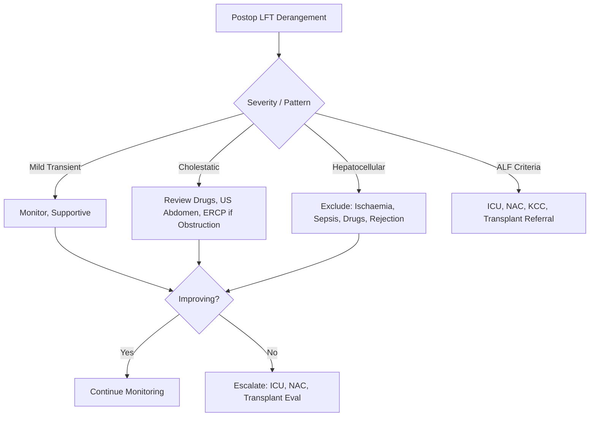

# Perioperative Liver Assessment

## Learning Objectives
- [ ] Perform preoperative liver risk stratification
- [ ] Interpret preoperative liver function tests
- [ ] Assess surgical risk in cirrhosis (Child-Pugh, MELD, CPET)
- [ ] Manage intraoperative and postoperative liver dysfunction
- [ ] Identify FCPS/MRCP high-yield perioperative hepatology

---

## Preoperative Hepatic Risk Stratification

```mermaid
flowchart TD
    A[Patient for Surgery] --> B{Known Liver Disease?}
    B -->|Yes| C[Formal Assessment]
    B -->|No| D[Screening LFTs if Risk Factors]
    C --> E[Child-Pugh Score]
    C --> F[MELD/MELD-Na Score]
    C --> G[CPET (If Major Surgery)]
    C --> H[Frailty Assessment (CFS)]
    C --> H1[Portal Hypertension Screen (US, Platelets)]
    E & F & G & H --> I{Risk Category}
    I -->|Low| J[Proceed with Standard Care]
    I -->|Moderate| K[Optimise → Proceed with Caution]
    I -->|High| L[Defer / Palliative / Transplant Eval]
```

---

## Preoperative Liver Function Tests

### Standard Screening Panel

| Test | Purpose | Abnormal → Action |
|------|---------|-------------------|
| **ALT, AST** | Hepatocellular Injury | Investigate Cause |
| **ALP, GGT** | Cholestasis / Biliary Obstruction | US Abdomen, MRCP if Needed |
| **Bilirubin** | Synthetic/Excretory Function | MELD Calculation |
| **Albumin** | Synthetic Function / Nutrition | Nutritional Optimisation |
| **INR / PT** | Synthetic Function | Transfuse if >1.5 (Procedure) |
| **Platelets** | Portal Hypertension / Hypersplenism | Transfuse if <50k (Major Surgery) |

> **FCPS/MRCP**: **Do NOT Routinely Correct INR/Platelets** Unless Active Bleeding or High-Risk Procedure

---

## Surgical Risk Stratification in Cirrhosis

### Child-Pugh Classification

| Class | Score | 30-Day Postoperative Mortality | Elective Surgery |
|-------|-------|-------------------------------|------------------|
| **A** | 5-6 | **~10%** | **Safe** (Standard Consent) |
| **B** | 7-9 | **~30%** | **High Risk** (MDT, Optimise First) |
| **C** | 10-15 | **>50%** | **Contraindicated** (Except Transplant) |

### MELD Score

| MELD Score | 30-Day Mortality | Elective Surgery |
|------------|------------------|------------------|
| **<10** | <5% | Low Risk |
| **10-19** | 10-20% | Moderate Risk (Optimise) |
| **≥20** | >30% | **High Risk / Contraindicated** |
| **≥30** | >50% | **Contraindicated** |

> **FCPS/MRCP**: **Child-Pugh B/C or MELD ≥15 = High Surgical Risk** — Requires MDT

---

## Comprehensive Preoperative Assessment

### 1. Hepatic Reserve Assessment

| Test | Purpose | Threshold |
|------|---------|-----------|
| **Child-Pugh Score** | Global Synthetic Function | Class B/C = High Risk |
| **MELD/MELD-Na** | Objective Mortality Prediction | **≥15 = High Risk** |
| **ICG Clearance (ICG-PDR)** | Functional Hepatic Reserve | **<14%/min = High Risk** |
| **LiMAx Test** | Hepatic Function Capacity | **<300 μg/kg/h = High Risk** |
| **CT Volumetry (FLR)** | Future Liver Remnant | **<20% (Healthy), <30% (Cirrhosis)** |

### 2. Portal Hypertension Assessment

| Test | Indication | Finding |
|------|------------|---------|
| **US + Doppler** | All Cirrhosis | Portal Vein Flow, Diameter, Collaterals |
| **Platelet Count** | Surrogate for PH | **<150k = CSPH Likely** |
| **Spleen Size** | Surrogate for PH | **>13-15 cm = CSPH** |
| **HVPG** | Gold Standard | **≥10 mmHg = CSPH; ≥20 = High Risk** |

### 3. Cardiopulmonary Assessment

| Test | Indication |
|------|------------|
| **CPET (VO2 max)** | Major Hepatic Resection, Transplant |
| **Echocardiography** | All Major Surgery (Diastolic Dysfunction, PoPH) |
| **ABG / PFTs** | If COPD/Pulmonary Disease Suspected |

### 4. Frailty & Nutritional Assessment

| Tool | Purpose |
|------|---------|
| **Clinical Frailty Scale (CFS)** | Predicts Postoperative Complications, Mortality |
| **Sarcopenia (CT L3 SMI)** | Predicts Complications, Mortality |
| **MNA (Mini Nutritional Assessment)** | Malnutrition = Poor Outcomes |
| **Handgrip Strength** | Sarcopenia Proxy |

---

## Intraoperative Liver Protection

### Anaesthetic Considerations

| Drug | Hepatic Effect | Preference |
|-------|----------------|------------|
| **Volatile Agents** | ↓ Hepatic Blood Flow (Dose-Dependent) | **Sevoflurane/Desflurane > Isoflurane** |
| **IV Agents (Propofol)** | Minimal Hepatic Effect | **Preferred** |
| **Opioids** | Minimal Direct Effect | **Monitor Sedation** |
| **Muscle Relaxants** | Rocuronium/Cisatracurium (Hepatic Clearance) | **Cisatracurium (Hofmann Elimination)** |

### Haemodynamic Goals

| Parameter | Target | Rationale |
|-----------|--------|-----------|
| **MAP** | **≥65 mmHg** | Hepatic Perfusion Pressure |
| **CVP** | **<10-12 mmHg** | Avoid ↑ IVC Pressure → ↓ Hepatic Venous Outflow |
| **Urine Output** | **>0.5 ml/kg/h** | Renal Perfusion → Hepatorenal Syndrome Prevention |
| **Hb** | **>80 g/L** (Restrictive) | Avoid Over-Transfusion (Portal Pressure) |

---

## Postoperative Liver Dysfunction

### Classification

| Syndrome | Definition | Timing | Mortality |
|----------|------------|--------|-----------|
| **Postoperative Liver Failure (50-50 Criteria)** | Bilirubin >50 μmol/L + PT <50% on Day 5 | Day 5 | High |
| **Acute Liver Failure** | INR ≥1.5 + Encephalopathy | <26 Weeks | Very High |
| **Transient Elevation** | AST/ALT >3×ULN, Resolving | Days 1-3 | Low |
| **Ischaemic Hepatitis** | AST/ALT >2000, Rapid Rise/Fall | Post-Hypotension | High (If Severe) |

---

## Management of Postoperative Liver Dysfunction



### Supportive Management

| Intervention | Target |
|-------------|--------|
| **Glucose** | **4-7 mmol/L** (Tight Control, Avoid Hypoglycaemia) |
| **Coagulopathy** | Vit K 10mg IV; FFP Only if Bleeding/Procedure (INR >2) |
| **Renal** | Avoid Nephrotoxins; Early CVVH if AKI |
| **Infection** | Surveillance Cultures; Prophylactic Abx (Selective) |
| **Nutrition** | **Early EN (24-48h)**; Protein 1.2-1.5g/kg/day |
| **Glucose** | 4-7 mmol/L (Insulin Infusion if Needed) |

---

## Specific Surgical Scenarios

### Hepatic Resection

| Parameter | Safe Threshold |
|-----------|----------------|
| **FLR (Healthy Liver)** | **>20%** |
| **FLR (Cirrhosis)** | **>30-40%** |
| **Vascular Inflow/Occlusion** | Intermittent Pringle (15/5 min) |
| **Postop Monitoring** | Day 1, 3, 5: Bilirubin, INR, Lactate, LFTs |

### Emergency Surgery in Cirrhosis

| Scenario | Management |
|----------|------------|
| **Bleeding Varices** | Vasoactives + Endoscopy + Antibiotics → Surgery Only if Failed |
| **Perforated Ulcer** | Damage Control → Stabilise → Definitive |
| **Obstruction** | Stent/Nasogastric Decompression → Semi-Elective |

---

## FCPS/MRCP High-Yield Summary

| Concept | Key Points |
|---------|------------|
| **Child-Pugh A** | Safe for Elective Surgery |
| **Child-Pugh B** | High Risk — Optimise, MDT Decision |
| **Child-Pugh C** | Contraindicated (Except Transplant) |
| **MELD ≥15** | Transplant Referral / High Surgical Risk |
| **MELD ≥20** | Contraindicated Elective Surgery |
| **FLR Thresholds** | Healthy >20%; Cirrhosis >30-40% |
| **ICG-PDR <14%** | High Risk |
| **Postop Bilirubin >50 + PT<50% (Day 5)** | "50-50 Criteria" → High Mortality |
| **Anaesthesia** | Sevo/Des > Iso; Propofol Good; Cisatracurium Preferred |
| **Postop Bilirubin >50 μmol/L Day 5** | "50-50 Rule" = High Mortality Risk |

---

## Viva Questions

1. **What is the maximum safe MELD score for elective surgery?**
2. **What is the FLR threshold for major hepatectomy in cirrhosis?**
3. **What are the "50-50 criteria" for postoperative liver failure?**
3. **How does cirrhosis affect drug metabolism perioperatively?**
4. **What is the role of ICG clearance in preoperative assessment?**
4. **What are the anaesthetic agents of choice in liver disease?**
5. **What is the management of postoperative liver failure?**
5. **When is liver surgery contraindicated in cirrhosis?**
6. **What is the role of portal hypertension assessment preoperatively?**
6. **How do you manage coagulopathy perioperatively in cirrhosis?**

---

## Confusions & Mnemonics

| Confusion | Clarification |
|-----------|---------------|
| Child-Pugh vs MELD | Child-Pugh = Clinical/Subjective; MELD = Objective, Allocation |
| FLR Healthy vs Cirrhosis | **Healthy >20%**; **Cirrhosis >30-40%** |
| 50-50 Criteria Day 5 | Bilirubin >50 + PT <50% = High Mortality |
| Prophylactic FFP | **NOT Routine** — Only Bleeding/Invasive Procedure |
| Anticoagulation in Cirrhosis | **Complex** — Balance Bleed vs Thrombosis; LMWH Often Used |
| Regional Anaesthesia | **Epidural Safe** if Coagulopathy Corrected; Avoid if INR>1.5, Plt<80k |
| Ascites Preoperatively | **LVP + Albumin** to Optimize Respiratory Mechanics |
| ICP in Cirrhosis Surgery | **Avoid Hypercapnia**; Head Up; Mannitol if Raised |

---

## Mind Map

```mermaid
mindmap
  root((Perioperative Liver Assessment))
    Preoperative Assessment
      LFTs, INR, Albumin, Platelets
      Child-Pugh, MELD, MELD-Na
      ICG-PDR, LiMAx, FLR (CT Volumetry)
      HVPG, US Doppler, Platelets
      CPET, Echo, Frailty, Nutrition
    Risk Stratification
      Child A / MELD<10 = Low
      Child B / MELD 10-19 = Moderate
      Child C / MELD>=20 = High/Contraindicated
    Intraoperative
      Anaesthesia: Sevo/Des, Propofol, Cisatracurium
      Haemodynamics: MAP>65, CVP<12, Avoid Overload
      Vascular Control: Pringle (15/5min)
    Postoperative Complications
      Liver Failure: 50-50 Criteria (Day 5)
      Ischaemic Hepatitis: Hypotension → Transaminitis
      Bile Leak: ERCP Stent
      Infection: Surveillance Culture
    Specific Surgeries
      Hepatectomy: FLR >20% (Healthy) / >30-40% (Cirrhosis)
      Emergency in Cirrhosis: Damage Control
      Transplant: MELD Allocation
```

---

## One-Page Revision Card

| **Risk Stratification** | **Criteria** | **Surgery** |
|-------------------------|--------------|-------------|
| **Low** | Child A, MELD <10, ICG-PDR >18% | **Proceed** |
| **Moderate** | Child B, MELD 10-19 | **Optimise → MDT Decision** |
| **High** | Child C, MELD ≥20, ICG-PDR <14% | **Contraindicated** (Except Transplant) |

| **Preop Assessment** | **Tool** | **Threshold** |
|---------------------|----------|---------------|
| Synthetic Function | Child-Pugh | A Safe, B Risk, C Contraindicated |
| Mortality Risk | MELD/MELD-Na | <10 Low, 10-19 Mod, ≥20 High |
| Hepatic Reserve | ICG-PDR / LiMAx | >18% / >300 Safe |
| FLR | CT Volumetry | >20% (Healthy), >30-40% (Cirrhosis) |
| Portal HTN | HVPG / Platelets | ≥10 CSPH; ≥20 High Risk |

| **Intraoperative** | **Targets** |
|--------------------|-------------|
| MAP | ≥65 mmHg |
| CVP | 8-12 mmHg (Avoid High) |
| Anaesthesia | Sevo/Des, Propofol, Cisatracurium |
| Pringle | 15 min On / 5 min Off |

| **Postop Liver Failure** | **Criteria (Day 5)** |
|--------------------------|----------------------|
| **50-50 Rule** | Bilirubin >50 μmol/L + PT <50% |
| **Action** | ICU, NAC, Transplant Evaluation |

| **Surgery Contraindicated** | |
|---------------------------|---|
| Child-Pugh C | |
| MELD ≥20 (Elective) | |
| FLR <20% (Healthy) / <30% (Cirrhosis) | |

---

## Spaced Repetition Tracker

| Day | 1 | 3 | 7 | 15 | 30 |
|-----|---|---|---|----|----|
| Child-Pugh/MELD Thresholds | ☐ | ☐ | ☐ | ☐ | ☐ |
| FLR Thresholds | ☐ | ☐ | ☐ | ☐ | ☐ |
| 50-50 Criteria | ☐ | ☐ | ☐ | ☐ | ☐ |
| Anaesthetic Choices | ☐ | ☐ | ☐ | ☐ | ☐ |
| FLR Thresholds | ☐ | ☐ | ☐ | ☐ | ☐ |

---

## Self-Test Scorecard

| Question | My Answer | Correct? |
|----------|-----------|----------|
| Child-Pugh B Mortality |  |  |
| FLR Threshold Cirrhosis |  |  |
| 50-50 Criteria |  |  |
| Anaesthetic Agent Choice |  |  |
| MELD ≥20 Contraindicated |  |  |

---

## Local Navigation

- [[Hepatology in Special Situations/Liver disease in the elderly|Liver in Elderly]]
- [[Hepatology in Special Situations/Liver disease in HIV|Liver in HIV]]
- [[Hepatology in Special Situations/Liver disease in critical illness|Critical Illness]]
- [[Liver Transplantation/Liver Transplantation|Liver Transplant]]
- [[Portal Hypertension and Complications/Acute variceal bleeding management|Variceal Bleed]]