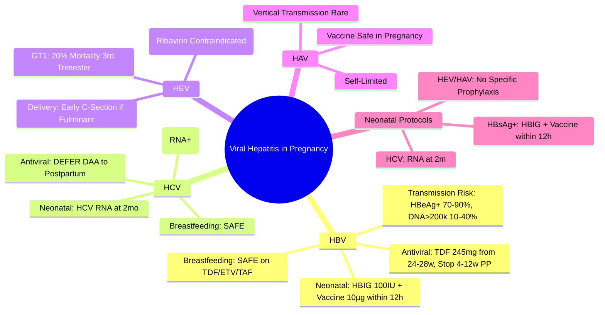

# Viral Hepatitis in Pregnancy

## Learning Objectives
- [ ] Manage HBV in pregnancy (vertical transmission prevention, antiviral indications)
- [ ] Manage HCV in pregnancy (transmission risk, treatment timing)
- [ ] Manage HEV in pregnancy (high mortality, supportive care)
- [ ] Apply delivery and postpartum care protocols
- [ ] Identify FCPS/MRCP high-yield obstetric virology

---

## Hepatitis B in Pregnancy

### Vertical Transmission Risk

| Maternal Factor | Transmission Risk Without Intervention |
|-----------------|----------------------------------------|
| **HBeAg+** | 70-90% |
| **HBeAg-, High HBV DNA (>200,000 IU/mL)** | 10-40% |
| **HBeAg-, Low HBV DNA (<200,000 IU/mL)** | <5% (Rare) |
| **HBsAg+ Only (No HBeAg, Low DNA)** | 5-10% |

> **FCPS/MRCP**: **HBV DNA >200,000 IU/mL = High Risk → Maternal Antiviral Indicated**

---

## Maternal Antiviral Therapy

### Indication
| Maternal HBV DNA | Gestation Start | Recommendation |
|------------------|----------------|----------------|
| **>200,000 IU/mL** (or **>5.3 log10 IU/mL**) | **24-28 Weeks** | **TENOFOVIR DISOPROXIL FUMARATE (TDF) 245mg Daily** |
| **<200,000 IU/mL** | — | **No Antiviral Needed** (Immunoprophylaxis Alone Sufficient) |

> **Threshold**: **200,000 IU/mL (5.3 log10)** — Evidence-Based from Multiple RCTs

### Drug of Choice: TDF (Tenofovir DF)
| Aspect | Detail |
|-------|--------|
| **Drug** | **Tenofovir DF (TDF) 245mg Daily** |
| **Start** | **24-28 Weeks Gestation** |
| **Stop** | **4-12 Weeks Postpartum** (After HBIG/Vaccine to Baby) |
| **Safety** | **Category B** — No Teratogenicity; Safe in Pregnancy |
| **Monitoring** | Renal Function, LFTs, HBV DNA q4-6 Weeks |

> **TDF Preferred Over ETV/TAF** — Most Pregnancy Safety Data; TAF Emerging but Less Data

### Discontinuation
- **Stop at 4-12 Weeks Postpartum**
- **Continue if**: High Baseline HBV DNA, Cirrhosis, Treatment Indication Persists
- **Flare Risk**: Postpartum ALT Flare Common — Monitor LFTs Monthly ×3 Months

---

## Neonatal Immunoprophylaxis (Within 12 Hours)

| Intervention | Dose | Timing |
|--------------|------|--------|
| **Hepatitis B Immunoglobulin (HBIG)** | **100 IU (0.5 mL) IM** | **Within 12 Hours** of Birth (Ideally <24h) |
| **Hepatitis B Vaccine (Engerix-B/HBvaxPRO)** | **10 µg (0.5 mL) IM** | **Within 24 Hours** of Birth (Different Site from HBIG) |

### Vaccination Schedule (Standard)
| Dose | Timing |
|------|--------|
| **1st** | Birth (with HBIG) |
| **2nd** | 1 Month |
| **3rd** | 6 Months |
| **Booster (if Anti-HBs <10)** | 6-12 Months |

> **Preterm <2kg**: HBIG + Vaccine at Birth → 3 Additional Doses (1, 2, 6, 12 Months)

---

## Breastfeeding

| Situation | Recommendation |
|-----------|----------------|
| **Mother on TDF/ETV/TAF** | **Safe to Breastfeed** — Minimal Drug Excretion in Milk |
| **Mother HBsAg+ Not on Treatment** | **Safe to Breastfeed** — No Additional Transmission Risk if Baby Received HBIG + Vaccine |
| **Mother HIV Coinfected** | **Avoid Breastfeeding** (If Safe Alternative Exists) |

> **FCPS/MRCP**: **Breastfeeding Safe** with Immunoprophylaxis — **No Contraindication**

---

## Postpartum Management

| Aspect | Management |
|--------|------------|
| **Maternal ALT Flare** | Common 4-12w Postpartum — Monitor LFTs Monthly ×3mo; Usually Self-Limited |
| **Antiviral Continuation** | Stop at 4-12w Postpartum (Unless Cirrhosis/Indication Persists) |
| **HBeAg Seroconversion** | More Common Postpartum — Monitor HBV DNA, HBeAg |
| **Contraception** | Discuss Postpartum — TDF/ETV/TAF Safe with All Methods |

---

## High-Risk Scenarios

| Scenario | Management |
|---------|------------|
| **Acute HBV in Pregnancy** | Supportive; TDF if ALF Risk; HBIG + Vaccine to Baby |
| **HBV Reactivation Postpartum** | Common 4-12w — Monitor LFTs Monthly ×3mo |
| **Mother HIV Coinfected** | TDF/FTC Backbone — Treat Both; Avoid Breastfeeding |
| **Mother on ETV** | **Switch to TDF** (ETV Pregnancy Data Limited) |
| **Mother with Cirrhosis** | Continue TDF Throughout Pregnancy + Postpartum |
| **Emergency Delivery <24w** | HBIG + Vaccine Still Indicated; Antiviral if High Risk |

---

## Hepatitis C in Pregnancy

### Vertical Transmission Risk

| Maternal Factor | Transmission Risk |
|-----------------|-------------------|
| **HCV RNA Positive** | **5-6%** (Higher if HIV Coinfected) |
| **HCV RNA Negative** | **Negligible** |
| **HIV Co-infection** | **10-15%** (Higher Viral Load) |

### Antiviral Therapy

| Scenario | Management |
|----------|------------|
| **Known HCV** | **Defer DAA Until Postpartum** (DAA Not Approved in Pregnancy) |
| **Acute HCV** | Supportive; Monitor; Treat Postpartum |
| **Cirrhosis** | Standard Management; Avoid Teratogens |

### Neonatal Management

| Intervention | Details |
|--------------|---------|
| **Breastfeeding** | **Safe** (No HCV Transmission via Breast Milk) |
| **Testing** | **HCV RNA at 2 Months** (Anti-HCV Passively Transferred) |
| **Follow-up** | HCV RNA at 12 Months; If Positive → Pediatric Referral |

---

## Hepatitis E in Pregnancy

| Feature | HEV in Pregnancy |
|-------|-----------------|
| **Genotype 1** | **20% Mortality (3rd Trimester)**; Fulminant Hepatic Failure |
| **Genotype 3/4** | Less Severe; Rare Chronic |
| **Management** | **Supportive** (No Antivirals Approved); Early Delivery Considered if Severe |
| **Ribavirin** | **Contraindicated** (Teratogenic) |
| **Delivery** | **Early C-Section** if Fulminant; Supportive Otherwise |

---

## Hepatitis A in Pregnancy

| Feature | HAV in Pregnancy |
|--------|------------------|
| **Course** | Self-Limited; No Increased Severity |
| **Vertical Transmission** | **Rare** (Transplacental <1%) |
| **Management** | Supportive; Vaccine Post-Exposure if Exposed |
| **Vaccine** | **Safe in Pregnancy** (Inactivated) |

---

## Neonatal Immunoprophylaxis Summary

| Mother | HBIG + Vaccine (Within 12h) | Vaccine Schedule |
|--------|----------------------------|------------------|
| **HBsAg+** | **YES** | Birth, 1m, 6m |
| **HBsAg- (Resolved)** | No | Standard Schedule |
| **HCV RNA+** | No HBIG | Standard Schedule + HCV RNA at 2m |
| **HEV** | No HBIG | N/A |

> **Preterm <2kg**: HBIG + Vaccine ×4 Doses (Birth, 1, 2, 6, 12mo)

---

## FCPS/MRCP High-Yield Summary

| Virus | Vertical Transmission | Maternal Antiviral | Neonatal Prophylaxis | Breastfeeding |
|-------|----------------------|-------------------|---------------------|---------------|
| **HBV** | High if HBeAg+/DNA>200k | **TDF 245mg from 24-28w** | **HBIG + Vaccine ≤12h** | **Safe** |
| **HCV** | 5-6% (RNA+) | **No DAA in Pregnancy** | HCV RNA at 2m | **Safe** |
| **HEV** | High in 3rd Trimester (GT1) | **No Antiviral** | No HBIG | Safe if Not Fulminant |
| **HAV** | Rare | No Antiviral | Vaccine Post-Exposure | Safe |

---

## Viva Questions

1. **What is the HBV DNA threshold for maternal antiviral therapy in pregnancy?**
2. **What is the antiviral of choice? Dose? When to start/stop?**
3. **What is the neonatal immunoprophylaxis protocol?**
3. **Is breastfeeding safe in HBsAg+ mother?**
4. **What is the postpartum flare? When does it occur?**
4. **What if mother has HCV RNA <200k?**
5. **What is the vaccination schedule for infant?**
5. **Is breastfeeding safe in HCV?**
6. **What is the mortality of HEV in pregnancy?**
7. **What if mother on ETV?**
8. **What is the neonatal testing schedule for HCV?**
9. **What is the HBIG dose and timing?**
10. **What if emergency delivery at 24 weeks?**

---

## Confusions & Mnemonics

| Confusion | Clarification |
|-----------|---------------|
| TDF vs ETV in Pregnancy | **TDF Preferred** — Most Safety Data; ETV Data Limited; TAF Emerging |
| DNA Threshold | **200,000 IU/mL (5.3 log)** — NOT 20,000 or 2,000 |
| HBIG Timing | **Within 12 Hours** (Ideally) — Different Site from Vaccine |
| Breastfeeding | **Safe** — No Additional Risk with Immunoprophylaxis |
| Postpartum Flare | **ALT Rise 4-12w** — Immune Reconstitution; Monitor Don't Treat Unless Severe |
| TDF Stop | **4-12 Week Postpartum** — Unless Cirrhosis/Ongoing Indication |
| Preterm <2kg | **Extra Vaccine Doses** (Birth, 1, 2, 6, 12mo) |
| ETV in Pregnancy | **Switch to TDF** — Less Pregnancy Data |
| HCV DAA in Pregnancy | **Contraindicated** — Not Approved; Defer to Postpartum |
| HEV in Pregnancy | **GT1: 20% Mortality**; Ribavirin Contraindicated |

---

## Mind Map

---

## One-Page Revision Card

| **HBV in Pregnancy** | **Details** |
|----------------------|-------------|
| **Transmission Risk** | HBeAg+ 70-90%; DNA>200k 10-40% |
| **Antiviral Indication** | **HBV DNA >200,000 IU/mL** |
| **Drug** | **TDF 245mg Daily** |
| **Timing** | **Start 24-28w, Stop 4-12w PP** |
| **Neonatal Prophylaxis** | **HBIG 100IU + Vaccine 10µg ≤12h** |

| **HCV in Pregnancy** | |
|----------------------|--|
| Transmission | 5-6% (RNA+) |
| Antiviral | **NO DAA** (Defer Postpartum) |
| Breastfeeding | **SAFE** |
| Infant Follow-up | HCV RNA at 2 Months |

| **HEV in Pregnancy** | |
|----------------------|--|
| GT1 Mortality | **20% in 3rd Trimester** |
| Antiviral | **NONE** (Ribavirin Contraindicated) |
| Delivery | Early C-Section if Fulminant |

| **Neonatal Prophylaxis** | **Details** |
|--------------------------|-------------|
| HBsAg+ Mother | HBIG 100IU + Vaccine 10µg (≤12h) |
| HCV RNA+ Mother | HCV RNA at 2 Months |
| HBsAg- Resolved | Standard Schedule Only |

---

## Spaced Repetition Tracker

| Day | 1 | 3 | 7 | 15 | 30 |
|-----|---|---|---|----|----|
| HBV DNA Threshold | ☐ | ☐ | ☐ | ☐ | ☐ |
| TDF Start/Stop | ☐ | ☐ | ☐ | ☐ | ☐ |
| HBIG + Vaccine Timing | ☐ | ☐ | ☐ | ☐ | ☐ |
| Breastfeeding Safety | ☐ | ☐ | ☐ | ☐ | ☐ |
| Postpartum Flare | ☐ | ☐ | ☐ | ☐ | ☐ |

---

## Self-Test Scorecard

| Question | My Answer | Correct? |
|----------|-----------|----------|
| HBV DNA Threshold for TDF |  |  |
| HBIG + Vaccine Timing |  |  |
| Breastfeeding Safe? |  |  |
| TDF Stop Timing |  |  |
| Postpartum Flare |  |  |

---

## Local Navigation

- [[Viral Hepatitis/Hepatitis B|HBV Overview]]
- [[Viral Hepatitis/Hepatitis B phases of chronic infection|HBV Phases]]
- [[Viral Hepatitis/Hepatitis B treatment indications|HBV Treatment]]
- [[Viral Hepatitis/Hepatitis B reactivation|HBV Reactivation]]
- [[Viral Hepatitis/Hepatitis B pregnancy and vertical transmission|HBV Pregnancy]]
- [[Autoimmune Liver Disease/AIH in pregnancy|AIH Pregnancy]]
---

> Auto-generated study sections for "Hepatology in Special Situations" — Ch 23: Hepatology.

## Flashcards (27 generated)

- Q: What is the definition of Hepatology in Special Situations?
  A: | Maternal HBV DNA | Gestation Start | Recommendation |
- Q: What is Drug of Hepatology in Special Situations?
  A: Tenofovir DF (TDF) 245mg Daily
- Q: What is Start of Hepatology in Special Situations?
  A: 24-28 Weeks Gestation
- Q: What is Stop of Hepatology in Special Situations?
  A: 4-12 Weeks Postpartum (After HBIG/Vaccine to Baby)
- Q: What is Safety of Hepatology in Special Situations?
  A: Category B — No Teratogenicity; Safe in Pregnancy
- Q: How is Hepatology in Special Situations monitored?
  A: Renal Function, LFTs, HBV DNA q4-6 Weeks
- Q: What is Maternal ALT Flare of Hepatology in Special Situations?
  A: Common 4-12w Postpartum — Monitor LFTs Monthly ×3mo; Usually Self-Limited
- Q: What is Antiviral Continuation of Hepatology in Special Situations?
  A: Stop at 4-12w Postpartum (Unless Cirrhosis/Indication Persists)
- Q: What is HBeAg Seroconversion of Hepatology in Special Situations?
  A: More Common Postpartum — Monitor HBV DNA, HBeAg
- Q: What is Contraception of Hepatology in Special Situations?
  A: Discuss Postpartum — TDF/ETV/TAF Safe with All Methods
- Q: What is Course of Hepatology in Special Situations?
  A: Self-Limited; No Increased Severity
- Q: What is Vertical Transmission of Hepatology in Special Situations?
  A: Rare (Transplacental <1%)
- Q: How is Hepatology in Special Situations managed?
  A: Supportive; Vaccine Post-Exposure if Exposed
- Q: What is Vaccine of Hepatology in Special Situations?
  A: Safe in Pregnancy (Inactivated)
- Q: What is Drug of Hepatology in Special Situations?
  A: Tenofovir DF (TDF) 245mg Daily
- Q: What is Start of Hepatology in Special Situations?
  A: 24-28 Weeks Gestation
- Q: What is Stop of Hepatology in Special Situations?
  A: 4-12 Weeks Postpartum (After HBIG/Vaccine to Baby)
- Q: What is Safety of Hepatology in Special Situations?
  A: Category B — No Teratogenicity; Safe in Pregnancy
- Q: How is Hepatology in Special Situations monitored?
  A: Renal Function, LFTs, HBV DNA q4-6 Weeks
- Q: What is Maternal ALT Flare of Hepatology in Special Situations?
  A: Common 4-12w Postpartum — Monitor LFTs Monthly ×3mo; Usually Self-Limited
- Q: What is Antiviral Continuation of Hepatology in Special Situations?
  A: Stop at 4-12w Postpartum (Unless Cirrhosis/Indication Persists)
- Q: What is HBeAg Seroconversion of Hepatology in Special Situations?
  A: More Common Postpartum — Monitor HBV DNA, HBeAg
- Q: What is Contraception of Hepatology in Special Situations?
  A: Discuss Postpartum — TDF/ETV/TAF Safe with All Methods
- Q: What is Course of Hepatology in Special Situations?
  A: Self-Limited; No Increased Severity
- Q: What is Vertical Transmission of Hepatology in Special Situations?
  A: Rare (Transplacental <1%)
- Q: How is Hepatology in Special Situations managed?
  A: Supportive; Vaccine Post-Exposure if Exposed
- Q: What is Vaccine of Hepatology in Special Situations?
  A: Safe in Pregnancy (Inactivated)

## MCQs (1 generated)

1. **Which of the following best describes Hepatology in Special Situations?**
   A. **| Maternal HBV DNA | Gestation Start | Recommendation |**
   B. An unrelated condition not matching the clinical picture of Hepatology in Special Situations
   C. A complication seen late in the disease course of Hepatology in Special Situations
   D. A condition that mimics Hepatology in Special Situations but has a different underlying cause

