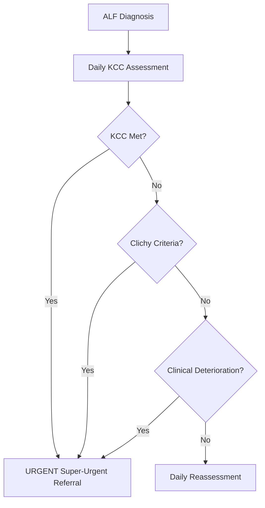

# Liver Transplant Referral and Timing in Acute Liver Failure

## Learning Objectives
- [ ] Apply transplant referral criteria (King's College, Clichy, MELD)
- [ ] Understand super-urgent listing process
- [ ] Identify contraindications to transplant in ALF
- [ ] Manage patient while awaiting transplant
- [ ] Identify FCPS/MRCP high-yield referral timing

---

## Transplant Referral Criteria



---

## 1. King's College Criteria (Primary Referral Standard)

### Paracetamol-Induced ALF
> **Any ONE of:**
1. **Arterial pH <7.30** (after adequate fluid resuscitation)
   **OR**
2. **PT >100 seconds (INR >6.5)** + **Serum Creatinine >300 μmol/L (3.4 mg/dL)** + **Grade III/IV Encephalopathy**

### Non-Paracetamol ALF
> **Any ONE of:**
1. **PT >100 seconds (INR >6.5)**
   **OR**
2. **Any THREE of the following 5 Minor Criteria:**
   - **Age** <10 years **or** >40 years
   - **Aetiology**: Non-A, Non-B Hepatitis, Drug-Induced, **Indeterminate**
   - **Jaundice to Encephalopathy Interval** >7 days
   - **PT >50 seconds (INR >3.5)**
   - **Serum Bilirubin >300 μmol/L (17.5 mg/dL)**

> **Mnemonic for Minor Criteria: "AAIII"** — Age, Aetiology, Interval, INR, Icterus

---

## 2. Clichy Criteria (Alternative for Paracetamol ALF)

| Criterion | Threshold |
|-----------|-----------|
| **Factor V** | **<20% of normal** (if age <30 years) |
| **Factor V** | **<30% of normal** (if age ≥30 years) |
| **AND** | **Hepatic Encephalopathy Grade III/IV** |

- **Used in some European centres** (France)
- **Factor V** reflects hepatic synthetic function better than PT
- **Same urgency** as KCC if met

---

## 3. MELD Score (Supplementary)

```
MELD = 3.78×ln(Bilirubin) + 11.2×ln(INR) + 9.57×ln(Creatinine) + 6.43
```
- **Range**: 6-40 (Higher = Sicker)
- **MELD ≥30**: High mortality; Consider Transplant Referral
- **Used when KCC not met** but clinical deterioration

---

## Referral Timing & Process

### When to Refer
| Scenario | Action |
|----------|--------|
| **KCC Met** | **IMMEDIATE** — Super-Urgent Referral |
| **Clichy Met** | **IMMEDIATE** — Super-Urgent Referral |
| **MELD ≥30** | Urgent Referral (If KCC Not Met) |
| **Clinical Deterioration Despite Max Therapy** | Urgent Referral |
| **Uncontrollable ICP >25 mmHg** | Urgent Referral |
| **Progressive Multi-organ Failure** | Urgent Referral |

### Referral Process (UK Model)
```mermaid
flowchart TD
    A[ALF Unit Identifies KCC/Referral Criteria] --> B[Contact National Transplant Centre]
    B --> C[Provide: KCC, MELD, Labs, Imaging, Clinical Summary]
    C --> D[Centre Assesses: Suitability, Contraindications]
    D --> E{Accepted?}
    E -->|Yes| F[Super-Urgent Listing (Days 0-1)]
    E -->|No| G[Discuss Futility / Palliation / Retrieve]
    F --> H[Transfer for Transplant Assessment]
    H --> I[Final Workup: Cardiac, Pulmonary, Infection Screen, Psychosocial]
    I --> J[Transplant if Organ Available]
```

---

## Super-Urgent Listing (UK) / Status 1A (US)

| Region | Listing Category | Priority |
|--------|------------------|----------|
| **UK (NHSBT)** | **Super-Urgent** (Category 1) | **Highest** — National Allocation |
| **US (UNOS)** | **Status 1A** | **Highest** — Regional/National |
| **Europe (Eurotransplant)** | **High Urgency (HU)** | **Highest** |

- **Time to Transplant**: Median **1-3 days** for Super-Urgent/Status 1A
- **Outcome**: **70-80% 1-year survival** post-transplant for ALF

---

## Contraindications to Transplant in ALF

### Absolute Contraindications
| Contraindication | Rationale |
|------------------|-----------|
| **Uncontrolled Sepsis** | Immunosuppression Fatal |
| **Irreversible Brain Damage** (Brain Death) | No Neurological Recovery |
| **Extrahepatic Malignancy** (<5y Disease-Free) | Recurrence Risk |
| **Severe Cardiopulmonary Disease** | Perioperative Mortality |
| **Advanced AIDS** (CD4 <200, Uncontrolled) | Infection/Recurrence |
| **Active Substance Abuse** (Alcohol <6mo Abstinence) | Recurrence/Non-Adherence |
| **Severe Psychiatric Illness** (Non-Adherence Risk) | Graft Loss |
| **Lack of Social Support** | Post-Tx Care Failure |

### Relative Contraindications
| Factor | Assessment |
|--------|------------|
| **Age >70** | Biological > Chronological Age |
| **Severe Malnutrition / Sarcopenia** | Poor Outcomes |
| **Portal Vein Thrombosis (Complete, Non-reconstructible)** | Technical Failure |
| **Non-Adherence History** | Multidisciplinary Assessment |

---

## Pre-Transplant Stabilisation (While Awaiting Organ)

| System | Target / Action |
|--------|-----------------|
| **Neurological** | ICP <20 mmHg; Mannitol/3% Saline; Sedation; Avoid Hypercarbia |
| **Coagulation** | FFP/Cryo for Bleeding/Procedures; **No Routine INR Correction** |
| **Renal** | CVVH if AKI/HRS; Electrolyte Correction; Avoid Nephrotoxins |
| **Cardiovascular** | MAP ≥65; Norepinephrine; Avoid Fluid Overload (CVP 8-12) |
| **Respiratory** | PaCO₂ 30-35 mmHg (If Cerebral Oedema); Lung Protective Ventilation |
| **Metabolic** | Glucose 4-7 mmol/L (Hourly); K 4-4.5, Mg/Phos Normal |
| **Infection** | Surveillance Cultures; Targeted Antibiotics; No Routine Prophylaxis |
| **Nutrition** | Early EN (24-48h); Protein 1.2-1.5 g/kg; Thiamine 100mg IV |

---

## FCPS/MRCP High-Yield Summary

| Concept | Key Points |
|---------|------------|
| **Primary Criteria** | **King's College Criteria** (Paracetamol vs Non-PCM) |
| **KCC PCM** | pH<7.3 OR (PT>100s + Cr>300 + HE III/IV) |
| **KCC Non-PCM** | PT>100s OR 3 of 5 Minor (AAIII) |
| **Clichy (PCM)** | Factor V <20% (<30y) / <30% (≥30y) + HE III/IV |
| **MELD Threshold** | ≥30 (If KCC Not Met) |
| **Referral Timing** | **IMMEDIATE** when Criteria Met — Hours Matter |
| **Listing** | Super-Urgent (UK) / Status 1A (US) |
| **Contraindications** | Sepsis, Brain Death, Extrahepatic Cancer, Severe Cardiopulmonary |
| **Pre-Tx Stabilisation** | ICP Control, Euvolaemia, Glucose, Coagulation, Infection Control |

---

## Viva Questions

1. **What are the King's College Criteria for paracetamol ALF?**
2. **What are the King's College Criteria for non-paracetamol ALF?**
3. **What is the AAIII mnemonic for minor criteria?**
4. **What are the Clichy Criteria? How do they differ from KCC?**
5. **When do you refer for transplant if KCC not met?**
6. **What are the absolute contraindications to transplant in ALF?**
7. **What is the super-urgent listing process?**
8. **How do you stabilise a patient awaiting ALF transplant?**
8. **What is the role of MELD in ALF transplant referral?**
9. **What is the 1-year survival post-ALF transplant?**
10. **When do you consider futility and palliation?**

---

## Confusions & Mnemonics

| Confusion | Clarification |
|-----------|---------------|
| KCC PCM vs Non-PCM | PCM: pH<7.3 OR (PT>100+Cr>300+HE III/IV); Non-PCM: PT>100 OR 3 of 5 Minor |
| Minor Criteria | **AAIII**: Age <10/>40, Aetiology, Interval>7d, INR>3.5, Icterus (Bil>300) |
| Clichy vs KCC | Clichy: Factor V + HE III/IV; KCC: pH or PT/Cr/HE |
| Factor V Threshold | <20% (<30y), <30% (≥30y) — More Sensitive than PT |
| MELD in ALF | Supplementary — KCC Primary; MELD≥30 if KCC Not Met |
| Referral Urgency | **IMMEDIATE** — Hours to Days; Delay Increases Mortality |
| Brain Death in ALF | **Contraindication** — No Recovery Possible |
| Substance Abuse | **Relative** — <6mo Abstinence = Relative Contraindication |

---

## Mind Map

```mermaid
mindmap
  root((ALF Transplant Referral))
    Primary Criteria
      KCC Paracetamol
        pH <7.3 OR (PT>100 + Cr>300 + HE III/IV)
      KCC Non-PCM
        PT>100s OR 3 of 5 Minor (AAIII)
      Clichy (PCM)
        Factor V <20% (<30y) / <30% (>=30y) + HE III/IV
    Supplementary
      MELD >=30
      Clinical Deterioration
      Uncontrolled ICP
    Referral Process
      Immediate Contact Transplant Centre
      Super-Urgent / Status 1A Listing
      Transfer for Assessment
    Contraindications
      Absolute: Sepsis, Brain Death, Cancer, Cardiopulmonary
      Relative: Age>70, Malnutrition, PVT, Non-Adherence
    Pre-Transplant Stabilisation
      ICP <20, Euvolaemia, Glucose 4-7, Coagulation, Infection Control
    Outcomes
      Super-Urgent: 1-3 Days to Tx
      1-Year Survival: 70-80%
```

---

## One-Page Revision Card

| **KCC Paracetamol** | **Threshold** |
|---------------------|---------------|
| Arterial pH | **<7.30** (Post-Resus) |
| **OR** PT >100s + Cr >300 + HE III/IV | **All 3 Required** |

| **KCC Non-Paracetamol** | |
|-------------------------|--|
| PT >100s (INR>6.5) | **OR** |
| **Any 3 of 5 Minor (AAIII)** | |
| Age <10 or >40 | |
| Aetiology: Non-A/Non-B, Drug, Indeterminate | |
| Jaundice → HE >7 days | |
| PT >50s (INR>3.5) | |
| Bilirubin >300 μmol/L | |

| **Clichy (Paracetamol)** | |
|--------------------------|--|
| Factor V <20% | Age <30 years |
| Factor V <30% | Age ≥30 years |
| **AND** HE Grade III/IV | |

| **Referral Action** | |
|----------------------|---|
| **KCC Met** | **IMMEDIATE Super-Urgent** |
| **Clichy Met** | **IMMEDIATE Super-Urgent** |
| **Clinical Deterioration** | **Urgent Referral** |

| **Contraindications** | |
|----------------------|--|
| Absolute | Sepsis, Brain Death, Extrahepatic Cancer, Severe Cardiopulmonary, Active Substance Abuse |
| Relative | Age>70, Malnutrition, Complete PVT, Non-Adherence |

| **Pre-Transplant Stabilisation** | |
|----------------------------------|--|
| ICP <20 mmHg | Mannitol/3% Saline |
| Euvolaemia | CVP 8-12, Avoid Overload |
| Glucose 4-7 mmol/L | Hourly Monitoring |
| Coagulation | FFP Only for Bleed/Proc |
| Infection | Targeted Abx, Surveillance |

---

## Spaced Repetition Tracker

| Day | 1 | 3 | 7 | 15 | 30 |
|-----|---|---|---|----|----|
| KCC Paracetamol | ☐ | ☐ | ☐ | ☐ | ☐ |
| KCC Non-PCM + AAIII | ☐ | ☐ | ☐ | ☐ | ☐ |
| Clichy Criteria | ☐ | ☐ | ☐ | ☐ | ☐ |
| Contraindications | ☐ | ☐ | ☐ | ☐ | ☐ |
| Pre-Tx Stabilisation | ☐ | ☐ | ☐ | ☐ | ☐ |

---

## Self-Test Scorecard

| Question | My Answer | Correct? |
|----------|-----------|----------|
| KCC PCM Criteria |  |  |
| KCC Non-PCM Minor Criteria |  |  |
| AAIII Expansion |  |  |
| Clichy Factor V Threshold |  |  |
| Absolute Contraindications |  |  |

---

## Local Navigation

- [[Acute Liver Failure/Clinical assessment and prognosis|ALF Assessment]]
- [[Acute Liver Failure/King's College Criteria|King's College Criteria]]
- [[Acute Liver Failure/ICU supportive care|ICU Supportive Care]]
- [[Liver Transplantation/Liver Transplantation|Liver Transplant Overview]]
- [[Acute Liver Failure/Definition and Aetiology|ALF Aetiology]]