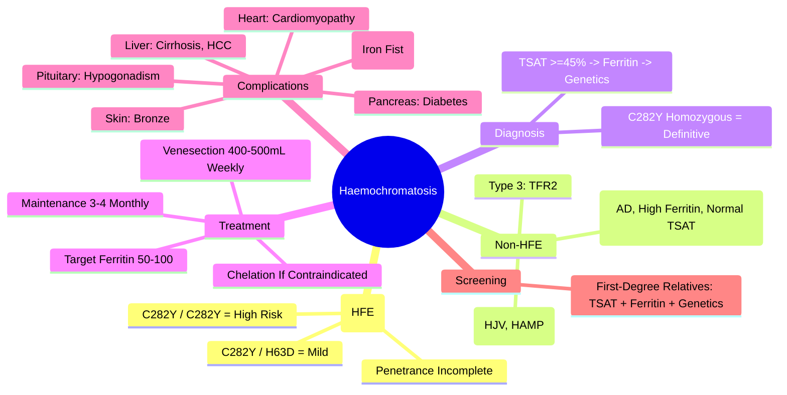

# Haemochromatosis: Diagnosis and Management

## Learning Objectives
- [ ] Apply diagnostic pathway (TSAT → Ferritin → Genetics)
- [ ] Interpret HFE genotypes (C282Y, H63D)
- [ ] Initiate and monitor venesection therapy
- [ ] Screen family members
- [ ] Identify FCPS/MRCP high-yield features (cirrhosis, HCC, diabetes, cardiomyopathy)

---

## Definition & Types

| Type | Gene | Inheritance | Features |
|------|------|-------------|----------|
| **Type 1 (HFE)** | **HFE (C282Y, H63D)** | **Autosomal Recessive** | **90% of Cases**; Adult Onset; Penetrance Variable |
| **Type 2A (Juvenile)** | HJV (Hemojuvelin) | Autosomal Recessive | Severe; Age 15-30; Cardiac/Endocrine Dominant |
| **Type 2B (Juvenile)** | HAMP (Hepcidin) | Autosomal Recessive | Severe; Similar to 2A |
| **Type 3** | TFR2 | Autosomal Recessive | Intermediate Severity |
| **Type 4 (Ferroportin Disease)** | SLC40A1 | **Autosomal Dominant** | High Ferritin, **Low/Normal TSAT**, Macrophage Iron Loading |

> **FCPS/MRCP**: **HFE Type 1 = Vast Majority**; Focus on C282Y Homozygosity

---

## Pathophysiology

```mermaid
flowchart LR
    A[HFE Mutation (C282Y)] --> B[Impaired Hepcidin Regulation]
    B --> C[Low Hepcidin]
    C --> D[Increased Ferroportin Activity]
    D --> E[Increased Intestinal Iron Absorption]
    D --> F[Increased Macrophage Iron Release]
    E & F --> G[Systemic Iron Overload]
    G --> H[Organ Deposition: Liver, Heart, Pancreas, Joints, Pituitary, Skin]
```

**Hepcidin** = Master Iron Regulator (Liver); Suppresses Ferroportin → Blocks Iron Export from Enterocytes/Macrophages

---

## Diagnostic Criteria (HFE Type 1)

### Stepwise Approach

```mermaid
flowchart TD
    A[Suspect Iron Overload: Fatigue, Arthralgia, Abnormal LFTs, Diabetes, Cardiomyopathy, Bronze Skin] --> B[Step 1: Transferrin Saturation (TSAT)]
    B --> C{TSAT ≥45%?}
    C -->|No| D[Unlikely Haemochromatosis]
    C -->|Yes| E[Step 2: Serum Ferritin]
    E --> F{Ferritin >200 (Women) / >300 (Men)?}
    F -->|No| G[Latent Iron Overload / Monitor]
    F -->|Yes| H[Step 3: HFE Genetic Testing]
    H --> I{C282Y Homozygous?}
    I -->|Yes| J[Diagnose HFE Haemochromatosis]
    I -->|C282Y/H63D Compound Het| K[Mild Risk / Monitor]
    I -->|Negative| L[Consider Non-HFE: Juvenile, TFR2, Ferroportin]
    J --> M[Family Screening]
```

### Diagnostic Thresholds

| Test | Threshold | Significance |
|------|-----------|--------------|
| **Transferrin Saturation (TSAT)** | **≥45%** | **Screening Test** (High Sensitivity) |
| **Ferritin (Women)** | **>200 μg/L** | Reflects Iron Stores; Acute Phase Reactant |
| **Ferritin (Men)** | **>300 μg/L** | Reflects Iron Stores; Acute Phase Reactant |
| **Genetics** | **C282Y Homozygous** | **Definitive for Type 1** |

---

## Genetic Testing Interpretation

| Genotype | Risk | Penetrance |
|----------|------|------------|
| **C282Y / C282Y** (Homozygous) | **High** | **Clinical Disease ~10-30%** (Men > Women) |
| **C282Y / H63D** (Compound Heterozygous) | Low-Moderate | Mild Iron Overload Possible |
| **H63D / H63D** (Homozygous) | Very Low | Rarely Clinical |
| **C282Y / WT** (Heterozygous) | Carrier | No Clinical Disease |

> **Most C282Y Homozygotes NEVER Develop Clinical Disease** — Penetrance Incomplete

---

## Staging & Organ Involvement

### Liver
| Stage | Features |
|-------|----------|
| **Iron Overload Only** | Hepatomegaly, Elevated Ferritin, Normal LFTs |
| **Fibrosis** | Progressive with Iron Burden |
| **Cirrhosis** | **Risk Factor for HCC** (20-30% with Cirrhosis) |
| **HCC** | Surveillance if Cirrhosis |

### Extrahepatic
| Organ | Manifestation |
|-------|---------------|
| **Pancreas** | **Diabetes Mellitus** (Bronze Diabetes) — Insulin Deficiency + Resistance |
| **Heart** | **Cardiomyopathy** (Restrictive → Dilated); Arrhythmias |
| **Pituitary** | **Hypogonadotropic Hypogonadism** (Loss of Libido, Impotence) |
| **Joints** | **Arthropathy** (MCP 2nd/3rd — "Iron Fist") |
| **Skin** | **Bronze Pigmentation** (Melanin + Iron) |
| **Thyroid** | Hypothyroidism |

---

## Treatment: Venesection (Phlebotomy)

### Induction Phase
| Parameter | Detail |
|-----------|--------|
| **Volume** | **400-500 mL** per Session |
| **Frequency** | **Weekly** (or Twice Weekly if Hb Allows) |
| **Target** | **Ferritin 50-100 μg/L** |
| **Hb Monitoring** | Maintain Hb >110 g/L (Men), >100 g/L (Women) |
| **Duration** | Months to 1-2 Years (Depends on Iron Burden) |

### Maintenance Phase
| Parameter | Detail |
|-----------|--------|
| **Frequency** | **Every 3-4 Months** (Adjust to Keep Ferritin 50-100) |
| **Volume** | 400-500 mL |
| **Lifelong** | Yes |

### Chelation (If Venesection Contraindicated)
| Drug | Dose | Indication |
|------|------|------------|
| **Deferasirox** | 20-30 mg/kg/day | Anaemia, Cardiac Failure, Poor Venous Access |
| **Deferoxamine** | 40-50 mg/kg/day SC/IV | Alternative |

---

## Family Screening

| Relative | Testing |
|----------|---------|
| **First-Degree (Parents, Siblings, Children)** | **TSAT + Ferritin + HFE Genotyping** |
| **C282Y Homozygote Proband** | Siblings: 25% Chance Homozygous |
| **Children** | Test Partner First; If Partner Negative → Children Only Carriers |

> **Screen ALL First-Degree Relatives** — Early Detection Prevents Organ Damage

---

## Complications & Surveillance

| Complication | Surveillance |
|--------------|--------------|
| **Liver Fibrosis/Cirrhosis** | **Transient Elastography (FibroScan)** or **Liver Biopsy** if Ferritin >1000 or LFTs Elevated |
| **HCC** | **If Cirrhosis: 6-Monthly US ± AFP** |
| **Diabetes** | Annual HbA1c / Fasting Glucose |
| **Cardiomyopathy** | Echo if Symptoms; Baseline at Diagnosis |
| **Hypogonadism** | Testosterone, LH, FSH if Symptoms |
| **Arthropathy** | Clinical; X-Ray MCP Joints |
| **Osteoporosis** | DEXA (Iron + Hypogonadism) |

---

## FCPS/MRCP High-Yield Summary

| Concept | Key Points |
|---------|------------|
| **Gene** | **HFE (C282Y)** — Autosomal Recessive |
| **Screening** | **TSAT ≥45%** → Ferritin → **Genetics** |
| **Definitive** | **C282Y Homozygote** |
| **Penetrance** | **Incomplete** (10-30% Clinical Disease) |
| **Target Organs** | Liver (Cirrhosis, HCC), Pancreas (DM), Heart (CM), Pituitary (Hypogonadism), Joints (MCP), Skin (Bronze) |
| **Treatment** | **Venesection 400-500mL Weekly → Ferritin 50-100 → Maintenance 3-4 Monthly** |
| **Chelation** | Deferasirox if Venesection Contraindicated |
| **Screening** | **All First-Degree Relatives** (TSAT + Ferritin + Genetics) |
| **HCC** | Cirrhosis = 6m US ± AFP |

---

## Viva Questions

1. **What is the diagnostic pathway for haemochromatosis?**
2. **What TSAT and ferritin thresholds trigger genetic testing?**
3. **What does C282Y homozygous mean? What about compound heterozygous?**
4. **What is the penetrance of HFE haemochromatosis?**
5. **Describe the venesection protocol (induction and maintenance).**
6. **When do you use chelation instead of venesection?**
7. **What are the extrahepatic manifestations?**
8. **What is the "iron fist" arthropathy?**
9. **Who needs family screening and what tests?**
10. **HCC surveillance in haemochromatosis?**

---

## Confusions & Mnemonics

| Confusion | Clarification |
|-----------|---------------|
| TSAT vs Ferritin | **TSAT = Screening** (Early, Sensitive); **Ferritin = Iron Stores** (Also Acute Phase Reactant) |
| C282Y Homozygous vs Compound Het | Homozygous = High Risk; Compound Het = Mild Risk |
| Penetrance | **Most C282Y Homozygotes Asymptomatic** — Low Clinical Penetrance |
| Venesection Target | **Ferritin 50-100 μg/L** (Not "Normal") — Mild Iron Deficiency Prevents Re-accumulation |
| Ferroportin Disease (Type 4) | **Autosomal Dominant**; **High Ferritin, LOW/Normal TSAT** (Macrophage Iron Trapping) |
| Juvenile Haemochromatosis | HJV/HAMP; Severe; Teens/20s; Cardiac/Endocrine Dominant |
| Bronze Diabetes | **Pancreatic Iron → DM + Skin Bronze** (Melanin + Iron) |
| MCP Arthropathy | **2nd/3rd MCP Joints** — Characteristic |

---

## Mind Map



---

## One-Page Revision Card

| **Diagnostic Pathway** | **Threshold** |
|------------------------|---------------|
| TSAT (Screening) | **≥45%** |
| Ferritin (Women) | **>200 μg/L** |
| Ferritin (Men) | **>300 μg/L** |
| Genetics | **C282Y Homozygous = Definitive** |

| **Genotype** | **Risk** |
|--------------|----------|
| C282Y / C282Y | High (10-30% Clinical) |
| C282Y / H63D | Low-Moderate |
| H63D / H63D | Very Low |

| **Venesection** | **Details** |
|-----------------|-------------|
| Induction | 400-500mL Weekly → Ferritin 50-100 |
| Maintenance | 400-500mL Every 3-4 Months |
| Hb Floor | 110 (Men) / 100 (Women) g/L |

| **Complications** | **Surveillance** |
|-------------------|------------------|
| Cirrhosis / HCC | FibroScan/Biopsy; 6m US if Cirrhotic |
| Diabetes | Annual HbA1c |
| Cardiomyopathy | Echo if Symptoms |
| Hypogonadism | Testosterone/LH/FSH if Symptomatic |
| Arthropathy | MCP 2nd/3rd (Iron Fist) |

---

## Spaced Repetition Tracker

| Day | 1 | 3 | 7 | 15 | 30 |
|-----|---|---|---|----|----|
| TSAT/Ferritin Thresholds | ☐ | ☐ | ☐ | ☐ | ☐ |
| C282Y Genotypes | ☐ | ☐ | ☐ | ☐ | ☐ |
| Venesection Protocol | ☐ | ☐ | ☐ | ☐ | ☐ |
| Extrahepatic Manifestations | ☐ | ☐ | ☐ | ☐ | ☐ |
| Family Screening | ☐ | ☐ | ☐ | ☐ | ☐ |

---

## Self-Test Scorecard

| Question | My Answer | Correct? |
|----------|-----------|----------|
| TSAT Threshold |  |  |
| C282Y Homozygous vs Compound Het |  |  |
| Penetrance |  |  |
| Venesection Target Ferritin |  |  |
| Extrahepatic Manifestations |  |  |

---

## Local Navigation

- [[Inherited and Metabolic Liver Disease/Wilson Disease|Wilson Disease]]
- [[Inherited and Metabolic Liver Disease/Alpha-1 Antitrypsin Deficiency|Alpha-1 AT]]
- [[Inherited and Metabolic Liver Disease/Porphyrias|Porphyrias]]
- [[Chronic Liver Disease and Cirrhosis/Aetiology|Inherited Metabolic in Cirrhosis]]
---

> Auto-generated study sections for "Inherited and Metabolic Liver Disease" — Ch 23: Hepatology.

## Flashcards (24 generated)

- Q: What is the definition of Inherited and Metabolic Liver Disease?
  A: G --> H[Organ Deposition: Liver, Heart, Pancreas, Joints, Pituitary, Skin]
- Q: What is Volume of Inherited and Metabolic Liver Disease?
  A: 400-500 mL per Session
- Q: What is Frequency of Inherited and Metabolic Liver Disease?
  A: Weekly (or Twice Weekly if Hb Allows)
- Q: What is Target of Inherited and Metabolic Liver Disease?
  A: Ferritin 50-100 μg/L
- Q: How is Inherited and Metabolic Liver Disease monitored?
  A: Maintain Hb >110 g/L (Men), >100 g/L (Women)
- Q: What is Duration of Inherited and Metabolic Liver Disease?
  A: Months to 1-2 Years (Depends on Iron Burden)
- Q: What is Liver Fibrosis/Cirrhosis of Inherited and Metabolic Liver Disease?
  A: Transient Elastography (FibroScan) or Liver Biopsy if Ferritin >1000 or LFTs Elevated
- Q: What is HCC of Inherited and Metabolic Liver Disease?
  A: If Cirrhosis: 6-Monthly US ± AFP
- Q: What is Diabetes of Inherited and Metabolic Liver Disease?
  A: Annual HbA1c / Fasting Glucose
- Q: What is Cardiomyopathy of Inherited and Metabolic Liver Disease?
  A: Echo if Symptoms; Baseline at Diagnosis
- Q: What is Hypogonadism of Inherited and Metabolic Liver Disease?
  A: Testosterone, LH, FSH if Symptoms
- Q: What is Arthropathy of Inherited and Metabolic Liver Disease?
  A: Clinical; X-Ray MCP Joints
- Q: What is Osteoporosis of Inherited and Metabolic Liver Disease?
  A: DEXA (Iron + Hypogonadism)
- Q: What is Volume of Inherited and Metabolic Liver Disease?
  A: 400-500 mL per Session
- Q: What is Frequency of Inherited and Metabolic Liver Disease?
  A: Weekly (or Twice Weekly if Hb Allows)
- Q: What is Target of Inherited and Metabolic Liver Disease?
  A: Ferritin 50-100 μg/L
- Q: How is Inherited and Metabolic Liver Disease monitored?
  A: Maintain Hb >110 g/L (Men), >100 g/L (Women)
- Q: What is Liver Fibrosis/Cirrhosis of Inherited and Metabolic Liver Disease?
  A: Transient Elastography (FibroScan) or Liver Biopsy if Ferritin >1000 or LFTs Elevated
- Q: What is HCC of Inherited and Metabolic Liver Disease?
  A: If Cirrhosis: 6-Monthly US ± AFP
- Q: What is Diabetes of Inherited and Metabolic Liver Disease?
  A: Annual HbA1c / Fasting Glucose
- Q: What is Cardiomyopathy of Inherited and Metabolic Liver Disease?
  A: Echo if Symptoms; Baseline at Diagnosis
- Q: What is Hypogonadism of Inherited and Metabolic Liver Disease?
  A: Testosterone, LH, FSH if Symptoms
- Q: What is Arthropathy of Inherited and Metabolic Liver Disease?
  A: Clinical; X-Ray MCP Joints
- Q: What is Osteoporosis of Inherited and Metabolic Liver Disease?
  A: DEXA (Iron + Hypogonadism)

## MCQs (1 generated)

1. **Which of the following best describes Inherited and Metabolic Liver Disease?**
   A. **G --> H[Organ Deposition: Liver, Heart, Pancreas, Joints, Pituitary, Skin]**
   B. An unrelated condition not matching the clinical picture of Inherited and Metabolic Liver Disease
   C. A complication seen late in the disease course of Inherited and Metabolic Liver Disease
   D. A condition that mimics Inherited and Metabolic Liver Disease but has a different underlying cause

## SBA Questions (1 generated)

1. A patient with suspected Inherited and Metabolic Liver Disease presents with: Type 1 (HFE) — HFE (C282Y, H63D); Type 2A (Juvenile) — HJV (Hemojuvelin); Type 2B (Juvenile) — HAMP (Hepcidin). What is the most likely diagnosis?
   A. **Inherited and Metabolic Liver Disease**
   B. A condition that mimics Inherited and Metabolic Liver Disease but is not the same entity
   C. A complication of Inherited and Metabolic Liver Disease rather than the primary diagnosis
   D. An unrelated condition in the same clinical category as Inherited and Metabolic Liver Disease

