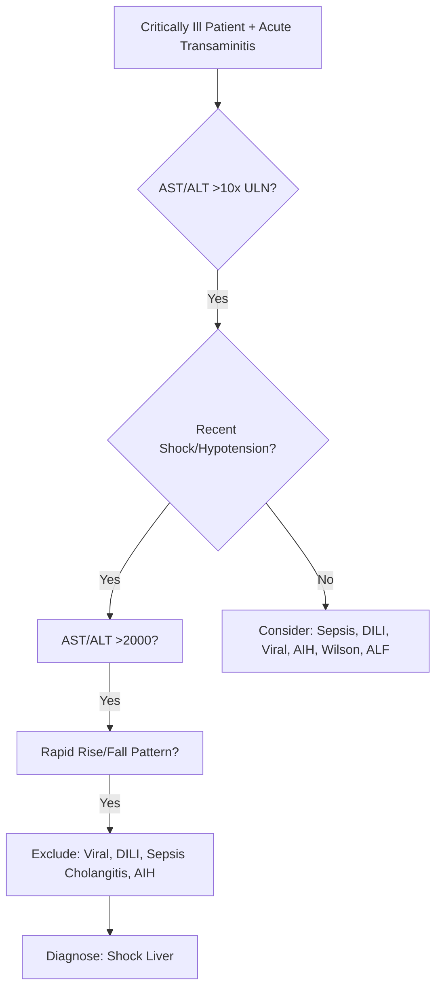
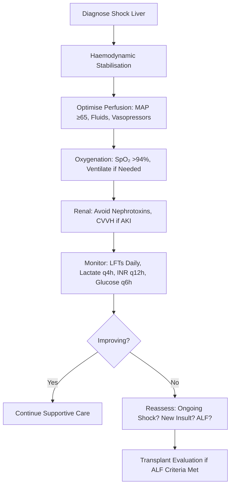

## 1. Learning Objectives
- [ ] Diagnose shock liver (ischaemic hepatitis) in critically ill patients
- [ ] Differentiate from other causes of acute transaminitis in ICU
- [ ] Apply management principles for ischaemic hepatitis
- [ ] Understand prognosis and monitoring
- [ ] Identify FCPS/MRCP high-yield critical care hepatology points

---

## 2. Definition & Terminology

| Term | Definition |
|------|------------|
| **Shock Liver** | **Acute hepatocellular injury** due to **hepatic hypoperfusion** (hypoxia/ischaemia) in critically ill patients |
| **Ischaemic Hepatitis** | Synonym for Shock Liver — Histological Evidence of Centrilobular Necrosis |
| **Hypoxic Hepatitis** | Same Entity — Emphasises Hypoxia as Mechanism |

> **FCPS/MRCP**: **Shock Liver = Ischaemic Hepatitis = Hypoxic Hepatitis** — Centrilobular Necrosis from Hypoperfusion

---

## 3. Pathophysiology

```mermaid
flowchart LR
    A[Systemic Hypotension / Shock] --> B[↓ Splanchnic Blood Flow]
    B --> C[Hepatic Hypoperfusion]
    C --> D[Centrilobular Hypoxia (Zone 3 Most Vulnerable)]
    D --> E[ATP Depletion → ↓ Na/K ATPase]
    E --> F[Cellular Swelling, Calcium Influx]
    F --> G[ROS, Inflammatory Cytokines]
    G --> H[Centrilobular Necrosis]
    H --> I[↑ AST/ALT Massive (>2000)]
```

### Zone 3 (Centrilobular) Vulnerability
- **Furthest from Portal Triad** → Lowest Oxygen Tension
- **Lowest Oxygen Reserve** → First to Suffer in Hypoxia
- **CYP450 Enzymes Concentrated** → ROS Production in Hypoxia

---

## 4. Clinical Presentation

| Feature | Shock Liver |
|-------|-------------|
| **Context** | **Shock, Sepsis, Cardiac Surgery, Major Trauma, Cardiac Arrest** |
| **Onset** | **Within 24-48 Hours** of Hypotensive Event |
| **Symptoms** | Often Asymptomatic (Sedated/Intubated); Jaundice (Late) |
| **Key Lab** | **AST/ALT >2000 U/L** (Often >5000-10,000) |
| **Pattern** | **Rapid Rise (24-48h) → Rapid Fall (3-7 Days)** |
| **AST:ALT Ratio** | Often **>1** (AST > ALT) — Mitochondrial Damage |
| **Bilirubin** | Rises Later (Peak Day 3-5) |
| **INR** | May Rise (Synthetic Dysfunction) |
| **Lactate** | **Markedly Elevated** (Marker of Hypoperfusion) |

---

## 5. Diagnostic Criteria



### Diagnostic Criteria (Suggested)
1. **Clinical Context**: Shock/Hypotension (MAP <60 mmHg, Vasopressors, Cardiac Arrest)
2. **AST/ALT**: **>2000 U/L** (Often 5000-10,000+)
3. **Pattern**: **Rapid Rise (24-48h) → Rapid Fall (3-7 Days)**
3. **Exclusion**: Viral Hepatitis (Seronegative), DILI (No Drug), AIH (IgG-, AutoAbs-), Biliary Obstruction (US Normal)
4. **Supporting**: Lactate ↑↑, INR ↑ (Later), Bilirubin ↑ (Day 3-5)

---

## 6. Differentials in ICU

| Condition | Pattern | Key Differentiator |
|-----------|---------|-------------------|
| **Shock Liver** | **AST/ALT >2000, Rapid Rise/Fall, Shock History** | **Temporal Link to Hypotension** |
| **Sepsis-Induced Cholestasis** | **ALP/GGT ↑↑, ALT/AST Modest** | **No Shock Hypotension Required** |
| **Drug-Induced (DILI)** | Variable | **Temporal Drug Relationship** |
| **Acute Viral Hepatitis** | ALT >1000, Serology + | **HAV/HBV/HCV/HEV Serology +** |
| **Autoimmune Hepatitis** | High IgG, AutoAbs, Steroid Responsive | **IgG↑, ANA/SMA/LKM+** |
| **Acute Biliary Obstruction** | ALP↑↑, Dilated Ducts on US | **Dilated CBD, Cholangitis** |
| **Wilson Disease** | Young, Low Ceruloplasmin, Coombs-Neg Haemolysis | Low Ceruloplasmin, KF Rings |
| **ALF** | INR ≥1.5 + Encephalopathy | **Encephalopathy Required** |

---

## 7. Management



### Key Principles

| Principle | Action |
|----------|--------|
| **Treat the Cause** | **Restore Perfusion** (Fluids, Vasopressors, Inotropes, Blood) |
| **N-Acetylcysteine** | **Consider** — Some Evidence of Benefit (Antioxidant) |
| **Avoid Hepatotoxins** | Review All Medications (Statins, Antibiotics, Paracetamol) |
| **Supportive** | Glucose Control, Coagulopathy (Vit K/FFP if Bleed), Renal Support |
| **Nutrition** | Early EN (24-48h), Protein 1.2-1.5g/kg/day |

---

## 8. Prognosis & Outcomes

| Parameter | Finding |
|----------|---------|
| **AST/ALT Peak** | **Day 2-3** (Often 5000-10,000+) |
| **Normalisation** | **3-7 Days** (Rapid Fall) |
| **Bilirubin Peak** | **Day 3-5** (Then Falls) |
| **INR Peak** | Day 3-5 (If Synthetic Impairment) |
| **Mortality** | **50-70%** (Driven by Underlying Shock, Not Liver Itself) |
| **Recovery** | **Complete in Survivors** (No Chronic Sequelae) |

> **Key**: **Mortality Driven by Underlying Shock** — Liver Injury Is a Marker, Not the Cause of Death

---

## 9. Shock Liver vs Acute Liver Failure (ALF)

| Feature | Shock Liver | ALF |
|---------|-------------|-----|
| **Encephalopathy** | **Absent** (Unless Late/Severe) | **Required** |
| **INR** | Often Normal/Mild ↑ | **≥1.5 (Required)** |
| **Bilirubin** | Late Rise | Variable |
| **Primary Driver** | **Hypoperfusion** | Multiple Aetiologies |
| **Recoverability** | **Excellent if Survive** | Variable (Aetiology Dependent) |
| **Transplant Need** | Rare | **Common (Super-Urgent)** |

---


*...continued (truncated for renderer performance)*
---

> Auto-generated study sections for "Hepatology in Special Situations" — Ch 23: Hepatology.

## Flashcards (34 generated)

- Q: What is the definition of Hepatology in Special Situations?
  A: A[Systemic Hypotension / Shock] --> B[↓ Splanchnic Blood Flow]
- Q: What is Shock Liver of Hepatology in Special Situations?
  A: Acute hepatocellular injury due to hepatic hypoperfusion (hypoxia/ischaemia) in critically ill patients
- Q: What is Ischaemic Hepatitis of Hepatology in Special Situations?
  A: Synonym for Shock Liver — Histological Evidence of Centrilobular Necrosis
- Q: What is Hypoxic Hepatitis of Hepatology in Special Situations?
  A: Same Entity — Emphasises Hypoxia as Mechanism
- Q: What is Context of Hepatology in Special Situations?
  A: Shock, Sepsis, Cardiac Surgery, Major Trauma, Cardiac Arrest
- Q: What is Onset of Hepatology in Special Situations?
  A: Within 24-48 Hours of Hypotensive Event
- Q: What are the clinical features of Hepatology in Special Situations?
  A: Often Asymptomatic (Sedated/Intubated); Jaundice (Late)
- Q: What is Key Lab of Hepatology in Special Situations?
  A: AST/ALT >2000 U/L (Often >5000-10,000)
- Q: What is Pattern of Hepatology in Special Situations?
  A: Rapid Rise (24-48h) → Rapid Fall (3-7 Days)
- Q: What is AST:ALT Ratio of Hepatology in Special Situations?
  A: Often >1 (AST > ALT) — Mitochondrial Damage
- Q: What is Bilirubin of Hepatology in Special Situations?
  A: Rises Later (Peak Day 3-5)
- Q: What is INR of Hepatology in Special Situations?
  A: May Rise (Synthetic Dysfunction)
- Q: What is Lactate of Hepatology in Special Situations?
  A: Markedly Elevated (Marker of Hypoperfusion)
- Q: What is AST/ALT Peak of Hepatology in Special Situations?
  A: Day 2-3 (Often 5000-10,000+)
- Q: What is Normalisation of Hepatology in Special Situations?
  A: 3-7 Days (Rapid Fall)
- Q: What is Bilirubin Peak of Hepatology in Special Situations?
  A: Day 3-5 (Then Falls)
- Q: What is INR Peak of Hepatology in Special Situations?
  A: Day 3-5 (If Synthetic Impairment)
- Q: What is Mortality of Hepatology in Special Situations?
  A: 50-70% (Driven by Underlying Shock, Not Liver Itself)
- Q: What is Recovery of Hepatology in Special Situations?
  A: Complete in Survivors (No Chronic Sequelae)
- Q: What is Context of Hepatology in Special Situations?
  A: Shock, Sepsis, Cardiac Surgery, Major Trauma, Cardiac Arrest
- Q: What is Onset of Hepatology in Special Situations?
  A: Within 24-48 Hours of Hypotensive Event
- Q: What are the clinical features of Hepatology in Special Situations?
  A: Often Asymptomatic (Sedated/Intubated); Jaundice (Late)
- Q: What is Key Lab of Hepatology in Special Situations?
  A: AST/ALT >2000 U/L (Often >5000-10,000)
- Q: What is Pattern of Hepatology in Special Situations?
  A: Rapid Rise (24-48h) → Rapid Fall (3-7 Days)
- Q: What is AST:ALT Ratio of Hepatology in Special Situations?
  A: Often >1 (AST > ALT) — Mitochondrial Damage
- Q: What is Bilirubin of Hepatology in Special Situations?
  A: Rises Later (Peak Day 3-5)
- Q: What is INR of Hepatology in Special Situations?
  A: May Rise (Synthetic Dysfunction)
- Q: What is Lactate of Hepatology in Special Situations?
  A: Markedly Elevated (Marker of Hypoperfusion)
- Q: What is AST/ALT Peak of Hepatology in Special Situations?
  A: Day 2-3 (Often 5000-10,000+)
- Q: What is Normalisation of Hepatology in Special Situations?
  A: 3-7 Days (Rapid Fall)
- Q: What is Bilirubin Peak of Hepatology in Special Situations?
  A: Day 3-5 (Then Falls)
- Q: What is INR Peak of Hepatology in Special Situations?
  A: Day 3-5 (If Synthetic Impairment)
- Q: What is Mortality of Hepatology in Special Situations?
  A: 50-70% (Driven by Underlying Shock, Not Liver Itself)
- Q: What is Recovery of Hepatology in Special Situations?
  A: Complete in Survivors (No Chronic Sequelae)

## MCQs (1 generated)

1. **Which of the following best describes Hepatology in Special Situations?**
   A. **A[Systemic Hypotension / Shock] --> B[↓ Splanchnic Blood Flow]**
   B. An unrelated condition not matching the clinical picture of Hepatology in Special Situations
   C. A complication seen late in the disease course of Hepatology in Special Situations
   D. A condition that mimics Hepatology in Special Situations but has a different underlying cause

## SBA Questions (1 generated)

1. A patient with suspected Hepatology in Special Situations presents with: Shock Liver — Acute hepatocellular injury due to hepatic hypoperfusion (hypoxia/ischaemia) in critically ill patients; Ischaemic Hepatitis — Synonym for Shock Liver — Histological Evidence of Centrilobular Necrosis; Hypoxic Hepatitis — Same Entity — Emphasises Hypoxia as Mechanism. What is the most likely diagnosis?
   A. **Hepatology in Special Situations**
   B. A condition that mimics Hepatology in Special Situations but is not the same entity
   C. A complication of Hepatology in Special Situations rather than the primary diagnosis
   D. An unrelated condition in the same clinical category as Hepatology in Special Situations

