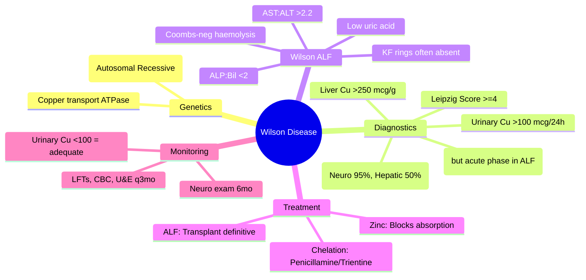

# Wilson Disease: Diagnosis & Treatment

## Learning Objectives
- [ ] Apply diagnostic criteria (ceruloplasmin, urinary copper, KF rings, genetics)
- [ ] Calculate Leipzig score
- [ ] Differentiate hepatic vs neurological presentations
- [ ] Initiate chelation therapy (penicillamine, trientine) and zinc
- [ ] Identify FCPS/MRCP high-yield features (Kayser-Fleischer rings, Coombs-negative haemolysis)

---

## Definition & Pathogenesis

| Feature | Wilson Disease |
|---------|----------------|
| **Genetics** | **Autosomal recessive**: **ATP7B** gene (chromosome 13) |
| **Protein** | ATP7B = Copper-transporting ATPase (biliary excretion) |
| **Defect** | Impaired biliary copper excretion → hepatic copper accumulation → oxidative damage |
| **Prevalence** | 1:30,000; carrier frequency 1:90 |
| **Age of onset** | **5-35 years** (hepatic); **10-50 years** (neurological) |

---

## Clinical Presentations

```mermaid
flowchart TD
    A[Wilson Disease] --> B[Hepatic Presentation]
    B --> C[Asymptomatic / Elevated LFTs]
    B --> D[Chronic Hepatitis]
    B --> E[Cirrhosis]
    B --> F[**Acute Liver Failure** (5-10% of young ALF)]
    A --> G[Neurological Presentation]
    G --> H[Tremor (wing-beating)]
    G --> I[Dystonia, rigidity, dysarthria]
    G --> J[Psychiatric: depression, psychosis, personality change]
    A --> K[Other]
    K --> L[Kayser-Fleischer Rings]
    K --> M[Renal: Fanconi syndrome, nephrolithiasis]
    K --> N[Cardiac: cardiomyopathy]
    K --> O[Bone: osteoporosis, arthritis]
    K --> P[Haematologic: Coombs-neg haemolytic anaemia]
```

---

## Diagnostic Criteria (Leipzig Score)

| Feature | Score |
|---------|-------|
| **Kayser-Fleischer rings** | Present: +2; Absent: 0 |
| **Neurological symptoms** | Severe: +2; Mild: +1; None: 0 |
| **Ceruloplasmin (mg/dL)** | <10: +2; 10-20: +1; >20: 0 |
| **Coombs-negative haemolytic anaemia** | Present: +1; Absent: 0 |
| **Liver copper (μg/g dry weight)** | >250: +2; 50-250: +1; <50: -1 |
| **Urinary copper (μg/24h)** | >100: +2; 40-100: +1; <40: 0 |
| **Mutation analysis** | 2 mutations: +4; 1 mutation: +1; 0: 0 |

| Total Score | Interpretation |
|-------------|----------------|
| **≥4** | **Wilson disease confirmed** |
| **3** | Probable — needs more testing |
| **≤2** | Unlikely |

---

## Key Diagnostic Tests

### 1. Ceruloplasmin
| Aspect | Detail |
|--------|--------|
| **Normal** | 20-40 mg/dL |
| **Wilson** | **Low (<20 mg/dL)** in 85-90% |
| **Pitfalls** | **Acute phase reactant** → may be NORMAL in ALF, inflammation, pregnancy, estrogen |
| **Specificity** | Not specific (low in malnutrition, nephrotic syndrome, Menkes disease) |

> **FCPS/MRCP**: **Low ceruloplasmin + clinical picture = Wilson until proven otherwise**

### 2. Urinary Copper (24-hour)
| Aspect | Detail |
|--------|--------|
| **Normal** | <40 μg/24h |
| **Wilson** | **>100 μg/24h** (often >500 in symptomatic) |
| **Post-penicillamine challenge** | Not routinely needed |

### 3. Kayser-Fleischer (KF) Rings
| Aspect | Detail |
|--------|--------|
| **Cause** | Copper deposition in Descemet's membrane |
| **Detection** | **Slit-lamp examination** (essential — not visible to naked eye usually) |
| **Sensitivity** | Neurological: **95-100%**; Hepatic: **50-60%**; ALF: often absent |
| **Specificity** | **High** (also in chronic cholestasis: PBC, PSC — but rare) |

### 4. Liver Copper (Biopsy)
| Aspect | Detail |
|--------|--------|
| **Normal** | <50 μg/g dry weight |
| **Wilson** | **>250 μg/g** (diagnostic) |
| **Caveat** | Sampling error in cirrhosis; **cholestatic diseases also high** |

### 5. Genetic Testing (ATP7B)
| Aspect | Detail |
|--------|--------|
| **Diagnostic** | **2 pathogenic mutations = definite** |
| **Carrier** | 1 mutation |
| **Limitations** | >500 mutations described; not all detected by panels |

---

## Wilson Disease Presenting as ALF (High-Yield)

| Feature | Wilson ALF |
|---------|------------|
| **ALP : Bilirubin ratio** | **<2** (ALP disproportionately low) |
| **AST : ALT ratio** | **>2.2** |
| **Haemolysis** | **Coombs-negative (90%)** |
| **Ceruloplasmin** | Low (but acute phase may ↑ it) |
| **Urinary copper** | >500 μg/24h typical |
| **KF rings** | Often **ABSENT** (acute) |
| **Survival without transplant** | **<20%** |

> **Any young person <40 with ALF of unknown cause = Wilson until proven otherwise**

---

## Treatment

### 1. Chelation Therapy

| Drug | Dose | Mechanism | Monitoring |
|------|------|-----------|------------|
| **Penicillamine** | 250-500 mg QID (500-1500 mg/day) | Chelates copper → urinary excretion | CBC, U&E, LFTs, urine protein q1-3mo; **pyridoxine 25mg daily** |
| **Trientine** | 500-750 mg QID (1000-2000 mg/day) | Chelates copper (less side effects) | Similar; preferred if penicillamine intolerant |
| **Tetrathiomolybdate** | Experimental | Inhibits copper absorption + chelates | Pulmonary fibrosis risk |

> **First-line**: Penicillamine OR Trientine (trientine preferred for neuro/less side effects)

### 2. Zinc Acetate (Maintenance / Initial if Mild)
| Dose | 50 mg TID (elemental zinc) |
|------|----------------------------|
| **Mechanism** | Induces intestinal metallothionein → blocks copper absorption |
| **Use** | Maintenance after decoppering; Initial for presymptomatic/mild |
| **Monitoring** | Urinary copper <100 μg/24h; Zinc levels |

### 3. Treatment Algorithm

```mermaid
flowchart TD
    A[Diagnose Wilson Disease] --> B{Presentation}
    B -->|ALF| C[URGENT: Penicillamine/Trientine + Zinc + Transplant Evaluation]
    B -->|Neurological / Hepatic (Symptomatic)| D[Penicillamine 750-1500mg/d OR Trientine 1000-2000mg/d + Zinc 50mg TID]
    B -->|Presymptomatic / Mild| E[Zinc 50mg TID alone (or + low-dose chelator)]
    D --> F[Monitor: Urinary Cu <100, LFTs, CBC, U&E q3mo]
    E --> F
    F --> G{Clinical Improvement?}
    G -->|Yes| H[Lifelong Therapy]
    G -->|No| I[Check Adherence; Switch Chelator; Transplant if ALF]
```

### 4. Pregnancy
- **Continue chelation** (reduce penicillamine to 250-500mg/d; trientine preferred)
- **Zinc safe**
- **Stop chelation = rapid copper re-accumulation**

---

## Monitoring on Treatment

| Parameter | Frequency | Target |
|-----------|-----------|--------|
| **Urinary copper (24h)** | 3-monthly initially | **<100 μg/24h** (adequate chelation) |
| **Serum copper (non-ceruloplasmin)** | 6-monthly | Low |
| **LFTs, CBC, U&E** | 3-monthly | Normal |
| **Neurological exam** | 6-monthly | Stable/improving |
| **Slit-lamp (KF rings)** | Annual | May fade with treatment |
| **Bone density** | 2-yearly | Osteoporosis risk |

---

## FCPS/MRCP High-Yield Summary

| Concept | Key Points |
|---------|------------|
| **Gene** | ATP7B (autosomal recessive) |
| **Ceruloplasmin** | Low (<20 mg/dL) — but may be normal in ALF (acute phase) |
| **Urinary copper** | >100 μg/24h (often >500 symptomatic) |
| **KF rings** | Slit-lamp; Neuro 95%, Hepatic 50%, ALF often absent |
| **Liver copper** | >250 μg/g dry weight (diagnostic) |
| **Leipzig score** | ≥4 = confirmed |
| **Wilson ALF** | ALP:Bil <2, AST:ALT >2.2, Coombs-neg haemolysis, low uric acid |
| **Treatment** | Penicillamine/Trientine + Zinc; Lifelong |
| **ALF management** | Transplant = definitive; Chelation = bridge |

---

## Viva Questions

1. **What is the gene defect in Wilson disease?**
2. **List the Leipzig score components.**
3. **Why may ceruloplasmin be normal in Wilson ALF?**
4. **What is the ALP:bilirubin ratio in Wilson ALF?**
5. **Describe Coombs-negative haemolysis in Wilson disease.**
6. **Compare penicillamine vs trientine.**
7. **What is the role of zinc?**
8. **How do you monitor treatment response?**
9. **Wilson ALF: transplant vs chelation?**
10. **Kayser-Fleischer rings: sensitivity in hepatic vs neurological?**

---

## Confusions & Mnemonics

| Confusion | Clarification |
|-----------|---------------|
| Ceruloplasmin normal in ALF | **Acute phase reactant** — inflammation ↑ ceruloplasmin despite copper overload |
| KF rings absent in ALF | Need months to form — acute presentation = no rings yet |
| Urinary copper units | **μg/24h** (not μmol) |
| Penicillamine vs Trientine | Trientine = fewer side effects (no nephrotic, no lupus, less neuro worsening) |
| Zinc mechanism | **Blocks intestinal absorption** (metallothionein induction) — not chelation |
| ALP:Bil ratio <2 | **Pathognomonic for Wilson ALF** — ALP synthesis impaired by copper |
| Coombs-negative haemolysis | Copper released from lysed RBCs → oxidative damage |
| Leipzig score | Add up points; ≥4 = diagnosed; Genetics 2 mutations = +4 alone |

---

## Mind Map



---

## One-Page Revision Card

| **Diagnostic Test** | **Wilson Finding** | **Caveat** |
|---------------------|-------------------|------------|
| Ceruloplasmin | <20 mg/dL | Normal in ALF (acute phase) |
| Urinary Copper (24h) | >100 μg/24h (often >500) | |
| KF Rings (Slit-lamp) | Present 95% neuro, 50% hepatic | Absent in ALF |
| Liver Copper (Biopsy) | >250 μg/g dry weight | Sampling error in cirrhosis |
| Leipzig Score | ≥4 = Confirmed | Genetics 2 mutations = +4 |

| **Wilson ALF Signature** | **Value** |
|--------------------------|-----------|
| ALP : Bilirubin ratio | **<2** |
| AST : ALT ratio | **>2.2** |
| Haemolysis | **Coombs-negative** |
| Uric acid | Low (<3 mg/dL) |

| **Treatment** | **Details** |
|---------------|-------------|
| Penicillamine | 750-1500mg/d; pyridoxine 25mg; monitor CBC, urine protein |
| Trientine | 1000-2000mg/d; fewer side effects |
| Zinc | 50mg TID; blocks absorption; maintenance |
| ALF | **Transplant definitive**; chelation bridge |

---

## Spaced Repetition Tracker

| Day | 1 | 3 | 7 | 15 | 30 |
|-----|---|---|---|----|----|
| Leipzig score components | ☐ | ☐ | ☐ | ☐ | ☐ |
| Wilson ALF signature | ☐ | ☐ | ☐ | ☐ | ☐ |
| Ceruloplasmin ALF caveat | ☐ | ☐ | ☐ | ☐ | ☐ |
| Penicillamine vs Trientine | ☐ | ☐ | ☐ | ☐ | ☐ |
| Zinc mechanism | ☐ | ☐ | ☐ | ☐ | ☐ |

---

## Self-Test Scorecard

| Question | My Answer | Correct? |
|----------|-----------|----------|
| Gene |  |  |
| Ceruloplasmin ALF caveat |  |  |
| ALP:Bil ratio ALF |  |  |
| KF ring sensitivity |  |  |
| Treatment first-line |  |  |

---

## Local Navigation

- [[Inherited and Metabolic Liver Disease/Haemochromatosis|Haemochromatosis]]
- [[Inherited and Metabolic Liver Disease/Alpha-1 antitrypsin deficiency|Alpha-1 AT]]
- [[Acute Liver Failure/Wilson disease presenting as ALF|Wilson ALF]]
- [[Autoimmune Liver Disease/Autoimmune hepatitis (AIH)|AIH]]