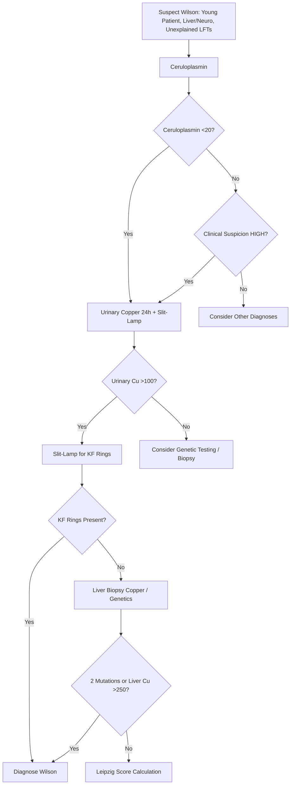
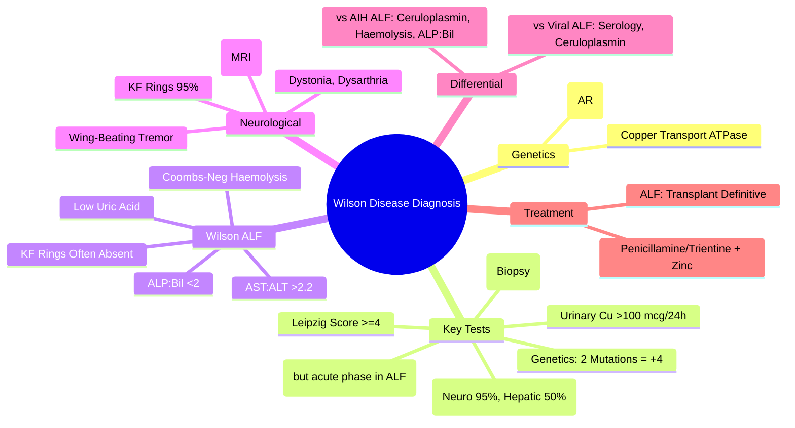

# Wilson Disease Diagnosis

## Learning Objectives
- [ ] Apply diagnostic criteria (Leipzig score, biochemical markers)
- [ ] Interpret ceruloplasmin, urinary copper, KF rings, genetic testing
- [ ] Differentiate hepatic vs neurological presentations
- [ ] Apply diagnostic algorithm for Wilson disease
- [ ] Identify FCPS/MRCP high-yield diagnostic features

---

## Overview

| Feature | Wilson Disease |
|---------|----------------|
| **Gene** | **ATP7B** (Chromosome 13) |
| **Inheritance** | **Autosomal Recessive** |
| **Protein** | Copper-Transporting ATPase (Biliary Excretion) |
| **Defect** | Impaired Biliary Copper Excretion → Hepatic Copper Accumulation → Oxidative Damage |
| **Prevalence** | 1:30,000; Carrier Frequency 1:90 |
| **Age of Onset** | **5-35 Years** (Hepatic: 10-20y; Neurological: 15-35y) |

---

## Diagnostic Criteria: Leipzig Score

> **Score ≥4 = Wilson Disease Confirmed**; **Score 3 = Probable**; **≤2 = Unlikely**

| Feature | Score |
|---------|-------|
| **Kayser-Fleischer Rings** | Present: +2; Absent: 0 |
| **Neurological Symptoms** | Severe: +2; Mild: +1; None: 0 |
| **Ceruloplasmin (mg/dL)** | <10: +2; 10-20: +1; >20: 0 |
| **Coombs-Negative Haemolytic Anaemia** | Present: +1; Absent: 0 |
| **Liver Copper (μg/g dry weight)** | >250: +2; 50-250: +1; <50: -1 |
| **Urinary Copper (μg/24h)** | >100: +2; 40-100: +1; <40: 0 |
| **Mutation Analysis (ATP7B)** | 2 Mutations: +4; 1 Mutation: +1; 0: 0 |

| Total Score | Interpretation |
|-------------|----------------|
| **≥4** | **Wilson Disease Confirmed** |
| **3** | Probable — Needs More Testing |
| **≤2** | Unlikely |

> **FCPS/MRCP**: **Leipzig Score ≥4 = Diagnosed**; **Genetics 2 Mutations = +4 Alone**

---

## Key Diagnostic Tests

### 1. Ceruloplasmin
| Aspect | Detail |
|-------|--------|
| **Normal** | 20-40 mg/dL (200-400 mg/L) |
| **Wilson** | **Low (<20 mg/dL)** in 85-90% |
| **Pitfalls** | **Acute Phase Reactant** → May Be **Normal in ALF, Inflammation, Pregnancy, Estrogen** |
| **Specificity** | Not Specific (Low in Malnutrition, Nephrotic Syndrome, Menkes Disease) |

> **FCPS/MRCP**: **Low Ceruloplasmin + Clinical Picture = Wilson Until Proven Otherwise**

### 2. Urinary Copper (24-Hour)
| Aspect | Detail |
|--------|--------|
| **Normal** | <40 μg/24h |
| **Wilson** | **>100 μg/24h** (Often >500 in Symptomatic) |
| **Post-Penicillamine Challenge** | Not Routinely Needed |

### 3. Kayser-Fleischer (KF) Rings
| Aspect | Detail |
|--------|--------|
| **Cause** | Copper Deposition in Descemet's Membrane |
| **Detection** | **Slit-Lamp Examination** (Essential — Not Visible to Naked Eye) |
| **Sensitivity** | Neurological: **95-100%**; Hepatic: **50-60%**; ALF: **Often Absent** |
| **Specificity** | **High** (Also in Chronic Cholestasis: PBC, PSC — Rare) |

### 4. Liver Copper (Biopsy)
| Aspect | Detail |
|--------|--------|
| **Normal** | <50 μg/g dry weight |
| **Wilson** | **>250 μg/g** (Diagnostic) |
| **Caveat** | Sampling Error in Cirrhosis; Cholestatic Diseases Also High |

### 5. Genetic Testing (ATP7B)
| Aspect | Detail |
|--------|--------|
| **Diagnostic** | **2 Pathogenic Mutations = Definite** |
| **Carrier** | 1 Mutation |
| **Limitations** | >500 Mutations Described; Not All Detected by Panels |

---

## Wilson Disease Presenting as ALF (High-Yield)

| Feature | Wilson ALF |
|---------|------------|
| **ALP : Bilirubin Ratio** | **<2** (ALP Disproportionately Low) |
| **AST : ALT Ratio** | **>2.2** |
| **Haemolysis** | **Coombs-Negative (90%)** |
| **Ceruloplasmin** | Low (But Acute Phase May ↑ It) |
| **Urinary Copper** | >500 μg/24h Typical |
| **KF Rings** | Often **Absent** (Acute) |
| **Uric Acid** | **Low (<3 mg/dL)** |
| **Survival Without Transplant** | **<20%** |

> **Any Young Person <40 with ALF of Unknown Cause = Wilson Until Proven Otherwise**

---

## Diagnostic Algorithm

---

## Wilson vs Other Causes: Differential

| Feature | Wilson ALF | AIH ALF | Viral ALF |
|---------|------------|---------|-----------|
| **Age** | <40 | Women 15-50 | Any |
| **Ceruloplasmin** | Low | Normal/↑ | Normal |
| **ALP : Bilirubin** | **<2** | Normal/↑ | Normal/↑ |
| **AST : ALT Ratio** | **>2.2** | <1 | <1 |
| **Haemolysis** | **Coombs-Neg (+)** | Absent | Absent |
| **Urinary Cu** | >500 μg/24h | Normal | Normal |
| **Ceruloplasmin** | Low (Acute Phase May ↑) | Normal/High | Normal |
| **Treatment** | **Transplant = Definitive** | Steroids | Supportive |

---

## Neurological Wilson: Key Features

| Feature | Detail |
|--------|--------|
| **Tremor** | **Wing-Beating** (Proximal, Intentional) |
| **Dystonia** | Oromandibular, Limbs, Truncal |
| **Dysarthria** | Scanning, Spastic |
| **Psychiatric** | Depression, Psychosis, Personality Change, Impulsivity |
| **MRI Brain** | **Face of Giant Panda** (Midbrain), Basal Ganglia Hyperintensity |
| **KF Rings** | **95-100%** (Slit-Lamp) |

---

## FCPS/MRCP High-Yield Summary

| Concept | Key Points |
|---------|------------|
| **Gene** | ATP7B (Autosomal Recessive) |
| **Ceruloplasmin** | <20 mg/dL (But Normal in ALF — Acute Phase) |
| **Urinary Copper** | >100 μg/24h (Often >500) |
| **KF Rings** | Slit-Lamp; Neuro 95%, Hepatic 50%, ALF Often Absent |
| **Liver Copper** | >250 μg/g Dry Weight (Diagnostic) |
| **Leipzig Score** | ≥4 = Confirmed; Genetics 2 Mutations = +4 |
| **Wilson ALF Signature** | ALP:Bil <2, AST:ALT >2.2, Coombs-Neg Haemolysis, Low Uric Acid |
| **Neurological** | Wing-Beating Tremor, Dystonia, Face of Giant Panda (MRI) |
| **Treatment** | Penicillamine/Trientine + Zinc; ALF = Transplant Definitive |

---

## Viva Questions

1. **What is the Leipzig score? How many points for diagnosis?**
2. **Why may ceruloplasmin be normal in Wilson ALF?**
3. **What is the ALP:bilirubin ratio in Wilson ALF?**
3. **What is the significance of Coombs-negative haemolysis in Wilson?**
4. **How do you diagnose Wilson disease in a patient with ALF?**
4. **What is the sensitivity of KF rings in neurological vs hepatic Wilson?**
5. **What is the ATP7B gene? Inheritance?**
5. **How do you differentiate Wilson ALF from AIH ALF?**
6. **What is the diagnostic significance of urinary copper?**
7. **What is the "Face of the Giant Panda" sign?**
8. **What is the treatment for Wilson disease? What about ALF?**

---

## Confusions & Mnemonics

| Confusion | Clarification |
|-----------|---------------|
| Ceruloplasmin Normal in ALF | **Acute Phase Reactant** — Inflammation ↑ Ceruloplasmin Despite Copper Overload |
| KF Rings Absent in ALF | Need Months to Form — Acute Presentation = No Rings Yet |
| Urinary Copper Units | **μg/24h** (Not μmol) |
| Penicillamine vs Trientine | Trientine = Fewer Side Effects (No Nephrotic, No Lupus, Less Neuro Worsening) |
| Zinc Mechanism | **Blocks Intestinal Absorption** (Metallothionein Induction) — Not Chelation |
| ALP:Bil Ratio <2 | **Pathognomonic for Wilson ALF** — ALP Synthesis Impaired by Copper |
| Coombs-Neg Haemolysis | Copper Released from RBCs → Oxidative Damage |
| Leipzig Score | Add Points; ≥4 = Diagnosed; Genetics 2 Mutations = +4 Alone |
| Face of Giant Panda | Midbrain T2 Hyperintensity (Red Nucleus Sparing) = Wilson Neuro |

---

## Mind Map

---

## One-Page Revision Card

| **Diagnostic Test** | **Wilson Finding** | **Caveat** |
|---------------------|-------------------|------------|
| Ceruloplasmin | <20 mg/dL | Normal in ALF (Acute Phase) |
| Urinary Copper (24h) | >100 μg/24h (Often >500) | |
| KF Rings (Slit-lamp) | Present 95% Neuro, 50% Hepatic | Absent in ALF |
| Liver Copper (Biopsy) | >250 μg/g Dry Weight | Sampling Error in Cirrhosis |
| Leipzig Score | ≥4 = Confirmed | Genetics 2 Mutations = +4 |

| **Wilson ALF Signature** | **Value** |
|--------------------------|-----------|
| ALP : Bilirubin Ratio | **<2** |
| AST : ALT Ratio | **>2.2** |
| Haemolysis | **Coombs-Negative** |
| Uric Acid | Low (<3 mg/dL) |

| **Treatment** | **Details** |
|---------------|-------------|
| Penicillamine | 750-1500mg/d; Pyridoxine 25mg; Monitor CBC, Urine Protein |
| Trientine | 1000-2000mg/d; Fewer Side Effects |
| Zinc | 50mg TID; Blocks Absorption; Maintenance |
| ALF | **Transplant Definitive**; Chelation Bridge |

---

## Spaced Repetition Tracker

| Day | 1 | 3 | 7 | 15 | 30 |
|-----|---|---|---|----|----|
| Leipzig Score Components | ☐ | ☐ | ☐ | ☐ | ☐ |
| Wilson ALF Signature | ☐ | ☐ | ☐ | ☐ | ☐ |
| Ceruloplasmin ALF Caveat | ☐ | ☐ | ☐ | ☐ | ☐ |
| Penicillamine vs Trientine | ☐ | ☐ | ☐ | ☐ | ☐ |
| Zinc Mechanism | ☐ | ☐ | ☐ | ☐ | ☐ |

---

## Self-Test Scorecard

| Question | My Answer | Correct? |
|----------|-----------|----------|
| Leipzig Score Components |  |  |
| Wilson ALF Signature |  |  |
| Ceruloplasmin ALF Caveat |  |  |
| Penicillamine vs Trientine |  |  |
| Zinc Mechanism |  |  |

---

## Local Navigation

- [[Inherited and Metabolic Liver Disease/Haemochromatosis|Haemochromatosis]]
- [[Inherited and Metabolic Liver Disease/Alpha-1 Antitrypsin Deficiency|Alpha-1 AT]]
- [[Acute Liver Failure/Wilson disease presenting as ALF|Wilson ALF]]
- [[Autoimmune Liver Disease/Autoimmune hepatitis (AIH)|AIH]]
---

> Auto-generated study sections for "Inherited and Metabolic Liver Disease" — Ch 23: Hepatology.

## Flashcards (30 generated)

- Q: What is the definition of Inherited and Metabolic Liver Disease?
  A: Score ≥4 = Wilson Disease Confirmed; Score 3 = Probable; ≤2 = Unlikely
- Q: What is Normal of Inherited and Metabolic Liver Disease?
  A: 20-40 mg/dL (200-400 mg/L)
- Q: What is Wilson of Inherited and Metabolic Liver Disease?
  A: Low (<20 mg/dL) in 85-90%
- Q: What is Pitfalls of Inherited and Metabolic Liver Disease?
  A: Acute Phase Reactant → May Be Normal in ALF, Inflammation, Pregnancy, Estrogen
- Q: What is Specificity of Inherited and Metabolic Liver Disease?
  A: Not Specific (Low in Malnutrition, Nephrotic Syndrome, Menkes Disease)
- Q: What causes Inherited and Metabolic Liver Disease?
  A: Copper Deposition in Descemet's Membrane
- Q: What is Detection of Inherited and Metabolic Liver Disease?
  A: Slit-Lamp Examination (Essential — Not Visible to Naked Eye)
- Q: What is Sensitivity of Inherited and Metabolic Liver Disease?
  A: Neurological: 95-100%; Hepatic: 50-60%; ALF: Often Absent
- Q: What is Specificity of Inherited and Metabolic Liver Disease?
  A: High (Also in Chronic Cholestasis: PBC, PSC — Rare)
- Q: What is Normal of Inherited and Metabolic Liver Disease?
  A: <50 μg/g dry weight
- Q: What is Wilson of Inherited and Metabolic Liver Disease?
  A: >250 μg/g (Diagnostic)
- Q: What is Caveat of Inherited and Metabolic Liver Disease?
  A: Sampling Error in Cirrhosis; Cholestatic Diseases Also High
- Q: What is Normal of Inherited and Metabolic Liver Disease?
  A: 20-40 mg/dL (200-400 mg/L)
- Q: What is Wilson of Inherited and Metabolic Liver Disease?
  A: Low (<20 mg/dL) in 85-90%
- Q: What is Pitfalls of Inherited and Metabolic Liver Disease?
  A: Acute Phase Reactant → May Be Normal in ALF, Inflammation, Pregnancy, Estrogen
- Q: What is Specificity of Inherited and Metabolic Liver Disease?
  A: Not Specific (Low in Malnutrition, Nephrotic Syndrome, Menkes Disease)
- Q: What causes Inherited and Metabolic Liver Disease?
  A: Copper Deposition in Descemet's Membrane
- Q: What is Detection of Inherited and Metabolic Liver Disease?
  A: Slit-Lamp Examination (Essential — Not Visible to Naked Eye)
- Q: What is Sensitivity of Inherited and Metabolic Liver Disease?
  A: Neurological: 95-100%; Hepatic: 50-60%; ALF: Often Absent
- Q: What is Normal of Inherited and Metabolic Liver Disease?
  A: <50 μg/g dry weight
- Q: What is Wilson of Inherited and Metabolic Liver Disease?
  A: >250 μg/g (Diagnostic)
- Q: What is Gene of Inherited and Metabolic Liver Disease?
  A: ATP7B (Autosomal Recessive)
- Q: What is Ceruloplasmin of Inherited and Metabolic Liver Disease?
  A: <20 mg/dL (But Normal in ALF — Acute Phase)
- Q: What is Urinary Copper of Inherited and Metabolic Liver Disease?
  A: >100 μg/24h (Often >500)
- Q: What is KF Rings of Inherited and Metabolic Liver Disease?
  A: Slit-Lamp; Neuro 95%, Hepatic 50%, ALF Often Absent
- Q: What is Liver Copper of Inherited and Metabolic Liver Disease?
  A: >250 μg/g Dry Weight (Diagnostic)
- Q: What is Leipzig Score of Inherited and Metabolic Liver Disease?
  A: ≥4 = Confirmed; Genetics 2 Mutations = +4
- Q: What is Wilson ALF Signature of Inherited and Metabolic Liver Disease?
  A: ALP:Bil <2, AST:ALT >2.2, Coombs-Neg Haemolysis, Low Uric Acid
- Q: What is Neurological of Inherited and Metabolic Liver Disease?
  A: Wing-Beating Tremor, Dystonia, Face of Giant Panda (MRI)
- Q: How is Inherited and Metabolic Liver Disease managed?
  A: Penicillamine/Trientine + Zinc; ALF = Transplant Definitive

## MCQs (1 generated)

1. **Which of the following best describes Inherited and Metabolic Liver Disease?**
   A. **Score ≥4 = Wilson Disease Confirmed; Score 3 = Probable; ≤2 = Unlikely**
   B. An unrelated condition not matching the clinical picture of Inherited and Metabolic Liver Disease
   C. A complication seen late in the disease course of Inherited and Metabolic Liver Disease
   D. A condition that mimics Inherited and Metabolic Liver Disease but has a different underlying cause

## SBA Questions (1 generated)

1. A patient with suspected Inherited and Metabolic Liver Disease presents with: Tremor — Wing-Beating (Proximal, Intentional); Dystonia — Oromandibular, Limbs, Truncal; Dysarthria — Scanning, Spastic. What is the most likely diagnosis?
   A. **Inherited and Metabolic Liver Disease**
   B. A condition that mimics Inherited and Metabolic Liver Disease but is not the same entity
   C. A complication of Inherited and Metabolic Liver Disease rather than the primary diagnosis
   D. An unrelated condition in the same clinical category as Inherited and Metabolic Liver Disease

