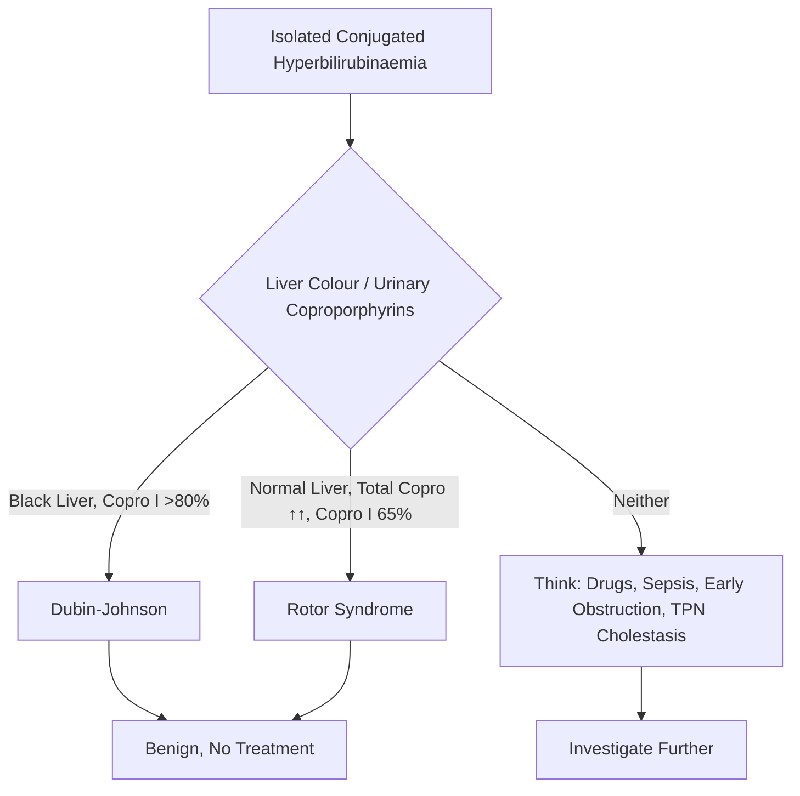
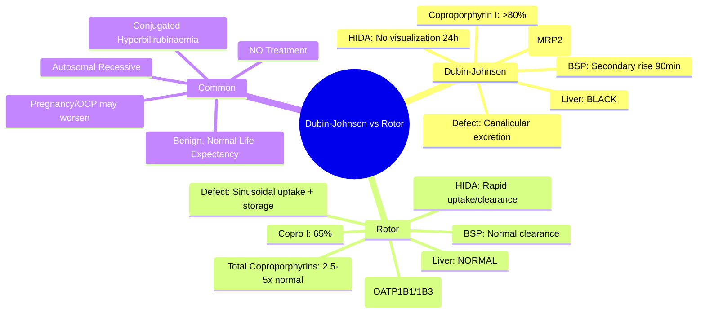

## 1. Learning Objectives
- [ ] Differentiate Dubin-Johnson from Rotor syndrome
- [ ] Understand pathophysiology (MRP2 vs OATP1B1/1B3 defects)
- [ ] Apply diagnostic criteria (liver colour, urinary coproporphyrins, HIDA scan)
- [ ] Know both are benign with normal life expectancy
- [ ] Identify FCPS/MRCP high-yield comparison points

---

## 2. Quick Comparison

| Feature | Dubin-Johnson Syndrome | Rotor Syndrome |
|---------|------------------------|----------------|
| **Inheritance** | **Autosomal recessive** | **Autosomal recessive** |
| **Gene** | **ABCC2 (MRP2)** | **SLCO1B1 & SLCO1B3 (OATP1B1/1B3)** |
| **Defect** | **Impaired biliary excretion** of conjugated bilirubin | **Impaired hepatic uptake** + impaired storage of conjugated bilirubin |
| **Bilirubin** | **Conjugated** (predominant) | **Conjugated** (predominant) |
| **Liver Appearance** | **BLACK** (melanin-like pigment) | **Normal colour** |
| **Urinary Coproporphyrin I** | **↑↑ (80% of total)** | **↑↑ (65% of total)** |
| **Total Urinary Coproporphyrins** | Normal or slightly ↑ | **Markedly ↑ (2.5-5x normal)** |
| **HIDA Scan** | **No visualization at 24h** (delayed/excretory failure) | **Rapid uptake, rapid clearance** (no storage) |
| **Bromosulfophthalein (BSP) Test** | **Secondary rise at 90 min** | Normal initial clearance, no secondary rise |
| **Prognosis** | **Benign, normal life expectancy** | **Benign, normal life expectancy** |

---

## 3. Dubin-Johnson Syndrome

### Pathophysiology
- **ABCC2** encodes **MRP2** (Multidrug Resistance Protein 2) — canalicular transporter for conjugated bilirubin and other anions
- **Defect** → **Impaired biliary excretion** of conjugated bilirubin → reflux into plasma

### Clinical Features
| Feature | Detail |
|---------|--------|
| **Presentation** | Adolescence/early adulthood; intermittent jaundice |
| **Triggers** | Pregnancy, OCP, alcohol, intercurrent illness |
| **Bilirubin** | **Conjugated > Unconjugated** (usually 2-5 mg/dL; can be higher) |
| **LFTs** | **Normal** (AST, ALT, ALP, GGT, Albumin, PT) |
| **Liver** | **BLACK** on gross inspection (polymerized epinephrine metabolites) |
| **Symptoms** | Usually asymptomatic; mild fatigue, abdominal discomfort |

### Diagnostic Hallmarks
1. **Black liver** (autopsy/surgery)
2. **Urinary coproporphyrin I >80% of total** (total normal/slightly ↑)
3. **HIDA scan: No visualization at 24h** (excretory block)
4. **BSP test: Secondary rise at 90 min** (reflux from hepatocyte)

### Genetics
- **ABCC2 (MRP2)** mutations — autosomal recessive
- Multiple mutations described (common in Iranian Jews, Japanese)

---

## 4. Rotor Syndrome

### Pathophysiology
- **SLCO1B1 & SLCO1B3** encode **OATP1B1 & OATP1B3** — sinusoidal uptake transporters for bilirubin and other anions
- **Defect** → **Impaired hepatic uptake** of bilirubin + **impaired intracellular storage** → reflux into plasma

### Clinical Features
| Feature | Detail |
|---------|--------|
| **Presentation** | Similar to Dubin-Johnson; intermittent conjugated hyperbilirubinaemia |
| **Bilirubin** | **Conjugated > Unconjugated** (usually lower than Dubin-Johnson) |
| **LFTs** | **Normal** |
| **Liver** | **Normal colour** (no pigment) |
| **Urinary Coproporphyrins** | **Total markedly ↑ (2.5-5x)**; **Coproporphyrin I ~65%** |

### Diagnostic Hallmarks
1. **Normal liver colour**
2. **Total urinary coproporphyrins ↑↑ (2.5-5x normal); Copro I ~65%**
3. **HIDA scan: Rapid uptake, rapid clearance** (no storage capacity)
4. **BSP test: Normal initial clearance, no secondary rise**

### Genetics
- **SLCO1B1 & SLCO1B3** (OATP1B1/1B3) mutations — **both genes must be mutated** (autosomal recessive)

---

## 5. Differential: Conjugated Hyperbilirubinaemia

| Condition | Bilirubin Type | Liver | Key Test |
|-----------|----------------|-------|----------|
| **Dubin-Johnson** | Conjugated | **Black** | Copro I >80% |
| **Rotor** | Conjugated | **Normal** | Total Copro ↑↑, Copro I 65% |
| **Obstruction** | Conjugated | Normal/Enlarged | Dilated ducts on US |
| **Drug-induced** | Mixed/Conjugated | Variable | Temporal relation |
| **Sepsis/TPN** | Mixed/Conjugated | Variable | Clinical context |

---

## 6. Management

| Aspect | Both Syndromes |
|--------|----------------|
| **Prognosis** | **Benign, normal life expectancy** |
| **Treatment** | **None required** |
| **Reassurance** | Explain benign nature |
| **Precautions** | Avoid hepatotoxins; caution with drugs excreted by MRP2/OATP |
| **Pregnancy** | May exacerbate jaundice (especially Dubin-Johnson); monitor |
| **OCP** | May worsen jaundice; consider alternative |

---

## 7. FCPS/MRCP High-Yield Summary

| Concept | Key Points |
|---------|------------|
| **Both** | Autosomal recessive, **benign**, normal life expectancy, **conjugated hyperbilirubinaemia** |
| **Dubin-Johnson** | **ABCC2 (MRP2)** defect → excretory block; **BLACK liver**; Copro I >80%; HIDA no visualization |
| **Rotor** | **SLCO1B1/1B3 (OATP1B1/1B3)** defect → uptake/storage defect; **Normal liver**; Total copro ↑↑, Copro I 65% |
| **Key Differentiator** | **Liver colour (Black vs Normal); Urinary coproporphyrin pattern** |
| **Treatment** | **None** — reassurance |
| **Pregnancy/OCP** | May exacerbate jaundice |

---

## 8. Viva Questions

1. **What is the main difference between Dubin-Johnson and Rotor syndrome?**
2. **Which gene is mutated in Dubin-Johnson? In Rotor?**
3. **Why is the liver black in Dubin-Johnson?**
4. **What is the urinary coproporphyrin pattern in each?**
5. **What does HIDA scan show in Dubin-Johnson vs Rotor?**
5. **What is the BSP test finding in Dubin-Johnson?**
6. **Are these conditions benign?**
7. **How do they present clinically?**
8. **Do they need treatment?**
9. **Can they cause liver failure?**
10. **Effect of pregnancy/OCP?**

---

## 9. Confusions & Mnemonics

| Confusion | Clarification |
|-----------|---------------|
| Dubin-Johnson vs Rotor | **Dubin = Dark (Black) liver, Copro I >80%**; **Rotor = Right (Normal) liver, Total Copro ↑↑** |
| MRP2 vs OATP | **MRP2 apical (canalicular) → excretion**; **OATP basolateral (sinusoidal) → uptake** |
| BSP test | **Dubin-Johnson: Secondary rise at 90 min** (reflux); **Rotor: No secondary rise** |
| HIDA scan | **Dubin-Johnson: No visualization at 24h** (excretory failure); **Rotor: Rapid uptake/clearance** |
| Conjugated vs Unconjugated | **Both = Conjugated predominant** (defect in handling conjugated bilirubin) |
| Prognosis | **Both BENIGN** — normal life expectancy, no treatment |

---

## 10. Mind Map

---

## 11. One-Page Revision Card

| **Feature** | **Dubin-Johnson** | **Rotor** |
|-------------|------------------|-----------|
| **Gene** | ABCC2 (MRP2) | SLCO1B1 + SLCO1B3 (OATP1B1/1B3) |
| **Defect** | Canalicular excretion | Sinusoidal uptake + storage |
| **Liver Colour** | **BLACK** | **Normal** |
| **Coproporphyrin I** | **>80%** | **65%** |
| **Total Coproporphyrins** | Normal/slight ↑ | **↑↑ (2.5-5x)** |
| **HIDA Scan** | No visualization 24h | Rapid uptake/clearance |
| **BSP Test** | Secondary rise 90min | Normal |
| **Prognosis** | Benign | Benign |

---

## 12. Spaced Repetition Tracker

| Day | 1 | 3 | 7 | 15 | 30 |
|-----|---|---|---|----|----|
| Dubin vs Rotor liver colour | ☐ | ☐ | ☐ | ☐ | ☐ |
| Coproporphyrin patterns | ☐ | ☐ | ☐ | ☐ | ☐ |
| Gene defects | ☐ | ☐ | ☐ | ☐ | ☐ |
| HIDA/BSP findings | ☐ | ☐ | ☐ | ☐ | ☐ |
| Benign course | ☐ | ☐ | ☐ | ☐ | ☐ |

---

## 13. Self-Test Scorecard

| Question | My Answer | Correct? |
|----------|-----------|----------|
| Liver colour difference |  |  |
| Coproporphyrin I % |  |  |
| Gene defects |  |  |
| BSP test Dubin-Johnson |  |  |
| Treatment needed? |  |  |

---

## 14. Local Navigation

- [[Inherited and Metabolic Liver Disease/Gilbert Syndrome|Gilbert Syndrome]]
- [[Inherited and Metabolic Liver Disease/Crigler-Najjar Syndrome|Crigler-Najjar]]
- [[Jaundice and LFT Interpretation/Isolated hyperbilirubinaemia|Isolated Hyperbilirubinaemia]]
- [[Jaundice and LFT Interpretation/Post-hepatic (obstructive) jaundice|Obstructive Jaundice]]
---

> Auto-generated study sections for "Inherited and Metabolic Liver Disease" — Ch 23: Hepatology.

## Flashcards (17 generated)

- Q: What is the definition of Inherited and Metabolic Liver Disease?
  A: - ABCC2 encodes MRP2 (Multidrug Resistance Protein 2) — canalicular transporter for conjugated bilirubin and other anions
- Q: What are the clinical features of Inherited and Metabolic Liver Disease?
  A: Adolescence/early adulthood; intermittent jaundice
- Q: What is Triggers of Inherited and Metabolic Liver Disease?
  A: Pregnancy, OCP, alcohol, intercurrent illness
- Q: What is Bilirubin of Inherited and Metabolic Liver Disease?
  A: Conjugated > Unconjugated (usually 2-5 mg/dL; can be higher)
- Q: What is LFTs of Inherited and Metabolic Liver Disease?
  A: Normal (AST, ALT, ALP, GGT, Albumin, PT)
- Q: What is Liver of Inherited and Metabolic Liver Disease?
  A: BLACK on gross inspection (polymerized epinephrine metabolites)
- Q: What are the clinical features of Inherited and Metabolic Liver Disease?
  A: Adolescence/early adulthood; intermittent jaundice
- Q: What is Triggers of Inherited and Metabolic Liver Disease?
  A: Pregnancy, OCP, alcohol, intercurrent illness
- Q: What is Bilirubin of Inherited and Metabolic Liver Disease?
  A: Conjugated > Unconjugated (usually 2-5 mg/dL; can be higher)
- Q: What is LFTs of Inherited and Metabolic Liver Disease?
  A: Normal (AST, ALT, ALP, GGT, Albumin, PT)
- Q: What is Liver of Inherited and Metabolic Liver Disease?
  A: BLACK on gross inspection (polymerized epinephrine metabolites)
- Q: What is Both of Inherited and Metabolic Liver Disease?
  A: Autosomal recessive, benign, normal life expectancy, conjugated hyperbilirubinaemia
- Q: What is Dubin-Johnson of Inherited and Metabolic Liver Disease?
  A: ABCC2 (MRP2) defect → excretory block; BLACK liver; Copro I >80%; HIDA no visualization
- Q: What is Rotor of Inherited and Metabolic Liver Disease?
  A: SLCO1B1/1B3 (OATP1B1/1B3) defect → uptake/storage defect; Normal liver; Total copro ↑↑, Copro I 65%
- Q: What is Key Differentiator of Inherited and Metabolic Liver Disease?
  A: Liver colour (Black vs Normal); Urinary coproporphyrin pattern
- Q: How is Inherited and Metabolic Liver Disease managed?
  A: None — reassurance
- Q: What is Pregnancy/OCP of Inherited and Metabolic Liver Disease?
  A: May exacerbate jaundice

## MCQs (1 generated)

1. **Which of the following best describes Inherited and Metabolic Liver Disease?**
   A. **- ABCC2 encodes MRP2 (Multidrug Resistance Protein 2) — canalicular transporter for conjugated bilirubin and other anions**
   B. An unrelated condition not matching the clinical picture of Inherited and Metabolic Liver Disease
   C. A complication seen late in the disease course of Inherited and Metabolic Liver Disease
   D. A condition that mimics Inherited and Metabolic Liver Disease but has a different underlying cause

## SBA Questions (1 generated)

1. A patient with suspected Inherited and Metabolic Liver Disease presents with: Presentation — Adolescence/early adulthood; intermittent jaundice; Triggers — Pregnancy, OCP, alcohol, intercurrent illness; Bilirubin — Conjugated > Unconjugated (usually 2-5 mg/dL; can be higher). What is the most likely diagnosis?
   A. **Inherited and Metabolic Liver Disease**
   B. A condition that mimics Inherited and Metabolic Liver Disease but is not the same entity
   C. A complication of Inherited and Metabolic Liver Disease rather than the primary diagnosis
   D. An unrelated condition in the same clinical category as Inherited and Metabolic Liver Disease

## PasTest Scenario SBAs (Clinical Vignettes)

> **Auto-generated PasTest/Mediscope-style scenario SBAs** grounded in the authored source. Each scenario tests a real clinical fact (triad, specific sign, contraindication, trial, first-line Rx) extracted from the topic. *Source: Ch 23: Hepatology — Dubin-Johnson vs Rotor Syndrome*

**Q1.** What is the most appropriate first-line therapy for Dubin-Johnson vs Rotor Syndrome?

  - **A.** Precautions
  - **B.** An advanced/surgical therapy reserved for refractory disease
  - **C.** Symptomatic treatment only, no disease-modifying therapy
  - **D.** Empiric broad-spectrum therapy without specific indication

  > **Answer: A** — Precautions
  >
  > *Source:* **Precautions**   Avoid hepatotoxins; caution with drugs excreted by MRP2/OATP

