# Post-Liver Transplant Complications

## Learning Objectives
- [ ] Recognise and manage acute cellular rejection (ACR) and antibody-mediated rejection (AMR)
- [ ] Identify and manage biliary complications (leak, stricture)
- [ ] Identify and manage vascular complications (HAT, PVT, HVOT)
- [ ] Manage recurrent disease (HCV, HBV, AIH, PBC, PSC, HCC)
- [ ] Manage renal dysfunction, metabolic syndrome, de novo malignancy
- [ ] Identify FCPS/MRCP high-yield post-transplant management steps

---

## Timeline of Post-Transplant Complications

```mermaid
gantt
    title Post-Liver Transplant Complications Timeline
    dateFormat  X
    axisFormat %d
    section Early (0-30 days)
    Primary Non-Function        :a1, 0, 5
    Hepatic Artery Thrombosis   :a2, 0, 14
    Biliary Leak                :a3, 5, 30
    Acute Cellular Rejection    :a4, 5, 30
    Infection (Bacterial/Fungal):a5, 0, 30
    section Intermediate (1-12 months)
    Biliary Stricture           :b1, 30, 365
    Chronic Rejection           :b2, 90, 365
    Recurrent HCV/HBV/HCC       :b3, 180, 1000
    Renal Dysfunction           :b4, 365, 2000
    section Late (>1 year)
    De Novo Malignancy          :c1, 365, 2000
    Metabolic Syndrome          :c2, 365, 2000
    Recurrent PSC/AIH/PBC       :c3, 365, 2000
```



---

## 1. Rejection

### Acute Cellular Rejection (ACR)
| Feature | Detail |
|---------|--------|
| **Timing** | **Days 5-30** (Peak 1-2 weeks); Can Occur Later |
| **Incidence** | **20-40%** (Higher if No Induction) |
| **Diagnosis** | **Liver Biopsy** (Banff Criteria): Portal Inflammation, **Endothelitis**, Bile Duct Injury |
| **Severity** | Mild / Moderate / Severe (Banff) |
| **Treatment** | **Pulse Methylprednisolone 500-1000mg IV ×3 Days** → Oral Taper |
| **Steroid-Refractory** | **Thymoglobulin (ATG)** or **Switch to mTOR** (Sirolimus/Everolimus) |

### Antibody-Mediated Rejection (AMR)
| Feature | Detail |
|---------|--------|
| **Timing** | Variable (Early or Late) |
| **Incidence** | <5% (Increasing with DSA Testing) |
| **Diagnosis** | **C4d+** on Biopsy + **Donor-Specific Antibodies (DSA)** + Histology |
| **Treatment** | **Plasmapheresis + IVIG + Rituximab ± Bortezomib** |
| **Prognosis** | Worse than ACR; Higher Graft Loss |

---

## 2. Biliary Complications

### Biliary Leak
| Feature | Detail |
|---------|--------|
| **Timing** | **Days 7-30** (Peak 2-3 weeks) |
| **Incidence** | 5-15% (DDLT > LDLT) |
| **Presentation** | Bile in Drain, Peritonitis, Fever, Rising Bilirubin/ALP |
| **Diagnosis** | **ERCP** (Gold Standard) / HIDA / CT |
| **Treatment** | **ERCP + Stent** (Primary); Percutaneous Drain; Surgery if Failed |

### Biliary Stricture
| Feature | Detail |
|---------|--------|
| **Timing** | **Months-Years** (Peak 3-12 months) |
| **Incidence** | 10-20% (Anastomotic > Non-Anastomotic) |
| **Types** | **Anastomotic** (Surgical); **Non-Anastomotic (Ischemic)** — More Difficult |
| **Diagnosis** | **MRCP** (Non-Invasive) → **ERCP** (Therapeutic) |
| **Treatment** | **ERCP + Dilatation ± Stent** (Multiple Sessions); Surgery (Hepaticojejunostomy) if Failed |

---

## 3. Vascular Complications

| Complication | Timing | Diagnosis | Management |
|--------------|--------|-----------|------------|
| **Hepatic Artery Thrombosis (HAT)** | **Days 1-30** (Peak 1-2 weeks) | **Doppler US** (Absent HA Flow), Rising AST/ALT, Biliary Ischaemia | **Urgent Re-Transplant** (If Early); Thrombectomy if <24h |
| **Portal Vein Thrombosis (PVT)** | Days-Weeks | **Doppler US** (Absent/Reduced Flow), Ascites, Varices | **Anticoagulation** (Heparin → Warfarin/DOAC); Thrombectomy if Acute |
| **Hepatic Venous Outflow Obstruction (HVOT)** | Days-Weeks | **Doppler US** (Absent/Reversed HWV Flow), Ascites, Hepatomegaly | **Anticoagulation**; Stent/Revision; Re-Transplant if Budd-Chiari |

> **HAT = Most Catastrophic Early Complication** — **Re-Transplant Often Required**

---

## 4. Recurrent Disease

| Disease | Recurrence Rate | Timing | Management |
|---------|----------------|--------|------------|
| **HCV** | **Near 100% Pre-DAA**; **<5% Post-DAA (SVR)** | 6-12 Months (Pre-DAA) | **DAA (SOF/VEL 12w)** >95% SVR |
| **HBV** | **High Without Prophylaxis**; **<5% With HBIG+NA** | Early (1-6 Months) | **NA (ETV/TDF) + HBIG** (High-Dose IV → Low-Dose IM) |
| **AIH** | 20-30% at 5 Years | Variable | Optimise IS (Tac/MMF); Add Steroids if Flare |
| **PBC** | 20-30% at 10 Years | Years | **UDCA 13-15mg/kg** |
| **PSC** | 20-30% at 5-10 Years | Years | Optimise IS; Treat Dominant Strictures; Monitor CCA |
| **HCC** | 10-20% (If Beyond Milan) | 6-24 Months | Resection/Ablation/Systemic/Re-Transplant (Rare) |

---

## 5. Renal Dysfunction

| Feature | Detail |
|---------|--------|
| **Incidence** | **20-30% CKD Stage 3-5 at 5 Years** |
| **Cause** | **CNI Nephrotoxicity** (Tacrolimus/Cyclosporine) |
| **Risk Factors** | Pre-Tx CKD, Diabetes, Hypertension, Older Age, HAT, Sepsis |
| **Management** | **CNI Minimisation** → **mTOR Conversion (Sirolimus/Everolimus)**; ACEi/ARB; Avoid Nephrotoxins |

---

## 6. De Novo Malignancy

| Cancer | Incidence | Risk Factors | Surveillance |
|--------|-----------|--------------|--------------|
| **Skin (SCC/BCC)** | **Most Common** (10-20x General) | Sun Exposure, Azathioprine, Fair Skin | **Annual Dermatology** |
| **PTLD (Post-Transplant Lymphoproliferative Disorder)** | 1-3% | **EBV Mismatch (D+/R-)**, High IS | Monitor EBV DNA; Reduce IS + Rituximab |
| **Lung, Colon, Cervix, Kaposi** | Increased | Smoking, HPV, HHV-8 | Age-Appropriate Screening |

> **CNI → mTOR Switch** Reduces De Novo Malignancy Risk (Anti-Proliferative)

---

## 7. Metabolic Syndrome

| Feature | Detail |
|---------|--------|
| **Incidence** | **50-60%** at 5 Years |
| **Components** | Obesity, Diabetes, Hypertension, Dyslipidaemia |
| **Causes** | Steroids, CNIs (Tac > CsA), mTOR, Lifestyle |
| **Management** | **Steroid Minimisation** → CNI Minimisation → **mTOR Switch**; Lifestyle; Metformin/Statin/ACEi |

---

## 8. Infection

| Period | Typical Pathogens |
|--------|-------------------|
| **0-1 Month** | **Bacterial** (Gram-Neg, Enterococcus), **Fungal** (Candida, Aspergillus), **CMV** (if D+/R-) |
| **1-6 Months** | **CMV** (Peak), **BK Virus**, **Herpesviruses**, **Community Pneumonia**, **UTI** |
| **>6 Months** | **Community-Acquired**, **Chronic Viral (HBV, HCV, HIV)**, **TB** (Endemic) |

| Prophylaxis | Regimen |
|-------------|---------|
| **CMV (D+/R-)** | **Valganciclovir 900mg Daily ×3-6 Months** |
| **PJP** | **TMP-SMX 1 DS Daily ×6-12 Months** |
| **Fungal (High Risk)** | **Fluconazole / Voriconazole** ×1-3 Months |

---

## FCPS/MRCP High-Yield Summary

| Concept | Key Points |
|---------|------------|
| **ACR** | Peak 1-2w; Biopsy: Endothelitis, Bile Duct Injury; **Pulse Steroids 500-1000mg ×3**; Refractory → ATG |
| **AMR** | C4d+, DSA+; **PLEX + IVIG + Rituximab** |
| **Biliary Leak** | 7-30d; **ERCP + Stent**; Surgery if Failed |
| **Biliary Stricture** | 3-12m; **ERCP Dilatation/Stent**; Surgery if Failed |
| **HAT** | **Days 1-30**; Doppler US; **Urgent Re-Transplant** |
| **ACR vs AMR** | ACR = T-cell (Endothelitis); AMR = Antibody (C4d, DSA) |
| **Recurrent HCV** | **DAA >95% SVR**; HBV = NA + HBIG |
| **Renal** | CNI Nephrotoxicity → **Minimise CNI → mTOR** |
| **De Novo Malignancy** | **Skin SCC (10-20x)**; Annual Derm; PTLD (EBV D+/R-) |
| **Metabolic** | **50-60%** at 5y; Steroid/CNI Minimisation → mTOR |

---

## Viva Questions

1. **What is the peak timing for acute cellular rejection?**
2. **What are the Banff criteria for ACR?**
3. **How do you treat steroid-refractory ACR?**
3. **How do you diagnose AMR?**
4. **What is the management of biliary leak post-transplant?**
4. **What is the management of HAT?**
5. **How do you differentiate ACR from AMR?**
6. **What is the recurrence rate of HCC post-transplant?**
7. **What is the management of CNI nephrotoxicity?**
8. **What is PTLD? Risk factors?**
9. **How do you manage recurrent HBV post-transplant?**
10. **What is the step-up approach for biliary stricture?**

---

## Confusions & Mnemonics

| Confusion | Clarification |
|-----------|---------------|
| ACR vs AMR | **ACR = T-cell (Endothelitis, Bile Duct Injury)**; **AMR = Antibody (C4d, DSA)** |
| HAT Timing | **Days 1-30** (Peak 1-2 weeks) — Most Catastrophic Early Complication |
| Biliary Leak vs Stricture | **Leak**: Early (7-30d), Bile in Drain; **Stricture**: Late (Months-Years), ↑ALP/Bilirubin |
| ACR Treatment | **Pulse Methylpred 500-1000mg ×3d** → Taper; Refractory = ATG |
| AMR Treatment | **Plasmapheresis + IVIG + Rituximab ± Bortezomib** |
| Recurrence Prophylaxis | HCV: DAA; HBV: NA + HBIG; AIH/PSC/PSC: Optimise IS |
| CNI Nephrotoxicity | **Tacrolimus/Cyclosporine** → **Minimise → mTOR (Sirolimus/Everolimus)** |
| PTLD | **EBV D+/R- Mismatch** + High IS → Reduce IS + Rituximab |
| Skin Cancer | **SCC 10-20x** — Annual Dermatology; Reduce IS; mTOR Switch |

---

## Mind Map

```mermaid
mindmap
  root((Post-Transplant Complications))
    Early (0-30d)
      PNF: Days 1-5 → Re-Tx
      HAT: Days 1-30 → Re-Tx
      Biliary Leak: 7-30d → ERCP Stent
      ACR: 5-30d → Pulse Steroids
      Infection: Bact/Fungal/CMV
    Late (>30d)
      Biliary Stricture: 3-12m → ERCP Dilatation
      Chronic Rejection
      Recurrent Disease
      Renal Dysfunction
      Malignancy
      Metabolic Syndrome
    Rejection
      ACR: Endothelitis, Bile Duct Injury → Pulse Steroids
      AMR: C4d+, DSA+ → PLEX+IVIG+Rituximab
    Biliary
      Leak: ERCP Stent
      Stricture: ERCP Dilatation/Stent
    Vascular
      HAT: Re-Tx
      PVT: Anticoagulation
      HVOT: Anticoagulation/Stent
    Recurrence
      HCV: DAA (SVR>95%)
      HBV: NA+HBIG
      AIH/PBC/PSC: Optimise IS
      HCC: Resection/Ablation/Systemic
    Long-Term
      Renal: CNI Toxicity → mTOR
      Malignancy: Skin (SCC), PTLD
      Metabolic: Steroid/CNI → mTOR
```

---

## One-Page Revision Card

| **Early Complications (0-30d)** | **Key Feature** | **Management** |
|--------------------------------|-----------------|----------------|
| **PNF** | Days 1-5, No Bile, Rising AST/ALT/INR | **Urgent Re-Transplant** |
| **HAT** | Days 1-30, Absent HA Flow on Doppler | **Urgent Re-Transplant** |
| **Biliary Leak** | Days 7-30, Bile in Drain | **ERCP + Stent** |
| **ACR** | Days 5-30, Endothelitis on Biopsy | **Pulse Steroids 500-1000mg ×3** |
| **Infection** | Bacterial, Fungal, CMV | Targeted Therapy |

| **Late Complications (>30d)** | **Timing** | **Management** |
|------------------------------|------------|----------------|
| Biliary Stricture | 3-12 months | ERCP Dilatation/Stent |
| Chronic Rejection | Months-Years | Optimise IS / Retransplant |
| Recurrent Disease | Variable | Disease-Specific |
| Renal Dysfunction | Years | CNI Minimisation → mTOR |
| De Novo Malignancy | Years | Surveillance / Reduce IS |

| **Rejection** | **ACR** | **AMR** |
|---------------|---------|---------|
| **Mechanism** | T-Cell Mediated | Antibody Mediated |
| **Biopsy** | Endothelitis, Bile Duct Injury | **C4d+, DSA+** |
| **Treatment** | Pulse Steroids ×3 | PLEX + IVIG + Rituximab |

| **Key Post-Tx Pearls** | |
|------------------------|--|
| HAT | **Days 1-30** → Re-Transplant |
| Renal Dysfunction | **CNI Toxicity** → mTOR Switch |
| Skin Cancer | **SCC 10-20x** → Annual Derm |
| PTLD | **EBV D+/R-** → Reduce IS + Rituximab |

---

## Spaced Repetition Tracker

| Day | 1 | 3 | 7 | 15 | 30 |
|-----|---|---|---|----|----|
| ACR vs AMR | ☐ | ☐ | ☐ | ☐ | ☐ |
| HAT Timing | ☐ | ☐ | ☐ | ☐ | ☐ |
| ACR Treatment | ☐ | ☐ | ☐ | ☐ | ☐ |
| Biliary Leak vs Stricture | ☐ | ☐ | ☐ | ☐ | ☐ |
| CNI Nephrotoxicity | ☐ | ☐ | ☐ | ☐ | ☐ |

---

## Self-Test Scorecard

| Question | My Answer | Correct? |
|----------|-----------|----------|
| ACR vs AMR biopsy |  |  |
| HAT timing & management |  |  |
| ACR treatment |  |  |
| Biliary leak vs stricture |  |  |
| CNI nephrotoxicity management |  |  |

---

## Local Navigation

- [[Liver Transplantation/Liver Transplantation|Liver Transplant Overview]]
- [[Liver Transplantation/Liver Transplantation Detailed|Transplant Detailed]]
- [[Liver Tumours/HCC (Hepatocellular Carcinoma)|HCC]]
- [[Acute Liver Failure/Definition and Aetiology|ALF]]
- [[Portal Hypertension and Complications/Hepatic Encephalopathy|HE]]