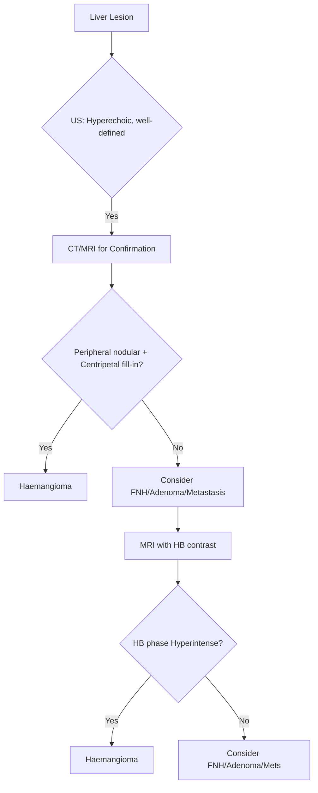
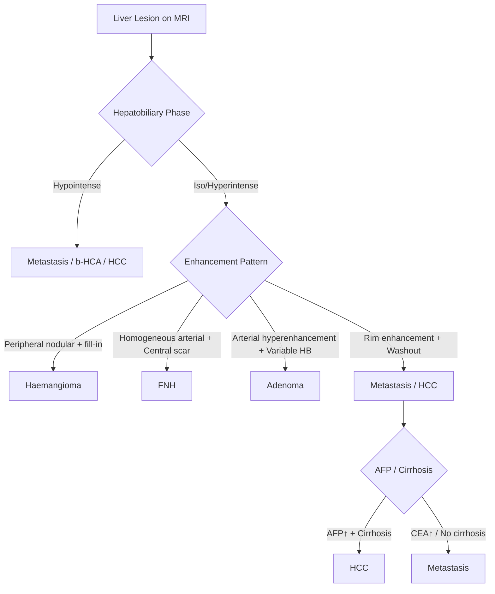

# Benign Liver Tumours: Haemangioma, FNH, Adenoma

## Learning Objectives
- [ ] Differentiate haemangioma, FNH, and hepatic adenoma
- [ ] Apply imaging criteria for diagnosis (US, CT, MRI)
- [ ] Determine management based on tumour type, size, and symptoms
- [ ] Know malignant transformation risk
- [ ] Identify FCPS/MRCP high-yield diagnostic and management points

---

## Overview of Benign Liver Tumours

```mermaid
flowchart TD
    A[Benign Liver Tumour] --> B{Type}
    B -->|Vascular| C[Haemangioma]
    B -->|Non-vascular| D{Female + OCP?}
    D -->|Yes| E[Hepatic Adenoma]
    D -->|No| F[Focal Nodular Hyperplasia (FNH)]
    E --> G[Subtypes: HNF1a, Beta-catenin, etc.]
```

| Tumour | Prevalence | Sex Predilection | Malignant Potential |
|--------|------------|------------------|---------------------|
| **Haemangioma** | **Most common (1-20%)** | Women > Men (2:1) | **None** |
| **FNH** | **2nd most common (2-3%)** | Women > Men (8:1) | **None** |
| **Hepatic Adenoma** | Rare (0.03-0.5%) | **Women (OCP)** (9:1) | **Yes** (5-10% HCC risk) |

> **FCPS/MRCP**: **Haemangioma = Most common benign liver tumour**; **Adenoma = Malignant potential**

---

## Haemangioma

### Pathophysiology
| Feature | Detail |
|---------|--------|
| **Histology** | Cavernous vascular channels lined by endothelium |
| **Pathogenesis** | Congenital hamartoma (not true neoplasm) |
| **Growth** | Slow; hormone-responsive (grows in pregnancy/OCP) |

### Clinical Features
| Feature | Detail |
|---------|--------|
| **Presentation** | **Asymptomatic** (>90% incidental) |
| **Symptoms (if large >10cm)** | RUQ fullness, pain, early satiety |
| **Complications (Rare)** | Rupture, Kasabach-Merritt (thrombocytopenia), compression |

### Imaging Diagnosis

| Modality | Haemangioma Features |
|--------|---------------------|
| **US** | Hyperechoic, well-defined, posterior acoustic enhancement |
| **CT (Triphasic)** | **Peripheral nodular enhancement** (arterial) → **Centripetal fill-in** (portal/delayed) |
| **MRI (Gold Standard)** | **T2: Very hyperintense** ("Light bulb sign"); **T1: Hypointense**; **Post-contrast: Peripheral nodular → Centripetal fill-in**; **Hepatobiliary phase: Hyperintense** |

### Diagnostic Algorithm



### Key MRI Sign: **"Light Bulb" Sign**
- **T2-weighted**: **Markedly hyperintense** ("light bulb bright")
- **T1**: Hypointense
- **Post-contrast**: Peripheral nodular → Centripetal fill-in
- **Hepatobiliary phase**: **Hyperintense** (retains contrast)

---

## Focal Nodular Hyperplasia (FNH)

### Pathophysiology
| Feature | Detail |
|---------|--------|
| **Aetiology** | Vascular malformation + hepatocyte hyperplasia (response to arterial aberration) |
| **Central Scar** | Fibrosis + abnormal vessels (pathognomonic) |
| **Genetics** | Usually sporadic; rare familial |

### Clinical Features
| Feature | Detail |
|---------|--------|
| **Demographics** | **Women 80-90%**, age 20-50 |
| **OCP Association** | **Strong link** (hormone-responsive) |
| **Symptoms** | Usually asymptomatic; RUQ pain if large |
| **Complications** | Rare rupture, bleeding (unlike adenoma) |

### Imaging Diagnosis

| Modality | FNH Features |
|--------|--------------|
| **US** | Iso/hypoechoic, central scar (hyperechoic), spokewheel vessels (Doppler) |
| **CT** | **Early intense homogeneous enhancement** (arterial); **Central scar enhances late**; Rapid washout |
| **MRI (Gold Standard)** | **Central scar: T1 hypointense, T2 hyperintense**; **Arterial: Homogeneous enhancement**; **Central scar: T2 hyperintense, delayed enhancement**; **Hepatobiliary phase: Iso/hyperintense** (contains hepatocytes + bile ducts) |

### Key MRI Signs
| Sign | Description |
|------|-------------|
| **Central Scar** | T2 hyperintense, delayed enhancement (pathognomonic) |
| **"Wheel-spoke" Pattern** | Radial vessels on arterial phase |
| **Hepatobiliary Phase** | **Iso/hyperintense** (contains hepatocytes + bile ductules) |

> **FCPS/MRCP**: **Central scar on MRI = FNH**; **Central scar on CT = late enhancement**

---

## Hepatic Adenoma

### Pathophysiology & Classification (Adenoma Subtypes)

| Subtype | Molecular Defect | Risk of HCC | Key Features |
|---------|-----------------|-------------|--------------|
| **HNF1α-inactivated (H-HCA)** | HNF1α mutation | Low (<5%) | Steatotic, coplanar on imaging |
| **β-catenin activated (b-HCA)** | CTNNB1 mutation | **High (30-40%)** | **Atypical imaging**, male predominance |
| **Inflammatory (I-HCA)** | FRK/IL6ST/STAT3/JAK1 | Low (<5%) | **Systemic inflammation** (CRP↑, fibrinogen↑) |
| **Unclassified (U-HCA)** | None identified | Unknown | Featureless |

### Clinical Features
| Feature | Detail |
|---------|--------|
| **Demographics** | **Women 90%** (OCP use 80-90%), age 15-45 |
| **Risk Factors** | **OCP >5 years**, anabolic steroids, glycogen storage diseases |
| **Symptoms** | Asymptomatic, RUQ pain, **rupture (haemorrhage) - 25-30%** |
| **Malignant Transformation** | **5-10%** (b-HCA highest) |

### Imaging Diagnosis

| Modality | Adenoma Features |
|--------|------------------|
| **US** | Hyperechoic/heterogeneous, well-defined, may have haemorrhage |
| **CT** | **Arterial hyperenhancement**, washout (less than HCC); may have fat/haemorrhage |
| **MRI (Gold Standard)** | **T1: Hyperintense** (fat/haemorrhage); **T2: Variable**; **Arterial hyperenhancement**; **HB phase: Variable** (H-HCA hypointense, I-HCA hyperintense) |

### Subtype Differentiation on MRI
| Subtype | MRI Features |
|---------|--------------|
| **H-HCA** | **Marked fat content** → T1 hyperintense (signal loss on opposed-phase) |
| **b-HCA** | **Arterial hyperenhancement**, washout; **Hepatobiliary phase: Hypointense** |
| **I-HCA** | **Arterial hyperenhancement**, **obscure margins**; **HB phase: Hyperintense** |

---

## Differential Diagnosis: Imaging Comparison



| Feature | Haemangioma | FNH | Adenoma | HCC | Metastasis |
|--------|-------------|-----|---------|-----|------------|
| **Gender** | F > M | **F >> M** | **F (OCP)** | M > F | Variable |
| **US** | Hyperechoic | Iso/hypoechoic + central scar | Heterogeneous | Heterogeneous | Variable |
| **CT** | Peripheral nodular → fill-in | **Homogeneous arterial + Central scar** | Heterogeneous, fat/haemorrhage | Arterial hyperenhancement + Washout | Rim enhancement |
| **MRI T2** | **Markedly hyperintense** | Moderate | Variable | Mild hyperintense | Hyperintense |
| **Arterial Phase** | **Peripheral nodular** | **Homogeneous intense** | Hyperenhancement | **Hyperenhancement** | Rim |
| **Portal Venous** | **Centripetal fill-in** | **Central scar enhances** | Washout | Washout | Washout |
| **Central Scar** | No | **Yes (T2 bright, late enhance)** | No | No | No |
| **HB Phase** | **Hyperintense** | **Iso/Hyper** | Variable (H-hypo, I-hyper) | Hypointense | Hypointense |
| **Fat Content** | No | No | **H-HCA: Yes** | No | No |

---

## Management

### Haemangioma
| Size/Symptoms | Management |
|---------------|------------|
| **<4 cm, Asymptomatic** | **Observation**; US 6-12 monthly ×1-2y |
| **4-10 cm, Asymptomatic** | US 6-12 monthly |
| **>10 cm OR Symptomatic** | Consider treatment |
| **Treatment Options** | **Surgery (enucleation/resection)** → Curative; **TAE** (if inoperable); **Radiation** (palliative) |

### FNH
| Size/Symptoms | Management |
|---------------|------------|
| **<5 cm, Asymptomatic** | **Observation**; US 6-12 monthly ×1-2y |
| **>5 cm OR Symptomatic** | **Surgery (laparoscopic resection)** |
| **OCP** | **Discontinue** (may regress) |
| **Contraindications for Surgery** | None (benign, no malignant potential) |

### Hepatic Adenoma
| Size/Subtype | Management |
|--------------|------------|
| **<5 cm, H/I-HCA** | **OCP cessation**; Surveillance US 6-monthly |
| **>5 cm OR b-HCA OR Male** | **Surgical Resection** (laparoscopic preferred) |
| **Rupture** | **Emergency Surgery** (embolization + resection) |
| **b-HCA** | **Resect regardless of size** (high HCC risk) |

---

## FCPS/MRCP High-Yield Summary

| Tumour | Key Identifier | Key Imaging | Malignant Potential | Management |
|--------|----------------|-------------|---------------------|------------|
| **Haemangioma** | **T2 "Light bulb"**; Peripheral fill-in | **HB phase: Hyperintense** | **None** | Observe / Surgery if >10cm/symptomatic |
| **FNH** | **Central scar** (T2 bright); "Wheel-spoke" | **HB phase: Iso/Hyperintense** | **None** | Observe / OCP stop / Surgery if >5cm/symptomatic |
| **Adenoma** | **OCP + Women**; Fat/haemorrhage | **HB phase: Variable** | **5-10% (b-HCA high)** | **Stop OCP**; Resect if >5cm/b-HCA/male |

---

## Viva Questions

1. **How do you differentiate haemangioma from FNH on MRI?**
2. **What is the "light bulb sign"? Which tumour?**
3. **Describe the central scar of FNH on MRI.**
3. **What are the adenoma subtypes? Which has highest HCC risk?**
4. **How do you manage a 6cm hepatic adenoma in a woman on OCP?**
4. **What is the malignant potential of each benign tumour?**
5. **How do you differentiate haemangioma from metastasis on MRI?**
5. **What is the management of ruptured hepatic adenoma?**
6. **What is the role of OCP in hepatic adenoma?**
6. **How do you differentiate FNH from adenoma on MRI?**
7. **What is the malignant potential of b-HCA?**
8. **When do you resect a haemangioma?**

---

## Confusions & Mnemonics

| Confusion | Clarification |
|-----------|---------------|
| Haemangioma vs Metastasis | **Haemangioma: T2 "light bulb", HB phase HYPERintense**; Mets: HB phase HYPOintense |
| FNH vs Adenoma | **FNH: Central scar + Wheel-spoke + HB phase Iso/Hyper**; Adenoma: No central scar, HB phase Variable |
| Adenoma vs HCC | Adenoma: Non-cirrhotic liver, OCP history; HCC: Cirrhosis, AFP↑, Vascular invasion |
| H-HCA vs b-HCA | **H-HCA: Fat-rich (H-B))**; **b-HCA: HB phase HYPOintense → High HCC risk** |
| I-HCA vs Others | **Inflammatory markers (CRP, fibrinogen) ↑**; HB phase Hyperintense |
| FNH regression | **Stops OCP → May regress** |
| Haemangioma rupture | **Rare** (<1%); Pain + Hypotension → Emergency surgery |

---

## Mind Map

```mermaid
mindmap
  root((Benign Liver Tumours))
    Haemangioma
      Most common
      T2 "Light bulb"
      Peripheral fill-in
      HB phase: Hyperintense
      Central scar: NO
      Benign, Observe/Surgery >10cm
    FNH
      Women + OCP
      Central scar (T2 bright)
      Wheel-spoke vessels
      HB phase: Iso/Hyper
      Benign, Stop OCP, Surgery if >5cm
    Adenoma
      Women + OCP
      Subtypes: H, b, I, U
      b-HCA = High HCC risk
      HB phase Variable
      Stop OCP, Resect >5cm/b-HCA
    Differential
      vs HCC: No cirrhosis, OCP history, No vascular invasion
      vs Mets: HB phase Hyper (Benign) vs Hypo (Mets)
      vs Haemangioma: Central scar, Wheel-spoke
    Management
      Haemangioma: Observe > Surgery if large/symptomatic
      FNH: Stop OCP, Observe/Surgery if large
      Adenoma: Stop OCP, Surgery if >5cm/b-HCA/Male
```

---

## One-Page Revision Card

| **Tumour** | **Epidemiology** | **Key MRI Signs** | **HB Phase** | **Malignant Risk** | **Management** |
|----------|------------------|-------------------|--------------|--------------------|----------------|
| **Haemangioma** | Most common; F>M | T2 "Light bulb"; Peripheral fill-in | **Hyperintense** | **None** | Observe; Surgery if >10cm/symptomatic |
| **FNH** | Women + OCP; 2nd common | Central scar (T2↑); Wheel-spoke | **Iso/Hyper** | **None** | Stop OCP; Surgery if >5cm/symptomatic |
| **Adenoma** | Women + OCP; Rare | Heterogeneous; Fat/Haemorrhage | Variable (H-hypo, b-hypo, I-hyper) | **5-10%** (b-HCA high) | **Stop OCP**; Resect >5cm / b-HCA / Male |

| **Key Differentials** | **Haemangioma** | **FNH** | **Adenoma** | **HCC** | **Metastasis** |
|----------------------|----------------|---------|-------------|---------|----------------|
| **Central Scar** | No | **Yes (T2 bright)** | No | No | No |
| **HB Phase** | **Hyper** | **Iso/Hyper** | Variable | **Hypo** | **Hypo** |
| **Central Scar Enhance** | No | **Late** | No | No | No |
| **Fat** | No | No | **H-HCA: Yes** | No | No |

| **Adenoma Subtypes** | **Genetics** | **HCC Risk** | **MRI HB Phase** |
|----------------------|--------------|--------------|------------------|
| **H-HCA** | HNF1α mutation | Low (<5%) | **Hypointense** (fat) |
| **b-HCA** | **CTNNB1 (β-catenin)** | **HIGH (30-40%)** | **Hypointense** |
| **I-HCA** | FRK/IL6ST/STAT3/JAK1 | Low (<5%) | **Hyperintense** |
| **U-HCA** | None | Unknown | Variable |

---

## Spaced Repetition Tracker

| Day | 1 | 3 | 7 | 15 | 30 |
|-----|---|---|---|----|----|
| Haemangioma MRI signs | ☐ | ☐ | ☐ | ☐ | ☐ |
| FNH Central Scar | ☐ | ☐ | ☐ | ☐ | ☐ |
| Adenoma Subtypes | ☐ | ☐ | ☐ | ☐ | ☐ |
| b-HCA HCC Risk | ☐ | ☐ | ☐ | ☐ | ☐ |
| Differential Table | ☐ | ☐ | ☐ | ☐ | ☐ |

---

## Self-Test Scorecard

| Question | My Answer | Correct? |
|----------|-----------|----------|
| Haemangioma "Light Bulb" Sign |  |  |
| FNH Central Scar Appearance |  |  |
| Adenoma Subtype with Highest HCC Risk |  |  |
| Haemangioma vs Metastasis on MRI |  |  |
| b-HCA HB Phase |  |  |

---

## Local Navigation

- [[Liver Tumours/HCC (Hepatocellular Carcinoma)|HCC]]
- [[Liver Tumours/Metastatic liver disease|Metastatic Liver Disease]]
- [[Liver Tumours/Liver Tumours|Liver Tumours Overview]]
- [[Liver Transplantation/Liver Transplantation|Liver Transplant]]